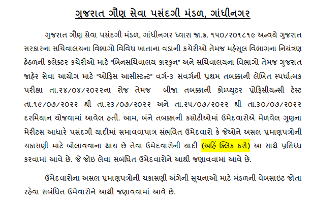
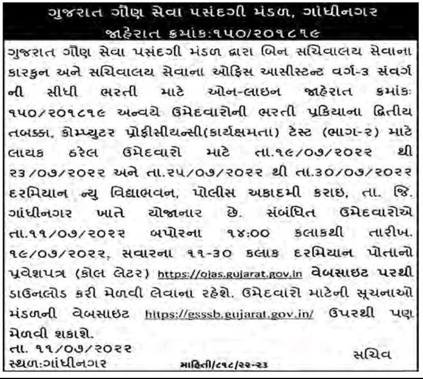
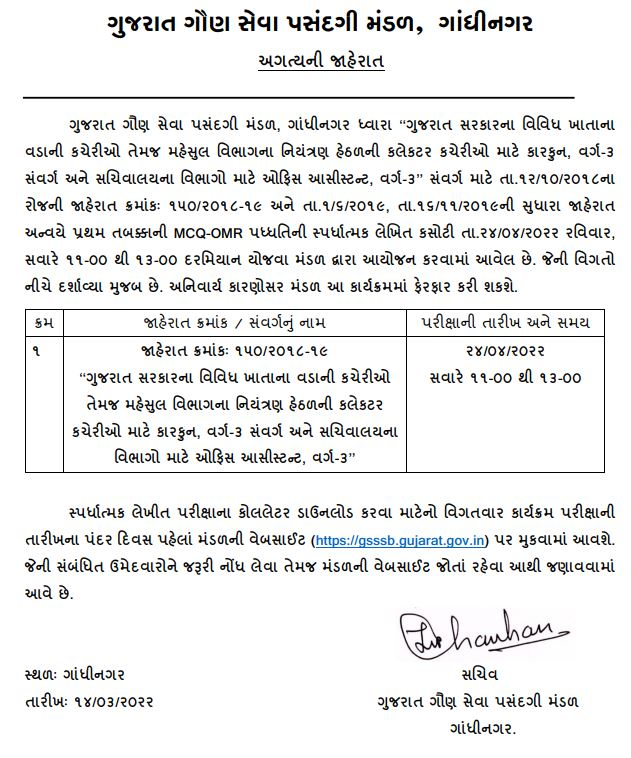
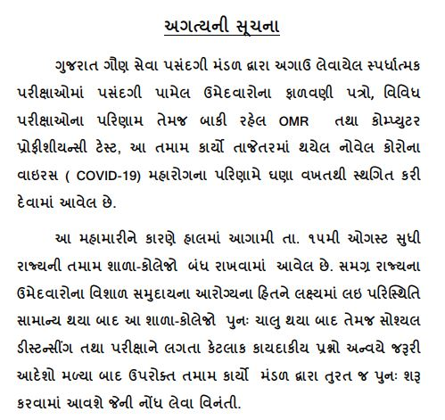

## **Bin Sachivalay Exam Update 2022**

**GSSSB Bin Sachivalay Clerk Document Verification List 2022:**

- Gujarat Gaun Seva Pasandgi Mandal (GSSSB) has Released GSSSB Bin Sachivalay Clerk Document Verification List 2022 (CPT Result PDF Download).
- [LIST OF CANDIDATES TO BE CALLED FOR DOCUMENT VERIFICATION](https://gsssb.gujarat.gov.in/images/150_2018-19-DV_LIST.pdf) BY G.S.S.S.B. FOR THE POST OF BINSACHIVALAY CLERK, CLASS-3 ADVT. NO. (150/201819)

\[caption id="attachment\_27029" align="aligncenter" width="614"\] GSSSB Bin Sachivalay Clerk Document Verification List 2022\[/caption\]

**Bin Sachivalay Clerk CPT Call Letter 2022 Released**

- Gujarat Gaun Seva Pasandgi Mandal has released the GSSSB Bin Sachivalay Clerk and Office Assistant CPT Exam Call Letter.
- Applications Can Download Bin Sachivalay CPT Exam Call Letter 2022 From Below Link.
- Bin Sachivalay Admit Card Date: 11-7-2022 to 19-7-2022
- Bin Sachivalay Clerk CPT Exam Date: 19-7-2022 to 23-7-2022 and 25-7-2022 to 30-7-2022
- [Click Here: GSSSB Bin Sachivalay Clerk CPT Call Letter 2022](https://ojas.gujarat.gov.in/ojas3/Preference.aspx?opt=LUbWdmhKlwjaHr/CUNi26A==)

\[caption id="attachment\_26580" align="aligncenter" width="720"\] Download GSSSB Bin Sachivalay Clerk CPT Call Letter 2022 @ojas.gujarat.gov.in\[/caption\]

**Bin Sachivalay Result Released PDF and CPT Exam List 2022 (11-6-2022)** 

- Gujarat Gaun Seva Pasandgi Mandal has released the GSSSB Bin Sachivalay Clerk and Office Assistant Result and Announced Eligible Candidates LIST for CPT 2022.
- Candidates Can Check Bin Sachivalay Result From Below Link.
- **GSSSB** **Bin Sachivalay Clerk Result 2022 [Notice](https://gsssb.gujarat.gov.in/images/150-1819-Result-Part-1.pdf)**
- **CPT LIST PDF: [Click Here](https://gsssb.gujarat.gov.in/images/150-2018-19-wt-result.pdf)**
- **CPT Schedule: [Click Here](https://gsssb.gujarat.gov.in/images/Exam-date-Comp-Test-on-Web-185-197-23-05-2022.pdf)**

GSSSB has Released the Official GSSSB Bin Sachivalay Answer Key on OJAS Job Portal. Candidates Can Direct Download Form Below Link and Check.

- bin sachivalay paper solution 2022 [pdf download](https://ojas.gujarat.gov.in/ojas1/AdvtDetailFiles/2142969_PAK-150-201819c.pdf)

Gujarat Subordinate Service Selection Board Published Bin Sachivalay Clerk and Office Assistant Exam Call Letter on his GSSSB OJAS official website.

### Bin Sachivalay Call Letter 2022 Gujarat @https://ojas.gujarat.gov.in

OJAS Bin Sachivalay Call Letter 2022 is Released. Applied Candidates Can Download GSSSB OJAS Call Letter From Official Website. The link is Given Below to Get Bin Sachivalay Clerk Admit Card 2022.

- GSSSB Bin Sachivalay Call Letter Date: 11-4-2022 to 24-4-2022
- [Click Here](https://ojas.gujarat.gov.in/ojas3/PrintApplForm.aspx?opt=OTMUam2FvAo=)

\[caption id="attachment\_25534" align="aligncenter" width="611"\] Official GSSSB Bin Sachivalay Call Letter Download 2022 & Exam Date\[/caption\]

* * *

\[caption id="attachment\_24749" align="aligncenter" width="631"\] official GSSSB Bin Sachivalay New Exam Date Announced & Call Letter Update 2022\[/caption\]

**GSSSB Bin Sachivalay clerk and office assistant exam Updates on 3rd March 2022:**

- A.K.Rakesh IAS has Announced Bin sachivalay clerk Exam Date on Twitter.
- **New GSSSB Bin Sachivalay Exam Date: 24-4-2022**

https://twitter.com/AKRAKESHIAS1/status/1499270850021068801

**(gsssb latest update) New Bin Sachivalay Exam Update on 9th Feb 2022:**

- GSSSB Gujarat State Subordinate Selection Board has Released 13-2-2022 Bin Sachivalay Exam Date Postponed Notice on the Official Website @https://gsssb.gujarat.gov.in/
- [Check Notice PDF](https://gsssb.gujarat.gov.in/images/150-exam-postpone.pdf)

**New Bin Sachivalay Exam Update on 29th January 2022:**

- GSSSB Gujarat State Subordinate Selection Board has Released an Advertisement Regarding Bin Sachivalay Exam Call Letter. Applied Candidates Can Download Binsachivalay Admit Card 2022 From Below Date.
- GSSSB Bin Sachivalay Clerk Call Letter Download 2022 Date: **29-1-2022 at 13:00 to 13-2-2022 at 12:00**
- GSSSB Bin Sachivalay Exam Date: 13-2-2022 Sunday at 12:00 to 14:00
- [Admit Card Download](https://ojas.gujarat.gov.in/ojas2/PrintApplForm.aspx?opt=OTMUam2FvAo=)

> **New Maru Gujarat Job 2022:**
> 
> - Gujarat High Court Civil Judge Recruitment 2022 Apply @hc-ojas.gujarat.gov.in: [Apply Now](https://freegovtjobalert.in/gujarat-high-court-civil-judge-recruitment/)
> - Gujarat Police PSI Written Exam Date 2022 on Official Website @http://psirbgujarat2021.in: [CHeck Now](https://freegovtjobalert.in/gujarat-police-recruitment/)
> - GPSSB Village Panchayat Secretary (3437 Talati Cum Mantri Bharti): [Apply Now](https://freegovtjobalert.in/gpssb-village-panchayat-secretary-recruitment/)
> - Gujarat High Court Civil Judge Syllabus 2022 - [Exam Pattern PDF](https://freegovtjobalert.in/gujarat-high-court-civil-judge-syllabus/)

**New Bin Sachivalay Exam Update on 22nd November 2021:**

- GSSSB Gujarat State Subordinate Selection Board (ગુજરાત ગૌણ સેવા પસંદગી મંડળ. ગુજરાત સરકાર) has Released New Bin Sachivalay and Office Assistant Exam Date on the Official Website at https://gsssb.gujarat.gov.in/
- Exam Date: 13-02-2022 at 12:00 to 14:00
- Check Official Notification: [Download PDF](https://gsssb.gujarat.gov.in/images/ADVT150.pdf)

Latest Update About Bin Sachivalay New Exam Date 2021:

- On 29 July GSSSB has Announced the About Pending Bin sachivalay Exam Date And the exam will be taken at the end of this year 2021 (Tentative).

https://youtu.be/pwGKMzJrB0U

 

gsssb latest update February 2022: Staff Selection Commission has Recently Released Short Notice About **Bin Sachivalay Clerk and Office Assistant** 3000+ Posts on his Official website. GSSSB Bin Sachivalay Exam, Maybe Conducted or Announced New Date in 2021.

 

Gujarat Gaun Seva Pasandgi Mandal will Publish a new Exam Date of Bin Sachivalay Clerk and Office Assistant Class-3 (advt.no. 150/201819). GSSSB Conducted Bin Sachivalay Exam After August 2020. The exam will be conducted only on the centers with CCTV Cameras.

<table style="border-collapse: collapse; width: 100%;"><tbody><tr><td style="width: 50%; background-color: #2a5a8e; text-align: center;" colspan="2"><h3><strong>GSSSB Recruitment 2021</strong></h3></td></tr><tr><td style="width: 50%; text-align: center;">Job Recruitment Board</td><td style="width: 50%; text-align: center;">Gujarat Gaun Seva Pasandgi Mandal</td></tr><tr><td style="width: 50%; text-align: center;">Notification No.</td><td style="width: 50%; text-align: center;">150/201819</td></tr><tr><td style="width: 50%; text-align: center;">Post</td><td style="width: 50%; text-align: center;">Bin Sachivalay Clerk &amp; office assistant</td></tr><tr><td style="width: 50%; text-align: center;">Vacancies</td><td style="width: 50%; text-align: center;">3000+</td></tr><tr><td style="width: 50%; text-align: center;">Job Location</td><td style="width: 50%; text-align: center;">Gujarat</td></tr><tr><td style="width: 50%; text-align: center;">Job Type</td><td style="width: 50%; text-align: center;"><a href="https://freegovtjobalert.in/gujarat-govt-jobs/" target="_blank" rel="noopener noreferrer">Gujarat Govt Jobs</a></td></tr><tr><td style="width: 50%; text-align: center;">Application Mode</td><td style="width: 50%; text-align: center;">Online</td></tr><tr><td style="width: 50%; text-align: center;">Admit Card</td><td style="width: 50%; text-align: center;">Available Soon</td></tr><tr><td style="width: 50%; text-align: center;">GSSSB Bin Sachivalay Exam Date</td><td style="width: 50%; text-align: center;">13-02-2022 at 12:00 to 14:00</td></tr></tbody></table>

GSSSB NEW Exam Date Notice: **[Check Here](https://gsssb.gujarat.gov.in/images/Inportant-Instruction.pdf)**

gsssb latest update February 2022 Please Check the Official Notification or Website Before Apply/ Download Admit Card.

GSSSB Official website: [https://gsssb.gujarat.gov.in](https://gsssb.gujarat.gov.in)

**Latest Gujarat jobs 2021:**

\[catlist name="gujarat-government-jobs" numberposts=20 orderby=modified date\]

<table style="border-collapse: collapse;"><tbody><tr><td style="width: 33.3333%; background-color: #2a5a8e; text-align: center;" colspan="3"><strong>Jobs by Qualification</strong></td></tr><tr><td style="width: 33.3333%; text-align: center;"><a href="https://freegovtjobalert.in/10th-pass-job/" target="_blank" rel="noopener noreferrer">10th Pass</a></td><td style="width: 33.3333%; text-align: center;"><a href="https://freegovtjobalert.in/12th-pass-job/" target="_blank" rel="noopener noreferrer">12th Pass</a></td><td style="width: 33.3333%; text-align: center;"><a href="https://freegovtjobalert.in/qualification/bcom/" target="_blank" rel="noopener noreferrer">B.Com</a></td></tr><tr><td style="width: 33.3333%; text-align: center;"><a href="https://freegovtjobalert.in/qualification/be/" target="_blank" rel="noopener noreferrer">B.E</a></td><td style="width: 33.3333%; text-align: center;"><a href="https://freegovtjobalert.in/qualification/b-sc/" target="_blank" rel="noopener noreferrer">B.Sc</a></td><td style="width: 33.3333%; text-align: center;"><a href="https://freegovtjobalert.in/qualification/btech/" target="_blank" rel="noopener noreferrer">B.Tech</a></td></tr><tr><td style="width: 33.3333%; text-align: center;"><a href="https://freegovtjobalert.in/qualification/ba/" target="_blank" rel="noopener noreferrer">B.A</a></td><td style="width: 33.3333%; text-align: center;"><a href="https://freegovtjobalert.in/qualification/bba/" target="_blank" rel="noopener noreferrer">BBA</a></td><td style="width: 33.3333%; text-align: center;"><a href="https://freegovtjobalert.in/qualification/bca/" target="_blank" rel="noopener noreferrer">BCA</a></td></tr><tr><td style="width: 33.3333%; text-align: center;"><a href="https://freegovtjobalert.in/qualification/b-ed/" target="_blank" rel="noopener noreferrer">B.Ed</a></td><td style="width: 33.3333%; text-align: center;"><a href="https://freegovtjobalert.in/qualification/b-pharma/" target="_blank" rel="noopener noreferrer">B.Pharma</a></td><td style="width: 33.3333%; text-align: center;"><a href="https://freegovtjobalert.in/qualification/charted-accountant/" target="_blank" rel="noopener noreferrer">C.A/ ICWA</a></td></tr><tr><td style="width: 33.3333%; text-align: center;"><a href="https://freegovtjobalert.in/qualification/iti/" target="_blank" rel="noopener noreferrer">I.T.I</a></td><td style="width: 33.3333%; text-align: center;"><a href="https://freegovtjobalert.in/qualification/llb/" target="_blank" rel="noopener noreferrer">LLB</a></td><td style="width: 33.3333%; text-align: center;"><a href="https://freegovtjobalert.in/qualification/ma/" target="_blank" rel="noopener noreferrer">M.A</a></td></tr><tr><td style="width: 33.3333%; text-align: center;"><a href="https://freegovtjobalert.in/qualification/mba-jobs/" target="_blank" rel="noopener noreferrer">M.B.A</a></td><td style="width: 33.3333%; text-align: center;"><a href="https://freegovtjobalert.in/qualification/mca/" target="_blank" rel="noopener noreferrer">M.C.A</a></td><td style="width: 33.3333%; text-align: center;"><a href="https://freegovtjobalert.in/qualification/m-com/" target="_blank" rel="noopener noreferrer">M.Com</a></td></tr><tr><td style="width: 33.3333%; text-align: center;"><a href="https://freegovtjobalert.in/qualification/md/" target="_blank" rel="noopener noreferrer">M.D</a></td><td style="width: 33.3333%; text-align: center;"><a href="https://freegovtjobalert.in/qualification/me/" target="_blank" rel="noopener noreferrer">M.E</a></td><td style="width: 33.3333%; text-align: center;"><a href="https://freegovtjobalert.in/qualification/m-sc/" target="_blank" rel="noopener noreferrer">M.Sc</a></td></tr><tr><td style="width: 33.3333%; text-align: center;"><a href="https://freegovtjobalert.in/qualification/m-tech/" target="_blank" rel="noopener noreferrer">M.Tech</a></td><td style="width: 33.3333%; text-align: center;"><a href="https://freegovtjobalert.in/qualification/m-ed/" target="_blank" rel="noopener noreferrer">M.Ed</a></td><td style="width: 33.3333%; text-align: center;"><a href="https://freegovtjobalert.in/qualification/msw/" target="_blank" rel="noopener noreferrer">MSW</a></td></tr><tr><td style="width: 33.3333%; text-align: center;"><a href="https://freegovtjobalert.in/qualification/m-phil/" target="_blank" rel="noopener noreferrer">M.Phil</a></td><td style="width: 33.3333%; text-align: center;"><a href="https://freegovtjobalert.in/qualification/mbbs/" target="_blank" rel="noopener noreferrer">MBBS</a></td><td style="width: 33.3333%; text-align: center;"><a href="https://freegovtjobalert.in/qualification/ph-d/" target="_blank" rel="noopener noreferrer">Ph.D</a></td></tr><tr><td style="width: 33.3333%; text-align: center;"><a href="https://freegovtjobalert.in/qualification/pgdca/" target="_blank" rel="noopener noreferrer">PGDCA</a></td><td style="width: 33.3333%; text-align: center;"><a href="https://freegovtjobalert.in/qualification/diploma/" target="_blank" rel="noopener noreferrer">Diploma</a></td><td style="width: 33.3333%; text-align: center;"><a href="https://freegovtjobalert.in/qualification/graduate/" target="_blank" rel="noopener noreferrer">Graduate</a></td></tr><tr><td style="width: 33.3333%; text-align: center;"><a href="https://freegovtjobalert.in/engineering-jobs/" target="_blank" rel="noopener noreferrer">Engineering Jobs</a></td><td style="width: 33.3333%; text-align: center;"><a href="https://freegovtjobalert.in/qualification/pg-diploma/" target="_blank" rel="noopener noreferrer">PG Diploma</a></td><td style="width: 33.3333%; text-align: center;"><a href="https://freegovtjobalert.in/qualification/post-graduation/" target="_blank" rel="noopener noreferrer">Post Graduation</a></td></tr></tbody></table>

**Quick Links:**

<table style="width: 100%; border-collapse: collapse;" border="2"><tbody><tr><td style="width: 33.3333%;"></td><td style="width: 33.3333%;"></td><td style="width: 33.3333%;"></td></tr><tr><td style="width: 33.3333%;"></td><td style="width: 33.3333%;"></td><td style="width: 33.3333%;"></td></tr></tbody></table>
