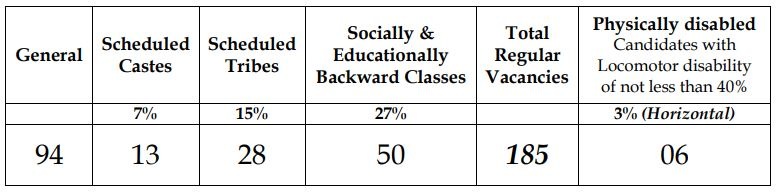

**Gujarat High Court Judge Recruitment 2019** Released Notification For 185 Civil Judge Vacancies. **Gujarat High Court** invites online Application form For That Candidates who must Have A Degree in Law. Good chance for those candidates who want to work as a judge in the future. **Gujarat High Court Civil Judge Application Form 2019** is Starts on 01-09-2019 to 10-10-2019. Interested Candidates submit the Application form before the last date has gone. To know About **HGC Civil Judge Vacancy** all Details Like Eligibility Criteria, Age Limits, Salary/Pay Scale, Selection Process, Application Fees, **How to apply for Gujarat High Court Recruitment 2019**, Etc. Given in this page below.

> New updates: Gujarat High Court Judge Recruitment has increased from 68 to 185. and Last date for application form is extended from 30-09-2019 to 10-10-2019. Now New Category Wise Vacancy Below:
> 
> 

## **Gujarat High Court Civil Judge Recruitment 2019 Details**

<table style="height: 654px; width: 84.9475%; border-collapse: collapse; border-style: double;"><tbody><tr style="height: 80px;"><td style="width: 100%; text-align: center; height: 50px;" colspan="2">Gujarat High Court

Civil Judge Vacancy 2019

185 vacancies</td></tr><tr style="height: 30px;"><td style="width: 100%; height: 30px; background-color: #2a5a8e; text-align: center;" colspan="2"><h3><strong>Gujarat High Court Bharti Important Dates</strong></h3></td></tr><tr style="height: 22px;"><td style="width: 50%; text-align: center; height: 22px;">Starting Date for Apply online</td><td style="width: 50%; text-align: center; height: 22px;">01-09-2019</td></tr><tr style="height: 22px;"><td style="width: 50%; text-align: center; height: 22px;">Last Date for Apply Online</td><td style="width: 50%; text-align: center; height: 22px;">30-09-2019 extended 10-10-2019</td></tr><tr><td style="width: 50%; text-align: center;">Admit Card Date</td><td style="width: 50%; text-align: center;">From 11-11-2019</td></tr><tr><td style="width: 50%; text-align: center;">Date of Preliminary Examination</td><td style="width: 50%; text-align: center;">17-11-2019</td></tr><tr><td style="width: 50%; text-align: center;">Main Exam Admit cards</td><td style="width: 50%; text-align: center;">From 13-01-2020</td></tr><tr><td style="width: 50%; text-align: center;">Date of Main Written Examination</td><td style="width: 50%; text-align: center;">19-01-2020</td></tr><tr><td style="width: 50%; text-align: center;">Date of Viva-voce Test (Oral Interview)</td><td style="width: 50%; text-align: center;">March/April 2020</td></tr><tr style="height: 30px;"><td style="width: 100%; height: 30px; background-color: #2a5a8e; text-align: center;" colspan="2"><h3><strong>Gujarat high court vacancy 2019 Details</strong></h3></td></tr><tr style="height: 22px;"><td style="text-align: center; height: 22px; width: 50%;">Job Recruitment Board</td><td style="text-align: center; width: 50%;">Gujarat High Court Recruitment</td></tr><tr><td style="text-align: center; width: 50%;">Post Name</td><td style="text-align: center; width: 50%;">Civil judge</td></tr><tr><td style="text-align: center; width: 50%;">No of vacancies</td><td style="text-align: center; width: 50%;">185</td></tr><tr><td style="text-align: center; width: 50%;">Job Category</td><td style="text-align: center; width: 50%;">Court Jobs</td></tr><tr><td style="text-align: center; width: 50%;">Job Location</td><td style="text-align: center; width: 50%;"><a href="https://freegovtjobalert.in/gujarat-govt-jobs/" target="_blank" rel="noopener noreferrer">Gujarat Govt Jobs</a></td></tr><tr><td style="text-align: center; width: 50%;">Application Mode</td><td style="text-align: center; width: 50%;">Online</td></tr><tr style="height: 30px;"><td style="width: 100%; height: 30px; background-color: #2a5a8e; text-align: center;" colspan="2"><h3><strong>Civil judge exam Eligibility Criteria&nbsp;</strong></h3></td></tr><tr style="height: 14px;"><td style="width: 50%; text-align: center; height: 14px;"><strong>Education Qualification</strong></td><td style="width: 50%; text-align: center; height: 14px;"><strong>Age Limits</strong></td></tr><tr style="height: 30px;"><td style="width: 50%; text-align: center; height: 30px;"><ul><li style="text-align: left;">A Degree in Law from a University recognized</li><li style="text-align: left;">must be practicing as an Advocate in Courts of Civil and / or Criminal Jurisdiction on the last date fixed for submission of Online Application.</li></ul></td><td style="width: 50%; text-align: center; height: 30px;"><ul><li style="text-align: left;">Maximum Age For General Candidates: 35 Years</li><li style="text-align: left;">Maximum Age For SC/ST/SEBC: 38 Years</li></ul></td></tr><tr><td style="width: 50%; background-color: #2a5a8e; text-align: center;" colspan="2"><h3><strong>Gujarat High Court Judge Salary/Pay Scale</strong></h3></td></tr><tr><td style="width: 50%; text-align: center;" colspan="2">Rs. 27700/- to Rs. 44850/-</td></tr><tr style="height: 30px;"><td style="width: 100%; height: 30px; background-color: #2a5a8e; text-align: center;" colspan="2"><h3><strong>Gujarat High Court </strong><strong>Application Fee&nbsp;</strong></h3></td></tr><tr style="height: 30px;"><td style="width: 100%; text-align: center; height: 30px;" colspan="2"><ul><li style="text-align: left;">General Candidates: Rs. 1000/- + Bank Charges</li><li style="text-align: left;">SC/ST/SEBC/PWD Candidates: Rs. 500/- + Bank Charges</li><li style="text-align: left;">Payment Mode: Online / Offline(Cash Challan)</li></ul></td></tr><tr style="height: 30px;"><td style="width: 100%; height: 30px; background-color: #2a5a8e; text-align: center;" colspan="2"><h3><strong>Important Links&nbsp;</strong></h3></td></tr><tr style="height: 10px;"><td style="width: 50%; text-align: center; height: 10px;"><strong>Apply Online&nbsp;</strong></td><td style="width: 50%; text-align: center; height: 10px;"><strong><a href="https://hc-ojas.guj.nic.in/HCGJobApply_CJ.aspx?sid=eTi6irwmOuQ=&amp;yr=vo2RF8JO+xo=&amp;ano=KMBlUXm0bLM=" target="_blank" rel="noopener noreferrer">Apply Now</a></strong></td></tr><tr><td style="width: 50%; text-align: center;"><strong>Last Date Extended</strong></td><td style="width: 50%; text-align: center;"><a href="https://freegovtjobalert.in/wp-content/uploads/2019/09/Last-Date-Extended-Gujarat-High-Court-Civil-Judge-Posts.pdf" target="_blank" rel="noopener noreferrer"><strong>Click Here</strong></a></td></tr><tr style="height: 36px;"><td style="width: 50%; text-align: center; height: 23px;"><strong>Notification</strong></td><td style="width: 50%; text-align: center; height: 23px;"><a href="https://freegovtjobalert.in/wp-content/uploads/2019/09/Gujarat-High-Court-Civil-Judge-Recruitment-2019-Notification-PDF.pdf" target="_blank" rel="noopener noreferrer"><strong>Click Here</strong></a></td></tr><tr style="height: 10px;"><td style="width: 50%; text-align: center; height: 10px;"><strong>&nbsp;Official Website</strong></td><td style="width: 50%; text-align: center; height: 10px;"><a href="http://gujarathighcourt.nic.in/" target="_blank" rel="noopener noreferrer"><strong>Click Here</strong></a></td></tr></tbody></table>

### **How To Apply For Gujarat High Court Judge Recruitment 2019?**

1. First Candidates Goto High Court of Gujarat - Online Job Application System: [https://hc-ojas.guj.nic.in](https://hc-ojas.guj.nic.in)
2. Then Click On [**Apply Online**](https://hc-ojas.guj.nic.in/AdvtList.aspx?type=curr) Section.
3. Now you see Advt No HCG/201920/80, Title Direct Recruitment to the Cadre of Civil Judge (2019-20)
4. Click On Apply Now Button.
5. Fill up All the Fields Given in Online Application Form.
6. ‘Save’ the On-line Application, by clicking ‘Save’ button.
7. Thereafter, a new window will be opened which displays Candidate’s Application Number. This means the Application has been saved.
8. Candidates note down the Application Number For Future Use.
9. then Goto Upload Photograph Section From **HC Ojas.guj.nic.in** homepage
10. Candidates are required to upload his/her Photograph and Signature by using Application no. and Date of birth
11. Then Goto **Confirm Application** Section From Homepage
12. Enter your Application Number & Birth Date and Check all details then Confirm your Application.
13. Candidate will get an SMS communication conveying his/her Confirmation Number, on the ‘registered’ Mobile Number. (Save Confirmation number for use until the end of the recruitment process)
14. Candidates Recruited to pay Application Fee by Clicking Print Application / Pay Fee button.
15. Candidates shall now take Printout of Confirmed application for future use.
16. Done

> Gujarat High Court Civil Judge Recruitment 2019 Notification [PDF](https://freegovtjobalert.in/wp-content/uploads/2019/09/Gujarat-High-Court-Civil-Judge-Recruitment-2019-Notification-PDF.pdf)
