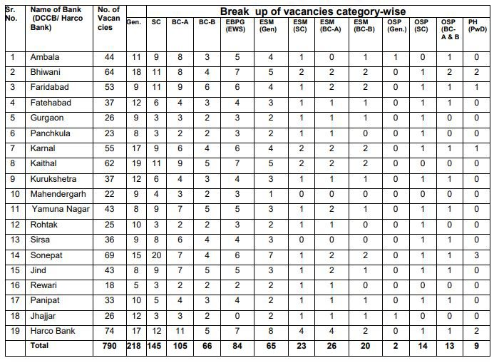
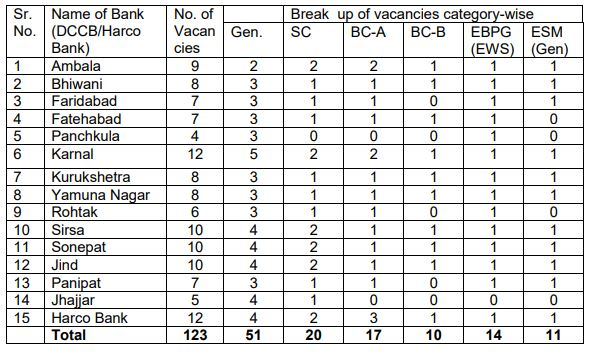
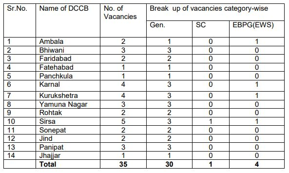
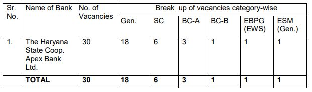

**HARCO Bank Recruitment 2019**: THE HARYANA STATE COOPERATIVE APEX BANK LTD. is invited for direct recruitment of clerk, Junior Accountant, Senior Accountant, and Assistant Manager/Development Officer. as per notification Total 978 vacancies, in Chandigarh and 18 District Central Co-operative Banks in the state of Haryana. information about all these posts is given on this page. Harco Bank Online Application Form can be filled up from 14-08-2019 to 31-08-2019. Interested candidates can apply online well in advance without waiting for the last date of submission of Harco bank recruitment online form. The online examination shall be conducted by Institute of Banking Personnel Selection (IBPS).

## HARCO Bank Clerk & Various Posts Vacancy Details

<table style="height: 2724px; width: 84.9475%; border-collapse: collapse; border-style: double;"><tbody><tr style="height: 80px;"><td style="width: 100%; text-align: center; height: 50px;" colspan="2"><strong>THE HARYANA STATE COOPERATIVE APEX BANK LTD</strong>

HARCO Bank Recruitment

978 Vacancies</td></tr><tr style="height: 30px;"><td style="width: 100%; height: 30px; background-color: #2a5a8e; text-align: center;" colspan="2"><h3><strong>HARCO Bank Clerk Important Dates</strong></h3></td></tr><tr style="height: 22px;"><td style="width: 49.7696%; text-align: center; height: 22px;">Starting Date for Registration</td><td style="width: 50.2304%; text-align: center; height: 22px;"><strong>14-08-2019</strong></td></tr><tr style="height: 22px;"><td style="width: 49.7696%; text-align: center; height: 22px;">Last Date for Registration</td><td style="width: 50.2304%; text-align: center; height: 22px;"><strong>31-08-2019</strong></td></tr><tr style="height: 25px;"><td style="width: 49.7696%; text-align: center; height: 25px;">Online Payment of Fees</td><td style="width: 50.2304%; text-align: center; height: 25px;"><strong>14-08-2019 to 31-08-2019</strong></td></tr><tr style="height: 44px;"><td style="width: 49.7696%; text-align: center; height: 44px;">Online Examination Dates</td><td style="width: 50.2304%; text-align: center; height: 44px;"><strong>October/November 2019(Tentative)</strong></td></tr><tr style="height: 30px;"><td style="width: 100%; height: 30px; background-color: #2a5a8e; text-align: center;" colspan="2"><h3><strong>&nbsp;Vacancy Details</strong></h3></td></tr><tr style="height: 22px;"><td style="text-align: center; height: 22px; width: 49.7696%;">Job Recruitment Board</td><td style="text-align: center; width: 50.2304%; height: 22px;"><strong>The Haryana State Cooperative Apex Bank Ltd.</strong></td></tr><tr style="height: 22px;"><td style="text-align: center; width: 49.7696%; height: 22px;">Post Name</td><td style="text-align: center; width: 50.2304%; height: 22px;"><strong>Various Posts</strong></td></tr><tr style="height: 22px;"><td style="text-align: center; width: 49.7696%; height: 22px;">No of Vacancies</td><td style="text-align: center; width: 50.2304%; height: 22px;"><strong>978</strong></td></tr><tr style="height: 22px;"><td style="text-align: center; width: 49.7696%; height: 22px;">Examination Organizer</td><td style="text-align: center; width: 50.2304%; height: 22px;"><strong>Institute of Banking Personnel Selection (IBPS)</strong></td></tr><tr style="height: 22px;"><td style="text-align: center; width: 49.7696%; height: 22px;">Job Category</td><td style="text-align: center; width: 50.2304%; height: 22px;"><a href="https://freegovtjobalert.in/bank-jobs-recruitment/" target="_blank" rel="noopener noreferrer"><strong>Bank Jobs</strong></a></td></tr><tr style="height: 22px;"><td style="text-align: center; width: 49.7696%; height: 22px;">Job State</td><td style="text-align: center; width: 50.2304%; height: 22px;"><a href="https://freegovtjobalert.in/haryana-govt-job/" target="_blank" rel="noopener noreferrer"><strong>Haryana</strong></a></td></tr><tr style="height: 22px;"><td style="text-align: center; width: 49.7696%; height: 22px;">Job Location</td><td style="text-align: center; width: 50.2304%; height: 22px;"><strong>Across Haryana</strong></td></tr><tr style="height: 30px;"><td style="width: 100%; background-color: #2a5a8e; text-align: center; height: 30px;" colspan="2"><h3><strong>HARCO Bank Category Wise Vacancy Details</strong></h3></td></tr><tr style="height: 1145px;"><td style="text-align: center; width: 100%; height: 1145px;" colspan="2"><strong>790 Vacancies of Clerks</strong>

<strong>123 Vacancies of Junior Accountant</strong>

<strong>35 Vacancies of Senior Accountant</strong>

<strong>30 Vacancies of Assistant Manager/Development Officer</strong>

</td></tr><tr style="height: 30px;"><td style="width: 100%; height: 30px; background-color: #2a5a8e; text-align: center;" colspan="2"><h3><strong>Eligibility Criteria&nbsp;</strong></h3></td></tr><tr style="height: 14px;"><td style="text-align: center; height: 14px; width: 49.7696%;"><strong>Post Name</strong></td><td style="text-align: center; width: 50.2304%; height: 14px;"><strong>Education Qualification</strong></td></tr><tr style="height: 150px;"><td style="text-align: center; width: 49.7696%; height: 56px;">Clerk</td><td style="text-align: center; width: 50.2304%; height: 56px;"><ul><li style="text-align: left;">Graduation with 55% marks or Commerce Graduate with 50% marks from a recognized University.</li><li style="text-align: left;">Knowledge of Hindi/ Sanskrit up to Matric standard.</li></ul></td></tr><tr style="height: 150px;"><td style="text-align: center; width: 49.7696%; height: 149px;">Junior Accountant</td><td style="text-align: center; width: 50.2304%; height: 149px;"><ul><li style="text-align: left;">B.Com/B.A with Economics or Math/ B.Sc with Maths as one of the subject with at least 55% marks in aggregate/ B.Tech with at least 60% marks.</li><li style="text-align: left;">Knowledge of Hindi/ Sanskrit up to Matric Standard.</li></ul></td></tr><tr style="height: 150px;"><td style="text-align: center; width: 49.7696%; height: 138px;">Senior Accountant</td><td style="text-align: center; width: 50.2304%; height: 138px;"><ul><li style="text-align: left;">At least 55% marks in Commerce or Science with Math or BA with Math or Economics with 3 years experience. OR At least 50% marks in M.Com or MA with Math or Economics</li><li style="text-align: left;">Knowledge of Hindi/ Sanskrit up to Matric Standard.</li></ul></td></tr><tr style="height: 200px;"><td style="text-align: center; width: 49.7696%; height: 315px;">Assistant Manager/Development Officer</td><td style="text-align: center; width: 50.2304%; height: 315px;"><ul><li style="text-align: left;">At least 60% marks in Graduation in science with Math/ Arts with Economics or Maths/ Commerce/B.Tech. OR Post Graduate in Maths or Economics or Commerce or Business Administration or Engineering with at least 55% marks either in Graduation or Post Graduation or Chartered Accountant with at least 55% marks. OR 50% marks in Post Graduation in Economics or Maths or Commerce with CAIIB. OR Master in Banking and Insurance Management with 60% marks.</li><li style="text-align: left;">Knowledge of Hindi/ Sanskrit up to Matric Standard.</li></ul></td></tr><tr style="height: 30px;"><td style="width: 100%; background-color: #2a5a8e; text-align: center; height: 30px;" colspan="2"><h3><strong>HARCO Bank Clerk Age Limits &amp; Age Relaxation</strong></h3></td></tr><tr style="height: 170px;"><td style="text-align: center; width: 100%; height: 177px;" colspan="2"><ul><li style="text-align: left;">Minimum of 18 years</li><li style="text-align: left;">maximum of 42 years</li></ul>
<strong>Age Relaxation:</strong>

<ul><li style="text-align: left;">SC, ST, Backward Class(A) &amp; Backward Class(B), the upper age limit is relaxable up to 5 years and in case of ExServiceman candidates shall be of 42 years Plus continuous Military Service added by three years.</li></ul></td></tr><tr style="height: 30px;"><td style="width: 100%; background-color: #2a5a8e; text-align: center; height: 30px;" colspan="2"><h3><strong>HARCO Bank Clerk Salary/Pay Scale</strong></h3></td></tr><tr style="height: 70px;"><td style="width: 100%; text-align: left; height: 75px;" colspan="2"><ul><li>Clerk, Junior Accountant, Senior Accountant: Level-6 (Rs.35400-112400)</li><li>Assistant Manager/Development Officer: Level-7 (Rs.44900-142400)</li></ul></td></tr><tr style="height: 30px;"><td style="width: 100%; height: 30px; background-color: #2a5a8e; text-align: center;" colspan="2"><h3><strong>HARCO Bank Clerk Application Fee&nbsp;</strong></h3></td></tr><tr style="height: 30px;"><td style="width: 100%; text-align: center; height: 55px;" colspan="2"><ul><li style="text-align: left;">General Category: Rs. 600/-</li><li style="text-align: left;">SC/BCA/BCB/ EBPG(EWS), female candidates of Haryana only: Rs. 300/-</li><li style="text-align: left;">No fee for Ex-serviceman of Haryana.</li></ul>(Payment Through online Via Debit Card/Credit Cards, Internet Bankings, Cash ards, Mobile Wallet.)</td></tr><tr style="height: 30px;"><td style="width: 100%; height: 30px; background-color: #2a5a8e; text-align: center;" colspan="2"><h3><strong>Important Links&nbsp;</strong></h3></td></tr><tr style="height: 10px;"><td style="width: 49.7696%; text-align: center; height: 10px;"><strong>Apply Online&nbsp;</strong></td><td style="width: 50.2304%; text-align: center; height: 10px;"><strong><a style="color: #ff0000;" title="HARCO Bank" href="https://ibpsonline.ibps.in/harcovpaug19/basic_details.php" target="_blank" rel="noopener noreferrer">Registration</a>&nbsp;|&nbsp;<a style="color: #ff0000;" title="HARCO Bank" href="https://ibpsonline.ibps.in/harcovpaug19/" target="_blank" rel="noopener noreferrer">Login</a></strong></td></tr><tr style="height: 36px;"><td style="width: 49.7696%; text-align: center; height: 23px;"><strong>Notification</strong></td><td style="width: 50.2304%; text-align: center; height: 23px;"><a style="color: #ff0000;" href="https://freegovtjobalert.in/wp-content/uploads/2019/08/Notification-HARCO-Bank-Clerk-Accountant-Asst-Manager-Posts.pdf" target="_blank" rel="noopener noreferrer"><strong>Click Here&nbsp;</strong></a></td></tr><tr style="height: 10px;"><td style="width: 49.7696%; text-align: center; height: 10px;"><strong>&nbsp;Official Website</strong></td><td style="width: 50.2304%; text-align: center; height: 10px;"><a style="color: #ff0000;" href="http://www.harcobank.org.in/" target="_blank" rel="noopener noreferrer"><strong>Click Here</strong></a></td></tr></tbody></table>

### How To Apply For HARCO Bank Clerk Application Form 2019?

1. Candidates First Goto Here: [HARCO Bank Apply Online Form](https://ibpsonline.ibps.in/harcovpaug19/)
2. Login With Your Registration Number & Password. (If you Don't Have registration number then first Click on "CLICK HERE FOR NEW REGISTRATION" and Register your self on IBPS Site and get registration number then login)
3. After Login, you can check & Fill up your Details
4. Upload Photograph, Candidate photo, Candidate Signature Image
5. Check All Details And Document Before Submit Yous Application Form.
6. then click on submit button.
7. Pay Application Fee. (Online)
8. Download & Save Your Application  For Future Use.
9. Done

> More Govt Jobs: [www.freegovtjobalert.in](https://freegovtjobalert.in)
