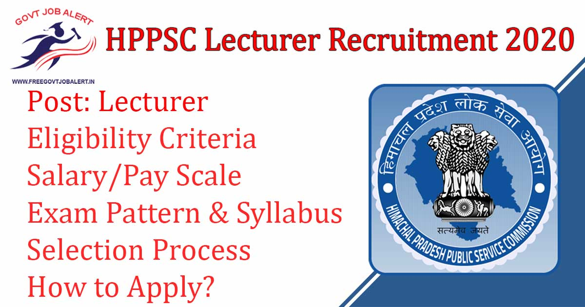
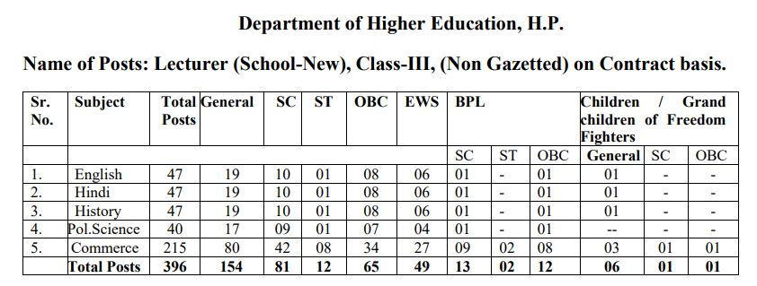
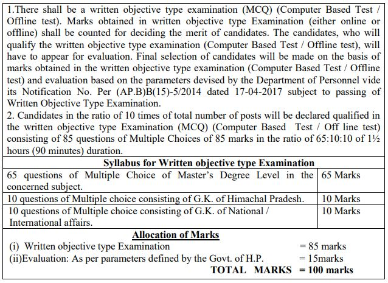

HPPSC Lecturer Recruitment 2019: Himachal Pradesh Public Service Commission has released a notification for the recruitment of the Lecturer Post. Online Recruitment Applications (ORA) are invited from desirous and eligible candidates for filling up of posts of Lecturer (SchoolNew) in the Department of Higher Education, Himachal Pradesh. As Per HPPSC Lecturer Recruitment 2019 Notification A total of 396 Vacancies is There. HPPSC Lecturer Recruitment online Form has started on 10-12-2019 at www.hppsc.hp.gov.in 2019.

## **HPPSC Lecturer Recruitment 2019**

<table style="border-collapse: collapse; width: 100%;"><tbody><tr><td style="width: 50%; background-color: #2a5a8e; text-align: center;" colspan="2"><h3><strong>HPPSC Recruitment 2019</strong></h3></td></tr><tr><td style="width: 50%; text-align: center;">Job Recruitment Board</td><td style="width: 50%; text-align: center;">Himachal Pradesh Public Service Commission</td></tr><tr><td style="width: 50%; text-align: center;">Notification No.</td><td style="width: 50%; text-align: center;">22/2019</td></tr><tr><td style="width: 50%; text-align: center;">Post</td><td style="width: 50%; text-align: center;">Lecturer</td></tr><tr><td style="width: 50%; text-align: center;">Vacancies</td><td style="width: 50%; text-align: center;">396</td></tr><tr><td style="width: 50%; text-align: center;">Job Location</td><td style="width: 50%; text-align: center;">Himachal Pradesh</td></tr><tr><td style="width: 50%; text-align: center;">Job Type</td><td style="width: 50%; text-align: center;">Teacher Jobs</td></tr><tr><td style="width: 50%; text-align: center;">Application Mode</td><td style="width: 50%; text-align: center;">Online</td></tr></tbody></table>

HPPSC Recruitment 2019 Notification PDF and Apply Online Link Available on his official website. Those Candidates are Eligible to apply who have passed Matriculation and 10+2 from any school/institution situated within Himachal Pradesh or is bonafide of Himachal Pradesh. Applicants must Age Between 18 to 45 Years. Selected Candidates Will be Placed in Himachal Pradesh. Good Chance For Those Candidates who are Finding Teacher Jobs In Himachal Pradesh. They can Fill up HPPSC Lecturer Online Application Form Before the Last Date.

<table style="border-collapse: collapse;"><tbody><tr><td style="width: 50%; background-color: #2a5a8e; text-align: center;" colspan="2"><h3><strong>Important Dates</strong></h3></td></tr><tr><td style="width: 50%; text-align: center;">Starting Date of Online Application</td><td style="width: 50%; text-align: center;">10-12-2019</td></tr><tr><td style="width: 50%; text-align: center;">Last Date of Online Application</td><td style="width: 50%; text-align: center;">31-12-2019</td></tr></tbody></table>

HPPSC Lecturer Recruitment 2019 Details Like Education Qualification, Age Limits, Application Fee, Exam Pattern, How to apply, etc. - given below.

### **HPPSC Vacancy Details**

- HPPSC Lecturer Vacancy: 396 Posts

### **HPPSC Lecturer Recruitment Eligibility Criteria**

Age Limits

- Minimum 18 Years
- Maximum 45  Years

Education Qualification

**Academic Qualifications:**

- Master‟s Degree in the subject concerned from a recognized University (with a minimum of 50% Marks in aggregate) or its equivalent. Candidates having a Master‟s Degree in Public Administration is eligible for Lecturer (SchoolNew) Political Science.

**Lecturer (School-New) Commerce:**

- Commerce with Accountancy/ Financial Accountancy and income tax as a major subject of study. Holder of Degree of MFC (Master of Finance Control) is also eligible for the post of Lecturer (School -New) in Commerce subject from a recognized University.

II - Proficiency in teaching Hindi & English

**2\. Professional Qualification:**

- Bachelor Education (B.Ed.) as a professional qualification from recognized University / Institution with minimum 50% marks. OR Two years ‟s Integrated M.Sc. Ed. Course or an equivalent course from a recognized University.

**Desirable Qualification:**

- Knowledge of customs, manner, and dialects of Himachal Pradesh and suitability for appointment in the peculiar conditions prevailing in the Pradesh.

### **HPPSC Lecturer Salary/Pay Scale**

- Rs.10300-34800 + 4200 GP (Contractual amount of Rs. 14,500/- PM)

### **Selection Process For HPPSC Lecturer Recruitment**

1. Written objective type Exam
2. Interview

### **HPPSC Lecturer Exam Pattern & Syllabus**

### **Application Fee For HPPSC Lecturer Recruitment 2020**

- General Category/ E.W.S Candidates: Rs. 400/-
- S.C. of H.P. / S.T. of H.P. / O.B.C. of H.P./ BPL of H.P./EWS (BPL): Rs. 100/-
- Ex-Servicemen of H.P: No Fee
- Payment Mode: Online

### **How to Apply for HPPSC Lecturer Recruitment 2020**

1. Candidates Go to HPPSC Official Website:
2. Then Go to Apply Online Section
3. Click On Online Application Registration
4. Fill Up Application Form and Register
5. Then Login With Your User Name & Password
6. Fill up Education Details
7. Upload Recruited Document/ Images
8. Pay Application Fee
9. Submit Application 
10. Download & Save Application For Future Use.

### **HPPSC Lecturer Recruitment 2020 Important Links**

- HPPSC Lecturer Recruitment Online Form 2020: [Click Here](http://www.hppsc.hp.gov.in/hppsc/Content/Index/?qlid=13&Ls_is=16&lngid=1)
- Download HPPSC 396 Lecturer Vacancy Notification 2019: [Click Here](http://www.hppsc.hp.gov.in/hppsc//WriteReadData/LINKS/PGT2240348ecf-62c4-4f80-8fad-4620fd7d621b.pdf)
- HPPSC Official website: [Click Here](http://www.hppsc.hp.gov.in/)

Candidates can visit www.hppsc.hp.gov.in to get more details about HPPSC Lecturer Recruitment 2019-20. To More Information About HPPSC upcoming vacancies 2020, latest Updates, Admit Card, Syllabus, Result, Etc. It will be published on the official website. Also, visit Regularly our website [www.freegovtjobalert.in](https://freegovtjobalert.in) for getting the Latest job Updates.
