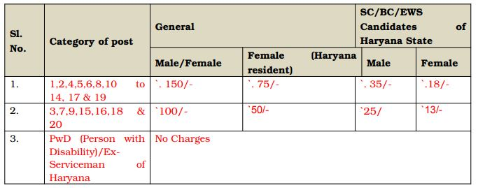

**HSSC Recruitment 2019**: Haryana Staff Selection Commission has Recently Released **(HSSC)Notice** For Various Posts. **HSSC Online Application** Are Invited For Direct Recruitment For 4322 Posts of Various Department/Boards/Corporations. We Mentioned All **HSSC new vacancy 2019**, **HSSC upcoming recruitment** in Our Website So interested Candidates Can bookmark a website and Get [**Free Govt Job Alert**](https://freegovtjobalert.in). **HSSC recruitment 2019** Above Post, All Details is Given In **HSSC Advertisement No. adv152019**. **HSSC Online Form 2019** is Starts From 20-09-219 to 09-10-2019. All Eligible & Interested Candidates Can Apply **HSSC Application Form Online**. To know **HSSC jobs Details** Like Education Qualification, Age Limits, Pay Scale, Etc. Given in this Page Below.

## HSSC Recruitment 2019 Apply Online 4233 Various Vacancy

<table style="height: 2679px; width: 90.0404%; border-collapse: collapse; border-style: double;"><tbody><tr style="height: 80px;"><td style="width: 100%; text-align: center; height: 50px;" colspan="2">Haryana Staff Selection Commission

HSSC Recruitment 2019

4322 Various Vacancy</td></tr><tr style="height: 30px;"><td style="width: 100%; height: 30px; background-color: #2a5a8e; text-align: center;" colspan="2"><h3><strong>HSSC Important Dates</strong></h3></td></tr><tr style="height: 22px;"><td style="width: 50%; text-align: center; height: 22px;">Opening date for submission of online applications</td><td style="width: 50%; text-align: center; height: 22px;">20-09-2019</td></tr><tr style="height: 22px;"><td style="width: 50%; text-align: center; height: 22px;">Closing date for submission of online application</td><td style="width: 50%; text-align: center; height: 22px;">09-10-2019</td></tr><tr style="height: 30px;"><td style="width: 100%; height: 30px; background-color: #2a5a8e; text-align: center;" colspan="2"><h3><strong>HSSC Various Vacancy Details</strong></h3></td></tr><tr style="height: 22px;"><td style="text-align: center; height: 22px; width: 50%;">Job Recruitment Board</td><td style="text-align: center; width: 50%;">Haryana Staff Selection Commission Recruitment</td></tr><tr><td style="text-align: center; width: 50%;">Post</td><td style="text-align: center; width: 50%;">Various Posts</td></tr><tr><td style="text-align: center; width: 50%;">No of Vacancies</td><td style="text-align: center; width: 50%;">4322</td></tr><tr><td style="text-align: center; width: 50%;">Job Location</td><td style="text-align: center; width: 50%;">Across Haryana</td></tr><tr><td style="text-align: center; width: 50%;">Application Mode</td><td style="text-align: center; width: 50%;">Online</td></tr><tr style="height: 30px;"><td style="width: 100%; height: 30px; background-color: #2a5a8e; text-align: center;" colspan="2"><h3><strong>HSSC Jobs Eligibility Criteria&nbsp;</strong></h3></td></tr><tr style="height: 14px;"><td style="width: 100%; text-align: center; height: 14px;" colspan="2"><table style="border-collapse: collapse; width: 95.7233%; height: 1077px;"><tbody><tr style="height: 44px;"><td style="width: 5.9964%; height: 44px;"><strong>No</strong></td><td style="width: 29.9835%; height: 44px;"><strong>Post Name (Vacancy)</strong></td><td style="width: 42.3325%; height: 44px;"><strong>Education</strong></td><td style="width: 10.8438%; height: 44px;"><strong>Age Years</strong></td><td style="width: 10.8438%; height: 44px;"><strong>Pay Scale</strong></td></tr><tr style="height: 44px;"><td style="width: 5.9964%; height: 44px;">01</td><td style="width: 29.9835%; height: 44px;">Dental Hygienist (29)</td><td style="width: 42.3325%; height: 44px;">Matric with Science from a recognized Board/University</td><td style="width: 10.8438%; height: 44px;">17-42</td><td style="width: 10.8438%; height: 44px;">FPL-6</td></tr><tr style="height: 132px;"><td style="width: 5.9964%; height: 10px;">02</td><td style="width: 29.9835%; height: 10px;">Laboratory Technician (307)</td><td style="width: 42.3325%; height: 10px;">10+2 with Physics and Chemistry and one-year Laboratory Technician Diploma from an institution recognized by Haryana State.</td><td style="width: 10.8438%; height: 10px;">17-42</td><td style="width: 10.8438%; height: 10px;">FPL-6</td></tr><tr style="height: 44px;"><td style="width: 5.9964%; height: 44px;">03</td><td style="width: 29.9835%; height: 44px;">Laboratory Attendant (28)</td><td style="width: 42.3325%; height: 44px;">Matric with Science (Physics &amp; Chemistry)</td><td style="width: 10.8438%; height: 44px;">17-42</td><td style="width: 10.8438%; height: 44px;">FPL-4</td></tr><tr style="height: 22px;"><td style="width: 5.9964%; height: 22px;">04</td><td style="width: 29.9835%; height: 22px;">MPHW(F) (565)</td><td style="width: 42.3325%; height: 22px;">10+2 ANM Training Course</td><td style="width: 10.8438%; height: 22px;">17-42</td><td style="width: 10.8438%; height: 22px;">FPL-6</td></tr><tr style="height: 44px;"><td style="width: 5.9964%; height: 44px;">05</td><td style="width: 29.9835%; height: 44px;">Pharmacist (92)</td><td style="width: 42.3325%; height: 44px;">10+2 with Science (Physics and Chemistry)</td><td style="width: 10.8438%; height: 44px;">17-42</td><td style="width: 10.8438%; height: 44px;">FPL-6</td></tr><tr style="height: 66px;"><td style="width: 5.9964%; height: 66px;">06</td><td style="width: 29.9835%; height: 66px;">Radiographer/Ultrasound Technician (197)</td><td style="width: 42.3325%; height: 66px;">Matric with Science (Physics and Chemistry), Radiographer’s diploma</td><td style="width: 10.8438%; height: 66px;">17-42</td><td style="width: 10.8438%; height: 66px;">FPL-6</td></tr><tr style="height: 44px;"><td style="width: 5.9964%; height: 44px;">07</td><td style="width: 29.9835%; height: 44px;">Health Visitor (08)</td><td style="width: 42.3325%; height: 44px;">Matric with Science (Physics &amp; Chemistry).</td><td style="width: 10.8438%; height: 44px;">17-42</td><td style="width: 10.8438%; height: 44px;">FPL-5</td></tr><tr style="height: 88px;"><td style="width: 5.9964%; height: 57px;">08</td><td style="width: 29.9835%; height: 57px;">Ophthalmic Assistant (66)</td><td style="width: 42.3325%; height: 57px;">Pre-Medical or it's equivalent with at least 40% Marks, Ophthalmic Assistant’s diploma</td><td style="width: 10.8438%; height: 57px;">17-42</td><td style="width: 10.8438%; height: 57px;">FPL-6</td></tr><tr style="height: 88px;"><td style="width: 5.9964%; height: 88px;">09</td><td style="width: 29.9835%; height: 88px;">Operation Theatre Assistant (100)</td><td style="width: 42.3325%; height: 88px;">Matric with Science (Physics and Chemistry), Operation Theatre Assistant Course from the PGIMER</td><td style="width: 10.8438%; height: 88px;">17-42</td><td style="width: 10.8438%; height: 88px;">FPL-4</td></tr><tr style="height: 44px;"><td style="width: 5.9964%; height: 44px;">10</td><td style="width: 29.9835%; height: 44px;">Staff Nurse (1584)</td><td style="width: 42.3325%; height: 44px;">B.Sc (Hons) Nursing or B.Sc (Post Basic) Nursing</td><td style="width: 10.8438%; height: 44px;">17-42</td><td style="width: 10.8438%; height: 44px;">FPL-7</td></tr><tr style="height: 88px;"><td style="width: 5.9964%; height: 88px;">11</td><td style="width: 29.9835%; height: 88px;">Veterinary Livestock Development Assistant (VLDA) (546)</td><td style="width: 42.3325%; height: 88px;">Matric or it's equivalent, Two Years Veterinary Livestock Development Assistant Diploma course</td><td style="width: 10.8438%; height: 88px;">17-42</td><td style="width: 10.8438%; height: 88px;">FPL-6</td></tr><tr style="height: 80px;"><td style="width: 5.9964%; height: 80px;">12</td><td style="width: 29.9835%; height: 80px;">Supervisor Female (19)</td><td style="width: 42.3325%; height: 80px;">Matriculation from a recognized Board, Eleven Months training as Bal Sevika</td><td style="width: 10.8438%; height: 80px;">17-45</td><td style="width: 10.8438%; height: 80px;">FPL-6</td></tr><tr style="height: 58px;"><td style="width: 5.9964%; height: 58px;">13</td><td style="width: 29.9835%; height: 58px;">Supervisor Female (57)</td><td style="width: 42.3325%; height: 58px;">Graduate from a recognized University</td><td style="width: 10.8438%; height: 58px;">17-42</td><td style="width: 10.8438%; height: 58px;">FPL-6</td></tr><tr style="height: 80px;"><td style="width: 5.9964%; height: 80px;">14</td><td style="width: 29.9835%; height: 80px;">Junior System Engineer (126)</td><td style="width: 42.3325%; height: 80px;">B.E/B.Tech(IT) / Computer Science / Electronics and Communications)</td><td style="width: 10.8438%; height: 80px;">18-42</td><td style="width: 10.8438%; height: 80px;">FPL-7</td></tr><tr style="height: 22px;"><td style="width: 5.9964%; height: 22px;">15</td><td style="width: 29.9835%; height: 22px;">Clerk (23)</td><td style="width: 42.3325%; height: 22px;">A Matriculate/Higher Secondary</td><td style="width: 10.8438%; height: 22px;">25-50</td><td style="width: 10.8438%; height: 22px;">FPL-2</td></tr><tr style="height: 88px;"><td style="width: 5.9964%; height: 88px;">16</td><td style="width: 29.9835%; height: 88px;">Welfare Organiser (77)</td><td style="width: 42.3325%; height: 88px;">A Matriculate or equivalent or higher qualifications or holder of 1st class education in the Army or an equivalent certificate from the Navy or Air Force</td><td style="width: 10.8438%; height: 88px;">25-52</td><td style="width: 10.8438%; height: 88px;">FPL-4</td></tr><tr style="height: 44px;"><td style="width: 5.9964%; height: 44px;">17</td><td style="width: 29.9835%; height: 44px;">Divisional/Revenue Accountant (42)</td><td style="width: 42.3325%; height: 44px;">Master’s Degree in Commerce</td><td style="width: 10.8438%; height: 44px;">18-42</td><td style="width: 10.8438%; height: 44px;">FPL-6</td></tr><tr style="height: 22px;"><td style="width: 5.9964%; height: 22px;">18</td><td style="width: 29.9835%; height: 22px;">Sub-Inspector General (409)</td><td style="width: 42.3325%; height: 22px;">12th Passed</td><td style="width: 10.8438%; height: 22px;">18-42</td><td style="width: 10.8438%; height: 22px;">FPL-2</td></tr><tr style="height: 44px;"><td style="width: 5.9964%; height: 44px;">19</td><td style="width: 29.9835%; height: 44px;">Staff Nurse (24) Employees State Insurance Health Care</td><td style="width: 42.3325%; height: 44px;">B.Sc (Honors) Nursing or B.Sc (Post Basic) Nursing</td><td style="width: 10.8438%; height: 44px;">18-42</td><td style="width: 10.8438%; height: 44px;">FPL-6</td></tr><tr style="height: 44px;"><td style="width: 5.9964%; height: 44px;">20</td><td style="width: 29.9835%; height: 44px;">MPHW(F) (23)Employees State Insurance Health Care</td><td style="width: 42.3325%; height: 44px;">10+2, ANM Training Course</td><td style="width: 10.8438%; height: 44px;">17-42</td><td style="width: 10.8438%; height: 44px;">FPL-4</td></tr></tbody></table></td></tr><tr style="height: 30px;"><td style="width: 100%; height: 30px; background-color: #2a5a8e; text-align: center;" colspan="2"><h3><strong>HSSC Application Form Fee&nbsp;</strong></h3></td></tr><tr style="height: 30px;"><td style="width: 100%; text-align: center; height: 30px;" colspan="2"></td></tr><tr style="height: 30px;"><td style="width: 100%; height: 30px; background-color: #2a5a8e; text-align: center;" colspan="2"><h3><strong>HSSC Recruitment Important Links&nbsp;</strong></h3></td></tr><tr style="height: 10px;"><td style="width: 50%; text-align: center; height: 10px;"><strong>Apply Online&nbsp;</strong></td><td style="width: 50%; text-align: center; height: 10px;"><strong><a style="color: #ff0000;" href="http://www.recruitmentportal.in/adv152019.html" target="_blank" rel="noopener noreferrer">Click Here</a></strong></td></tr><tr style="height: 36px;"><td style="width: 50%; text-align: center; height: 23px;"><strong>Notification</strong></td><td style="width: 50%; text-align: center; height: 23px;"><a style="color: #ff0000;" href="https://freegovtjobalert.in/wp-content/uploads/2019/09/Notification-HSSC-Various-Posts.pdf" target="_blank" rel="noopener noreferrer"><strong>Click Here</strong></a></td></tr><tr style="height: 10px;"><td style="width: 50%; text-align: center; height: 10px;"><strong>&nbsp;Official Website</strong></td><td style="width: 50%; text-align: center; height: 10px;"><a style="color: #ff0000;" href="https://www.hssc.gov.in/" target="_blank" rel="noopener noreferrer"><strong>Click Here</strong></a></td></tr><tr><td style="width: 50%; text-align: center;" colspan="2"><strong>Interested Candidates Plese Read Carefully HSSC Recruitment 2019 Notification Before Apply Online</strong></td></tr></tbody></table>

### How To Fill up HSSC Recruitment Application Form?

1. The online application can be filled up using URL address i.e [www.recruitmentportal.in/adv152019.html](http://www.recruitmentportal.in/adv152019.html)
2. Fill up Application Form Details
3. Upload Documents
4. Submit HSSC Online Form
5. Payment of HSSC Application Fee Online
6. Done.
