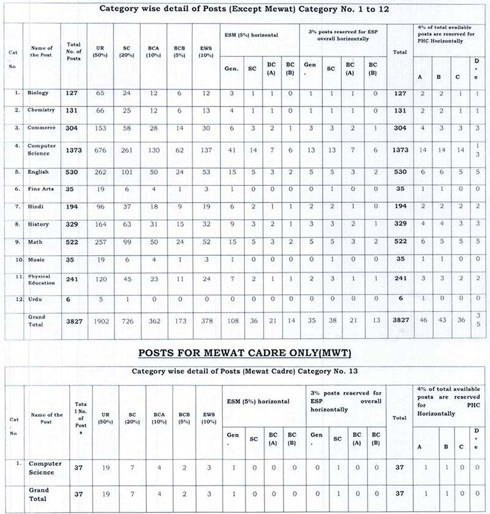

**HSSC PGT Recruitment 2019**: Haryana Staff Selection Commission are invited for direct recruitment for the 3864 posts of (PGT)-H.E.S.-ll (Group-B Services). **Apply online For HSSC PGT Teacher** started from date 20-08-2019 to 05-09-2019 on the official website. Haryana state government invites candidates who completed MA, B.Ed, M.Com, MCA, B.tech Etc. we provided all details About **HSSC PGT Teacher Vacancy** such as Education qualification, Age limit, Salary & pay scale, How To apply, etc. Also, you can get **HSSC PGT Teacher Vacancy Official notification PDF Download** in This Page. Interested candidates for PGT Teacher job in Haryana And completed for all Eligibility criteria can apply before 5th September 2019.

## HSSC PGT Teacher Job Vacancy

<table style="height: 575px; width: 93.7895%; border-collapse: collapse; border-style: double;"><tbody><tr style="height: 132px;"><td style="width: 100%; text-align: center; height: 50px;" colspan="2">Haryana Staff Selection Commission

HSSC Recruitment 2019

POST GRADUATE TEACHERS (PGT) H.E.S.II ÍGROUP-B SERVICES</td></tr><tr style="height: 30px;"><td style="width: 100%; height: 30px; background-color: #2a5a8e; text-align: center;" colspan="2"><h3><strong>&nbsp;Important Dates</strong></h3></td></tr><tr style="height: 22px;"><td style="width: 50%; text-align: center; height: 22px;">Opening Date for Submission of Online Applications</td><td style="width: 50%; text-align: center; height: 22px;">20-08-2019</td></tr><tr style="height: 22px;"><td style="width: 50%; text-align: center; height: 22px;">Closing Date For Submission of Online Application</td><td style="width: 50%; text-align: center; height: 22px;">05-09-2019(11:59 PM)</td></tr><tr style="height: 22px;"><td style="width: 50%; text-align: center; height: 22px;">Closing date for deposit of fee</td><td style="width: 50%; text-align: center; height: 22px;">09-09-2019</td></tr><tr style="height: 30px;"><td style="width: 100%; height: 30px; background-color: #2a5a8e; text-align: center;" colspan="2"><h3><strong>&nbsp;Vacancy Details</strong></h3></td></tr><tr style="height: 22px;"><td style="width: 100%; text-align: center; height: 22px;" colspan="2"><table style="border-collapse: collapse; width: 100%;"><tbody><tr><td style="width: 20.0341%;"><strong>Post Name&nbsp;</strong></td><td style="width: 11.2087%;"><strong>Vacancies</strong></td><td style="width: 68.7571%;"><strong>Qualification</strong></td></tr><tr><td style="width: 20.0341%;">Biology</td><td style="width: 11.2087%;">127</td><td style="width: 68.7571%;">M.Sc. Zoolog,l Botany/ Bio-Sciences/ Bio-Chemistry/ Genetics/ Micro-Biology/ Plant Physiology/ Bio-Technology/ Life Sciences/Molecular Bio with at least 50% marks provided that the the applicant had studied Botany &amp;, Zoology at Graduation Level and B.Ed. from a recognized university.</td></tr><tr><td style="width: 20.0341%;">Chemistry</td><td style="width: 11.2087%;">131</td><td style="width: 68.7571%;">M.Sc. Chemistry or Bio-Chemistry with at least 50%o marks and B.trd. from a recognized university.</td></tr><tr><td style="width: 20.0341%;">Commerce</td><td style="width: 11.2087%;">304</td><td style="width: 68.7571%;">M.Com. with Accounting/Cost accounting/financial accounting as a major subject of study with at least SOok marks and B.Ed. from a recognized university. Holders of a degree of M.Com in Applied/Business Economics shall not be eligible.</td></tr><tr><td style="width: 20.0341%;">Computer Science</td><td style="width: 11.2087%;">1373</td><td style="width: 68.7571%;">M.Sc Computer Science (Regular two-year course)/MCA (Regular three-year&nbsp;course)/ BE/B.Tech. Computer Science/Computer Engg./lT (Regular course) with 55% aggregate marks from a recognized university.</td></tr><tr><td style="width: 20.0341%;">English</td><td style="width: 11.2087%;">530</td><td style="width: 68.7571%;">M.A. English with at least 507o marks and B.Ed. from a recognized university.</td></tr><tr><td style="width: 20.0341%;">Arts</td><td style="width: 11.2087%;">35</td><td style="width: 68.7571%;">M.A. Fine Arts with at least 5O7o marks and B.Ed from a recognized university.</td></tr><tr><td style="width: 20.0341%;">Hindi</td><td style="width: 11.2087%;">194</td><td style="width: 68.7571%;">M.A, Hindi with at least 50% marks and B.Ed. from a recognized university.</td></tr><tr><td style="width: 20.0341%;">History</td><td style="width: 11.2087%;">329</td><td style="width: 68.7571%;">M.A. History with at least 507o marks and B.Ed. from a recognized university.</td></tr><tr><td style="width: 20.0341%;">Mathematics</td><td style="width: 11.2087%;">522</td><td style="width: 68.7571%;">M.A. Mathematics/ M.Sc. Mathematics/Applied Mathematics with Mathematics as one of the subject at Graduation level with at least 507o marks and B.Ed. from a recognized university.</td></tr><tr><td style="width: 20.0341%;">Music</td><td style="width: 11.2087%;">35</td><td style="width: 68.7571%;">M.A Music with at least 50% marks and B.Ed from a recognized university.</td></tr><tr><td style="width: 20.0341%;">Physical Education</td><td style="width: 11.2087%;">241</td><td style="width: 68.7571%;">M.A. Physical traduction with at least 50%o marks and B.Ed. from recognized university.</td></tr><tr><td style="width: 20.0341%;">Urdu</td><td style="width: 11.2087%;">6</td><td style="width: 68.7571%;">M.A. Urdu with at least 50% marks and B.Ed. from recognized university.</td></tr><tr><td style="width: 20.0341%;">Computer Science(Only MWT)</td><td style="width: 11.2087%;">37</td><td style="width: 68.7571%;">M.Sc Computer Science (Regular two-year course)/MCA (Regular three year course)/ BE/B.Tech. Computer Science/Computer Engg./lT (Regular course) with 55% aggregate marks from a recognized university.</td></tr></tbody></table></td></tr><tr style="height: 30px;"><td style="width: 100%; height: 30px; background-color: #2a5a8e; text-align: center;" colspan="2"><h3><strong>Eligibility Criteria&nbsp;</strong></h3></td></tr><tr style="height: 14px;"><td style="width: 50%; text-align: center; height: 14px;"><strong>Pay Scale</strong></td><td style="width: 50%; text-align: center; height: 14px;"><strong>Age Limits</strong></td></tr><tr style="height: 30px;"><td style="width: 50%; text-align: center; height: 30px;">In the pay matrix level-8 (Rs. 47,600-1,51,100).</td><td style="width: 50%; text-align: center; height: 30px;">Minimum 18 Years

Maximum 42 years</td></tr><tr style="height: 30px;"><td style="width: 100%; height: 30px; background-color: #2a5a8e; text-align: center;" colspan="2"><h3><strong>Application Fee&nbsp;</strong></h3></td></tr><tr style="height: 30px;"><td style="text-align: center; height: 30px; width: 50%;"><b>General</b></td><td style="text-align: center; width: 50%; height: 30px;"><strong>Haryana resident</strong></td></tr><tr style="height: 148px;"><td style="text-align: center; width: 50%; height: 148px;"><ul><li style="text-align: left;">Male/Female: Rs. 500/-</li></ul></td><td style="text-align: center; width: 50%; height: 148px;"><ul><li style="text-align: left;">Female: Rs. 125/-</li></ul>SC/BC/EWS Candidates of Haryana State:<ul><li style="text-align: left;">Male: Rs. 125/-</li><li style="text-align: left;">Female: Rs. 75</li></ul></td></tr><tr style="height: 22px;"><td style="text-align: center; width: 50%; height: 22px;" colspan="2">PwD (Person with Disability)/ExServiceman of Haryana: No Charges&nbsp;</td></tr><tr style="height: 30px;"><td style="width: 100%; height: 30px; background-color: #2a5a8e; text-align: center;" colspan="2"><h3><strong>Important Links&nbsp;</strong></h3></td></tr><tr style="height: 10px;"><td style="width: 50%; text-align: center; height: 10px;"><strong>Apply Online&nbsp;</strong></td><td style="width: 50%; text-align: center; height: 10px;">Start On 20-08-2019</td></tr><tr style="height: 36px;"><td style="width: 50%; text-align: center; height: 23px;"><strong>Notification</strong></td><td style="width: 50%; text-align: center; height: 23px;"><a style="color: #ff0000;" href="https://freegovtjobalert.in/wp-content/uploads/2019/08/HSSC-PGT-Teacher-Job-Vacancy-Notification.pdf" target="_blank" rel="noopener noreferrer"><strong>Click Here&nbsp;</strong></a></td></tr><tr style="height: 10px;"><td style="width: 50%; text-align: center; height: 10px;"><strong>&nbsp;Official Website</strong></td><td style="width: 50%; text-align: center; height: 10px;"><a style="color: #ff0000;" href="http://www.hssc.gov.in/index.htm" target="_blank" rel="noopener noreferrer"><strong>Click Here&nbsp;</strong></a></td></tr></tbody></table>

### Subject and Category Wise PGT Teacher Vacancy Details

### HSSC PGT Teacher Experience:

- One-half (=0.5) mark for each year or part thereof exceeding six months of experience, out of a maximum of sixteen years, on the same or a higher post in any Department/Board/Corporation/Company/Statutory Body/Commission/Authority of Government of Haryana.
- No marks shall be awarded for any period of fewer than six months.

### How To Apply For HSSC PGT Teacher Post Vacancy?

1. Candidates Goto on This Link: http://adv132O19.hryssc.in/StaticPages/HomePage.aspx
2. Click on "Click here for New Registration", if you are a new user.
3. Complete the Registration & Click on "Submit".
4. After Registration, Log in with Your Registered Number & Password.
5. Fill all details in the application & upload Photo, Signature.
6. Application fee should be paid through Online & then Submit the Form.
7. Download And Take a print out of Online application for future use.

 

> More [Free Govt Job Alert](https://freegovtjobalert.in/)
