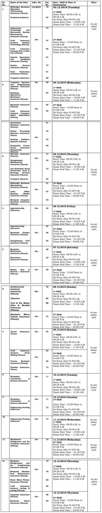

<table style="border-collapse: collapse; width: 100%;"><tbody><tr><td style="width: 50%; background-color: #2a5a8e; text-align: center;" colspan="2"><h2><strong>HSSC Recruitment 2019</strong></h2></td></tr><tr><td style="width: 50%; text-align: center;">Job Recruitment Board</td><td style="width: 50%; text-align: center;">Haryana Staff Selection Commission</td></tr><tr><td style="width: 50%; text-align: center;">Notification No.</td><td style="width: 50%; text-align: center;">Advt. No 12/2019</td></tr><tr><td style="width: 50%; text-align: center;">Post</td><td style="width: 50%; text-align: center;">Various Posts</td></tr><tr><td style="width: 50%; text-align: center;">Vacancies</td><td style="width: 50%; text-align: center;">3206</td></tr><tr><td style="width: 50%; text-align: center;">Job Location</td><td style="width: 50%; text-align: center;">Haryana</td></tr><tr><td style="width: 50%; text-align: center;">Job Type</td><td style="width: 50%; text-align: center;">State Govt Jobs</td></tr><tr><td style="width: 50%; text-align: center;">Application Mode</td><td style="width: 50%; text-align: center;">Online</td></tr><tr><td style="width: 50%; text-align: center;">Admit Card&nbsp;</td><td style="width: 50%; text-align: center;">Released</td></tr><tr><td style="width: 50%; text-align: center;">Exam Date</td><td style="width: 50%; text-align: center;">03 to 10-12-2019</td></tr><tr><td style="width: 50%; text-align: center;">Official Website</td><td style="width: 50%; text-align: center;">www.hssc.gov.in</td></tr></tbody></table>

## **HSSC Various Vacancies CBT Admit Card Released - Download Now**

Haryana Staff Selection Commission Has Issued Various Posts Computer Based Test Admit Card. Applied Candidates can Direct Download Admit Card Link Given In this Page. Exam Date, Shift, Time of Examination, Exam Place All Details Mention in Admit Card.

**3606 HSSC Various Vacancies Exam Date 2019**

**Check Important Thinks in HSSC Admit Card 2019**

- Candidates Name
- Father, Mother Name
- Signature of Candidates
- Candidates Photo
- Cast Category(General/SC/ST/OBC)
- Exam Name
- Exam Date & Time
- Exam Center Address
- Candidates Roll Number
- Read Carefully Instruction Given in Admit Card

**How to Download HSSC Admit Card 2019**

1. Candidates Go to Official Website: www.hssc.gov.in.
2. Find Advertisement 12/2019 and Click on.
3. Click on Download Admit Card.
4. Sign in with your Login id & Password.
5. Now Display Your Admit Card Download & Printout For Future Use.

> Direct Download HSSC Admit Card [Here](http://adv122019.hryssc.in/StaticPages/login.aspx)
