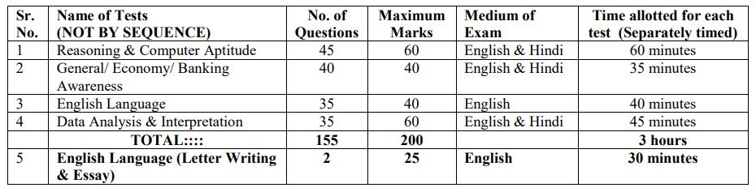

IBPS PO MT Admit Card 2019: Institute of Banking Personnel Selection Released Recruitment of Probationary Officers/ Management Trainees (IBPS PO MT) in Participating Organisations Is Tentatively Scheduled in October/ November 2019. and now The Institute of Banking Personnel Selection has Conducted PO/MT Main exam. Applied candidates can download the admit card for IBPS exam.

## IBPS PO/MT Admit Card 2019

<table style="border-collapse: collapse; width: 100%;"><tbody><tr><td style="width: 50%; text-align: center;">Job Recruitment Board</td><td style="width: 50%; text-align: center;">Institute of Banking Personnel Selection(IBPS)</td></tr><tr><td style="width: 50%; text-align: center;">Post</td><td style="width: 50%; text-align: center;">Probationary officer /Management Trainee</td></tr><tr><td style="width: 50%; text-align: center;">Vacancies</td><td style="width: 50%; text-align: center;">4336 Posts</td></tr><tr><td style="width: 50%; text-align: center;">Job type</td><td style="width: 50%; text-align: center;">Bank Jobs</td></tr><tr><td style="width: 50%; text-align: center;">PET Test Exam Date</td><td style="width: 50%; text-align: center;">23 to 28-09-2019</td></tr><tr><td style="width: 50%; text-align: center;">PET Admit Card Date</td><td style="width: 50%; text-align: center;">16 to 28-09-2019</td></tr><tr><td style="width: 50%; text-align: center;">Prelims Exam Date</td><td style="width: 50%; text-align: center;">12 to 20-10-2019</td></tr><tr><td style="width: 50%; text-align: center;">Prelims Exam Admit Card</td><td style="width: 50%; text-align: center;">30-09-2019 to 19-10-2019</td></tr><tr><td style="width: 50%; text-align: center;">Prelims Exam Result</td><td style="width: 50%; text-align: center;">October/ November 2019</td></tr><tr><td style="width: 50%; text-align: center;">Main Exam Admit Card</td><td style="width: 50%; text-align: center;">11-11-2019</td></tr><tr><td style="width: 50%; text-align: center;">Main Exam Date</td><td style="width: 50%; text-align: center;">30-11-2019</td></tr></tbody></table>

### IBPS PO Admit Card Download 2019

IBPS Released Admit Card For Probationary Officer / Management Trainee Exam. Applied Candidates can download PO/MT Admit Card/ Hall Ticket for the Main exam. IBPS Admit Card is Publish on IBPS Official Website. So candidates can download from the official website and also direct download ibps PO Admit Card from Here. IBPS PO/MT Admit Card Download Link Given Page Below.

<table style="border-collapse: collapse; width: 100%;"><tbody><tr><td style="width: 100%; background-color: #2a5a8e; text-align: center;"><strong><a href="https://freegovtjobalert.in/ibps-crp-po-mt-ix-vacancies/" target="_blank" rel="noopener noreferrer">IBPS PO/MT Notification 2019 Details Click Here</a></strong></td></tr></tbody></table>

### IBPS PO/MT Selection Process

1. Prelims Online Exam
2. Main Exam
3. Interview

### IBPS PO Exam Pattern

\[caption id="attachment\_1692" align="alignnone" width="930"\] IBPS PO MT Main Exam Pattern\[/caption\]

 

### How to Download IBPS PO/MT Admit Card 2019

1. Candidates Goto IBPS Official Website: [ibps.in](http://ibps.in)
2. Find And Click on **CRP PO/MT**
3. Click here to Download Online Main Exam Call Letter for Probationary Officers/ Management Trainees -(CRP PO/MT-IX)
4. login With Enter Registration Number & Password.
5. Now you can download your admit card for the Main exam.
6. Download & Print out For Exam Hall Ticket Use.
7. Done.

> IBPS PO/MT Main Exam Admit Card [**Download Link**](https://ibpsonline.ibps.in/crppot9jul19/clomea_nov19/login.php?appid=d78fccf6b4ee3c3b22c264da45201082)
