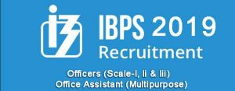

**IBPS RRB Office Assistant Recruitment 2019**:  Institute of Banking Personnel Selection Was Published IBPS RRB Office Assistant Recruitment Notification 2019 on 18th June 2019. IBPS RRB Has Taken Recruitment to Various Posts Including Officers (Scale-I, Ii & Iii) and Office Assistant (Multipurpose). a Total of 8000+ Recruitments Have Been Announced. Candidates Who Are Preparing for This **IBPS RRB Jobs** or Are Interested in **IBPS RRB Vacancy**, They Can Apply Online. Starting Online Application, from 18th June 2019 to 4th July 2019. You Can Find Apply Online Link in This Page. Interested Candidates Can Apply Online Before 4th July 2019. **IBPS RRB Eligibility 2019** Criteria as All of the Educational Qualifications, Age, Experience, and Salary Details Are Below.

## IBPS RRB Office Assistant Recruitment 2019

<table style="height: 706px; width: 100%; border-collapse: collapse; border-style: double;"><tbody><tr style="height: 130px;"><td style="width: 99.8835%; height: 25px; text-align: center;" colspan="2"><strong>IBPS RRB Office Assistant Recruitment 2019</strong>
<strong>For</strong>

<strong>Officers (Scale-I, Ii &amp; Iii) and Office Assistant (Multipurpose)</strong>
</td></tr><tr style="height: 13px;"><td style="width: 99.8835%; height: 22px; background-color: #2a5a8e;" colspan="2">
<strong>Important Dates</strong>
</td></tr><tr style="height: 39px;"><td style="width: 49.5338%; height: 32px;">
Starting Date to Apply Online
</td><td style="width: 50.3497%; height: 32px; text-align: center;"><strong>18-06-2019</strong></td></tr><tr style="height: 39px;"><td style="width: 49.5338%; height: 26px;">
Last Date to Apply Online
</td><td style="width: 50.3497%; height: 26px; text-align: center;"><strong>04-07-2019</strong></td></tr><tr style="height: 39px;"><td style="width: 49.5338%; height: 39px; text-align: center;">Fee Payment Last Date</td><td style="width: 50.3497%; height: 39px; text-align: center;"><strong>04-07-2019</strong></td></tr><tr style="height: 22px;"><td style="width: 49.5338%; height: 22px; text-align: center;">Pre Exam Training Date</td><td style="width: 50.3497%; height: 22px; text-align: center;"><strong>21-26</strong>&nbsp;<strong>July 2019 (Scale I)&nbsp;</strong>

&nbsp; &nbsp;<strong>27 July to 01 Aug. 2019 ( Office Assistant)</strong></td></tr><tr style="height: 22px;"><td style="width: 49.5338%; height: 22px; text-align: center;">Pre Exam Training Admit Card</td><td style="width: 50.3497%; height: 22px; text-align: center;"><strong>July 2019</strong></td></tr><tr style="height: 39px;"><td style="width: 49.5338%; height: 22px; text-align: center;">Pre Exam Date</td><td style="width: 50.3497%; height: 22px; text-align: center;">&nbsp;<strong>03, 04, 11 Aug. 2019 (Scale I)</strong>

<strong>17, 18, 25 Aug. 2019 ( Office Assistant)</strong></td></tr><tr style="height: 22px;"><td style="width: 49.5338%; height: 22px; text-align: center;">Mains Exam Date</td><td style="width: 50.3497%; height: 22px; text-align: center;">&nbsp;<strong>22 September 2019 (Scale I,II,III)</strong>

<strong>29 September 2019 ( Office Assistant)</strong></td></tr><tr style="height: 36px;"><td style="width: 99.8835%; height: 27px; background-color: #2a5a8e;" colspan="2">
<strong>IBPS RRB Vacancy Details / </strong><strong>Eligibility Details / Age Limits</strong>
</td></tr><tr style="height: 36px;"><td style="width: 99.8835%; height: 36px;" colspan="2"><table style="border-collapse: collapse; width: 100%; height: 731px;"><tbody><tr style="height: 40px;"><td style="width: 25%; height: 33px; background-color: #2a5a8e; text-align: center;"><strong>Post Name&nbsp;</strong></td><td style="width: 38.5167%; height: 33px; background-color: #2a5a8e; text-align: center;"><strong>Educational Qualification</strong></td><td style="width: 13.3972%; height: 33px; background-color: #2a5a8e; text-align: center;"><strong>Age Limits</strong></td><td style="width: 23.0861%; height: 33px; background-color: #2a5a8e; text-align: center;"><strong>Experience</strong></td></tr><tr style="height: 120px;"><td style="width: 25%; height: 120px; text-align: center;">Office Assistant (Multipurpose)</td><td style="width: 38.5167%; height: 120px; text-align: center;">Bachelor Degree in any Stream.

Knowledge of Computer</td><td style="width: 13.3972%; height: 120px; text-align: center;">18-28 Years</td><td style="width: 23.0861%; height: 120px; text-align: center;">-----</td></tr><tr style="height: 120px;"><td style="width: 25%; height: 120px; text-align: center;">Officer Scale-I (Assistant Manager)</td><td style="width: 38.5167%; height: 120px; text-align: center;">Bachelor Degree in any Stream.

Knowledge of Computer</td><td style="width: 13.3972%; height: 120px; text-align: center;">18-30 Years</td><td style="width: 23.0861%; height: 120px; text-align: center;">----</td></tr><tr style="height: 94px;"><td style="width: 25%; height: 94px; text-align: center;">Officer Scale-II General Banking Officer (Manager)</td><td style="width: 38.5167%; height: 94px; text-align: center;">Bachelor Degree in any Stream with 50% Marks.</td><td style="width: 13.3972%; height: 94px; text-align: center;">21-32 Years</td><td style="width: 23.0861%; height: 94px; text-align: center;">Two years as an officer in a Bank or Financial Institution.</td></tr><tr style="height: 132px;"><td style="width: 25%; height: 132px; text-align: center;">Officer Scale-II (Information Technology Officer)</td><td style="width: 38.5167%; height: 132px; text-align: center;">Bachelor’s degree in Electronics / Communication / Computer Science / Information Technology with a minimum of 50% marks in aggregate.</td><td style="width: 13.3972%; height: 132px; text-align: center;">21-32 Years</td><td style="width: 23.0861%; height: 132px; text-align: center;">One year (in the relevant field)</td></tr><tr style="height: 44px;"><td style="width: 25%; height: 44px; text-align: center;">Officer Scale-II (Chartered Accountant )</td><td style="width: 38.5167%; height: 44px; text-align: center;">Certified Associate (CA) from Institute of Chartered Accountants of India.</td><td style="width: 13.3972%; height: 44px; text-align: center;">21-32 Years</td><td style="width: 23.0861%; height: 44px; text-align: center;">One Year as a Chartered Accountant</td></tr><tr style="height: 22px;"><td style="width: 25%; height: 22px; text-align: center;">Officer Scale-II (Law Officer )</td><td style="width: 38.5167%; height: 22px; text-align: center;">Degree from a recognized University in Law with a minimum of 50% marks in aggregate</td><td style="width: 13.3972%; height: 22px; text-align: center;">21-32 Years</td><td style="width: 23.0861%; height: 22px; text-align: center;">Two years as an advocate or should have worked as Law Officer in Banks or Financial Institutions for a period of not less than two years</td></tr><tr style="height: 22px;"><td style="width: 25%; height: 22px; text-align: center;">Officer Scale-II (Treasury Manager)</td><td style="width: 38.5167%; height: 22px; text-align: center;">Chartered Accountant or MBA in Finance from a recognized university/ institution.</td><td style="width: 13.3972%; height: 22px; text-align: center;">21-32 Years</td><td style="width: 23.0861%; height: 22px; text-align: center;">One Year (in the relevant field)</td></tr><tr style="height: 22px;"><td style="width: 25%; height: 22px; text-align: center;">Officer Scale-II (Marketing Officer)</td><td style="width: 38.5167%; height: 22px; text-align: center;">MBA in Marketing from a recognized university</td><td style="width: 13.3972%; height: 22px; text-align: center;">21-32 Years</td><td style="width: 23.0861%; height: 22px; text-align: center;">One Year (in the relevant field)</td></tr><tr style="height: 22px;"><td style="width: 25%; height: 22px; text-align: center;">Officer Scale-II (Agricultural Officer)</td><td style="width: 38.5167%; height: 22px; text-align: center;">Bachelor’s degree in Agriculture/ Horticulture/ Dairy/ Animal Husbandry/ Forestry/ Veterinary Science/ Agricultural Engineering/ Pisciculture from a recognized university with a minimum of 50% marks in aggregate.</td><td style="width: 13.3972%; height: 22px; text-align: center;">21-32 Years</td><td style="width: 23.0861%; height: 22px; text-align: center;">Two Years (in the relevant field)</td></tr><tr style="height: 100px;"><td style="width: 25%; text-align: center; height: 100px;">Officer Scale-III (Senior Manager)</td><td style="width: 38.5167%; text-align: center; height: 100px;">Candidates Have Bachelor Degree in any Stream with Minimum 50% Marks</td><td style="width: 13.3972%; text-align: center; height: 100px;">21-40 Years</td><td style="width: 23.0861%; text-align: center; height: 100px;">Minimum 5 years experience as an Officer in a Bank or Financial Institutions</td></tr></tbody></table></td></tr><tr style="height: 22px;"><td style="width: 99.8835%; height: 22px; background-color: #2a5a8e; text-align: center;" colspan="2"><strong>Application Fee</strong></td></tr><tr style="height: 22px;"><td style="text-align: center; width: 99.8835%; height: 42px;" colspan="2">General, OBC Candidates: <strong>Rs. 600/-</strong>

SC, ST Candidates: <strong>Rs. 100/-</strong>

PH Candidates: <strong>Rs. 100/-</strong>

(Pay the Exam Fee Through Credit Card / Debit Card / Net Banking Fee Mode.)</td></tr><tr style="height: 22px;"><td style="width: 99.8835%; height: 22px; background-color: #2a5a8e; text-align: center;" colspan="2"><strong>Pay Scale / Salary</strong></td></tr><tr style="height: 22px;"><td style="text-align: center; height: 24px; width: 49.5338%;">Office Assistant (Multipurpose)</td><td style="text-align: center; width: 50.3497%; height: 24px;">Rs.7200-19300/-</td></tr><tr style="height: 22px;"><td style="text-align: center; width: 49.5338%; height: 22px;">Officer Scale- I</td><td style="text-align: center; width: 50.3497%; height: 22px;">Rs.14500- 25700/-</td></tr><tr style="height: 22px;"><td style="text-align: center; width: 49.5338%; height: 22px;">Officer Scale-II (Specialist Officers )</td><td style="text-align: center; width: 50.3497%; height: 22px;">Rs.19400- 28100/-</td></tr><tr style="height: 22px;"><td style="text-align: center; width: 49.5338%; height: 22px;">Officer Scale- III</td><td style="text-align: center; width: 50.3497%; height: 22px;">Rs.25700- 25700/-</td></tr><tr style="height: 22px;"><td style="width: 99.8835%; height: 22px; background-color: #2a5a8e; text-align: center;" colspan="2"><strong>Important Links</strong></td></tr><tr style="height: 22px;"><td style="text-align: center; width: 49.5338%; height: 22px;"><strong>Registration/Apply Online</strong><strong></strong></td><td style="text-align: center; width: 50.3497%; height: 22px;"><a href="https://www.ibps.in/crp-rrb-viii/" target="_blank" rel="noopener noreferrer"><strong>Click Here</strong></a></td></tr><tr style="height: 22px;"><td style="text-align: center; width: 49.5338%; height: 22px;"><strong>Download Prelims Exam Admit Card Officer Scale-I</strong></td><td style="text-align: center; width: 50.3497%; height: 22px;"><a style="color: #ff0000;" href="https://ibpsonline.ibps.in/rrb8as1jun19/clopea_jul19/login.php?appid=c72aee8657cc183b0a4286a608e6bc2b" target="_blank" rel="noopener noreferrer"><strong>Click Here</strong></a></td></tr><tr style="height: 50px;"><td style="text-align: center; width: 49.5338%; height: 50px;"><strong>Download PET Admit Card for Officer Scale-I&nbsp;&nbsp;(Only for SC/ST/Minority Community Candidates )</strong></td><td style="text-align: center; width: 50.3497%; height: 50px;"><a style="color: #ff0000;" href="https://ibpsonline.ibps.in/rrb8as1jun19/clpeta_jul19/login.php?appid=9cd86c8f933991d9e4ffa1069e35f76c" target="_blank" rel="noopener noreferrer"><strong>Click Here</strong></a></td></tr><tr style="height: 75px;"><td style="text-align: center; width: 49.5338%; height: 75px;"><strong>Download PET Admit Card for Office Assistant (Multipurpose) (Only for SC/ST/Minority Community Candidates )</strong></td><td style="text-align: center; width: 50.3497%; height: 75px;"><a style="color: #ff0000;" href="https://ibpsonline.ibps.in/rrbb8oajun19/clpeta_jul19/login.php?appid=47a328dbe94345a3d348c05b736d552a" target="_blank" rel="noopener noreferrer"><strong>Click Here</strong></a></td></tr><tr style="height: 22px;"><td style="text-align: center; width: 49.5338%; height: 22px;"><strong>Official Notification</strong></td><td style="text-align: center; width: 50.3497%; height: 22px;"><a href="https://freegovtjobalert.in/wp-content/uploads/2019/07/IBPS-RRB-Office-Assistant-Recruitment-Notification-2019.pdf" target="_blank" rel="noopener noreferrer"><strong>Click Here</strong></a></td></tr><tr style="height: 22px;"><td style="text-align: center; width: 49.5338%; height: 22px;"><strong>Official Website</strong></td><td style="text-align: center; width: 50.3497%; height: 22px;"><a href="https://www.ibps.in" target="_blank" rel="noopener noreferrer"><strong>Click Here</strong></a></td></tr></tbody></table>

**Age relaxation in IBPS RRB various posts:**

- Scheduled Caste/Scheduled Tribe - 5 years
- Other Backward Classes - 3 years
- Persons With Benchmark Disability as defined under “The Rights of Persons With Disabilities Act, 2016” - 10 years
- Ex-Servicemen/ Disabled Ex-Servicemen (for the post of Office Assistant (Multipurpose)) actual period of service rendered in the defense forces + 3 years (8 years for Disabled ExServicemen belonging to SC/ST) subject to a maximum age limit of - 50 years

**IBPS RRB Selection Process :**

- Preliminary Examination (if Applicable)
- Main Examination (if Applicable)
- Interview (if Applicable)

**How To Apply For IBPS RRB Office Assistant Recruitment:**

1. Candidates are first required to go to the IBPS’s authorised website **[www.ibps.in](http://www.ibps.in)** and click on the Home Page to open the link “CRP for RRBs” and then click on the appropriate option “CLICK HERE TO APPLY ONLINE FOR CRP- RRBsOFFICERS (Scale-I, II and III)” or “CLICK HERE TO APPLY ONLINE FOR CRP- RRBs- OFFICE ASSISTANT (Multipurpose)” to open up the On-Line Application Form.
2. Candidates will have to click on “CLICK HERE FOR NEW REGISTRATION” to register their application by entering their basic information in the online application form. After that, a provisional registration number and password will be generated by the system and displayed on the screen.
3. Candidate should note down the Provisional registration number and password. An Email & SMS indicating the Provisional Registration number and Password will also be sent.
4. Candidates are required to upload their: Photograph, Signature, Left thumb impression, A handwritten declaration as per the specifications are given in the Guidelines for Scanning and Upload of documents (Annexure III).
5. Candidates are advised to carefully fill in the online application themselves as no change in any of the data filled in the online application will be possible/ entertained. Prior to submission of the online application, candidates are advised to use the “SAVE AND NEXT” facility to verify the details in the online application form and modify the same if required. No change is permitted after clicking on FINAL SUBMIT Button. Visually Impaired candidates are responsible for carefully verifying/ getting the details filled in, in the online application form properly verified and ensuring that the same are correct prior to submission as no change is possible after submission.
6. For the posts of Office Assistant (Multipurpose) and Officers Scale I, the candidate should indicate in the online application the state to which he/she opts for provisional allotment on selection. The option once exercised will be irrevocable.

> More Govt Jobs **[Click Here](https://freegovtjobalert.in)**
