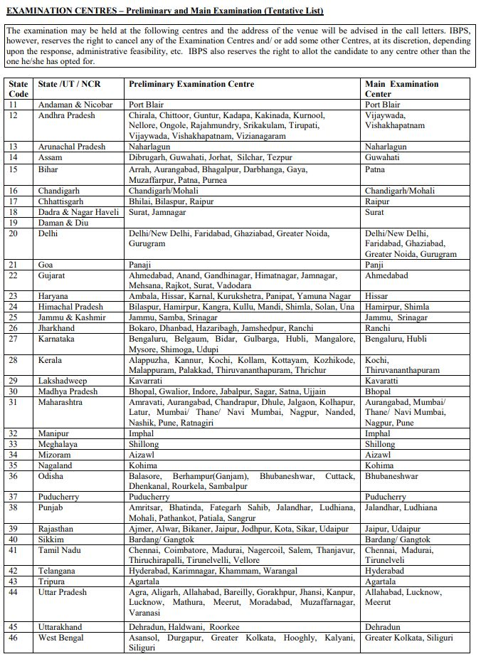

IBPS SO Exam Pattern 2019: IBPS SO 2019 Notification PDF Has Published on his official Website. As Per Ibps so 2019 Notification pdf A total of 1163 Vacancies are there. Institute of Banking Personnel Selection Specialist Officer Recruitment 2019 for Various Bank. The Candidates Should Have a Degree/ PG/Bachelor's Degree. Applicants Should Have to Age Between 20 to 30 Years. Candidates Selected Through IBPS SO 2019 Exam can be Posted Anywhere in India. IBPS SO 2019 Recruitment Details Like Education Qualification, Age Limits, Selection Process, Exam Pattern, Application Fee, How to apply, etc is Given [Here](https://freegovtjobalert.in/ibps-so-recruitment/)

## **IBPS SO Exam Pattern 2019**

<table style="border-collapse: collapse; width: 100%;"><tbody><tr><td style="width: 50%; background-color: #2a5a8e; text-align: center;" colspan="2"><strong>IBPS Recruitment 2019</strong></td></tr><tr><td style="width: 50%; text-align: center;">Job Recruitment Board</td><td style="width: 50%; text-align: center;">Institute of Banking Personnel Selection</td></tr><tr><td style="width: 50%; text-align: center;">Post</td><td style="width: 50%; text-align: center;">Specialist Officer</td></tr><tr><td style="width: 50%; text-align: center;">Vacancies</td><td style="width: 50%; text-align: center;">1163</td></tr><tr><td style="width: 50%; text-align: center;">Job Location</td><td style="width: 50%; text-align: center;">Across India</td></tr><tr><td style="width: 50%; text-align: center;">Job Type</td><td style="width: 50%; text-align: center;">Bank Jobs</td></tr><tr><td style="width: 50%; text-align: center;">Application Mode</td><td style="width: 50%; text-align: center;">Online</td></tr></tbody></table>

## **IBPS SO** **Exam Pattern 2019**

 

#### **IBPS SO Preliminary Exam Pattern 2019**

<table style="border-collapse: collapse; width: 100%;"><tbody><tr><td style="width: 100%; background-color: #2a5a8e; text-align: center;" colspan="5"><strong>The Post of Law Officer and Rajbhasha Adhikari</strong></td></tr><tr><td style="width: 43.4582%; text-align: center;"><strong>Name of Tests</strong></td><td style="width: 14.163%; text-align: center;"><strong>No. of</strong> <strong>Questions</strong></td><td style="width: 14.273%; text-align: center;"><strong>Maximum</strong> <strong>Marks</strong></td><td style="width: 16.0353%; text-align: center;"><strong>Medium of Exam</strong></td><td style="width: 12.0705%; text-align: center;"><strong>Duration</strong></td></tr><tr><td style="width: 43.4582%; text-align: center;">English Language</td><td style="width: 14.163%; text-align: center;">50</td><td style="width: 14.273%; text-align: center;">25</td><td style="width: 16.0353%; text-align: center;">English</td><td style="width: 12.0705%; text-align: center;">40 minutes</td></tr><tr><td style="width: 43.4582%; text-align: center;">Reasoning</td><td style="width: 14.163%; text-align: center;">50</td><td style="width: 14.273%; text-align: center;">50</td><td style="width: 16.0353%; text-align: center;">English and Hindi</td><td style="width: 12.0705%; text-align: center;">40 minutes</td></tr><tr><td style="width: 43.4582%; text-align: center;">General Awareness with Special Reference to Banking Industry</td><td style="width: 14.163%; text-align: center;">50</td><td style="width: 14.273%; text-align: center;">50</td><td style="width: 16.0353%; text-align: center;">English and Hindi</td><td style="width: 12.0705%; text-align: center;">40 minutes</td></tr><tr><td style="width: 43.4582%; text-align: center;"><strong>Total</strong></td><td style="width: 14.163%; text-align: center;"><strong>150</strong></td><td style="width: 14.273%; text-align: center;"><strong>125</strong></td><td style="width: 16.0353%; text-align: center;"></td><td style="width: 12.0705%; text-align: center;"></td></tr></tbody></table>

 

<table style="border-collapse: collapse; width: 98%;"><tbody><tr><td style="width: 100%; background-color: #2a5a8e; text-align: center;" colspan="5"><strong>&nbsp;The Post of IT Officer, Agriculture Field Officer, HR/Personnel Officer, and Marketing Officer</strong></td></tr><tr><td style="width: 20%; text-align: center;"><strong>Name of Tests</strong></td><td style="width: 20%; text-align: center;"><strong>No. of</strong> <strong>Questions</strong></td><td style="width: 20%; text-align: center;"><strong>Maximum</strong> <strong>Marks</strong></td><td style="width: 20%; text-align: center;"><strong>Medium of Exam</strong></td><td style="width: 20%; text-align: center;"><strong>Duration</strong></td></tr><tr><td style="width: 20%; text-align: center;">English Language</td><td style="width: 20%; text-align: center;">50</td><td style="width: 20%; text-align: center;">25</td><td style="width: 20%; text-align: center;">English</td><td style="width: 20%; text-align: center;">40 minutes</td></tr><tr><td style="width: 20%; text-align: center;">Reasoning</td><td style="width: 20%; text-align: center;">50</td><td style="width: 20%; text-align: center;">50</td><td style="width: 20%; text-align: center;">English and Hindi</td><td style="width: 20%; text-align: center;">40 minutes</td></tr><tr><td style="width: 20%; text-align: center;">Quantitative Aptitude</td><td style="width: 20%; text-align: center;">50</td><td style="width: 20%; text-align: center;">50</td><td style="width: 20%; text-align: center;">English and Hindi</td><td style="width: 20%; text-align: center;">40 minutes</td></tr><tr><td style="width: 20%; text-align: center;"><strong>Total</strong></td><td style="width: 20%; text-align: center;"><strong>150</strong></td><td style="width: 20%; text-align: center;"><strong>125</strong></td><td style="width: 20%; text-align: center;"></td><td style="width: 20%; text-align: center;"></td></tr></tbody></table>

 

#### **IBPS SO Main Exam Pattern 2019**

 

<table style="border-collapse: collapse; width: 100%;"><tbody><tr><td style="width: 100%; background-color: #2a5a8e; text-align: center;" colspan="5"><strong>The Post of Law Officer, IT Officer, Agriculture Field Officer, HR/Personnel Officer, and Marketing Officer</strong></td></tr><tr><td style="width: 25.7269%; text-align: center;"><strong>Name of Tests</strong></td><td style="width: 17.2467%; text-align: center;"><strong>No. of</strong> <strong>Questions</strong></td><td style="width: 17.0264%; text-align: center;"><strong>Maximum</strong> <strong>Marks</strong></td><td style="width: 20%; text-align: center;"><strong>Medium of Exam</strong></td><td style="width: 20%; text-align: center;"><strong>Duration</strong></td></tr><tr><td style="width: 25.7269%; text-align: center;">Professional Knowledge</td><td style="width: 17.2467%; text-align: center;">60</td><td style="width: 17.0264%; text-align: center;">60</td><td style="width: 20%; text-align: center;">English &amp; Hindi</td><td style="width: 20%; text-align: center;">45 minutes</td></tr></tbody></table>

 

<table style="border-collapse: collapse; width: 98%;"><tbody><tr><td style="width: 100%; background-color: #2a5a8e; text-align: center;" colspan="5"><strong>&nbsp;The Post of Rajbhasha Adhikari</strong></td></tr><tr><td style="width: 35.8427%; text-align: center;"><strong>Name of Tests</strong></td><td style="width: 15.2809%; text-align: center;"><strong>No. of</strong> <strong>Questions</strong></td><td style="width: 14.2696%; text-align: center;"><strong>Maximum</strong> <strong>Marks</strong></td><td style="width: 18.0899%; text-align: center;"><strong>Medium of Exam</strong></td><td style="width: 16.5169%; text-align: center;"><strong>Duration</strong></td></tr><tr><td style="width: 35.8427%; text-align: center;">Professional Knowledge (Objective)</td><td style="width: 15.2809%; text-align: center;">45</td><td style="width: 14.2696%; text-align: center;" rowspan="2">60</td><td style="width: 18.0899%; text-align: center;" rowspan="2">English &amp; Hindi</td><td style="width: 16.5169%; text-align: center;">30 minutes</td></tr><tr><td style="width: 35.8427%; text-align: center;">Professional Knowledge (Descriptive)</td><td style="width: 15.2809%; text-align: center;">2</td><td style="width: 16.5169%; text-align: center;">30 minutes</td></tr></tbody></table>

 

**Penalty for Wrong Answers (Applicable to both – Online Preliminary and Online Main examinations)**

- There will be a penalty for wrong answers marked in the Objective Tests.
- For each question for which a wrong answer has been given by the candidate one fourth or 0.25 of the marks assigned to that question will be deducted as penalty to arrive at corrected score.
- If a question is left blank, i.e. no answer is marked by the candidate, there will be no penalty for that question.

#### **IBPS SO Interview**

- Candidates who have been shortlisted in the Online Main Examination for CRP SPL-IX will subsequently be called for an Interview to be conducted by the Participating Organisations and coordinated by the Nodal Banks in each State/ UT.
- Interviews will be conducted at select centers.
- The center, address of the venue, time & date of the interview will be informed to the shortlisted candidates in the call letter. Candidates are required to download their interview call letters from authorized IBPS website www.ibps.in
- The total marks allotted for the Interview are 100.
- The minimum qualifying marks in the interview will not be less than 40% (35% for SC/ST/OBC/PWBD candidates).
- The Weightage (ratio) of the Online Main Examination and interview will be 80:20 respectively.
- The combined final score of candidates shall be arrived at based on total scores obtained by the candidates in the Online Main Examination of CRP- SPL-IX and Interview.

### **Important Links For IBPS SO Vacancy**

- IBPS Specialist Officer (CRP SPL-IX) Online Form 2019: [Registration](https://ibpsonline.ibps.in/crpspl9nov19/basic_details.php "IBPS") | [Login](https://ibpsonline.ibps.in/crpspl9nov19/ "IBPS")
- Download 1163 IBPS Specialist Officer (CRP SPL-IX) Notification PDF: [Click Here](https://www.ibps.in/wp-content/uploads/CRP_SPL_IX_ADVT.pdf)
- IBPS Official Website: [Click Here](https://www.ibps.in/)
