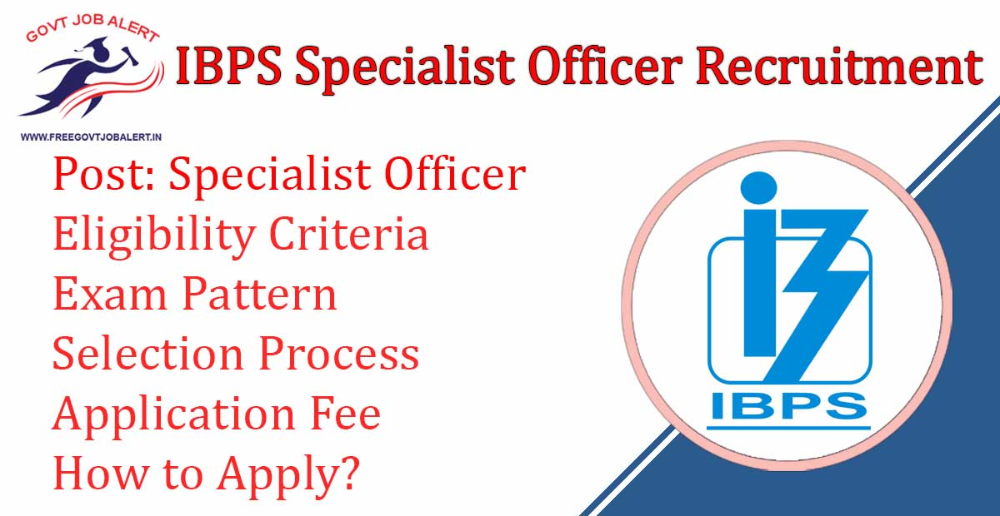
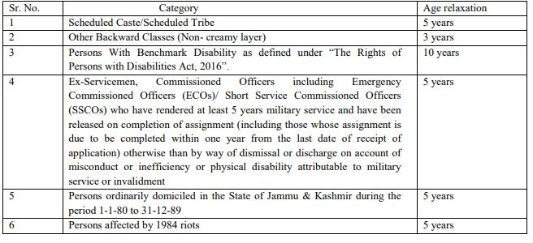

\[caption id="attachment\_1662" align="aligncenter" width="1200"\] IBPS SO Recruitment 2019\[/caption\]

IBPS SO Recruitment 2019: Institute of Banking Personnel Selection Has Released Notification Regarding Specialist Officer Vacancy. IBPS SO Vacancy in different Public Sector Banks For Multiple Positions. As Per Ibps so 2019 Notification pdf A total of 1163 Vacancies are there. IBPS SO Recruitment 2019 apply online Start on Date 6th November 2019.

## **IBPS SO Recruitment 2019-20**

<table style="border-collapse: collapse; width: 100%;"><tbody><tr><td style="width: 50%; background-color: #2a5a8e; text-align: center;" colspan="2"><strong>IBPS Recruitment 2019</strong></td></tr><tr><td style="width: 50%; text-align: center;">Job Recruitment Board</td><td style="width: 50%; text-align: center;">Institute of Banking Personnel Selection</td></tr><tr><td style="width: 50%; text-align: center;">Post</td><td style="width: 50%; text-align: center;">Specialist Officer</td></tr><tr><td style="width: 50%; text-align: center;">Vacancies</td><td style="width: 50%; text-align: center;">1163</td></tr><tr><td style="width: 50%; text-align: center;">Job Location</td><td style="width: 50%; text-align: center;">Across India</td></tr><tr><td style="width: 50%; text-align: center;">Job Type</td><td style="width: 50%; text-align: center;">Bank Jobs</td></tr><tr><td style="width: 50%; text-align: center;">Application Mode</td><td style="width: 50%; text-align: center;">Online</td></tr></tbody></table>

IBPS SO 2019 Notification PDF Has Published on his official Website. Institute of Banking Personnel Selection Specialist Officer Recruitment 2019 for Various Bank. The Candidates Should Have a Degree/ PG/Bachelor's Degree. Applicants Should Have to Age Between 20 to 30 Years. Candidates Selected Through IBPS SO 2019 Exam can be Posted Anywhere in India.

<table style="border-collapse: collapse; width: 98%; height: 329px;"><tbody><tr style="height: 28px;"><td style="width: 100%; background-color: #2a5a8e; text-align: center; height: 28px;" colspan="2"><h3><strong>IBPS SO Recruitment 2019 Important Dates</strong></h3></td></tr><tr style="height: 49px;"><td style="width: 60.6742%; text-align: center; height: 49px;">Starting Date of Online Application</td><td style="width: 39.3258%; text-align: center; height: 49px;">06-11-2019</td></tr><tr style="height: 24px;"><td style="width: 60.6742%; text-align: center; height: 24px;">Last Date of Online Application</td><td style="width: 39.3258%; text-align: center; height: 24px;">26-11-2019</td></tr><tr style="height: 24px;"><td style="width: 60.6742%; text-align: center; height: 24px;">Application Fee</td><td style="width: 39.3258%; text-align: center; height: 24px;">06-11-2019 to 26-11-2019</td></tr><tr style="height: 45px;"><td style="width: 60.6742%; text-align: center; height: 10px;">Download of call letters for Online examination – Preliminary</td><td style="width: 39.3258%; text-align: center; height: 10px;">December 2019</td></tr><tr style="height: 20px;"><td style="width: 60.6742%; text-align: center; height: 20px;">Online Examination – Preliminary</td><td style="width: 39.3258%; text-align: center; height: 20px;">28.12.2019 and 29.12.2019</td></tr><tr style="height: 20px;"><td style="width: 60.6742%; text-align: center; height: 20px;">Result of Online exam – Preliminary</td><td style="width: 39.3258%; text-align: center; height: 20px;">January 2020</td></tr><tr style="height: 42px;"><td style="width: 60.6742%; text-align: center; height: 42px;">Download of Call letter for Online exam – Main</td><td style="width: 39.3258%; text-align: center; height: 42px;">January 2020</td></tr><tr style="height: 20px;"><td style="width: 60.6742%; text-align: center; height: 20px;">Online Examination – Main</td><td style="width: 39.3258%; text-align: center; height: 20px;">25.01.2020</td></tr><tr style="height: 20px;"><td style="width: 60.6742%; text-align: center; height: 20px;">Declaration of Result of Online Main Examination</td><td style="width: 39.3258%; text-align: center; height: 20px;">February 2020</td></tr><tr style="height: 24px;"><td style="width: 60.6742%; text-align: center; height: 24px;">Download of call letters for interview</td><td style="width: 39.3258%; text-align: center; height: 24px;">February 2020</td></tr><tr style="height: 24px;"><td style="width: 60.6742%; text-align: center; height: 24px;">Conduct of interview</td><td style="width: 39.3258%; text-align: center; height: 24px;">February 2020</td></tr><tr style="height: 24px;"><td style="width: 60.6742%; text-align: center; height: 24px;">Provisional Allotment</td><td style="width: 39.3258%; text-align: center; height: 24px;">April 2020</td></tr></tbody></table>

IBPS SO 2019 Recruitment Details Like Education Qualification, Age Limits, Selection Process, Exam Pattern, Application Fee, How to apply, etc Given below.

### **IBPS SO Vacancy Details**

- I.T. Officer (Scale-I): 76 Posts
- Agricultural Field Officer (Scale I): 670 Posts
- Rajbhasha Adhikari (Scale I): 27 Posts
- Law Officer (Scale I): 60 Posts
- HR/Personnel Officer (Scale I): 20 Posts
- Marketing Officer (Scale I): 310 Posts

Bank Wise/Post Wise IBPS SO Vacancy Details: [Click Here](https://freegovtjobalertdaily.blogspot.com/2019/11/ibps-so-recruitment-2019-apply-online.html)

### **IBPS SO Recruitment 2019 Eligibility Criteria**

Education Qualification

<table style="border-collapse: collapse; width: 100%;"><tbody><tr><td style="width: 31.4978%; text-align: center;">Post Name</td><td style="width: 68.5022%; text-align: center;">Education Qulificatrion</td></tr><tr><td style="width: 31.4978%; text-align: center;">I.T. Officer (Scale-I)</td><td style="width: 68.5022%; text-align: center;">4 year Engineering/ Technology Degree in Computer Science/ Computer Applications/ Information Technology/ Electronics/ Electronics &amp; Telecommunications/ Electronics &amp; Communication/ Electronics &amp; Instrumentation OR Post Graduate Degree in Electronics/ Electronics &amp; Tele Communication/ Electronics &amp; Communication/ Electronics &amp; Instrumentation/ Computer Science/ Information Technology/ Computer Applications OR Graduate having passed DOEACC ‘B’ level</td></tr><tr><td style="width: 31.4978%; text-align: center;">Agricultural Field Officer (Scale I)</td><td style="width: 68.5022%; text-align: center;">4 year Degree (graduation) in Agriculture/ Horticulture/Animal Husbandry/ Veterinary Science/ Dairy Science/ Fishery Science/ Pisciculture/ Agri. Marketing &amp; Cooperation/ Co-operation &amp; Banking/ Agro-Forestry/Forestry/ Agricultural Biotechnology/ Food Science/ Agriculture Business Management/ Food Technology/ Dairy Technology/ Agricultural Engineering/ Sericulture</td></tr><tr><td style="width: 31.4978%; text-align: center;">Rajbhasha Adhikari (Scale I)</td><td style="width: 68.5022%; text-align: center;">Post Graduate Degree in Hindi with English as a subject at the degree (graduation) level OR Postgraduate degree in Sanskrit with English and Hindi as subjects at the degree (graduation) level.</td></tr><tr><td style="width: 31.4978%; text-align: center;">Law Officer (Scale I)</td><td style="width: 68.5022%; text-align: center;">A Bachelor Degree in Law (LLB) and enrolled as an advocate with Bar Council</td></tr><tr><td style="width: 31.4978%; text-align: center;">HR/Personnel Officer (Scale I)</td><td style="width: 68.5022%; text-align: center;">Graduate and Two Years Full-time Post Graduate degree or Two Years Full-time&nbsp;Post Graduate Diploma in Personnel Management / Industrial Relations/ HR / HRD/ Social Work / Labour Law.</td></tr><tr><td style="width: 31.4978%; text-align: center;">Marketing Officer (Scale I)</td><td style="width: 68.5022%; text-align: center;">Graduate and Two Years Full-time MMS (Marketing)/ Two Years Full-time MBA (Marketing)/ Two Years Full-time PGDBA / PGDBM/ PGPM/ PGDM with specialization in Marketing</td></tr></tbody></table>

Age Limits

- Minimum: 20 years
- Maximum: 30 Years

### **IBPS SO Recruitment 2019 Selection Process**

1. Preliminary Examination
2. Main Examination
3. Interview

### **IBPS SO Recruitment 2019 Exam Pattern**

1.Preliminary Examination

- Total of 150 Questions/ 125 Marks - 120 Minutes

2.Main Examination

- Total of 60 Questions/ 60 Marks - 45 Minutes

3.Interview

- Candidates who have been shortlisted in the Online Main Examination for CRP SPL-IX will subsequently be called for an Interview to be conducted by the Participating Organisations and coordinated by the Nodal Banks in each State/ UT.
- Interviews will be conducted at select centers.
- The center, address of the venue, time & date of the interview will be informed to the shortlisted candidates in the call letter. Candidates are required to download their interview call letters from authorized IBPS website www.ibps.in

Exam Wise Full Details IBPS SO Exam Pattern Details: [Click Here](https://freegovtjobalert.in/ibps-so-exam-pattern/)

### **IBPS SO Recruitment 2019 Admit Card 2019**

- An eligible candidate should download his/her call letter from the authorized IBPS’s website www.ibps.in by entering his/ her details i.e. Registration Number and Password/Date of Birth. No hard copy of the call letter/ Information Handout etc. will be sent by post/ courier.
- The Centre, venue address, post applied for, date and time for both Preliminary and Main examination and interview shall be intimated in the respective Call Letter.

### **IBPS SO Recruitment 2019 Cutoff Score 2019**

- Each candidate will be required to obtain a minimum score in the test of Online Main examination and also secure sufficiently high scores to be considered to be shortlisted for interview.
- Depending on the number of vacancies available, cut-offs will be decided and candidates will be shortlisted for interview. Prior to the completion of the interview process, scores obtained in the online Main examination will not be shared with the candidates shortlisted for the interview.

### **IBPS SO Recruitment 2019 Application Fee**

- General Candidates: Rs. 600/-
- SC/ST/PWBD Candidates: Rs. 100/-
- The payment can be made by using Debit Cards (RuPay/ Visa/ Master Card/ Maestro), Credit Cards, Internet Banking, IMPS, Cash Cards/ Mobile Wallets by providing information as asked on the screen.

### **How to Apply For IBPS SO Recruitment 2019-20**

1. Candidates are first required to go to the IBPS’s authorized website www.ibps.in
2. Click on CRP Specialist Officers From Home Page
3. Then Click on Common Recruitment Process for Specialist Officers IX
4. Click On Apply Online for Common Recruitment Process for Specialist Officers - IX (CRP SPL-IX)
5. Click on 'Click here for New Registration'
6. Fill up Application Form
7. Upload Required Images
8. Pay Application Fee
9. Submit Application
10. Download & Save Application For Future Use.
11. Done.

### **Important Links For IBPS SO Vacancy**

- IBPS Specialist Officer (CRP SPL-IX) Online Form 2019: [Registration](https://ibpsonline.ibps.in/crpspl9nov19/basic_details.php "IBPS") | [Login](https://ibpsonline.ibps.in/crpspl9nov19/ "IBPS")
- Download 1163 IBPS Specialist Officer (CRP SPL-IX) Notification PDF: [Click Here](https://www.ibps.in/wp-content/uploads/CRP_SPL_IX_ADVT.pdf)
- IBPS Official Website: [Click Here](https://www.ibps.in/)

Candidates can visit www.ibps.in to get more details about the Institute of Banking Personnel Selection for Specialist Officer. To More Information, IBPS Latest Updates, Admit Card, Syllabus, Result, Etc. It will be published on the official website. Also, visit Regularly our website [www.freegovtjobalert.in](https://freegovtjobalert.in) for getting the Latest job Updates.
