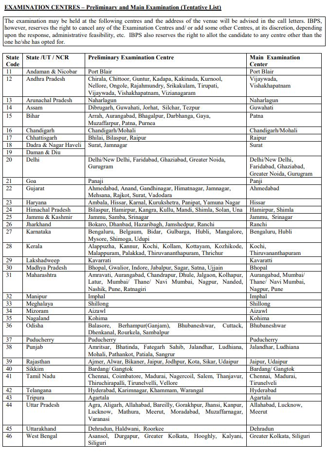

IBPS Admit Card 2019: Institute of Banking Personnel Selection (IBPS) has Issued IBPS Specialist Officer Prelims Exam Admit Card 2019 on his official website. IBPS SO Prelims Exam held on 28 & 29-12-2019. Those Candidates Can Download IBPS Exam Admit Card, From Here.

## **IBPS Specialist Officer Prelims Exam Admit Card 2019 Released**

<table style="border-collapse: collapse; width: 100%;"><tbody><tr><td style="width: 50%; background-color: #2a5a8e; text-align: center;" colspan="2"><strong>IBPS Recruitment 2019</strong></td></tr><tr><td style="width: 50%; text-align: center;">Job Recruitment Board</td><td style="width: 50%; text-align: center;">Institute of Banking Personnel Selection</td></tr><tr><td style="width: 50%; text-align: center;">Post</td><td style="width: 50%; text-align: center;"><a href="https://freegovtjobalert.in/ibps-so-recruitment/" target="_blank" rel="noopener noreferrer">Specialist Officer</a></td></tr><tr><td style="width: 50%; text-align: center;">Vacancies</td><td style="width: 50%; text-align: center;">1163</td></tr><tr><td style="width: 50%; text-align: center;">Job Location</td><td style="width: 50%; text-align: center;">Across India</td></tr><tr><td style="width: 50%; text-align: center;">Job Type</td><td style="width: 50%; text-align: center;">Bank Jobs</td></tr><tr><td style="width: 50%; text-align: center;">Application Mode</td><td style="width: 50%; text-align: center;">Online</td></tr><tr><td style="width: 50%; text-align: center;">IBPS SO Admit Card</td><td style="width: 50%; text-align: center;">Released</td></tr><tr><td style="width: 50%; text-align: center;">Exam Date</td><td style="width: 50%; text-align: center;">28 &amp; 29-12-2019</td></tr></tbody></table>

### **IBPS SO Recruitment 2019 Selection Process**

1. Preliminary Examination
2. Main Examination
3. Interview

#### **IBPS SO Preliminary Exam Pattern 2019**

<table style="border-collapse: collapse; width: 100%;"><tbody><tr><td style="width: 100%; background-color: #2a5a8e; text-align: center;" colspan="5"><strong>The Post of Law Officer and Rajbhasha Adhikari</strong></td></tr><tr><td style="width: 43.4582%; text-align: center;"><strong>Name of Tests</strong></td><td style="width: 14.163%; text-align: center;"><strong>No. of</strong> <strong>Questions</strong></td><td style="width: 14.273%; text-align: center;"><strong>Maximum</strong> <strong>Marks</strong></td><td style="width: 16.0353%; text-align: center;"><strong>Medium of Exam</strong></td><td style="width: 12.0705%; text-align: center;"><strong>Duration</strong></td></tr><tr><td style="width: 43.4582%; text-align: center;">English Language</td><td style="width: 14.163%; text-align: center;">50</td><td style="width: 14.273%; text-align: center;">25</td><td style="width: 16.0353%; text-align: center;">English</td><td style="width: 12.0705%; text-align: center;">40 minutes</td></tr><tr><td style="width: 43.4582%; text-align: center;">Reasoning</td><td style="width: 14.163%; text-align: center;">50</td><td style="width: 14.273%; text-align: center;">50</td><td style="width: 16.0353%; text-align: center;">English and Hindi</td><td style="width: 12.0705%; text-align: center;">40 minutes</td></tr><tr><td style="width: 43.4582%; text-align: center;">General Awareness with Special Reference to Banking Industry</td><td style="width: 14.163%; text-align: center;">50</td><td style="width: 14.273%; text-align: center;">50</td><td style="width: 16.0353%; text-align: center;">English and Hindi</td><td style="width: 12.0705%; text-align: center;">40 minutes</td></tr><tr><td style="width: 43.4582%; text-align: center;"><strong>Total</strong></td><td style="width: 14.163%; text-align: center;"><strong>150</strong></td><td style="width: 14.273%; text-align: center;"><strong>125</strong></td><td style="width: 16.0353%; text-align: center;"></td><td style="width: 12.0705%; text-align: center;"></td></tr></tbody></table>

<table style="border-collapse: collapse; width: 98%;"><tbody><tr><td style="width: 100%; background-color: #2a5a8e; text-align: center;" colspan="5"><strong>&nbsp;The Post of IT Officer, Agriculture Field Officer, HR/Personnel Officer, and Marketing Officer</strong></td></tr><tr><td style="width: 20%; text-align: center;"><strong>Name of Tests</strong></td><td style="width: 20%; text-align: center;"><strong>No. of</strong> <strong>Questions</strong></td><td style="width: 20%; text-align: center;"><strong>Maximum</strong> <strong>Marks</strong></td><td style="width: 20%; text-align: center;"><strong>Medium of Exam</strong></td><td style="width: 20%; text-align: center;"><strong>Duration</strong></td></tr><tr><td style="width: 20%; text-align: center;">English Language</td><td style="width: 20%; text-align: center;">50</td><td style="width: 20%; text-align: center;">25</td><td style="width: 20%; text-align: center;">English</td><td style="width: 20%; text-align: center;">40 minutes</td></tr><tr><td style="width: 20%; text-align: center;">Reasoning</td><td style="width: 20%; text-align: center;">50</td><td style="width: 20%; text-align: center;">50</td><td style="width: 20%; text-align: center;">English and Hindi</td><td style="width: 20%; text-align: center;">40 minutes</td></tr><tr><td style="width: 20%; text-align: center;">Quantitative Aptitude</td><td style="width: 20%; text-align: center;">50</td><td style="width: 20%; text-align: center;">50</td><td style="width: 20%; text-align: center;">English and Hindi</td><td style="width: 20%; text-align: center;">40 minutes</td></tr><tr><td style="width: 20%; text-align: center;"><strong>Total</strong></td><td style="width: 20%; text-align: center;"><strong>150</strong></td><td style="width: 20%; text-align: center;"><strong>125</strong></td><td style="width: 20%; text-align: center;"></td><td style="width: 20%; text-align: center;"></td></tr></tbody></table>

**Penalty for Wrong Answers (Online Preliminary)**

- There will be a penalty for wrong answers marked in the Objective Tests.
- For each question for which a wrong answer has been given by the candidate one fourth or 0.25 of the marks assigned to that question will be deducted as penalty to arrive at corrected score.
- If a question is left blank, i.e. no answer is marked by the candidate, there will be no penalty for that question.

### **Important Links For IBPS SO Vacancy**

- Download IBPS Specialist Officer Prelims Exam Admit Card 2019: [Click Here](https://ibpsonline.ibps.in/crpspl9nov19/clopea_dec19/login.php?appid=dae096f12c88e504161ef81468eaa017)
- Download 1163 IBPS Specialist Officer (CRP SPL-IX) Notification PDF: [Click Here](https://www.ibps.in/wp-content/uploads/CRP_SPL_IX_ADVT.pdf)
- IBPS Official Website: [Click Here](https://www.ibps.in/)
