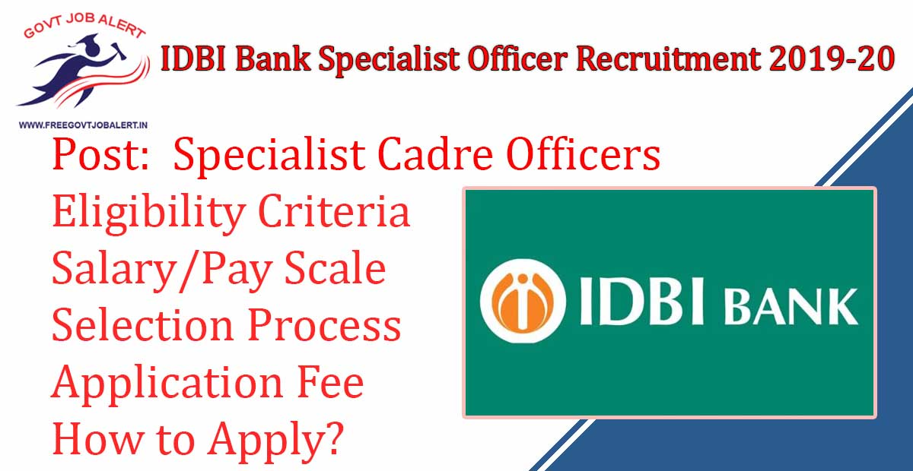
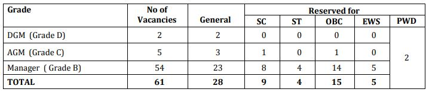

\[caption id="attachment\_1833" align="aligncenter" width="1200"\] IDBI Bank Specialist Officer Recruitment 2019-20: 61 IDBI SO Vacancy\[/caption\]

IDBI Bank Specialist Officer Recruitment 2019: Industrial Development Bank of India has Released Advertisement (Ad No.3/ 2019-20) Regarding Specialist Cadre Officer Vacancy. IDBI Bank Invites Online Application From Eligible Indian Citizens for the Agriculture Office, Faculty, Fraud Risk Management, Fraud Risk Management- Investigator, Transaction Monitoring Team - Head Post. IDBI Bank Specialist Officer Online Form 2019 Has Started on 28-11-2019. The Candidates fulfilling required eligibility criteria may apply Online through the link given in Bank's website: www.idbibank.in.

## **IDBI Bank Specialist Officer Recruitment 2019-20**

<table style="border-collapse: collapse; width: 100%;"><tbody><tr><td style="width: 50%; background-color: #2a5a8e; text-align: center;" colspan="2"><strong>IDBI Bank Recruitment 2019</strong></td></tr><tr><td style="width: 50%; text-align: center;">Job Recruitment Board</td><td style="width: 50%; text-align: center;">Industrial Development Bank of India</td></tr><tr><td style="width: 50%; text-align: center;">Notification No.</td><td style="width: 50%; text-align: center;">Advertisement No.3/ 2019-20</td></tr><tr><td style="width: 50%; text-align: center;">Post</td><td style="width: 50%; text-align: center;">&nbsp;Specialist Cadre Officers</td></tr><tr><td style="width: 50%; text-align: center;">Vacancies</td><td style="width: 50%; text-align: center;">61</td></tr><tr><td style="width: 50%; text-align: center;">Job Location</td><td style="width: 50%; text-align: center;">Across India</td></tr><tr><td style="width: 50%; text-align: center;">Job Type</td><td style="width: 50%; text-align: center;">Bank Jobs</td></tr><tr><td style="width: 50%; text-align: center;">Application Mode</td><td style="width: 50%; text-align: center;">Online</td></tr></tbody></table>

IDBI Bank Recruitment 2019 Notification Published on his Official Website. As Per IDBI Bank SO Recruitment Notification 2019 A total of 61 Vacancies Are There. The Candidates Should Have a Graduation/ PG/ CA/ MBA Degree. Applicants Must Have Age Between 25 to 45 Years. Selected Candidates Will be Placed in IDBI Bank Branch Across India. Interested & Eligible Candidates Can, IDBI Bank recruitment 2019 apply online Before the Last Date.

<table style="border-collapse: collapse;"><tbody><tr><td style="width: 50%; background-color: #2a5a8e; text-align: center;" colspan="2"><h3><strong>IDBI Bank SO Exam Dates</strong></h3></td></tr><tr><td style="width: 50%; text-align: center;">Starting Date of Online Application</td><td style="width: 50%; text-align: center;">28-11-2019</td></tr><tr><td style="width: 50%; text-align: center;">Last Date of Online Application</td><td style="width: 50%; text-align: center;">12-12-2019</td></tr><tr><td style="width: 50%; text-align: center;">Application Fee</td><td style="width: 50%; text-align: center;">28-11-2019 to 12-12-2019</td></tr><tr><td style="width: 50%; text-align: center;">Last Date For Printing your Application</td><td style="width: 50%; text-align: center;">27-12-2019</td></tr></tbody></table>

IDBI Bank SO Vacancy 2019 Details Like Education Qualification, Age Limits, Salary/Pay Scale, Selection Process, Application Fee, How to apply, etc. It is given Below.

### **IDBI Bank Vacancy Details**

- IDBI Bank So Vacancy 2019: 61 Posts

\[caption id="attachment\_1831" align="aligncenter" width="718"\] IDBI Bank 61 SO Vacancy 2019\[/caption\]

### **IDBI Bank Specialist Officer Recruitment 2019 Eligibility Criteria**

<table style="border-collapse: collapse; width: 100%;"><tbody><tr><td style="width: 19.8605%; text-align: center; background-color: #2a5a8e;"><strong>Post Name</strong></td><td style="width: 12.812%; text-align: center; background-color: #2a5a8e;"><strong>Age</strong></td><td style="width: 31.9752%; text-align: center; background-color: #2a5a8e;"><strong>Education Qualification</strong></td></tr><tr><td style="width: 19.8605%; text-align: center;">Agriculture Officer</td><td style="width: 12.812%; text-align: center;">25 to 35 Years</td><td style="width: 31.9752%; text-align: center;">Graduate Degree with at least 60% marks in Agriculture / Horticulture / Veterinary Science / Fisheries / Dairy Technology &amp; Animal Husbandry from ICAR recognized agricultural university.</td></tr><tr><td style="width: 19.8605%; text-align: center;">Faculty - Behavioural Sciences (Organisational behavior &amp; Human Resource Management)</td><td style="width: 12.812%; text-align: center;">35 to 45 Years</td><td style="width: 31.9752%; text-align: center;">Postgraduate in Psychology or relevant behavior sciences/MBA in HRM</td></tr><tr><td style="width: 19.8605%; text-align: center;">Fraud Risk Management - Fraud Analyst (Maker)</td><td style="width: 12.812%; text-align: center;">22 to 35 Years</td><td style="width: 31.9752%; text-align: center;">Graduate in Commerce with a minimum of 60% marks.</td></tr><tr><td style="width: 19.8605%; text-align: center;">Fraud Risk Management - Investigator (Checker)</td><td style="width: 12.812%; text-align: center;">28 to 40 Years</td><td style="width: 31.9752%; text-align: center;">Graduate in Commerce with a minimum of 60% marks.</td></tr><tr><td style="width: 19.8605%; text-align: center;">Transaction Monitoring Team - Head</td><td style="width: 12.812%; text-align: center;">35 to 45 Years</td><td style="width: 31.9752%; text-align: center;">CA/ MBA/ Graduation with Certified Fraud Examiner (CFE)</td></tr></tbody></table>

- Age Relaxation: Check Notification

### **Salary/Pay Scale For IDBI Bank Specialist Officer Recruitment 2019**

<table style="border-collapse: collapse; width: 86.3864%;"><tbody><tr><td style="width: 34.0217%; text-align: center; background-color: #2a5a8e;"><strong>Post</strong></td><td style="width: 54.5495%; text-align: center; background-color: #2a5a8e;"><strong>Pay and allowances</strong></td></tr><tr><td style="width: 34.0217%; text-align: center;">Deputy General Manager, Grade ‘D’</td><td style="width: 54.5495%; text-align: center;">In the scale of 50030-1460(4)-55870-1650(2)-59170 (07 years)</td></tr><tr><td style="width: 34.0217%; text-align: center;">Assistant General Manager, Grade ‘C’</td><td style="width: 54.5495%; text-align: center;">In the scale of 42020-1310(5)-48570-1460(2)-51490 (8 years)</td></tr><tr><td style="width: 34.0217%; text-align: center;">Manager - Grade ‘B’</td><td style="width: 54.5495%; text-align: center;">In the scale of 31705-1145(1)-32850-1310(10)-45950 (12 years)</td></tr></tbody></table>

### **Selection Process  For IDBI Bank Specialist Officer Recruitment 2019**

- The selection process for Grades viz ‘B,’ ‘C’ and ‘D’ will comprise of preliminary screening based on the eligibility criteria, candidate's qualifications, suitability/ experience, etc. submitted online. Only such candidates will be called for Group Discussion (GD) and/ or Personal Interview (PI).

### **IDBI Bank Specialist Officer Recruitment 2019- Application Fee**

- General Candidates: Rs. 700/-
- SC/ST Candidates: Rs. 150/-
- PWD Candidates: Nil
- Payment Mode: Online

### **How to Apply For IDBI Bank Specialist Officer Recruitment 2019**

1. Candidates Go to IDBI Bank Official Website: www.idbibank.in
2. Find **Recruitment of Specialist Cadre Officers FY 2019-20** in Careers/ Current Openings.
3. Register and Get Registration Number & Password
4. Then Fill up Application Form
5. Upload Required Document & Images
6. Pay Application Fee
7. Submit the Application Form
8. Download & Printout Application For Future Use.

### **IDBI Bank Specialist Officer Recruitment 2019 Important Links** 

- IDBI Bank Specialist Cadre Officer Online Form 2019: [Click Here](https://ibpsonline.ibps.in/idbibksnov19/https://ibpsonline.ibps.in/idbibksnov19/ "IDBI Bank SO Online Form")
- Download IDBI Bank 61 SO Recruitment Notification 2019: [Click Here](https://www.idbibank.in/pdf/careers/Recruitment-of-Specialist-Officers.pdf "IDBI Bank SO Notification")
- IDBI Bank Official Website: [Click Here](https://www.idbibank.in/ "IDBI Bank")

Candidates can visit www.idbibank.in to get more details about IDBI Bank Specialist Officer Recruitment 2019-20. To More Information About IDBI Bank upcoming vacancy 2019-20, latest Updates, Admit Card, Syllabus, Result, Etc. It will be published on the official website. Also, visit Regularly our website [www.freegovtjobalert.in](https://freegovtjobalert.in "Free Govt Job Alert") for getting the Latest job Updates.
