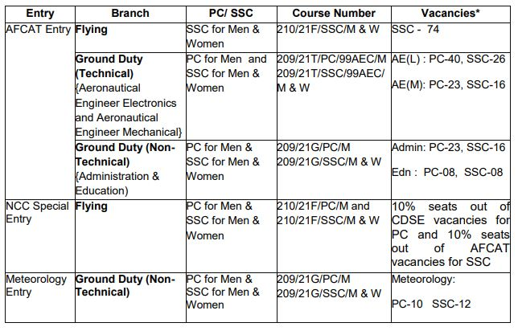
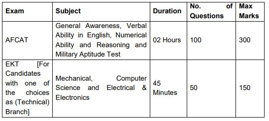

Indian Air Force Has Released Recruitment Notification Regarding A Gazetted Officers in Flying and Ground Duty. Indian Air Force invites Indian citizens (Men and Women) to be part of this elite force as Group A Gazetted Officers in Flying and Ground Duty (Technical and Non-Technical) branches. Indian Air Force AFCAT 02/2020 Online Form Has Starting on 15th June 2020 at Official Website. Interested & Eligible Candidates Can Apply Before the Last Date.

> **Latest Update: Indian Air Force AFCAT 02/2020 Admit Card Released** 

<table style="border-collapse: collapse; width: 100%; height: 223px;"><tbody><tr style="height: 29px;"><td style="width: 50%; background-color: #2a5a8e; text-align: center; height: 29px;" colspan="2"><strong>Indian Air Force Recruitment 2020</strong></td></tr><tr style="height: 25px;"><td style="width: 50%; text-align: center; height: 25px;">Job Recruitment Board</td><td style="width: 50%; text-align: center; height: 25px;">Indian Air Force</td></tr><tr style="height: 25px;"><td style="width: 50%; text-align: center; height: 25px;">Notification No.</td><td style="width: 50%; text-align: center; height: 25px;">AFCAT 02/2020</td></tr><tr style="height: 44px;"><td style="width: 50%; text-align: center; height: 44px;">Post</td><td style="width: 50%; text-align: center; height: 44px;">Gazetted Officers in Flying and Ground Duty (Technical and Non-Technical)</td></tr><tr style="height: 25px;"><td style="width: 50%; text-align: center; height: 25px;">Vacancies</td><td style="width: 50%; text-align: center; height: 25px;">256</td></tr><tr style="height: 25px;"><td style="width: 50%; text-align: center; height: 25px;">Job Location</td><td style="width: 50%; text-align: center; height: 25px;">India</td></tr><tr style="height: 25px;"><td style="width: 50%; text-align: center; height: 25px;">Job Type</td><td style="width: 50%; text-align: center; height: 25px;">Defence Jobs</td></tr><tr style="height: 25px;"><td style="width: 50%; text-align: center; height: 25px;">Application Mode</td><td style="width: 50%; text-align: center; height: 25px;">Online</td></tr><tr><td style="width: 50%; text-align: center;">Admit Card</td><td style="width: 50%; text-align: center;">Released</td></tr></tbody></table>

## **Details of Indian Air Force AFCAT 02/2020 Online Form**

Indian Air Force Jobs Notification Published on his Official Website. Applicants Should Have Age Between 20 to 26 Years. Indian Air Force Recruitment 2020 Notification Details like Age Limits, Physical Standards, Medical Standards, Salary/ Pay Scale, How to apply, etc Given below.

<table style="border-collapse: collapse;"><tbody><tr><td style="width: 50%; background-color: #2a5a8e; text-align: center;" colspan="2"><h3><strong>Important Dates</strong></h3></td></tr><tr><td style="width: 50%; text-align: center;">Starting Date of Online Application</td><td style="width: 50%; text-align: center;">15-06-2020</td></tr><tr><td style="width: 50%; text-align: center;">Last Date of Online Application</td><td style="width: 50%; text-align: center;">14-07-2020</td></tr><tr><td style="width: 50%; text-align: center;">Online Exam Date</td><td style="width: 50%; text-align: center;">19/20-09-2020</td></tr><tr><td style="width: 50%; text-align: center;">AFCAT Admit Card</td><td style="width: 50%; text-align: center;">After 04-09-2020</td></tr></tbody></table>

### **Indian Air Force Vacancy Details**

### **AFCAT Eligibility Criteria**

**Type of Commission**

A. PC for Man:

- Candidates joining as PC officers would continue to serve till the age of superannuation as per their branch and rank.

B. SSC for Men & Women:

- The engagement period for Flying Branch SSC officers is fourteen years from the date of Commissioning (Non-extendable).
- The initial tenure for SSC officers in Ground Duty (Tech and Non-Tech) branches would be for a period of ten years. An extension of four years may be granted subject to service requirements, availability of vacancies, willingness, suitability, and merit.

**Age Limits**

**Flying Branch through AFCAT and NCC Special Entry:**

- **20 to 24 years** as on 01 July 2021 i.e. born between 02 July 1997 to 01 July 2001 (both dates inclusive). Upper age limit for candidates holding valid and current Commercial Pilot License issued by DGCA (India) is relaxable up to 26 years i.e. born between 02 July 1995 to 01 July 2001 (both dates inclusive).

**Ground Duty (Technical/Non-Technical) Branches:**

- **20 to 26 years** as on 01 July 2021 i.e. born between 02 July 1995 to 01 July 2001 (both dates inclusive).

**Education Qualification**

Flying Branch:

- Candidates should have mandatorily passed with a minimum of 50% marks each in Maths and Physics at 10+2 level. OR Graduation OR B.E/B.Tech degree.
- Candidates who have cleared Section A & B examination of Associate Membership of Institution of Engineers (India) or Aeronautical Society of India in relevant Engineering disciplines.

Ground Duty (Technical) Branch:

- Degree or PG Degree (Relevant Subjects).

### **AFCAT Salary/Pay Scale**

- Pay on Commissioning (As Per 7th CPC)
- Flying Officer Rs. 56,100 - 1,10,700 | Level 10 | MSP- Rs. 15,500

### **AFCAT Syllabus**

The Online examination will consist of objective type questions and will be in English only for both AFCAT and EKT.

The Marking Scheme is as follows:-

- (aa) Three marks will be awarded for every correct answer.
- (ab) One mark will be deducted for every incorrect answer.
- (ac) No marks for unattempted questions.

### **AFCAT Physical Conditioning**

- Running: up to 4 Km. in 15 minutes.
- Skipping.
- Push-ups & Sit-ups: Minimum 20 each.
- Chin-ups: 08.
- Rope Climbing: 3 to 4 meters.
- Swimming (25 m).

### **AFCAT Online Application Fee**

- AFCAT Entry Fee: Rs. 250/-
- Payment Mode: Online

### **How to Fill up Indian Air Force AFCAT 02/2020 Online Form**

1. Candidates Go to https://afcat.cdac.in
2. Find Indian Air Force AFCAT 01/2020 Batch Notification
3. Download & Read Carefully
4. Follow Instructions and Fillup Online Form
5. Pay Application Fee Via Online
6. Submit Application
7. Done

### **Important Links For Indian Air Force AFCAT 02/2020 Batch**

- AFCAT 02/2020 Admit Card: [Download](https://afcat.cdac.in/afcatreg/)
- Recruitment Short Notice: [Download](https://freegovtjobalert.in/wp-content/uploads/2019/11/Short-Notification-Indian-Air-Force-AFCAT-02-2020-Posts.pdf)
- Download Indian Air Force AFCAT 02/2020 Batch Notification 2020: [Download](https://freegovtjobalert.in/wp-content/uploads/2019/11/Notification-Indian-Air-Force-AFCAT-02-2020-Posts.pdf)
- AFCAT official Website: [Click Here](https://afcat.cdac.in/AFCAT/)

Candidates can visit https://afcat.cdac.in to get more details about Indian Air Force Jobs 2020. To More Information About Upcoming Vacancy in Indian Air Force jobs 2020-21, latest Updates, Admit Card, Syllabus, Result, Etc. It will be published on the official website. Also, visit Regularly our website [www.freegovtjobalert.in](https://freegovtjobalert.in) for getting the Latest job Updates.
