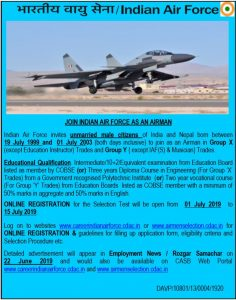

**Indian air force recruitment 2019**: Indian air force published a notification for Airmen in Group X-Y. Invites Online Applications from Unmarried Male (Indian/Nepalese) Candidates for Selection Test to Join as Airmen in Group „X‟ Trades (Except Education Instructor Trade) and Group „Y‟ Trades {Except Indian Air Force (Security) and Musician Trades} for Intake: 02/2020 in **Indian Air Force Vacancy 2019** Indian Air Force Recruitment 2019. those candidates interested and make a career in Indian air force careers, Eligible Candidate Apply **Indian Air Force Online Form 2019** on **careerindianairforce** before 15 July 2019. you can check IAF airmen 02/2020 Batch Check Eligibility Criteria Of airmen in this page below.

## Join Indian Air Force As An airmen Short Notification

##  Airmen in Group X-Y Apply Online Form

<table style="height: 1571px; width: 100%; border-collapse: collapse; border-style: double;"><tbody><tr style="height: 181px;"><td style="width: 99.8835%; height: 107px;" colspan="2">
Indian air force recruitment 2019

For

&nbsp;Airmen in Group X-Y&nbsp;
</td></tr><tr style="height: 13px;"><td style="width: 99.8835%; height: 22px; background-color: #2a5a8e;" colspan="2"><h2 style="text-align: center;"><strong>Indian air force recruitment Important Dates</strong></h2></td></tr><tr style="height: 39px;"><td style="width: 49.5338%; height: 39px; text-align: left;">
Starting Date to Apply Online
</td><td style="width: 50.3497%; height: 39px; text-align: center;">1-7-2019</td></tr><tr style="height: 39px;"><td style="width: 49.5338%; height: 29px; text-align: left;">
Last Date to Apply Online
</td><td style="width: 50.3497%; height: 29px; text-align: center;">15-7-2019</td></tr><tr style="height: 39px;"><td style="width: 49.5338%; height: 43px; text-align: center;">Online Exam Dates</td><td style="width: 50.3497%; height: 43px; text-align: center;">21 SEPTEMBER TO 24 SEPTEMBER 2019</td></tr><tr style="height: 22px;"><td style="width: 49.5338%; height: 22px; text-align: center;">Airmen Admit card Date</td><td style="width: 50.3497%; height: 22px; text-align: center;">Coming Soon</td></tr><tr style="height: 36px;"><td style="width: 99.8835%; height: 36px; background-color: #2a5a8e;" colspan="2"><h2 align="center"><b>&nbsp;Airmen in Group X-Y Eligibility</b></h2></td></tr><tr style="height: 36px;"><td style="height: 36px; width: 49.5338%;">
Group X
</td><td style="width: 50.3497%; height: 36px;">
Passed Intermediate/10+2/ Equivalent examination with Mathematics, Physics and English from an Educational Board listed as COBSE member with minimum 50% marks in aggregate and 50% marks in English.

OR

Passed Three Year Polytechnic Diploma with 50% Marks
</td></tr><tr style="height: 254px;"><td style="width: 49.5338%; height: 254px;">
Group Y
</td><td style="width: 50.3497%; height: 254px;">
Passed Intermediate / 10+2 / Equivalent Examination in any stream/subjects approved by Central / State Education Boards listed as COBSE member with minimum 50% marks in aggregate and 50% marks in English

OR

Passed two years vocational course from Educational Boards listed as COBSE member with minimum 50% marks in aggregate and 50% marks in English in a vocational course or in Intermediate/Matriculation if English is not a subject in Vocational Course.
</td></tr><tr style="height: 176px;"><td style="width: 99.8835%; height: 176px;" colspan="2">
<strong>Important Notes</strong>

<ol><li>Candidate eligible for Group ‘X’ examination (on the basis of intermediate/10+2) are also eligible for Group Y and would be given an option of appearing in both group X and Group Y exam in one sitting while filling up the online registration form.</li><li>Diploma holders are eligible to appear for Group X trades only.</li><li>&nbsp;Education Boards listed in Council of Boards for School Education (COBSE) website as members, as on date of registration shall only be considered.</li></ol></td></tr><tr style="height: 25px;"><td style="width: 99.8835%; height: 25px; background-color: #2a5a8e; text-align: center;" colspan="2"><h2><strong>Air Force X Y Group Age Limit</strong></h2></td></tr><tr style="height: 50px;"><td style="text-align: center; width: 99.8835%; height: 34px;" colspan="2">Candidate born between 19 July 1999 and 01 July 2003 (both days inclusive) is eligible to apply.

In case, a candidate clears all the stages of the Selection Procedure, then the upper age limit as on date of enrolment is 21 years.</td></tr><tr style="height: 22px;"><td style="width: 99.8835%; height: 22px; background-color: #2a5a8e; text-align: center;" colspan="2"><h2 align="center"><b>Air Force X Y Group Physical Eligibility</b></h2></td></tr><tr style="height: 22px;"><td style="text-align: center; height: 42px; width: 99.8835%;" colspan="2">General Medical Standards for both Group ‘X’ (Except Education Instructor Trade) and Group ‘Y’ {Except IAF(S) and Musician} Trades are as follows: -

1.Height: Minimum acceptable height shall be 152.5 cms.

2.Chest: Minimum range of expansion: 5 cm

3.Weight: Proportionate to height and age. However, a minimum weight of 55 Kg required for Operations Assistant (ATS) Trade only.

4. Corneal Surgery (PRK/LASIK) shall not be acceptable.

5. Hearing: Candidate should have normal hearing i.e. able to hear forced whisper from a distance of 6 meters with each ear separately.

6. Dental: Should have healthy gums, a good set of teeth and a minimum 14 dental points.

7. Health: Candidate should be of normal anatomy without loss of any appendages. He should be free from any active or latent, acute or chronic, medical or surgical disability or infection and skin ailments. A candidate shall be physically and mentally FIT to perform duty in any part of the world, in any climate and terrain.</td></tr><tr style="height: 36px;"><td style="height: 36px; width: 99.8835%; background-color: #2a5a8e; text-align: center;" colspan="2"><h2><strong>Airforce Group X Y Salary(pay &amp; Allowances and Perquisites )</strong></h2></td></tr><tr style="height: 426px;"><td style="text-align: center; width: 99.8835%; height: 426px;" colspan="2">
<strong>Pay &amp; Allowances:</strong>

<ul><li style="text-align: left;">During training, a stipend of Rs. 14,600/- per month shall be paid.&nbsp;</li><li style="text-align: left;">Group „X‟ Trades (Except Education Instructor Trade). Rs.33,100/- per month plus Dearness allowance (as applicable) which, in subsequent years, may rise as per the career progression of the individual.</li><li style="text-align: left;">Group „Y‟ {Except IAF(S) and Musician} Trades. Rs. 26,900/- per month plus Dearness allowance (as applicable) which, in subsequent years, may rise as per the career progression of the individual.</li></ul>
<strong>Other Allowances:</strong>

<ul><li style="text-align: left;">In addition to the above, various allowances such as Transport Allowance, Composite Personal Maintenance Allowance (CPMA), Leave Ration Allowance (LRA), High Altitude Allowance, Field Area/Modified Field Area Allowance, HRA, Children Education Allowance/ Hostel Subsidy etc., shall also be admissible from time to time as applicable.</li></ul>
<strong>Perks:</strong>

<ul><li style="text-align: left;">Perks such as Ration, Clothing, Medical facilities, Accommodation, CSD (Canteen) facilities, Leave (60 days Annual and 30 days Casual in a Calendar year as a privilege, subject to service exigencies), Recreational facilities, Transport facility for school going children and Leave Travel Concession (LTC) shall also be provided as per the existing rules. Also, Group Insurance Cover of Rs. 37.5 Lakhs at a premium of Rs. 2300/- per month for all airmen and facility of Group Housing Scheme are also extended.</li></ul></td></tr><tr style="height: 22px;"><td style="width: 99.8835%; height: 22px; background-color: #2a5a8e; text-align: center;" colspan="2"><h2 align="center"><b>Application Fee</b></h2></td></tr><tr style="height: 22px;"><td style="text-align: center; width: 99.8835%; height: 65px;" colspan="2">Examination fee of Rs.250/- is to be paid by the candidate while registering for the online examination.

(The payment can be made by using Debit Cards/ Credit Cards/Internet Banking through the payment gateway. The examination fee can also be paid by Challan payment at any Axis Bank Branch.)</td></tr><tr style="height: 22px;"><td style="width: 99.8835%; height: 22px; background-color: #2a5a8e; text-align: center;" colspan="2"><strong>Important Links</strong></td></tr><tr style="height: 22px;"><td style="text-align: center; width: 49.5338%; height: 22px;"><strong>Registration/Apply Online</strong><strong></strong></td><td style="text-align: center; width: 50.3497%; height: 22px;"><strong><a style="color: #ff0000;" href="https://airmenselection.cdac.in/STAR/controller/redirectController/showSignUp" target="_blank" rel="noopener noreferrer">Registration</a> / <a style="color: #ff0000;" href="https://airmenselection.cdac.in/CASB/" target="_blank" rel="noopener noreferrer">Apply Online</a></strong></td></tr><tr style="height: 22px;"><td style="text-align: center; width: 49.5338%; height: 22px;"><strong>Login</strong></td><td style="text-align: center; width: 50.3497%; height: 22px;"><a href="https://airmenselection.cdac.in/STAR/controller/showSignIn" target="_blank" rel="noopener noreferrer"><strong>Click Here</strong></a></td></tr><tr style="height: 25px;"><td style="text-align: center; width: 49.5338%; height: 25px;"><strong>Airmen Admit card</strong></td><td style="text-align: center; width: 50.3497%; height: 25px;"><strong>Coming Soon</strong></td></tr><tr style="height: 22px;"><td style="text-align: center; width: 49.5338%; height: 22px;"><strong>Official Notification</strong></td><td style="text-align: center; width: 50.3497%; height: 22px;"><a href="https://freegovtjobalert.in/wp-content/uploads/2019/07/indian-air-force-recruitment-2019-for-airmen-in-group-x-y-official-notification.pdf" target="_blank" rel="noopener noreferrer"><strong>Click Here</strong></a></td></tr><tr style="height: 22px;"><td style="text-align: center; width: 49.5338%; height: 22px;"><strong>Official Website</strong></td><td style="text-align: center; width: 50.3497%; height: 22px;"><a href="http://indianairforce.nic.in" target="_blank" rel="noopener noreferrer"><strong>Click Here</strong></a></td></tr></tbody></table>

> ## Indian Air Force Airmen Group X-Y Exam Pattern & Syllabus 2019 [**Click Here**](https://freegovtjobalert.in/airmen-group-x-y-exam-pattern-syllabus/)

## **How To Apply Indian air force/how to join Indian air force after 10th/12th:**

- The applicant can apply through the online mode.
- Candidate Need to visit website ([www.airmenselection.gov.in](https://airmenselection.cdac.in/CASB/)) for ONLINE REGISTRATION & guidelines for filling up / dispatch of an application form, eligibility criteria, and Selection Procedure. We advise the candidate to Read all the instructions before filling the Application form.
- ONLINE REGISTRATION shall commence on 01 July 2019 and shall close on 15 July 2019. Only ONLINE REGISTERED applications shall be accepted.

**IMPORTANT NOTIFICATION TO CANDIDATES**

**1\. Followings are to be uploaded as the case may be:-**

- Class 10th /matriculation passing certificate.
- Intermediate/10+2 or equivalent marksheets (if applying on the basis of 12th/ intermediate or equivalent educational qualifications). OR
- 3 Yrs Engineering Diploma Final Year Marksheet (if applying on the basis of 3 Years Engineering Diploma from a Govt. recognised polytechnic in a prescribed stream).
- Passport size recent colour photograph (taken not before June 2019) of size 10 KB to 50 KB (front portrait in light background without headgear except for Sikhs). The photograph is to be taken with candidate holding a black slate in front of his chest with his Name and Date of Photograph taken, clearly written on it with white chalk in capital letters.
- Candidate’s left-hand thumb impression image (Size 10 KB to 50 KB).
- Candidate’s signature image (Size 10 KB to 50 KB).
- Candidate’s parent’s (Father/Mother)/Guardian’s signature image (if the candidate is below 18 years on the date of filling the online application).
- The mark sheet indicating marks in English subject in diploma (if applying on the basis of 3 Years Engineering Diploma qualification) or in 12th/10th if English is not a subject in Diploma.

2\. Candidate must have his valid E-mail ID and Mobile No. for successful online registration.

3\. Candidate should have his Aadhaar Card Number handy.

4\. Candidates are to reach at the Examination Centre with a colour print out of provisional admit card. Candidates shall be debarred from appearing in the online test in case anomalies/irregularities/ incorrect information are observed during initial verification at the examination venue or at any subsequent stage of the selection process.

5\. The candidate shall carry a valid ID proof whenever he reports for the selection test and medical test.

6\. Details about required educational qualification, physical/medical standards and job specification are available on CASB web portal [www.airmenselection.cdac.in](http://www.airmenselection.cdac.in) under the candidate’s login and this information can be accessed by the candidate without signing in.

7\. PRESIDENT, CASB RESERVES THE RIGHT TO ALLOT EXAMINATION CENTRE FOR PHASE - I AND II WHICH MAY OR MAY NOT BE AS PER CHOICE OF THE CANDIDATE

> More Govt Jobs **[Click Here](https://freegovtjobalert.in)**
