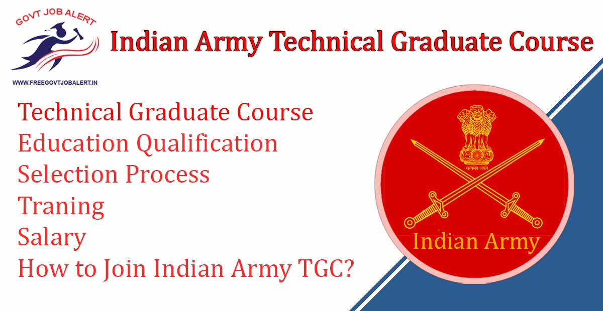

Indian Army Technical Graduate Course 2019: Applications are invited from unmarried Male Engineering Graduates for 131st Technical Graduate Course (commencing in Jul 2020 at Indian Military Academy (IMA), Dehradun) for permanent commission in the Indian Army. Indian Army TGC 2020 Notification of Technical Graduates Course for Engineering Streams and Equivalent Stream. Interested and Eligible Candidates can fill up online form before 14-11-2019.

## Indian Army Technical Graduate Course TGC 131 Details

<table style="border-collapse: collapse; width: 100%;"><tbody><tr><td style="width: 50%; background-color: #2a5a8e;" colspan="2"><h3 style="text-align: center;">Indian Army Technical Graduate Course 2019</h3></td></tr><tr><td style="width: 50%; text-align: center;">Job Recruitment Board</td><td style="width: 50%; text-align: center;">Indian Army</td></tr><tr><td style="width: 50%; text-align: center;">Post</td><td style="width: 50%; text-align: center;">Technical Graduate Course</td></tr><tr><td style="width: 50%; text-align: center;">Vacancies</td><td style="width: 50%; text-align: center;">40</td></tr><tr><td style="width: 50%; text-align: center;">Job Location</td><td style="width: 50%; text-align: center;">Across India</td></tr><tr><td style="width: 50%; text-align: center;">Job Type</td><td style="width: 50%; text-align: center;">Defence Jobs</td></tr><tr><td style="width: 50%; text-align: center;">Application Mode</td><td style="width: 50%; text-align: center;">Online</td></tr></tbody></table>

The Indian Army TGC Notification Publish on his Official website. As Per Notification A Total of 40 Various Vacancies Are There. to know about TGC Details Like Education Qualification, Age limits, TGC Indian army salary, Promotion Criteria, How to Apply, Etc Given Below In this page.

<table style="border-collapse: collapse; width: 100%;"><tbody><tr><td style="width: 50%; background-color: #2a5a8e; text-align: center;" colspan="2"><h3>Important Date</h3></td></tr><tr><td style="width: 50%; text-align: center;">Starting date for submission of online application</td><td style="width: 50%; text-align: center;">16-10-2019</td></tr><tr><td style="width: 50%; text-align: center;">Last date for submission of online application</td><td style="width: 50%; text-align: center;">14-11-2019</td></tr></tbody></table>

### Join Indian Army vacancy 2019 Details

<table style="border-collapse: collapse; width: 100%;"><tbody><tr><td style="width: 24.8009%; text-align: center; background-color: #2a5a8e;"><strong>Engineering Streams</strong></td><td style="width: 60.478%; text-align: center; background-color: #2a5a8e;"><strong>Equivalent Stream</strong></td><td style="width: 14.721%; text-align: center; background-color: #2a5a8e;"><strong>Vacancies</strong></td></tr><tr><td style="width: 24.8009%; text-align: center;">Civil</td><td style="width: 60.478%; text-align: center;">Civil Engineering, Civil Engineering (Structural Engineering ), Structural Engineering</td><td style="width: 14.721%; text-align: center;">08</td></tr><tr><td style="width: 24.8009%; text-align: center;">Architecture</td><td style="width: 60.478%; text-align: center;">Architecture Engineering</td><td style="width: 14.721%; text-align: center;">01</td></tr><tr><td style="width: 24.8009%; text-align: center;">Mechanical</td><td style="width: 60.478%; text-align: center;">Mechanical Engineering, Mechanical (Mechatronics) Engineering, Mechanical &amp; Automation Engineering</td><td style="width: 14.721%; text-align: center;">04</td></tr><tr><td style="width: 24.8009%; text-align: center;">Electrical / Electrical &amp; Electronics</td><td style="width: 60.478%; text-align: center;">Electrical Engineering, Electrical Engineering (Electronics &amp; Power), Power System Engineering, Electrical &amp; Electronics Engineering</td><td style="width: 14.721%; text-align: center;">05</td></tr><tr><td style="width: 24.8009%; text-align: center;">Computer Sc &amp; Engg / Computer Technology/ Info Tech/ M. Sc Computer Sc</td><td style="width: 60.478%; text-align: center;">Computer Engineering, Computer Science, Computer Science Engineering, Computer Science &amp; Engineering, Information Science &amp; Engineering</td><td style="width: 14.721%; text-align: center;">11</td></tr><tr><td style="width: 24.8009%; text-align: center;">Electronics &amp; Telecom/ Telecommunication/ Electronics &amp; Comm/ Satellite Communication</td><td style="width: 60.478%; text-align: center;">Electronics &amp; Telecommunication Engineering, Telecommunication Engineering, Electronics &amp; Communication Engineering, Electronics &amp; Electrical Communication Engineering</td><td style="width: 14.721%; text-align: center;">08</td></tr><tr><td style="width: 24.8009%; text-align: center;">Electronics</td><td style="width: 60.478%; text-align: center;">Power Electronics &amp; Drives</td><td style="width: 14.721%; text-align: center;">01</td></tr><tr><td style="width: 24.8009%; text-align: center;">Electronics &amp; Instrumentation/ Instrumentation</td><td style="width: 60.478%; text-align: center;">Applied Electronics &amp; Instrumentation Engineering, Electronics &amp; Instrumentation Engineering , Electronics &amp; Instrumentation &amp; Control Engineering , Instrumentation &amp; Control Engineering, Instrumentation Technology</td><td style="width: 14.721%; text-align: center;">01</td></tr><tr><td style="width: 24.8009%; text-align: center;">Aeronautical/ Ballistics/ Avionics</td><td style="width: 60.478%; text-align: center;">Aeronautical Engineering, Avionics Engineering</td><td style="width: 14.721%; text-align: center;">01</td></tr><tr><td style="width: 85.2789%; text-align: center;" colspan="2"><strong>Total</strong></td><td style="width: 14.721%; text-align: center;"><strong>40</strong></td></tr></tbody></table>

### Indian Army TGC eligible criteria

Education Qualification:

- Candidates who have passed the requisite Engineering Degree course or are in the final year of Engineering Degree course are eligible to apply.

Age Limit:

- Minimum 20 Years
- Maximum  27 Years

### Indian Army TGC Selection Process

1. Shortlisting
2. SSB Interview

### Indian Army TGC Medical Examination

- Medical Standards and Procedures of Medical Examination for Officers Entry into Army as applicable.
- More Details Visit www.joinindianarmy.nic.in

### Indian Army TGC Traning

- Selected candidates will be detailed for training at Indian Military Academy, Dehradun according to their position in the final order of merit, engineering stream-wise up to the number of vacancies available at the time.
- Duration of training - 49 weeks.

### Indian Army TGC Promotion

<table style="border-collapse: collapse; width: 100%;"><tbody><tr><td style="width: 50%; text-align: center; background-color: #2a5a8e;"><strong>Rank</strong></td><td style="width: 50%; text-align: center; background-color: #2a5a8e;"><strong>Promotion Criteria</strong></td></tr><tr><td style="width: 50%; text-align: center;">Lieutenant</td><td style="width: 50%; text-align: center;">On Commission</td></tr><tr><td style="width: 50%; text-align: center;">Captain</td><td style="width: 50%; text-align: center;">On completion of 02 Yrs</td></tr><tr><td style="width: 50%; text-align: center;">Major</td><td style="width: 50%; text-align: center;">On completion of 06 Yrs</td></tr><tr><td style="width: 50%; text-align: center;">Lt Colonel</td><td style="width: 50%; text-align: center;">On completion of 13 Yrs</td></tr><tr><td style="width: 50%; text-align: center;">Colonel (TS)</td><td style="width: 50%; text-align: center;">On completion of 26 Yrs</td></tr><tr><td style="width: 50%; text-align: center;">Brigadier</td><td style="width: 50%; text-align: center;" rowspan="6">On selection basis subject to fulfillment of Brigadier requisite service conditions.</td></tr><tr><td style="width: 50%; text-align: center;">Major General</td></tr><tr><td style="width: 50%; text-align: center;">Lt General /HAG Scale</td></tr><tr><td style="width: 50%; text-align: center;">HAG + Scale (*Admissible to 1/3rd of total strength of Lt Generals)</td></tr><tr><td style="width: 50%; text-align: center;">VCOAS/Army Cdr/Lt Gen (NFSG)</td></tr><tr><td style="width: 50%; text-align: center;">COAS</td></tr></tbody></table>

### Indian Army TGC Salary

<table style="border-collapse: collapse; width: 100%;"><tbody><tr><td style="width: 46.7578%; text-align: center; background-color: #2a5a8e;"><strong>Rank</strong></td><td style="width: 19.1978%; text-align: center; background-color: #2a5a8e;"><strong>Level</strong></td><td style="width: 34.0444%; text-align: center; background-color: #2a5a8e;"><strong>Pay</strong></td></tr><tr><td style="width: 46.7578%; text-align: center;">Lieutenant</td><td style="width: 19.1978%; text-align: center;">Level 10</td><td style="width: 34.0444%; text-align: center;">Rs.56,100/-&nbsp; - 1,77,500/-</td></tr><tr><td style="width: 46.7578%; text-align: center;">Captain</td><td style="width: 19.1978%; text-align: center;">Level 10B</td><td style="width: 34.0444%; text-align: center;">Rs.61,300/- - 1,93,900/-</td></tr><tr><td style="width: 46.7578%; text-align: center;">Major</td><td style="width: 19.1978%; text-align: center;">Level 11</td><td style="width: 34.0444%; text-align: center;">Rs.69,400/- - 2,07,200/-</td></tr><tr><td style="width: 46.7578%; text-align: center;">Lt Colonel</td><td style="width: 19.1978%; text-align: center;">Level 12A</td><td style="width: 34.0444%; text-align: center;">Rs.1,21,200/- - 2,12,400/-</td></tr><tr><td style="width: 46.7578%; text-align: center;">Colonel (TS)</td><td style="width: 19.1978%; text-align: center;">Level 13</td><td style="width: 34.0444%; text-align: center;">Rs.1,30,600/- - 2,15,900/-</td></tr><tr><td style="width: 46.7578%; text-align: center;">Brigadier</td><td style="width: 19.1978%; text-align: center;">Level 13A</td><td style="width: 34.0444%; text-align: center;">Rs.1,39,600/- - 2,17,600/-</td></tr><tr><td style="width: 46.7578%; text-align: center;">Major General</td><td style="width: 19.1978%; text-align: center;">Level 14</td><td style="width: 34.0444%; text-align: center;">Rs.1,44,200/- - 2,18,200/-</td></tr><tr><td style="width: 46.7578%; text-align: center;">Lt General /HAG Scale</td><td style="width: 19.1978%; text-align: center;">Level 15</td><td style="width: 34.0444%; text-align: center;">Rs.1,82,200/- - 2,24,100/-</td></tr><tr><td style="width: 46.7578%; text-align: center;">HAG + Scale (*Admissible to 1/3rd of total strength of Lt Generals)</td><td style="width: 19.1978%; text-align: center;">Level 16</td><td style="width: 34.0444%; text-align: center;">Rs.2,05,400/- - 2,24,400/-</td></tr><tr><td style="width: 46.7578%; text-align: center;">VCOAS/Army Cdr/Lt Gen (NFSG)</td><td style="width: 19.1978%; text-align: center;">Level 17</td><td style="width: 34.0444%; text-align: center;">Rs.2,25,000/-(fixed)</td></tr><tr><td style="width: 46.7578%; text-align: center;">COAS</td><td style="width: 19.1978%; text-align: center;">Level 18</td><td style="width: 34.0444%; text-align: center;">Rs.2,50,000/-(fixed)</td></tr></tbody></table>

**Fix Stipend For Cadet Training**

- Rs 56,100/- Per month\* (Starting pay in Level 10)

### How to Join Indian Army Technical Graduate Course 2019

1. Candidates Go to website “www.joinindianarmy.nic.in”.
2. Click on ‘Officer Entry Apply/Login’ and then click ‘Registration’.
3. Fill the online registration form after reading the instructions carefully.
4. After getting registered, click on ‘Apply Online’ under Dashboard.
5. A page ‘Officers Selection – Eligibility’ will open.
6. Then click ‘Apply’ shown against Technical Graduate Course.
7. A page ‘Application Form’ will open.
8. Read the instructions carefully and click ‘Continue’ to fill details as required under various segments. Personal information, Communication details, Education details and details of previous SSB.
9. ‘Save & Continue’ each time before you go to the next segment.
10. After filling details on the last segment, you will move to a page ‘Summary of your information’ wherein you can check and edit the entries already made.
11. Then click on ‘Submit Now’ only after carefully ascertaining that the correct details have been filled in.
12. Candidates must click ‘Submit Now’ each time they open the application for editing.
13. The candidates are required to take out two copies of their application having Roll Number, 30 minutes after final closure of online application on the last day.
14. Done

### Indian Army Technical Graduate Course Important Links

- Indian Army Technical Graduate Course Online Form 2019: [Click Here](https://joinindianarmy.nic.in/login.htm)
- Indian Army TGC 131 Notification Jul 2020: [Click Here](https://freegovtjobalert.in/wp-content/uploads/2019/10/Notification-Indian-Army-TGC-131-Jul-2020.pdf)
- Indian Army Official Website: [Click Here](https://joinindianarmy.nic.in/index.htm)
