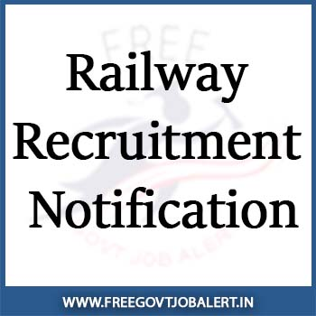

**Indian coast guard Recruitment 2021 | Navik & Yantrik Posts | Total 358 Vacancies | Last Date: 19-01-2021 | Indian Coast Guard Job Notification @https://joinindiancoastguard.cdac.in**

The Indian Coast Guard has Released Notification for the recruitment of Navik And Yantrik (02/2021 Batch) Vacancies. Indian Coast Guard are invited from Indian male candidates possessing educational qualifications and age as prescribed for recruitment to the post of Navik (General Duty), Navik (Domestic Branch), and Yantrik in the Indian Coast Guard, an Armed Force of the Union.

<table style="border-collapse: collapse; width: 100%;"><tbody><tr><td style="width: 50%; background-color: #2a5a8e; text-align: center;" colspan="2"><h3><strong>Indian coast guard Recruitment 2021</strong></h3></td></tr><tr><td style="width: 50%; text-align: center;">Job Recruitment Board</td><td style="width: 50%; text-align: center;">Indian coast guard</td></tr><tr><td style="width: 50%; text-align: center;">Notification</td><td style="width: 50%; text-align: center;">02-2021 Batch</td></tr><tr><td style="width: 50%; text-align: center;">Post</td><td style="width: 50%; text-align: center;">Navik (General Duty), Navik (Domestic Branch) and Yantrik</td></tr><tr><td style="width: 50%; text-align: center;">Vacancy</td><td style="width: 50%; text-align: center;">358 Posts</td></tr><tr><td style="width: 50%; text-align: center;">Job Location</td><td style="width: 50%; text-align: center;">Across India</td></tr><tr><td style="width: 50%; text-align: center;">Job Type</td><td style="width: 50%; text-align: center;">Defence Jobs</td></tr><tr><td style="width: 50%; text-align: center;">Application Mode</td><td style="width: 50%; text-align: center;">Online</td></tr></tbody></table>

## Indian coast guard Recruitment 2021 Notification for Navik (GD)

<table style="border-collapse: collapse; width: 100%;"><tbody><tr><td style="width: 50%; background-color: #2a5a8e; text-align: center;" colspan="2"><h3><strong>Important Dates</strong></h3></td></tr><tr><td style="width: 50%; text-align: center;">Starting date of Online Application</td><td style="width: 50%; text-align: center;">05-01-2021</td></tr><tr><td style="width: 50%; text-align: center;">Last Date of Online Application</td><td style="width: 50%; text-align: center;">19-01-2021</td></tr><tr><td style="width: 50%; text-align: center;">Stage-I Exam Date</td><td style="width: 50%; text-align: center;">Mid/End March 2021 (Tentative)</td></tr><tr><td style="width: 50%; text-align: center;">Stage-II Exam Date</td><td style="width: 50%; text-align: center;">End April/Early May 2021 (Tentative)</td></tr><tr><td style="width: 50%; text-align: center;">Stage-III&amp; IV Exam Date</td><td style="width: 50%; text-align: center;">Early August 2021 (Tentative)</td></tr></tbody></table>

### **Indian Coast Guard Vacancy 2021 Details**

### **Eligibility Criteria of Indian Coast Guard Jobs 2021**

**Age Limits**

- Minimum 18 Years
- Maximum 22 Years
- Upper age relaxation of 5 years for SC/ST and 3 years for OBC (non-creamy) candidates is applicable only if posts are reserved for them.

(a) For Navik (GD) and Yantrik. Born between 01 Aug 1999 to 31 Jul 2003 (both dates inclusive).

(b) For Navik (DB). Born between 01 Oct 1999 to 30 Sep 2003 (both dates inclusive).

**Education Qualification**

<table style="border-collapse: collapse; width: 100%; height: 450px;"><tbody><tr style="height: 25px;"><td style="width: 40.3077%; text-align: center; height: 25px;"><strong>Post&nbsp;</strong></td><td style="width: 59.6923%; text-align: center; height: 25px;"><strong>Qualification</strong></td></tr><tr style="height: 100px;"><td style="width: 40.3077%; text-align: center; height: 100px;">Navik (General Duty)</td><td style="width: 59.6923%; text-align: center; height: 100px;">10+2 passed with Maths and Physics from an education board recognized by Council of Boards for School Education (COBSE).</td></tr><tr style="height: 100px;"><td style="width: 40.3077%; text-align: center; height: 100px;">Navik (Domestic Branch)</td><td style="width: 59.6923%; text-align: center; height: 100px;">10th Class passed from an education board recognized by Council of Boards for School Education (COBSE).</td></tr><tr style="height: 225px;"><td style="width: 40.3077%; text-align: center; height: 225px;">Yantrik</td><td style="width: 59.6923%; text-align: center; height: 225px;">10th class passed from an education board recognized by Council of Boards for School Education (COBSE) and Diploma in Electrical/ Mechanical / Electronics/ Telecommunication (Radio/Power) Engineering approved by All India Council of Technical Education (AICTE)</td></tr></tbody></table>

### **Indian Coast Guard Jobs Salary/Pay Scale**

- Navik: Rs. 21700/- (Pay Level-3) plus Dearness Allowance and other allowances based on nature of duty/place of posting as per the prevailing regulations
- Yantrik: y Rs. 29200/- (Pay Level-5). In addition, you will be paid Yantrik pay @ Rs. 6200/- plus Dearness Allowance and other allowances based on nature of duty/place of posting as per the prevailing regulation

**Promotion and Perquisites:**

- **(a)** Promotion prospects exist up to the rank of Pradhan Adhikari/ Pradhan Sahayak Engineer with pay scale Rs. 47600/- (Pay Level 8) plus Yantrik pay @ Rs. 6200/- with Dearness Allowance. Promotion to the Officer cadre is subject to suitability and performance.

**(b) Other Benefits.**

- (i) Free ration and clothing as per the existing rules. Free medical treatment for self and family including dependent parents.
- (ii) Government accommodation for self & family on nominal license fee or HRA as approved by Government.
- (iii) 45 days Earned leave and 08 days Casual leave every year with Leave Travel Concession (LTC) for self, family and dependent parents as per Government rules.
- (iv) Contributory Pension Scheme and Gratuity on retirement.
- (v) Canteen and various loan facilities.
- (iv) ECHS medical facilities after retirement.

**(c) Insurance Cover.**

- Insurance cover (on contribution) of Rs. 50 lakhs for Enrolled Personnel is applicable.

### **Selection Process of Indian Coast Guard Recruitment 2021**

The selection of recruits is based on an all India order of merit on their performance in **Stage-I, II, III & IV**(explained in detail below) and the number of vacancies available for the post.

Clearing of Stage-I, II, III, IV and satisfactory performance in training is compulsory for recruitment in ICG.

All candidates will be compulsorily subjected to biometric, photo identification and document verification during stage-I, II, III & IV of the selection procedure.

The details of various stages are as follows: -

**Stage- I –Written Exam Pattern**

<table style="border-collapse: collapse; width: 100%;"><tbody><tr><td style="width: 21.8097%; text-align: center; background-color: #2a5a8e;"><strong>Post</strong></td><td style="width: 22.7998%; text-align: center; background-color: #2a5a8e;"><strong>Written Test</strong></td><td style="width: 27.2002%; text-align: center; background-color: #2a5a8e;"><strong>Passing Marks</strong></td><td style="width: 28.1903%; text-align: center; background-color: #2a5a8e;"><strong>Remarks</strong></td></tr><tr><td style="width: 21.8097%; text-align: center;">Navik (DB)</td><td style="width: 22.7998%; text-align: center;">Section I</td><td style="width: 27.2002%; text-align: center;">30 (UR/EWS/ OBC) 27 (for SC/ST)</td><td style="width: 28.1903%; text-align: center;"></td></tr><tr><td style="width: 21.8097%; text-align: center;">Navik (GD)</td><td style="width: 22.7998%; text-align: center;">Section (I+II)</td><td style="width: 27.2002%; text-align: center;">30+20=50 (UR/ EWS/ OBC) 27+17= 44 (SC/ST)</td><td style="width: 28.1903%; text-align: center;">Passing in section I and II separately is compulsory</td></tr><tr><td style="width: 21.8097%; text-align: center;">Yantrik (Electrical)</td><td style="width: 22.7998%; text-align: center;">Section (I+III)</td><td style="width: 27.2002%; text-align: center;">30+20= 50 (UR/ EWS/ OBC) 27+17= 44 (SC/ST)</td><td style="width: 28.1903%; text-align: center;">Passing in section I and III separately is compulsory</td></tr><tr><td style="width: 21.8097%; text-align: center;">Yantrik (Electronics)</td><td style="width: 22.7998%; text-align: center;">Section (I+IV)</td><td style="width: 27.2002%; text-align: center;">30+20= 50 (UR/ EWS/ OBC) 27+17= 44 (SC/ST)</td><td style="width: 28.1903%; text-align: center;">Passing in section I and IV separately is compulsory</td></tr><tr><td style="width: 21.8097%; text-align: center;">Yantrik (Mechanical)</td><td style="width: 22.7998%; text-align: center;">Section (I+V)</td><td style="width: 27.2002%; text-align: center;">30+20= 50 (UR/ EWS/ OBC) 27+17= 44 (SC/ST)</td><td style="width: 28.1903%; text-align: center;">Passing in section I and V separately is compulsory</td></tr></tbody></table>

**Indian Coast Guard Written Exam Syllabus 2021**

<table style="border-collapse: collapse; width: 100%;"><tbody><tr><td style="width: 17.2497%; text-align: center; background-color: #2a5a8e;"><strong>Section</strong></td><td style="width: 20.5501%; text-align: center; background-color: #2a5a8e;"><strong>Details of Examination</strong></td><td style="width: 22.2002%; text-align: center; background-color: #2a5a8e;"><strong>Subject wise allocation of Questions</strong></td><td style="width: 20%; text-align: center; background-color: #2a5a8e;"><strong>Passing Marks</strong></td><td style="width: 20%; text-align: center; background-color: #2a5a8e;"><strong>Syllabus</strong></td></tr><tr><td style="width: 17.2497%; text-align: center;">Section I</td><td style="width: 20.5501%; text-align: center;">Maximum Marks – 60 Time – 45 mins. Total no. of Questions – 60</td><td style="width: 22.2002%; text-align: center;">Maths – 20 Science - 10 English – 15 Reasoning–10 GK – 5</td><td style="width: 20%; text-align: center;">30 (UR/EWS/ OBC category) 27 (for SC/ST category)</td><td style="width: 20%; text-align: center;">Class 10th

Syllabus</td></tr><tr><td style="width: 17.2497%; text-align: center;">Section II</td><td style="width: 20.5501%; text-align: center;">Maximum Marks – 50 Time – 30 mins. Total no. of Questions – 50</td><td style="width: 22.2002%; text-align: center;">Maths – 25 Physics– 25</td><td style="width: 20%; text-align: center;">20 (UR/EWS/ OBC category) 17 (for SC/ST category)</td><td style="width: 20%; text-align: center;">Class 12th Maths &amp; Physics Syllabus</td></tr><tr><td style="width: 17.2497%; text-align: center;">Section III</td><td style="width: 20.5501%; text-align: center;">Maximum Marks – 50 Time – 30 mins. Total no. of Questions – 50</td><td style="width: 22.2002%; text-align: center;">Electrical Engineering - 50</td><td style="width: 20%; text-align: center;">20 (UR/EWS/ OBC category) 17 (for SC/ST category)</td><td style="width: 20%; text-align: center;">Diploma Level Electrical Engineering Syllabus</td></tr><tr><td style="width: 17.2497%; text-align: center;">Section IV</td><td style="width: 20.5501%; text-align: center;">Maximum Marks – 50 Time – 30 mins. Total no. of Questions – 50</td><td style="width: 22.2002%; text-align: center;">Electronics Engineering - 50</td><td style="width: 20%; text-align: center;">20 (UR/EWS/ OBC category) 17 (for SC/ST category)</td><td style="width: 20%; text-align: center;">Diploma Level Electronics Engineering syllabus</td></tr><tr><td style="width: 17.2497%; text-align: center;">Section V</td><td style="width: 20.5501%; text-align: center;">Maximum Marks – 50 Time – 30 mins. Total no. of Questions – 50</td><td style="width: 22.2002%; text-align: center;">Mechanical Engineering - 50</td><td style="width: 20%; text-align: center;">20 (UR/EWS/ OBC category) 17 (for SC/ST category)</td><td style="width: 20%; text-align: center;">Diploma Level Mechanical Engineering syllabus</td></tr></tbody></table>

**Stage - II**

Based on the performance in the Computer Based Online Examination, a merit list will be prepared and e-admit card for stage-II will be issued as per the vacancies available and ratio decided by ICG

**(A)Physical Fitness Test (PFT).**

- PFT will be conducted for all those who qualify the written tests. All candidates are advised to be in possession of sport rig (Shoe, T-shirt, trousers, etc). The PFT will consist of:-
    - 1.6 Km run to be completed in 7 minutes.
    - 20 Squat ups (Uthak Baithak)
    - 10 Push up. Candidates undergoing PFT will do so at their own risk.

**(B) Document verification (Pass/fail)**

**(C) Re-assessment of Inconsistent Performers (Pass/fail)**

**(D) Initial Medicals Examination**

**Medical Standards:**

Medical examination will be conducted by authorized Military Doctors as per medical standards prescribed in current regulations applicable to Enrolled Personnel on entry.

**Height:**

- Minimum height 157 cms.
- Height standards may be reduced by up to 05 cms below 157 cms for candidates having domicile of Assam, Nagaland, Mizoram, Meghalaya, Arunachal Pradesh, Manipur, Tripura, Garhwal, Sikkim and Andaman, and the Nicobar Islands. Height standards may be reduced by up to 02 cms for candidates having domicile of Lakshadweep.

**Chest:**

- Should be well proportioned. Minimum expansion 5 cms.

**Weight:**

- Proportionate to height and age + 10 percentage acceptable.

**Hearing:**

- Normal.

**Tattoo:**

- Permanent body tattoos are not permitted on any part of the body.
- However, certain concessions are permitted to candidates belonging to tribal areas communities as declared by the Govt. of India. For other candidates, permanent body tattoos are only permitted on the inner face of forearms i.e. from inside of the elbow to the wrist and on the reverse side of the palm/back (dorsal) side of the hand.
- Details in this regard are available on the Indian Coast Guard Recruitment website https://joinindiancoastguard.cdac.in

**Stage - III**

Based on the performance in Stage-I & Stage-II, an all-India merit list will be prepared and an e-admit card for stage-III (final medicals at INS Chilka) will be issued as per the vacancies available and ratio decided by ICG. The duration of Stage-III is 1 to 2 days. Stage-III involves the following: -

- (a) Document verification (Pass/fail).
- (b)Final Medicals at INS Chilka
- (c) Submission of the original document, police verification and other associated forms

**Stage - IV**

- The candidates are to submit all the original documents and verification of all original documents through boards/universities/state government will be carried out by the Indian Coast Guard.
- The candidate will be terminated from service if the documents are reported as not genuine by respective boards/universities/state government.

### **Application Fee**

- Other Candidates: Rs. 250/-
- SC/ST candidates: No Fee
- Payment Mode: Net banking or by using Visa/ Master/ Maestro/ Rupay Credit/ Debit Card/ UPI

\[su\_button url="https://t.me/free\_govtjobalert" target="self" style="default" background="#2a5a8e" color="#FFFFFF" size="3" wide="no" center="no" radius="auto" icon="" icon\_color="#FFFFFF" text\_shadow="none" desc="" download="" onclick="" rel="" title="" id="" class=""\]Get Daily Job Updates On Telegram\[/su\_button\]

### **How to Apply Online For Indian coast guard Navik Post 2021**

1. The Candidates Should Visit Official Website @ https://joinindiancoastguard.cdac.in/
2. Next, Find & Download Advertisement and Check Eligibility Criteria Very Carefully.
3. Select the Desired Post from Online Application Section and Click on the Apply Now Button.
4. Fill Registration Along with Some Basic Information Like Name, Date of Birth, Caste, Etc. With Registered Mobile Number and Email.
5. Pay Application Fee Through Online.
6. Then Upload Photo, Sign & Photo Identity Card.
7. Last, Submit the Application Form & Download or Take a Printout For Future Use.

**Note:** The Applicants Are Requested to Read the Official Notification Carefully Before Apply.

<table style="border-collapse: collapse; width: 100%;"><tbody><tr><td style="width: 100%; background-color: #2a5a8e; text-align: center;" colspan="2"><h3>Important Links</h3></td></tr><tr style="height: 25px;"><td style="width: 50%; text-align: center; height: 25px;">Apply Online&nbsp;</td><td style="width: 50%; text-align: center; height: 25px;"><a title="Indian Coast Guard" href="https://cgept.cdac.in/icgreg/candidate/login" target="_blank" rel="nofollow noopener">Click Here</a></td></tr><tr style="height: 25px;"><td style="width: 50%; text-align: center; height: 25px;">Official Notification</td><td style="width: 50%; text-align: center; height: 25px;"><a href="https://joinindiancoastguard.cdac.in/assets/img/downloads/advertisenment.pdf" target="_blank" rel="noopener">English</a> | <a href="https://joinindiancoastguard.cdac.in/assets/img/downloads/adv_h.pdf" target="_blank" rel="noopener">Hindi</a></td></tr><tr style="height: 25px;"><td style="width: 50%; text-align: center; height: 25px;">Official Website</td><td style="width: 50%; text-align: center; height: 25px;"><a href="https://joinindiancoastguard.cdac.in/" target="_blank" rel="noopener">Check Here</a></td></tr><tr style="height: 25px;"><td style="width: 50%; text-align: center; height: 25px;">Get Free Govt Job Alert On Mobile&nbsp;</td><td style="width: 50%; text-align: center; height: 25px;"><a href="https://t.me/free_govtjobalert" target="_blank" rel="noopener noreferrer">Telegram</a> | <a href="https://www.facebook.com/Free-Govt-Job-Alert-1091006524429779/" target="_blank" rel="noopener noreferrer">Facebook</a> | <a href="https://feedburner.google.com/fb/a/mailverify?uri=Freegovtjobalertin&amp;loc=en_US" target="_blank" rel="noopener noreferrer">Email</a></td></tr></tbody></table>

**Training:**

- The basic training for Navik (General Duty) and Yantrik will commence in Aug 2021 and Navik (Domestic Branch) in Oct 2021at INS Chilka followed by sea training and professional training in the allotted trade.
- Branch/trade will be allocated as per the requirement of service and performance during basic training.
- Naviks (GD/DB)/Yantriks are liable to be discharged as UNSUITABLE if their progress (including academic) or conduct is unsatisfactory at any time during training.
- Trainees are also liable to be discharged at any stage of training if their online application or the documents are found to be falsified at the stage of recruitment.

**Latest Jobs:**

\[catlist name="job-notification" numberposts=20 orderby=modified date\]

<table style="border-collapse: collapse;"><tbody><tr><td style="width: 33.3333%; background-color: #2a5a8e; text-align: center;" colspan="3"><strong>Jobs by Qualification</strong></td></tr><tr><td style="width: 33.3333%; text-align: center;"><a href="https://freegovtjobalert.in/10th-pass-job/" target="_blank" rel="noopener noreferrer">10th Pass</a></td><td style="width: 33.3333%; text-align: center;"><a href="https://freegovtjobalert.in/12th-pass-job/" target="_blank" rel="noopener noreferrer">12th Pass</a></td><td style="width: 33.3333%; text-align: center;"><a href="https://freegovtjobalert.in/qualification/bcom/" target="_blank" rel="noopener noreferrer">B.Com</a></td></tr><tr><td style="width: 33.3333%; text-align: center;"><a href="https://freegovtjobalert.in/qualification/be/" target="_blank" rel="noopener noreferrer">B.E</a></td><td style="width: 33.3333%; text-align: center;"><a href="https://freegovtjobalert.in/qualification/b-sc/" target="_blank" rel="noopener noreferrer">B.Sc</a></td><td style="width: 33.3333%; text-align: center;"><a href="https://freegovtjobalert.in/qualification/btech/" target="_blank" rel="noopener noreferrer">B.Tech</a></td></tr><tr><td style="width: 33.3333%; text-align: center;"><a href="https://freegovtjobalert.in/qualification/ba/" target="_blank" rel="noopener noreferrer">B.A</a></td><td style="width: 33.3333%; text-align: center;"><a href="https://freegovtjobalert.in/qualification/bba/" target="_blank" rel="noopener noreferrer">BBA</a></td><td style="width: 33.3333%; text-align: center;"><a href="https://freegovtjobalert.in/qualification/bca/" target="_blank" rel="noopener noreferrer">BCA</a></td></tr><tr><td style="width: 33.3333%; text-align: center;"><a href="https://freegovtjobalert.in/qualification/b-ed/" target="_blank" rel="noopener noreferrer">B.Ed</a></td><td style="width: 33.3333%; text-align: center;"><a href="https://freegovtjobalert.in/qualification/b-pharma/" target="_blank" rel="noopener noreferrer">B.Pharma</a></td><td style="width: 33.3333%; text-align: center;"><a href="https://freegovtjobalert.in/qualification/charted-accountant/" target="_blank" rel="noopener noreferrer">C.A/ ICWA</a></td></tr><tr><td style="width: 33.3333%; text-align: center;"><a href="https://freegovtjobalert.in/qualification/iti/" target="_blank" rel="noopener noreferrer">I.T.I</a></td><td style="width: 33.3333%; text-align: center;"><a href="https://freegovtjobalert.in/qualification/llb/" target="_blank" rel="noopener noreferrer">LLB</a></td><td style="width: 33.3333%; text-align: center;"><a href="https://freegovtjobalert.in/qualification/ma/" target="_blank" rel="noopener noreferrer">M.A</a></td></tr><tr><td style="width: 33.3333%; text-align: center;"><a href="https://freegovtjobalert.in/qualification/mba-jobs/" target="_blank" rel="noopener noreferrer">M.B.A</a></td><td style="width: 33.3333%; text-align: center;"><a href="https://freegovtjobalert.in/qualification/mca/" target="_blank" rel="noopener noreferrer">M.C.A</a></td><td style="width: 33.3333%; text-align: center;"><a href="https://freegovtjobalert.in/qualification/m-com/" target="_blank" rel="noopener noreferrer">M.Com</a></td></tr><tr><td style="width: 33.3333%; text-align: center;"><a href="https://freegovtjobalert.in/qualification/md/" target="_blank" rel="noopener noreferrer">M.D</a></td><td style="width: 33.3333%; text-align: center;"><a href="https://freegovtjobalert.in/qualification/me/" target="_blank" rel="noopener noreferrer">M.E</a></td><td style="width: 33.3333%; text-align: center;"><a href="https://freegovtjobalert.in/qualification/m-sc/" target="_blank" rel="noopener noreferrer">M.Sc</a></td></tr><tr><td style="width: 33.3333%; text-align: center;"><a href="https://freegovtjobalert.in/qualification/m-tech/" target="_blank" rel="noopener noreferrer">M.Tech</a></td><td style="width: 33.3333%; text-align: center;"><a href="https://freegovtjobalert.in/qualification/m-ed/" target="_blank" rel="noopener noreferrer">M.Ed</a></td><td style="width: 33.3333%; text-align: center;"><a href="https://freegovtjobalert.in/qualification/msw/" target="_blank" rel="noopener noreferrer">MSW</a></td></tr><tr><td style="width: 33.3333%; text-align: center;"><a href="https://freegovtjobalert.in/qualification/m-phil/" target="_blank" rel="noopener noreferrer">M.Phil</a></td><td style="width: 33.3333%; text-align: center;"><a href="https://freegovtjobalert.in/qualification/mbbs/" target="_blank" rel="noopener noreferrer">MBBS</a></td><td style="width: 33.3333%; text-align: center;"><a href="https://freegovtjobalert.in/qualification/ph-d/" target="_blank" rel="noopener noreferrer">Ph.D</a></td></tr><tr><td style="width: 33.3333%; text-align: center;"><a href="https://freegovtjobalert.in/qualification/pgdca/" target="_blank" rel="noopener noreferrer">PGDCA</a></td><td style="width: 33.3333%; text-align: center;"><a href="https://freegovtjobalert.in/qualification/diploma/" target="_blank" rel="noopener noreferrer">Diploma</a></td><td style="width: 33.3333%; text-align: center;"><a href="https://freegovtjobalert.in/qualification/graduate/" target="_blank" rel="noopener noreferrer">Graduate</a></td></tr><tr><td style="width: 33.3333%; text-align: center;"><a href="https://freegovtjobalert.in/engineering-jobs/" target="_blank" rel="noopener noreferrer">Engineering Jobs</a></td><td style="width: 33.3333%; text-align: center;"><a href="https://freegovtjobalert.in/qualification/pg-diploma/" target="_blank" rel="noopener noreferrer">PG Diploma</a></td><td style="width: 33.3333%; text-align: center;"><a href="https://freegovtjobalert.in/qualification/post-graduation/" target="_blank" rel="noopener noreferrer">Post Graduation</a></td></tr></tbody></table>

**Quick Links:**

<table style="border-collapse: collapse; width: 100%;"><tbody><tr><td style="width: 33.3333%; border-style: hidden;"></td><td style="width: 33.3333%; border-style: hidden;"></td><td style="width: 33.3333%; border-style: hidden;"></td></tr><tr><td style="width: 33.3333%; border-style: hidden;"></td><td style="width: 33.3333%; border-style: hidden;"></td><td style="width: 33.3333%; border-style: hidden;"></td></tr></tbody></table>
