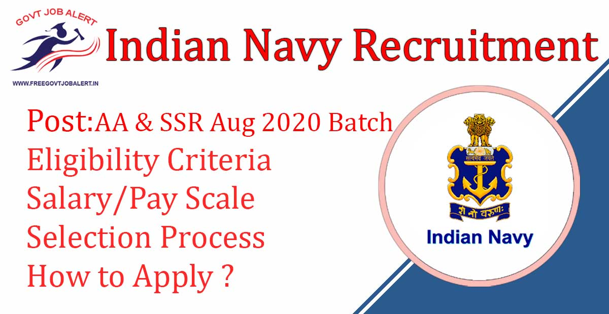
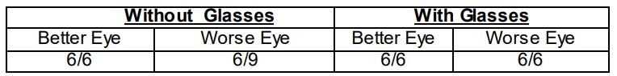

Indian Navy SSR & AA recruitment 2020: Indian Navy Recruitment 2019-20 has Released notification for fill up as sailors for artificer apprentice & Senior Secondary Recruits. Indian Navy has invited online application from Unmarried Male Candidates for enrolment as sailors for AA & SSR Vacancy respectively in the Aug 2020 batch. Indian Navy Sailor (AA & SSR) – Aug 2020 Online Form has Starting on 08-11-2019.

## **Indian Navy SSR & AA recruitment 2020**

<table style="border-collapse: collapse; width: 100%;"><tbody><tr><td style="width: 100%; background-color: #2a5a8e; text-align: center;" colspan="2"><strong>Indian Navy Recruitment 2019-20</strong></td></tr><tr><td style="width: 50%; text-align: center;">Job Recruitment Board</td><td style="width: 50%; text-align: center;">Indian Navy</td></tr><tr><td style="width: 50%; text-align: center;">Notification No.</td><td style="width: 50%; text-align: center;">Indian Navy AA &amp; SSR Aug 2020 Batch</td></tr><tr><td style="width: 50%; text-align: center;">Post</td><td style="width: 50%; text-align: center;">Artificer Apprentice (AA) &amp; Senior Secondary Recruits (SSR)</td></tr><tr><td style="width: 50%; text-align: center;">Vacancies</td><td style="width: 50%; text-align: center;">2700</td></tr><tr><td style="width: 50%; text-align: center;">Job Location</td><td style="width: 50%; text-align: center;">Across India</td></tr><tr><td style="width: 50%; text-align: center;">Job Type</td><td style="width: 50%; text-align: center;">Defence Jobs</td></tr><tr><td style="width: 50%; text-align: center;">Application Mode</td><td style="width: 50%; text-align: center;">Online</td></tr></tbody></table>

The Indian Navy Recruitment 2019-20 Notification Has Published on his official website. The Candidates should Have 12th Pass. Selected Candidates Will be posted in Anywhere on India. to know about Indian Navy SSR & AA Recruitment Details Like Education Qualification, Age Limits, Application Fee, Physical Eligibility, Visual Standards, Stipend, Selection Process, How to apply, etc given on this page below.

<table style="border-collapse: collapse;"><tbody><tr><td style="width: 50%; background-color: #2a5a8e; text-align: center;" colspan="2"><h3><strong>Important Dates</strong></h3></td></tr><tr><td style="width: 50%; text-align: center;">Starting Date of Online Application</td><td style="width: 50%; text-align: center;">08-11-2019</td></tr><tr><td style="width: 50%; text-align: center;">Last Date of Online Application</td><td style="width: 50%; text-align: center;">18-11-2019</td></tr><tr><td style="width: 50%; text-align: center;">Exam Date</td><td style="width: 50%; text-align: center;">February 2020</td></tr></tbody></table>

### **Indian Navy Vacancy Details**

- Artificer Apprentice (AA): 500 Vacancies
- Senior Secondary Recruits (SSR): 2200 Vacancies

### **Indian Navy SSR & AA Recruitment** **Eligibility Criteria**

**Education Qualification**

- **AA-** Qualified in 10+2 examination with 60% or more marks in aggregate with Maths & Physics and at least one of these subjects:- Chemistry/Biology/Computer Science from the Boards of School Education recognized by MHRD, Govt. of India.
- **SSR-** Qualified in 10+2 examination with Maths & Physics and at least one of these subjects: - Chemistry/Biology/Computer Science from the Boards of School Education recognized by MHRD, Govt. of India.

**Age Limits**

- Candidates should be born between 01 Aug 2000 to 31 Jul 2003 (Both dates inclusive)

**Physical Fitness Test (PFT)**

- Qualifying in Physical Fitness Test (PFT) is mandatory for selection.
- PFT will consist of 1.6 Km run to be completed in 7 minutes, 20 squats (Uthak Baithak) and 10 Push-ups.
- Candidates undergoing PFT will do so at their own risk.

**Medical Standards**

- Medical examination will be conducted by authorized military doctors as per medical standard prescribed in current regulations applicable to sailors on entry.
- Minimum height 157 cms. Weight and Chest should be proportionate. Minimum chest expansion of 5 cms. Details regarding minimum height standards for entry into the Indian Navy as Sailors, including applicable relaxations, can be accessed from the official recruitment website.

**Visual Standards (Distant vision only)**

\[caption id="attachment\_1630" align="aligncenter" width="764"\] Indian Navy SSR & AA recruitment Visual Standards (Distant vision only).\[/caption\]

### **Indian Navy SSR & AA recruitment** **Salary/Pay Scale**

- During the initial training period, a stipend of Rs. 14,600/- per month will be admissible.
- On successful completion of initial training, they will be placed in Level 3 of the Defence Pay Matrix (₹ 21,700- ₹69,100).
- In addition, they will be paid MSP @ ₹ 5200/- per month plus DA (as applicable) plus „X‟ Group pay {only for Artificer Apprentice (AA)} @ Rs. 6200/- per month plus DA (as applicable).

**Insurance Cover**

- Insurance cover (on contribution) of Rs. 50 lakhs for sailors is applicable.

**Promotion**

- Promotion prospects exist up to the rank of Master Chief Petty Officer-I, i.e. Level 8 of the Defence Pay Matrix (₹ 47,600- ₹ 1,51,100) plus MSP @ ₹ 5200/- per month plus DA (as applicable). Opportunities for promotion to commissioned officer also exist for those who perform well and qualify the prescribed examinations.

### **Selection Process For** **Indian Navy SSR & AA recruitment**

- **AA-** Selection of recruits is based on the all India order of merit on their performance in Computer-based Examination, subject to qualifying Physical Fitness Test (PFT) and fitness in Medical Examinations.
- **SSR-**Selection of recruits is based on State wise merit of their performance in Computer-based Examination, subject to qualifying Physical Fitness Test (PFT) and fitness in Medical Examinations.

### **Indian Navy SSR & AA** **Exam Pattern**

- One common examination will be conducted for AA and SSR entries.
- The question paper will be computer-based with a total of 100 questions, each carrying 01 marks.
- The question paper will be bilingual (Hindi & English) and objective type (multiple-choice).
- The question paper will comprise of four sections i.e. English, Science, Mathematics and General Knowledge.
- The standard of the question paper will be that of 10+2 Syllabus & sample papers for the examination are available on the website www.joinindiannavy.gov.in.
- The duration of the examination will be for one hour.
- The candidates are required to pass in all sections and in aggregate. The Navy reserves the right to determine the pass marks in each Section and in aggregate.

**Penalty for Wrong Answer**

- Candidates should note that there will be penalty (Negative Marking) for wrong answers marked by a candidate in the question paper.
- There are four alternatives for the answer to every question. For each question for which a wrong answer has been given by the candidate, one fourth (0.25) of the marks assigned to that question will be deducted as penalty.

### **Indian Navy SSR & AA Exam Syllabus PDF**

- Indian Navy AA Written Exam Syllabus [PDF](https://www.joinindiannavy.gov.in/files/syllabus/syallabus_AA_SSR.pdf)
- Indian Navy SSR Written Exam Syllabus [PDF](https://www.joinindiannavy.gov.in/files/syllabus/syallabus_AA_SSR.pdf)

### **Sample Question Papers For Indian Navy SSR & AA Exam**

- Indian Navy AA Written Exam Sample Question Paper [PDF Download](http://www.joinindiannavy.gov.in/files/files/AA.pdf)
- Indian Navy SSR Written Exam Sample Question Paper [PDF Download](http://www.joinindiannavy.gov.in/files/files/SSR.pdf) 

### **Indian Navy SSR & AA Post** **Application Fee** 

- General candidates: Rs. 215/-
- SC/ST Candidates: Nil
- Payment Mode: Online (net banking or by using Visa/ Master/ RuPay Credit/ Debit Card/ UPI)

### **How to Fill up** **Indian Navy SSR & AA Recruitment Online Form** 

1. Applicants Register yourself on www.joinindiannavy.gov.in with your e-mail ID, if not registered already. The Applicants must ensure that while filling their Application Form, they are providing their valid and active e-mail IDs and mobile numbers, which should not be changed till the selection procedure is over.
2. „Log–in‟ with the registered E-mail ID and Click on “Current Opportunities”.
3. Click on “Apply” (√) button.
4. Fill up the Form completely. Before clicking the „Submit‟ button make sure all the details are correct, all required documents are scanned in original & uploaded.
5. Online applications will be further scrutinized for eligibility and may be rejected at any stage if found ineligible in any respect.
6. Submit & Download Application For Future Use.
7. Done

### **Important Links For** **Indian Navy SSR & AA recruitment**

- Indian Navy Sailor (AA & SSR) – Aug 2020 Online Form: [Click Here](https://www.joinindiannavy.gov.in/en/account/login)
- Download Indian Navy Sailor (AA & SSR) – Aug 2020 Batch Notification PDF: [Click Here](https://freegovtjobalert.in/wp-content/uploads/2019/11/Indian-Navy-2700-Sailor-AA-SSR-–-Aug-2020-Batch-Notification.pdf)
- Indian Navy Official Website: [Click Here](https://www.joinindiannavy.gov.in/)

Candidates can visit www.joinindiannavy.gov.in to get more details about Upcoming Indian Navy recruitment 2019-20. To More Information About Upcoming Vacancy in Indian Navy jobs 2019-20, Indian Navy vacancy latest Updates, Admit Card, Syllabus, Result, Etc. It will be published on the official website. Also, visit Regularly our website [www.freegovtjobalert.in](https://freegovtjobalert.in) for getting the Latest job Updates.
