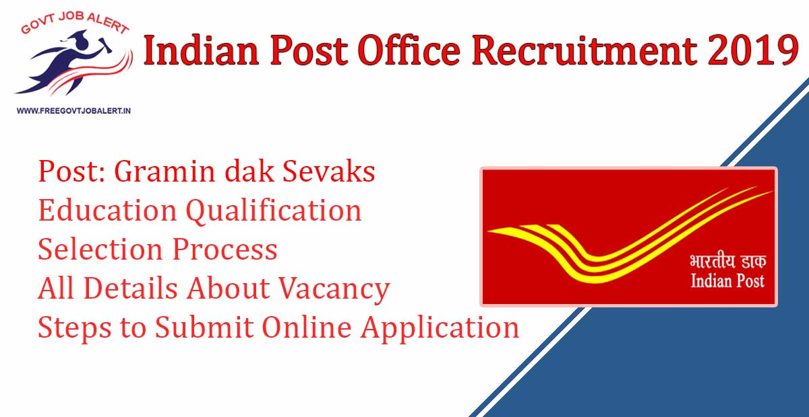

Indian Post Office Recruitment 2019: India Post Has Released Notification For the Recruitment of the post Gramin dak Sevaks. As Per India Post Office Recruitment Notification 2019 A Total of 5476 Vacancies Are There. Good opportunity For Those Candidates Who Are Finding Post Office Jobs 2019. Post Office Recruitment 2019 Online Registration has started on 15-10- 2019.

## India Post Office Recruitment 2019 For Gramin Dak Sevak Post

<table style="border-collapse: collapse; width: 100%;"><tbody><tr><td style="width: 50%; background-color: #2a5a8e; text-align: center;" colspan="2"><h3>Indian Post Office Recruitment 2019</h3></td></tr><tr><td style="width: 50%; text-align: center;">Job Recruitment Board</td><td style="width: 50%; text-align: center;">Indian Post Office</td></tr><tr><td style="width: 50%; text-align: center;">Post</td><td style="width: 50%; text-align: center;">Gramin Dak Sevak (GDS)</td></tr><tr><td style="width: 50%; text-align: center;">Vacancies</td><td style="width: 50%; text-align: center;">5476 Post</td></tr><tr><td style="width: 50%; text-align: center;">Job Location</td><td style="width: 50%; text-align: center;">Andhra Pradesh, Chhattisgarh, Telangana</td></tr><tr><td style="width: 50%; text-align: center;">Job Type</td><td style="width: 50%; text-align: center;">Post Office Jobs</td></tr><tr><td style="width: 50%; text-align: center;">Application Mode</td><td style="width: 50%; text-align: center;">Online</td></tr></tbody></table>

Recently, The Indian Post Office Recruitment Notification 2019 has Publish on his Official website. Indian Post Office Vacancy 2019 has post for the Gramin Dak Sevak into Different States of India. Above Describe Post of Gramin Dak Sevak is in the State of Andhra Pradesh(AP), Chhattisgarh(CH), Telangana. There a Total of 5476 Vacancies which is Divided into Three States, wherein Andhra Pradesh has 2707 Vacancies, Chhattisgarh has 1799 Vacancies, and Telangana has 970 Vacancies. Selected Applicants Will Be placed in Above Three States. to know About India Post GDS Recruitment Details Click on Below Links.

- [AP Postal Circle Recruitment 2019 | 2707 Gramin Dak Sevak Vacancies](https://freegovtjobalert.in/ap-postal-circle-recruitment-gds-gramin-dak-sevak/)
- [Chhattisgarh Postal Circle Recruitment 2019 | 1799 CG GDS Vacancy](https://freegovtjobalert.in/chhattisgarh-postal-circle-recruitment-gds/)
- [Telangana Postal Circle Recruitment 2019 | 970 TS Postal GDS Notification](https://freegovtjobalert.in/telangana-postal-circle-recruitment-gds/)

<table style="border-collapse: collapse;"><tbody><tr><td style="width: 50%; background-color: #2a5a8e; text-align: center;" colspan="2"><h3>Important Dates</h3></td></tr><tr><td style="width: 50%; text-align: center;">Starting date for Online Registration</td><td style="width: 50%; text-align: center;">15-10-2019</td></tr><tr><td style="width: 50%; text-align: center;">Last date for Online Registration</td><td style="width: 50%; text-align: center;">14-11-2019</td></tr><tr><td style="width: 50%; text-align: center;">Starting Date for Submission of online application</td><td style="width: 50%; text-align: center;">22-10-2019</td></tr><tr><td style="width: 50%; text-align: center;">Last Date for Submission of online application</td><td style="width: 50%; text-align: center;">21-11-2019</td></tr></tbody></table>

### Post Office Vacancy 2019 Details

<table style="border-collapse: collapse; width: 100%;"><tbody><tr><td style="width: 50%; text-align: center; background-color: #2a5a8e;"><strong>Name of the Postal Circle</strong></td><td style="width: 50%; text-align: center; background-color: #2a5a8e;"><strong>No of Vacancy</strong></td></tr><tr><td style="width: 50%; text-align: center;">AP Postal Circle</td><td style="width: 50%; text-align: center;">2707</td></tr><tr><td style="width: 50%; text-align: center;">Chhattisgarh Postal Circle</td><td style="width: 50%; text-align: center;">1799</td></tr><tr><td style="width: 50%; text-align: center;">Telangana Postal Circle</td><td style="width: 50%; text-align: center;">970</td></tr><tr><td style="width: 50%; text-align: center;"><strong>Total</strong></td><td style="width: 50%; text-align: center;"><strong>5476</strong></td></tr></tbody></table>

### Indian Post Office Recruitment Eligibility Criteria

Education Qualification:

- Candidates Must Have 10th Pass
- knowledge of Local Language

Age Limits:

- Minimum 18 Years
- Maximum 40 Years

Application Fee:

- General/OBC/EWS Candidates: Rs. 100/-
- SC/ST/PWD/Female Candidates: Nil
- Payment Mode: Online/Offline

### Indian Post Office Selection Process

- Selection will be made as per the automatic generated merit list as per the rules based on the candidate's online submitted applications.

### How to apply for India Post Office GDS Recruitment

1. Go to Indian Post Office Official Website: http://www.appost.in/
2. First Registration on India Post Office Site
3. Pay Application Fee(Online/Offline)
4. Click on Apply Online
5. Fill Indian Post Office Application Form
6. Upload Documents
7. Submit Application
8. Download & Save For Future Use.
9. Done

### Indian Post Office Recruitment Important Links

- Direct Apply Online For Indian Post Office Recruitment 2019: [Registration](https://indiapostgdsonline.in/phase4/fee.aspx) | Apply Online (22-10-2019)
- Indian Post Office Recruitment Notification 2019 PDF: [Click Here](http://www.appost.in/)
- Indian Post Office Official Website: [Click Here](http://www.appost.in/)
