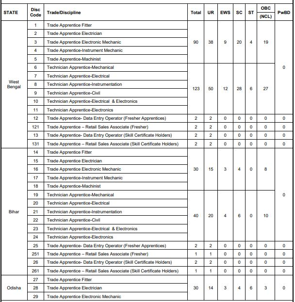
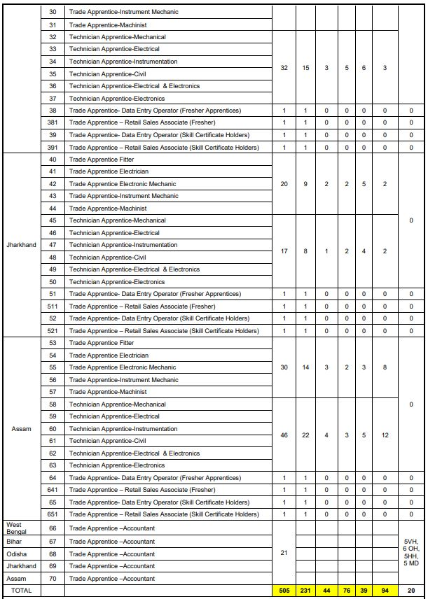
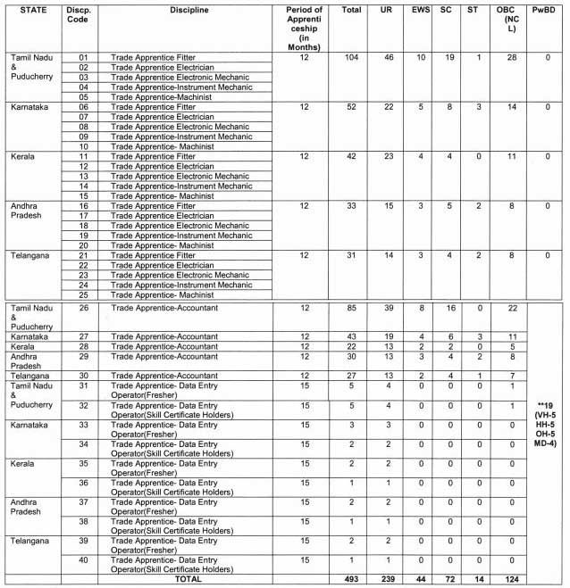
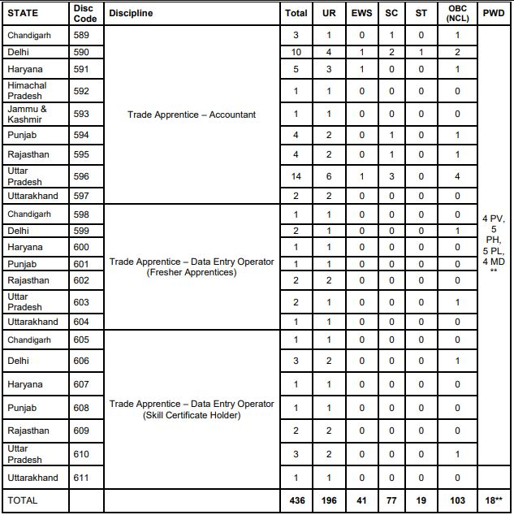

Indian Oil Corporation Limited, one of the largest commercial undertaking in India and a Fortune “Global 500” Company, as a measure of Skill Building Initiative for the Nation, proposes to engage Technical and Non-Technical Apprentices at its Locations in States of Eastern India (West Bengal, Bihar, Odisha, Jharkhand & Assam).

<table style="border-collapse: collapse; width: 100%;"><tbody><tr><td style="width: 100%; background-color: #2a5a8e; text-align: center;" colspan="2"><h3><strong>IOCL Apprentice Recruitment 2021</strong></h3></td></tr><tr style="height: 25px;"><td style="width: 50%; text-align: center; height: 25px;">Job Recruitment Board</td><td style="width: 50%; text-align: center;">Indian Oil Corporation Limited</td></tr><tr style="height: 25px;"><td style="width: 50%; text-align: center; height: 25px;">Notification No.</td><td style="width: 50%; text-align: center;">IOCL/MKTG/ER/APPR/2020-21/2</td></tr><tr style="height: 25px;"><td style="width: 50%; text-align: center; height: 25px;">Post</td><td style="width: 50%; text-align: center;">Technical and Non-Technical</td></tr><tr style="height: 25px;"><td style="width: 50%; text-align: center; height: 25px;">Vacancies</td><td style="width: 50%; text-align: center;">505</td></tr><tr style="height: 25px;"><td style="width: 50%; text-align: center; height: 25px;">Job Location</td><td style="width: 50%; text-align: center;">West Bengal, Bihar, Odisha, Jharkhand &amp; Assam</td></tr><tr style="height: 25px;"><td style="width: 50%; text-align: center; height: 25px;">Job Type</td><td style="width: 50%; text-align: center;">Apprentice Jobs</td></tr><tr style="height: 25px;"><td style="width: 50%; text-align: center; height: 25px;">Application Mode</td><td style="width: 50%; text-align: center;">Online</td></tr></tbody></table>

## **IOCL Technical and Non-Technical Apprentice Recruitment 2021**

Applications are invited from candidates meeting the following qualification & other parameters for engagement as Apprentices under the Apprentices Act, 1961/1973 (as amended from time to time) in the Trade/Disciplines mentioned below:

<table style="border-collapse: collapse; width: 100%; height: 113px;"><tbody><tr style="height: 25px;"><td style="width: 50%; height: 25px; background-color: #2a5a8e; text-align: center;" colspan="2"><h3><strong>Important Dates</strong></h3></td></tr><tr style="height: 24px;"><td style="width: 50%; text-align: center; height: 24px;">Starting Date</td><td style="width: 50%; height: 24px; text-align: center;">28-01-2021</td></tr><tr style="height: 24px;"><td style="width: 50%; text-align: center; height: 24px;">Last Date</td><td style="width: 50%; height: 24px; text-align: center;">26-02-2021 at 05:00 PM</td></tr><tr><td style="width: 50%; text-align: center;">Tentative Date for Download Admit Card</td><td style="width: 50%; text-align: center;">01-03-2021 at 05:00 PM</td></tr><tr><td style="width: 50%; text-align: center;">Tentative Date for Written Test</td><td style="width: 50%; text-align: center;">14-03-2021</td></tr><tr><td style="width: 50%; text-align: center;">Tentative Date for Upload of Provisionally Qualified Candidates for DV</td><td style="width: 50%; text-align: center;">25-03-2021 at 05:00 PM</td></tr></tbody></table>

### **IOCL Apprentice Vacancy 2021 Details**

**Period of Apprenticeship Training:**

**1.** 12 Months for all disciplines except **2.** Trade Apprentice – Data Entry Operator (Fresher Apprentices) will be having 15 Months of training **3.** Trade Apprentice – Retail Sales Associate (Fresher) will be having 14 Months Training

### **Eligibility Criteria**

Age Limits

- Minimum 18 Years
- Maximum 24 Years

Education Qualification

<table style="width: 98%; height: 286px;" border="1" cellspacing="0" cellpadding="0"><tbody><tr><td style="text-align: center;"><strong>Post</strong></td><td style="text-align: center;"><strong>Qualification</strong></td></tr><tr style="height: 22px;"><td style="height: 22px; text-align: center;" valign="top" width="308">Technician Apprentice (Mechanical)</td><td style="height: 22px; text-align: center;" valign="top" width="308">Diploma (Mechanical Engg)</td></tr><tr style="height: 22px;"><td style="height: 22px; text-align: center;" valign="top" width="308">Technician Apprentice(Electrical)</td><td style="height: 22px; text-align: center;" valign="top" width="308">Diploma (Electrical Engg)</td></tr><tr style="height: 22px;"><td style="height: 22px; text-align: center;" valign="top" width="308">Technician Apprentice (Instrumentation)</td><td style="height: 22px; text-align: center;" valign="top" width="308">Diploma (Instrumentation Engineering)</td></tr><tr style="height: 22px;"><td style="height: 22px; text-align: center;" valign="top" width="308">Technician Apprentice (Civil)</td><td style="height: 22px; text-align: center;" valign="top" width="308">Diploma (Civil Engg)</td></tr><tr style="height: 22px;"><td style="height: 22px; text-align: center;" valign="top" width="308">Technician Apprentice (Electrical &amp; Electronics)</td><td style="height: 22px; text-align: center;" valign="top" width="308">Diploma (Electrical &amp; Electronics Engineering)</td></tr><tr style="height: 22px;"><td style="height: 22px; text-align: center;" valign="top" width="308">Technician Apprentice (Electronics)</td><td style="height: 22px; text-align: center;" valign="top" width="308">Diploma (Electronics Engineering)</td></tr><tr style="height: 22px;"><td style="height: 22px; text-align: center;" valign="top" width="308">Trade Apprentice (Fitter)</td><td style="height: 22px; text-align: center;" valign="top" width="308">ITI (Fitter)</td></tr><tr style="height: 22px;"><td style="height: 22px; text-align: center;" valign="top" width="308">Trade Apprentice (Electrician)</td><td style="height: 22px; text-align: center;" valign="top" width="308">ITI (Electrician)</td></tr><tr style="height: 22px;"><td style="height: 22px; text-align: center;" valign="top" width="308">Trade Apprentice (Electronic Mechanic)</td><td style="height: 22px; text-align: center;" valign="top" width="308">ITI (Electronic Mechanic)</td></tr><tr style="height: 22px;"><td style="height: 22px; text-align: center;" valign="top" width="308">Trade Apprentice (Instrument Mechanic)</td><td style="height: 22px; text-align: center;" valign="top" width="308">ITI (Instrument Mechanic)</td></tr><tr style="height: 22px;"><td style="height: 22px; text-align: center;" valign="top" width="308">Trade Apprentice (Machinist)</td><td style="height: 22px; text-align: center;" valign="top" width="308">ITI (Machinist)</td></tr><tr style="height: 22px;"><td style="height: 22px; text-align: center;" valign="top" width="308">Trade Apprentice (Data Entry Operator)</td><td style="height: 44px; text-align: center;" rowspan="2" valign="top" width="308">
&nbsp;12th Class
</td></tr><tr style="height: 22px;"><td style="height: 22px; text-align: center;">Trade Apprentice (Retail Sales Associate)</td></tr></tbody></table>

### **Salary/Pay Scale**

- The rate of stipend payable to apprentices per month shall be as prescribed under the Apprentices Act, 1961/1973/Apprentices Rules 1992 (as amended) and Corporation’s guidelines.

### **Selection Process**

- Selection shall be on the basis of performance of the candidates on the basis of marks obtained by them in the Written Test (Duration 90 Minutes) and meeting notified eligibility criteria.

### **Exam Pattern & Syllabus**

The Written Test will comprise of 100 questions with Objective Type Multiple Choice Questions (MCQs) consisting of four option with one correct option. The questions would be in bilingual i.e. English & Hindi.

**The written test will assess the candidates on the following parameters: -**

**Trade Apprentice - Accountant:**

- Generic Aptitude including Quantitative Aptitude – 30 Marks
- Reasoning Abilities – 30 Marks
- Basic English language Skills – 40 Marks

**Trade Apprentice (Fitter / Electrician / Electronics Mechanic / Instrument Mechanic / Machinist) & Technician Apprentice** **(Mechanical / Electrical / Instrumentation / Civil / Electrical & Electronics / Electronics):**

- Technical Acumen in relevant discipline – 40 Marks
- Generic Aptitude including Quantitative Aptitude – 20 Marks
- Reasoning Abilities – 20 Marks
- Basic English Language Skills – 20 Marks

**Trade Apprentice (Data Entry Operator /Retail Sales Associate):**

- Generic Aptitude – 30 Marks
- Reasoning Abilities – 30 Marks
- Basic English – 40 Marks

\[su\_button url="https://t.me/free\_govtjobalert" target="self" style="default" background="#2a5a8e" color="#FFFFFF" size="3" wide="no" center="no" radius="auto" icon="" icon\_color="#FFFFFF" text\_shadow="none" desc="" download="" onclick="" rel="" title="" id="" class=""\]Get Daily Job Updates On Telegram\[/su\_button\]

### **How to Apply**

1. The Candidates Should Visit Official Website @ https://iocl.com/
2. Next, Find & Download the Advertisement and Check Eligibility Criteria Very Carefully.
3. Select the Desired Post from Online Application Section and Click on the Apply Now Button.
4. Fill Registration Along with Some Basic Information Like Name, Date of Birth, Caste, Etc. With Registered Mobile Number and Email.
5. Then Upload Photo, Sign & Photo Identity Card.
6. Last, Submit the Application Form & Download or Take a Printout For Future Use.

Note: The Applicants Are Requested to Read the Official Notification Carefully Before Apply.

<table style="border-collapse: collapse; width: 100%;"><tbody><tr><td style="width: 100%; background-color: #2a5a8e; text-align: center;" colspan="2"><h3>Important Links</h3></td></tr><tr><td style="width: 50%; text-align: center;">Apply Online</td><td style="width: 50%; text-align: center;"><a title="IOCL, Marketing Division" href="http://iocl.onlinereg.in/ioclsrreg1120/frmprimaryreg.aspx" target="_blank" rel="nofollow noopener noreferrer">Registration</a>|&nbsp;<a title="IOCL, Marketing Division" href="http://iocl.onlinereg.in/ioclsrreg1120/ApplicantLogin.aspx" target="_blank" rel="nofollow noopener noreferrer">Login</a></td></tr><tr style="height: 25px;"><td style="width: 50%; text-align: center; height: 25px;">Apprentice Registration</td><td style="width: 50%; text-align: center; height: 25px;"><a href="https://apprenticeshipindia.org/" target="_blank" rel="noopener">Click Here</a></td></tr><tr style="height: 25px;"><td style="width: 50%; text-align: center; height: 25px;">Official Notification</td><td style="width: 50%; text-align: center; height: 25px;"><a href="https://iocl.com/PeopleCareers/PDF/Advertisement-Apprentices%202021.pdf" target="_blank" rel="noopener">Download</a></td></tr><tr style="height: 25px;"><td style="width: 50%; text-align: center; height: 25px;">Official Website</td><td style="width: 50%; text-align: center; height: 25px;"><a href="https://iocl.com/" target="_blank" rel="noopener">Check Here</a></td></tr><tr style="height: 25px;"><td style="width: 50%; text-align: center; height: 25px;">Get Free Govt Job Alert On Mobile&nbsp;</td><td style="width: 50%; text-align: center; height: 25px;"><a href="https://t.me/free_govtjobalert" target="_blank" rel="noopener noreferrer">Telegram</a> | <a href="https://www.facebook.com/Free-Govt-Job-Alert-1091006524429779/" target="_blank" rel="noopener noreferrer">Facebook</a> | <a href="https://feedburner.google.com/fb/a/mailverify?uri=Freegovtjobalertin&amp;loc=en_US" target="_blank" rel="noopener noreferrer">Email</a></td></tr></tbody></table>

**Latest Jobs 2021:**

\[catlist name="job-notification" numberposts=20 orderby=modified date\]

<table style="border-collapse: collapse;"><tbody><tr><td style="width: 33.3333%; background-color: #2a5a8e; text-align: center;" colspan="3"><strong>Jobs by Qualification</strong></td></tr><tr><td style="width: 33.3333%; text-align: center;"><a href="https://freegovtjobalert.in/10th-pass-job/" target="_blank" rel="noopener noreferrer">10th Pass</a></td><td style="width: 33.3333%; text-align: center;"><a href="https://freegovtjobalert.in/12th-pass-job/" target="_blank" rel="noopener noreferrer">12th Pass</a></td><td style="width: 33.3333%; text-align: center;"><a href="https://freegovtjobalert.in/qualification/bcom/" target="_blank" rel="noopener noreferrer">B.Com</a></td></tr><tr><td style="width: 33.3333%; text-align: center;"><a href="https://freegovtjobalert.in/qualification/be/" target="_blank" rel="noopener noreferrer">B.E</a></td><td style="width: 33.3333%; text-align: center;"><a href="https://freegovtjobalert.in/qualification/b-sc/" target="_blank" rel="noopener noreferrer">B.Sc</a></td><td style="width: 33.3333%; text-align: center;"><a href="https://freegovtjobalert.in/qualification/btech/" target="_blank" rel="noopener noreferrer">B.Tech</a></td></tr><tr><td style="width: 33.3333%; text-align: center;"><a href="https://freegovtjobalert.in/qualification/ba/" target="_blank" rel="noopener noreferrer">B.A</a></td><td style="width: 33.3333%; text-align: center;"><a href="https://freegovtjobalert.in/qualification/bba/" target="_blank" rel="noopener noreferrer">BBA</a></td><td style="width: 33.3333%; text-align: center;"><a href="https://freegovtjobalert.in/qualification/bca/" target="_blank" rel="noopener noreferrer">BCA</a></td></tr><tr><td style="width: 33.3333%; text-align: center;"><a href="https://freegovtjobalert.in/qualification/b-ed/" target="_blank" rel="noopener noreferrer">B.Ed</a></td><td style="width: 33.3333%; text-align: center;"><a href="https://freegovtjobalert.in/qualification/b-pharma/" target="_blank" rel="noopener noreferrer">B.Pharma</a></td><td style="width: 33.3333%; text-align: center;"><a href="https://freegovtjobalert.in/qualification/charted-accountant/" target="_blank" rel="noopener noreferrer">C.A/ ICWA</a></td></tr><tr><td style="width: 33.3333%; text-align: center;"><a href="https://freegovtjobalert.in/qualification/iti/" target="_blank" rel="noopener noreferrer">I.T.I</a></td><td style="width: 33.3333%; text-align: center;"><a href="https://freegovtjobalert.in/qualification/llb/" target="_blank" rel="noopener noreferrer">LLB</a></td><td style="width: 33.3333%; text-align: center;"><a href="https://freegovtjobalert.in/qualification/ma/" target="_blank" rel="noopener noreferrer">M.A</a></td></tr><tr><td style="width: 33.3333%; text-align: center;"><a href="https://freegovtjobalert.in/qualification/mba-jobs/" target="_blank" rel="noopener noreferrer">M.B.A</a></td><td style="width: 33.3333%; text-align: center;"><a href="https://freegovtjobalert.in/qualification/mca/" target="_blank" rel="noopener noreferrer">M.C.A</a></td><td style="width: 33.3333%; text-align: center;"><a href="https://freegovtjobalert.in/qualification/m-com/" target="_blank" rel="noopener noreferrer">M.Com</a></td></tr><tr><td style="width: 33.3333%; text-align: center;"><a href="https://freegovtjobalert.in/qualification/md/" target="_blank" rel="noopener noreferrer">M.D</a></td><td style="width: 33.3333%; text-align: center;"><a href="https://freegovtjobalert.in/qualification/me/" target="_blank" rel="noopener noreferrer">M.E</a></td><td style="width: 33.3333%; text-align: center;"><a href="https://freegovtjobalert.in/qualification/m-sc/" target="_blank" rel="noopener noreferrer">M.Sc</a></td></tr><tr><td style="width: 33.3333%; text-align: center;"><a href="https://freegovtjobalert.in/qualification/m-tech/" target="_blank" rel="noopener noreferrer">M.Tech</a></td><td style="width: 33.3333%; text-align: center;"><a href="https://freegovtjobalert.in/qualification/m-ed/" target="_blank" rel="noopener noreferrer">M.Ed</a></td><td style="width: 33.3333%; text-align: center;"><a href="https://freegovtjobalert.in/qualification/msw/" target="_blank" rel="noopener noreferrer">MSW</a></td></tr><tr><td style="width: 33.3333%; text-align: center;"><a href="https://freegovtjobalert.in/qualification/m-phil/" target="_blank" rel="noopener noreferrer">M.Phil</a></td><td style="width: 33.3333%; text-align: center;"><a href="https://freegovtjobalert.in/qualification/mbbs/" target="_blank" rel="noopener noreferrer">MBBS</a></td><td style="width: 33.3333%; text-align: center;"><a href="https://freegovtjobalert.in/qualification/ph-d/" target="_blank" rel="noopener noreferrer">Ph.D</a></td></tr><tr><td style="width: 33.3333%; text-align: center;"><a href="https://freegovtjobalert.in/qualification/pgdca/" target="_blank" rel="noopener noreferrer">PGDCA</a></td><td style="width: 33.3333%; text-align: center;"><a href="https://freegovtjobalert.in/qualification/diploma/" target="_blank" rel="noopener noreferrer">Diploma</a></td><td style="width: 33.3333%; text-align: center;"><a href="https://freegovtjobalert.in/qualification/graduate/" target="_blank" rel="noopener noreferrer">Graduate</a></td></tr><tr><td style="width: 33.3333%; text-align: center;"><a href="https://freegovtjobalert.in/engineering-jobs/" target="_blank" rel="noopener noreferrer">Engineering Jobs</a></td><td style="width: 33.3333%; text-align: center;"><a href="https://freegovtjobalert.in/qualification/pg-diploma/" target="_blank" rel="noopener noreferrer">PG Diploma</a></td><td style="width: 33.3333%; text-align: center;"><a href="https://freegovtjobalert.in/qualification/post-graduation/" target="_blank" rel="noopener noreferrer">Post Graduation</a></td></tr></tbody></table>

**Quick Links:**

<table style="width: 100%; border-collapse: collapse;" border="2"><tbody><tr><td style="width: 33.3333%;"></td><td style="width: 33.3333%;"></td><td style="width: 33.3333%;"></td></tr><tr><td style="width: 33.3333%;"></td><td style="width: 33.3333%;"></td><td style="width: 33.3333%;"></td></tr></tbody></table>

* * *

### **IOCL 493 Apprentice at lOCL-Southern Region (MD) (Closed)**

Indian Oil Corporation Limited is Going to Fill up Trade Apprentices at its Locations in the States of South India (Tamil Nadu & Puducherry, Karnataka, Kerala, Andhra Pradesh & Telangana). IOCL Applications are invited from 12th Pass/ ITI Pass/ Graduate Candidates.

<table style="border-collapse: collapse; width: 100%;"><tbody><tr><td style="width: 100%; background-color: #2a5a8e; text-align: center;" colspan="2"><h3><strong>IOCL Recruitment 2020</strong></h3></td></tr><tr style="height: 25px;"><td style="width: 50%; text-align: center; height: 25px;">Job Recruitment Board</td><td style="width: 50%; text-align: center;">Indian Oil Corporation Limited</td></tr><tr style="height: 25px;"><td style="width: 50%; text-align: center; height: 25px;">Notification No.</td><td style="width: 50%; text-align: center;">IOCL/MKTG/SR/APPR/2020-21 Phase-I</td></tr><tr style="height: 25px;"><td style="width: 50%; text-align: center; height: 25px;">Post</td><td style="width: 50%; text-align: center;">Various</td></tr><tr style="height: 25px;"><td style="width: 50%; text-align: center; height: 25px;">Vacancies</td><td style="width: 50%; text-align: center;">493 + 50 (Corrigendum)</td></tr><tr style="height: 25px;"><td style="width: 50%; text-align: center; height: 25px;">Job Location</td><td style="width: 50%; text-align: center;">States of South India</td></tr><tr style="height: 25px;"><td style="width: 50%; text-align: center; height: 25px;">Job Type</td><td style="width: 50%; text-align: center;">Apprentice Jobs</td></tr><tr style="height: 25px;"><td style="width: 50%; text-align: center; height: 25px;">Application Mode</td><td style="width: 50%; text-align: center;">Online</td></tr></tbody></table>

## **IOCL Apprentice Recruitment 2020-21**

IOCL has Released a Recruitment Notification For Technical & Non-Technical Trade Apprentices. IOCL Apprentice Recruitment 2020 Notification & Indian Oil Southern Region Apply Online link is available Official Website @ www.iocl.com.

<table style="border-collapse: collapse; width: 100%; height: 113px;"><tbody><tr style="height: 25px;"><td style="width: 50%; height: 25px; background-color: #2a5a8e; text-align: center;" colspan="2"><h3><strong>Important Dates</strong></h3></td></tr><tr style="height: 24px;"><td style="width: 50%; text-align: center; height: 24px;">Starting Date</td><td style="width: 50%; height: 24px; text-align: center;">27-11-2020 at 10:00 AM</td></tr><tr style="height: 24px;"><td style="width: 50%; text-align: center; height: 24px;">Last Date</td><td style="width: 50%; height: 24px; text-align: center;">23-12-2020 at 05:00 PM (Extended)</td></tr><tr><td style="width: 50%; text-align: center;">Date of Written Exam</td><td style="width: 50%; text-align: center;">03-1-2021</td></tr></tbody></table>

### **IOCL Apprentice Vacancy 2020 Details**

### **Eligibility Criteria of IOCL Apprentice Jobs 2020**

Age Limits

- Minimum 18 Years
- Maximum 24 Years

Education Qualification

<table style="border-collapse: collapse; width: 100%;"><tbody><tr><td style="width: 50%; text-align: center;"><strong>Post Name</strong></td><td style="width: 50%; text-align: center;"><strong>Qualification</strong></td></tr><tr><td style="width: 50%; text-align: center;">Fitter</td><td style="width: 50%; text-align: center;">Matric with ITI (Fitter)</td></tr><tr><td style="width: 50%; text-align: center;">Electrician</td><td style="width: 50%; text-align: center;">Matric with ITI (Electrician)</td></tr><tr><td style="width: 50%; text-align: center;">Electronic Mechanic</td><td style="width: 50%; text-align: center;">Matric with ITI (Electronic Mechanic)</td></tr><tr><td style="width: 50%; text-align: center;">Instrument Mechanic</td><td style="width: 50%; text-align: center;">Matric with ITI (Instrument Mechanic)</td></tr><tr><td style="width: 50%; text-align: center;">Machinist</td><td style="width: 50%; text-align: center;">Matric with ITI (Machinist)</td></tr><tr><td style="width: 50%; text-align: center;">Accountant</td><td style="width: 50%; text-align: center;">Graduation in Any Discipline</td></tr><tr><td style="width: 50%; text-align: center;">Data Entry Operator (Fresher)</td><td style="width: 50%; text-align: center;">12th Class</td></tr><tr><td style="width: 50%; text-align: center;">Data Entry Operator (Skilled Certificate Holders)</td><td style="width: 50%; text-align: center;">12th Class with Relevant Experience</td></tr></tbody></table>

### **Selection Process** 

- Written Test
- Interview

The candidates will have to qualify successfully through each stage of the selection process i.e. Written Test (Minimum 40%, relaxable by 5% for candidates from SC/ST/PwBD categories against reserved positions) and Pre-engagement medical fitness for being adjudged suitable for engagement.

### **IOCL Apprentice Syllabus 2021**

The Written Test will be conducted with Objective Type Multiple Choice Questions(MCQ's) consisting of four options with one correct option.

**Trade Apprentice (Fitter/Electrician/Electronic Mechanic/Instrument Mechanic/Machinist):**

- Technical Acumen in relevant discipline
- Generic Aptitude including Quantitative Aptitude
- Reasoning Abilities
- Basic English Language Skills

**Trade Apprentice (Accountant):**

- Generic Aptitude including Quantitative Aptitude
- Reasoning Abilities
- Basic English Language Skills

**Trade Apprentice (Data Entry Operator):**

- Generic Aptitude and Reasoning
- General English
- Numerical Aptitude
- General Knowledge/Awareness

\[su\_button url="https://t.me/free\_govtjobalert" target="self" style="default" background="#2a5a8e" color="#FFFFFF" size="3" wide="no" center="no" radius="auto" icon="" icon\_color="#FFFFFF" text\_shadow="none" desc="" download="" onclick="" rel="" title="" id="" class=""\]Get Daily Job Updates On Telegram\[/su\_button\]

### **How to Apply Online For IOCL Apprentice Recruitment 2020**

1. First, Candidates are advised to register as a Trade Apprentice online: [Here](https://apprenticeshipindia.org/candidate-registration)
2. Then, The Candidates Should Visit Official Website @ https://iocl.com/ (Careers-> Latest Job Opening)
3. Next, Find & Download Advertisement and Check Eligibility Criteria Very Carefully.
4. Select the Desired Post from Online Application Section and Click on the Apply Now Button.
5. Fill Registration Along with Some Basic Information Like Name, Date of Birth, Caste, Etc. With Registered Mobile Number and Email.
6. Then Upload Photo, Sign & Photo Identity Card.
7. Last, Submit the Application Form & Download or Take a Printout For Future Use.

Note: The Applicants Are Requested to Read the Official Notification Carefully Before Apply.

<table style="border-collapse: collapse; width: 100%;"><tbody><tr><td style="width: 100%; background-color: #2a5a8e; text-align: center;" colspan="2"><h3>Important Links</h3></td></tr><tr style="height: 25px;"><td style="width: 50%; text-align: center; height: 25px;">Apply Online&nbsp;</td><td style="width: 50%; text-align: center; height: 25px;"><a title="IOCL, Marketing Division" href="http://iocl.onlinereg.in/ioclsrreg1120/frmprimaryreg.aspx" target="_blank" rel="nofollow noopener noreferrer">Registration</a>|&nbsp;<a title="IOCL, Marketing Division" href="http://iocl.onlinereg.in/ioclsrreg1120/ApplicantLogin.aspx" target="_blank" rel="nofollow noopener noreferrer">Login</a></td></tr><tr><td style="width: 50%; text-align: center;">Corrigendum</td><td style="width: 50%; text-align: center;"><a href="https://iocl.com/PeopleCareers/PDF/8.0_Corrigendum_Addition_of_2_Disciplines.pdf" target="_blank" rel="noopener">Check Here</a></td></tr><tr style="height: 25px;"><td style="width: 50%; text-align: center; height: 25px;">Official Notification</td><td style="width: 50%; text-align: center; height: 25px;"><a href="http://iocl.onlinereg.in/ioclsrreg1120/Images/Advertisement_2020.pdf" target="_blank" rel="noopener noreferrer">Download</a></td></tr><tr style="height: 25px;"><td style="width: 50%; text-align: center; height: 25px;">Official Website</td><td style="width: 50%; text-align: center; height: 25px;"><a href="https://iocl.com/" target="_blank" rel="noopener noreferrer">Check Here</a></td></tr><tr style="height: 25px;"><td style="width: 50%; text-align: center; height: 25px;">Get Free Govt Job Alert On Mobile&nbsp;</td><td style="width: 50%; text-align: center; height: 25px;"><a href="https://t.me/free_govtjobalert" target="_blank" rel="noopener noreferrer">Telegram</a> | <a href="https://www.facebook.com/Free-Govt-Job-Alert-1091006524429779/" target="_blank" rel="noopener noreferrer">Facebook</a> | <a href="https://feedburner.google.com/fb/a/mailverify?uri=Freegovtjobalertin&amp;loc=en_US" target="_blank" rel="noopener noreferrer">Email</a></td></tr></tbody></table>

 

* * *

Indian Oil Corporation Limited Has Published Recruitment Notification For Apprentice Jobs. The Recruit of **Technical and Non-Technical Apprentices** Various Posts at its Locations in States & Union Territory of North India (Chandigarh, Haryana, Himachal Pradesh, Jammu & Kashmir, Delhi, Punjab, Rajasthan, Uttarakhand & Uttar Pradesh).

<table style="border-collapse: collapse; width: 100%;"><tbody><tr><td style="width: 100%; background-color: #2a5a8e; text-align: center;" colspan="2"><h3><strong>IOCL Recruitment 2020</strong></h3></td></tr><tr style="height: 25px;"><td style="width: 50%; text-align: center; height: 25px;">Job Recruitment Board</td><td style="width: 50%; text-align: center;">Indian Oil Corporation Limited</td></tr><tr style="height: 25px;"><td style="width: 50%; text-align: center; height: 25px;">Notification No.</td><td style="width: 50%; text-align: center;">IOCL/MKTG/NR/APPR/2020-21/1</td></tr><tr style="height: 25px;"><td style="width: 50%; text-align: center; height: 25px;">Post</td><td style="width: 50%; text-align: center;">Technical and Non-Technical Apprentices</td></tr><tr style="height: 25px;"><td style="width: 50%; text-align: center; height: 25px;">Vacancies</td><td style="width: 50%; text-align: center;">436</td></tr><tr style="height: 25px;"><td style="width: 50%; text-align: center; height: 25px;">Job Location</td><td style="width: 50%; text-align: center;">Various States</td></tr><tr style="height: 25px;"><td style="width: 50%; text-align: center; height: 25px;">Job Type</td><td style="width: 50%; text-align: center;">Apprentice Jobs</td></tr><tr style="height: 25px;"><td style="width: 50%; text-align: center; height: 25px;">Application Mode</td><td style="width: 50%; text-align: center;">Online</td></tr></tbody></table>

## **IOCL Apprentice Recruitment 2020-21**

IOCL Invites Online Application From Mechanical, Electrical, Civil, Graduate, 12th Pass Candidates. The IOCL Apprentice form has to be submitted through online mode only. Selected Candidates Will be Posted in the Various States. More Detail Are Given Below on this Page.

<table style="border-collapse: collapse; width: 100%; height: 113px;"><tbody><tr style="height: 25px;"><td style="width: 50%; height: 25px; background-color: #2a5a8e; text-align: center;" colspan="2"><h3><strong>Important Dates</strong></h3></td></tr><tr style="height: 24px;"><td style="width: 50%; text-align: center; height: 24px;">Starting Date</td><td style="width: 50%; height: 24px; text-align: center;">23-11-2020</td></tr><tr style="height: 24px;"><td style="width: 50%; text-align: center; height: 24px;">Last Date</td><td style="width: 50%; height: 24px; text-align: center;">19-12-2020</td></tr><tr><td style="width: 50%; text-align: center;">Tentative Date For Download Admit Card</td><td style="width: 50%; text-align: center;">22-12-2020</td></tr><tr><td style="width: 50%; text-align: center;">Tentative Date of Written Test</td><td style="width: 50%; text-align: center;">03-01-2021</td></tr></tbody></table>

### **IOCL Apprentice Vacancy 2020 Details**

**Period of Apprenticeship Training:**

- 12 Months for all disciplines except
- Trade Apprentice – Data Entry Operator (Fresher Apprentices) & Trade Apprentice – Data Entry Operator (Skilled Certificate Holders) will be having 15 months of training.

### **Eligibility Criteria of IOCL Apprentice Recruitment 2020-21**

Age Limits

- Minimum 18 Years
- Maximum 24 Years
- Relaxation in upper age up to 5 years for SC/ST candidates and 3 years for OBC (NCL) candidates considered against reserved positions will be allowed

Education Qualification

<table style="border-collapse: collapse; width: 100%;"><tbody><tr><td style="width: 50%; text-align: center; background-color: #2a5a8e;"><strong>Post Code</strong></td><td style="width: 50%; text-align: center; background-color: #2a5a8e;"><strong>Qualification&nbsp;</strong></td></tr><tr><td style="width: 50%; text-align: center;">For Discipline Code - 501/507/513/519/525/531/537/543</td><td style="width: 50%; text-align: center;">Technician Apprentice(Mechanical)- 3 years Diploma in Mechanical Engineering from recognized Institute/University with minimum 50 % marks in aggregate for General &amp; OBC candidates &amp; 45% in case of SC/ST candidates against reserved positions</td></tr><tr><td style="width: 50%; text-align: center;">For Discipline Code – 502/508/514/520/526/532/538/544</td><td style="width: 50%; text-align: center;">Technician Apprentice(Electrical) – 3 years Diploma in Electrical Engineering from recognized Institute/University with minimum 50 % marks in aggregate for General &amp; OBC candidates &amp; 45% in case of SC/ST candidates against reserved positions.</td></tr><tr><td style="width: 50%; text-align: center;">. For Discipline Code- 503/509/515/521/527/533/539/545</td><td style="width: 50%; text-align: center;">Technician Apprentice(Instrumentation) – 3 years Diploma in Instrumentation Engineering from recognized Institute/University with minimum 50 % marks in aggregate for General &amp; OBC candidates &amp; 45% in case of SC/ST candidates against reserved positions.</td></tr><tr><td style="width: 50%; text-align: center;">For Discipline Code- 504/510/516/522/528/534/540/546</td><td style="width: 50%; text-align: center;">Technician Apprentice(Civil) – 3 years Diploma in Civil Engineering from recognized Institute/University with minimum 50 % marks in aggregate for General &amp; OBC candidates &amp; 45% in case of SC/ST candidates against reserved positions</td></tr><tr><td style="width: 50%; text-align: center;">For Discipline Code- 505/511/517/523/529/535/541/547</td><td style="width: 50%; text-align: center;">Technician Apprentice(Electrical &amp; Electronics) – 3 years Diploma in Electrical &amp; Electronics Engineering from recognized Institute/University with minimum 50 % marks in aggregate for General &amp; OBC candidates &amp; 45% in case of SC/ST candidates against reserved positions.</td></tr><tr><td style="width: 50%; text-align: center;">For Discipline Code- 506/512/518/524/530/536/542/548</td><td style="width: 50%; text-align: center;">Technician Apprentice(Electronics) – 3 years Diploma in Electronics Engineering from recognized Institute/University with minimum 50 % marks in aggregate for General &amp; OBC candidates &amp; 45% in case of SC/ST candidates against reserved positions.</td></tr><tr><td style="width: 50%; text-align: center;">For Discipline Code- 549/554/559/564/569/574/579/584</td><td style="width: 50%; text-align: center;">Trade Apprentice (Fitter) – Regular Full-time ITI (Fitter) recognized by NCVT / SCVT</td></tr><tr><td style="width: 50%; text-align: center;">For Discipline Code- 550/555/560/565/570/575/580/585</td><td style="width: 50%; text-align: center;">Trade Apprentice (Electrician) – Regular Full time ITI (Electrician) recognized by NCVT / SCVT.</td></tr><tr><td style="width: 50%; text-align: center;">For Discipline Code- 551/556/561/566/571/576/581/586</td><td style="width: 50%; text-align: center;">Trade Apprentice (Electronics Mechanic) – Regular Full time ITI (Electronics Mechanic) recognized by NCVT / SCVT</td></tr><tr><td style="width: 50%; text-align: center;">For Discipline Code- 552/557/562/567/572/577/582/587</td><td style="width: 50%; text-align: center;">Trade Apprentice (Instrument Mechanic) – Regular Full time ITI (Instrument Mechanic) recognized by NCVT / SCVT.</td></tr><tr><td style="width: 50%; text-align: center;">For Discipline Code- 553/558/563/568/573/578/583/588</td><td style="width: 50%; text-align: center;">Trade Apprentice (Machinist) – Regular Full-time ITI (Machinist) recognized by NCVT / SCVT.</td></tr><tr><td style="width: 50%; text-align: center;">For Discipline Code – 589/590/591/592/593/594/595/596/597</td><td style="width: 50%; text-align: center;">Trade Apprentice-Accountant: Regular Full Time Graduate in any discipline with minimum 50% marks in aggregate for General &amp; OBC candidates and 45% in case of SC/ST/PwBD candidates for reserved positions from a recognized Institute/University.</td></tr><tr><td style="width: 50%; text-align: center;">For Discipline Code – 598/599/600/601/602/603/604</td><td style="width: 50%; text-align: center;">Trade Apprentice – Data Entry Operator (Fresher Apprentices): Class XII or it's equivalent with minimum 50% marks in aggregate for General &amp; OBC candidates and 45% in case of SC/ST/PwBD candidates for reserved positions from a recognized Board/Institute.</td></tr><tr><td style="width: 50%; text-align: center;">For Discipline Code – 605/606/607/608/609/610/611</td><td style="width: 50%; text-align: center;">Trade Apprentice – Data Entry Operator (Skilled Certificate Holders): Class XII or its equivalent with Skill Certificate holder in ‘Domestic Data Entry Operator’ with minimum 50% marks in aggregate for General &amp; OBC candidates and 45% in case of SC/ST/PwBD candidates for reserved positions from a recognized Board / Institute.</td></tr><tr><td style="width: 50%; text-align: center;">For all discipline codes</td><td style="width: 50%; text-align: center;">The prescribed qualification for Class XII / Graduate / Diploma holders should be from a recognized Board/ University/Institute as a regular full-time course in the relevant trade/discipline with minimum 50% marks (45% for SC/ST and PwBD category candidates for the seats reserved for them) in aggregate.</td></tr></tbody></table>

### **Salary/Pay Scale**

- The rate of stipend payable to apprentices per month shall be as prescribed under the Apprentices Act, 1961/1973 / Apprentices Rules 1992 (as amended) and Corporation’s guidelines.
- **Insurance Coverage:** Apprentices shall be covered under suitable Accident Insurance Coverage.

**Company Accommodation/HRA:** No HRA or Company’s accommodation shall be provided to Apprentices.

**Leave & Holidays:**

The following leave & holidays shall be admissible to Apprentices:

- General Leave- 32 days @ 8 days per quarter during the period of Apprenticeship including on medical grounds.
- Casual Leave- 12 days per calendar year (pro-rata)
- An Apprentice shall avail such Holidays as are observed in the establishment in which he/she is undergoing Apprenticeship training.
- Leave not availed shall lapse at the end of the apprenticeship period.

### **Selection Process** 

- Written Exam
- Document Verification

### **Exam Pattern**

- Selection shall be on the basis of performance of the candidates on the basis of marks obtained by them in the Written Test (Duration 90 Minutes) and meeting notified eligibility criteria.
- The Written Test will comprise of 100 questions with Objective Type Multiple Choice Questions (MCQs) consisting of four option with one correct option. The questions would be in bilingual i.e. English & Hindi.

The written test will assess the candidates on the following parameters:

<table style="border-collapse: collapse; width: 100%;"><tbody><tr><td style="width: 41.7317%; text-align: center; background-color: #2a5a8e;"><strong>Trade&nbsp;</strong></td><td style="width: 58.2683%; text-align: center; background-color: #2a5a8e;"><strong>Syllabus &amp; Marks</strong></td></tr><tr><td style="width: 41.7317%; text-align: center;">Trade Apprentice Accountant</td><td style="width: 58.2683%; text-align: center;">Generic Aptitude including Quantitative Aptitude – 30 Marks Reasoning Abilities – 30 Marks Basic English Language Skills – 40 Marks</td></tr><tr><td style="width: 41.7317%; text-align: center;">Trade Apprentice -Data Entry Operator (Fresher &amp; Skill Certificate Holder)</td><td style="width: 58.2683%; text-align: center;">General Aptitude and Reasoning Abilities – 25 Marks Basic English Language Skills – 25 Marks Quantitative Aptitude – 25 Marks General Awareness – 25 Marks</td></tr><tr><td style="width: 41.7317%; text-align: center;">Trade Apprentice (Fitter/ Electrician/ Electronics Mechanic/ Instrument Mechanic/ Machinist) &amp; Technician Apprentice (Mechanical/ Electrical/ Instrumentation/ Civil/Electrical &amp; Electronics/ Electronics)</td><td style="width: 58.2683%; text-align: center;">Technical Acumen in relevant discipline – 40 Marks Generic Aptitude including Quantitative Aptitude – 20 Marks Reasoning Abilities – 20 Marks Basic English Language Skills – 20 Marks</td></tr></tbody></table>

\[su\_button url="https://t.me/free\_govtjobalert" target="self" style="default" background="#2a5a8e" color="#FFFFFF" size="3" wide="no" center="no" radius="auto" icon="" icon\_color="#FFFFFF" text\_shadow="none" desc="" download="" onclick="" rel="" title="" id="" class=""\]Get Daily Job Updates On Telegram\[/su\_button\]

### **How to Apply Online For IOCL Apprentice Recruitment 2020-21**

1. The Candidates Should Visit Official Website @ https://iocl.com/
2. Next, Find & Download Advertisement and Check Eligibility Criteria Very Carefully.
3. Select the Desired Post from Online Application Section and Click on the Apply Now Button.
4. Fill Registration Along with Some Basic Information Like Name, Date of Birth, Caste, Etc. With Registered Mobile Number and Email.
5. Then Upload Photo, Sign & Photo Identity Card.
6. Last, Submit the Application Form & Download or Take a Printout For Future Use.

Note: The Applicants Are Requested to Read the Official Notification Carefully Before Apply.

<table style="border-collapse: collapse; width: 100%;"><tbody><tr><td style="width: 100%; background-color: #2a5a8e; text-align: center;" colspan="2"><h3>Important Links</h3></td></tr><tr style="height: 25px;"><td style="width: 50%; text-align: center; height: 25px;">Apply Online&nbsp;</td><td style="width: 50%; text-align: center; height: 25px;"><a href="https://www.ioclrecruit.com/Candidate/Index.aspx" target="_blank" rel="noopener noreferrer">Click Here</a></td></tr><tr style="height: 25px;"><td style="width: 50%; text-align: center; height: 25px;">Official Notification</td><td style="width: 50%; text-align: center; height: 25px;"><a href="https://iocl.com/PeopleCareers/PDF/final_website_notification_for_apprenticeship_recruitment.pdf" target="_blank" rel="noopener noreferrer">Download</a></td></tr><tr style="height: 25px;"><td style="width: 50%; text-align: center; height: 25px;">Official Website</td><td style="width: 50%; text-align: center; height: 25px;"><a href="https://iocl.com/" target="_blank" rel="noopener noreferrer">Check Here</a></td></tr><tr style="height: 25px;"><td style="width: 50%; text-align: center; height: 25px;">Get Free Govt Job Alert On Mobile&nbsp;</td><td style="width: 50%; text-align: center; height: 25px;"><a href="https://t.me/free_govtjobalert" target="_blank" rel="noopener noreferrer">Telegram</a> | <a href="https://www.facebook.com/Free-Govt-Job-Alert-1091006524429779/" target="_blank" rel="noopener noreferrer">Facebook</a> | <a href="https://feedburner.google.com/fb/a/mailverify?uri=Freegovtjobalertin&amp;loc=en_US" target="_blank" rel="noopener noreferrer">Email</a></td></tr></tbody></table>

**Important Documents:** 

Candidates shortlisted on the basis of their position in the merit list and subject to the number of seats in respective Trades/ Disciplines shall be called for document verification.

The following original documents along with a self-attested copy should be furnished at the time of Document Verification:

- 10th Pass/Matriculation certificate issued by the concerned education board as proof of date of birth. No other document will be accepted for verification of date of birth.
- SC/ST/OBC(NCL)/Disability/EWS-Income & Asset Certificate by reserved category candidates in the prescribed format issued by Competent Authority.
- Class XII mark sheet issued by the concerned education board/ Semester-wise/ year-wise mark sheets of ITI (Fitter) issued by NCVT or SCVT/Graduation/Diploma Engineering
- Class XII/Final ITI (Fitter) issued by NCVT or SCVT/Graduation/Diploma Certificate issued by respective Board/ Authority.
- Conversion certificate from CGPA/OGPA/Letter Grade to the percentage of marks, if applicable, from concerned University/Institute.
- Certificate mentioning the date of publication of result from the Principal of the Polytechnic/ School/College/ Institute from where the candidate pursued his/her Class XII/ITI (Fitter)/ Graduation/ Diploma course, if applicable.
- For Candidates applying against Code 605/606/607/608/609/610/611 with Skill Certificate in ‘Domestic Data Entry Operator’ - Skill certificate issued by an awarding body recognized under National Skill Qualifications Framework or any other authority recognized by the Central Govt. in this regard.
- Any other Certificate, as specified.

**Latest Jobs:**

\[catlist name="job-notification" numberposts=20 orderby=modified date\]

<table style="border-collapse: collapse;"><tbody><tr><td style="width: 33.3333%; background-color: #2a5a8e; text-align: center;" colspan="3"><strong>Jobs by Qualification</strong></td></tr><tr><td style="width: 33.3333%; text-align: center;"><a href="https://freegovtjobalert.in/10th-pass-job/" target="_blank" rel="noopener noreferrer">10th Pass</a></td><td style="width: 33.3333%; text-align: center;"><a href="https://freegovtjobalert.in/12th-pass-job/" target="_blank" rel="noopener noreferrer">12th Pass</a></td><td style="width: 33.3333%; text-align: center;"><a href="https://freegovtjobalert.in/qualification/bcom/" target="_blank" rel="noopener noreferrer">B.Com</a></td></tr><tr><td style="width: 33.3333%; text-align: center;"><a href="https://freegovtjobalert.in/qualification/be/" target="_blank" rel="noopener noreferrer">B.E</a></td><td style="width: 33.3333%; text-align: center;"><a href="https://freegovtjobalert.in/qualification/b-sc/" target="_blank" rel="noopener noreferrer">B.Sc</a></td><td style="width: 33.3333%; text-align: center;"><a href="https://freegovtjobalert.in/qualification/btech/" target="_blank" rel="noopener noreferrer">B.Tech</a></td></tr><tr><td style="width: 33.3333%; text-align: center;"><a href="https://freegovtjobalert.in/qualification/ba/" target="_blank" rel="noopener noreferrer">B.A</a></td><td style="width: 33.3333%; text-align: center;"><a href="https://freegovtjobalert.in/qualification/bba/" target="_blank" rel="noopener noreferrer">BBA</a></td><td style="width: 33.3333%; text-align: center;"><a href="https://freegovtjobalert.in/qualification/bca/" target="_blank" rel="noopener noreferrer">BCA</a></td></tr><tr><td style="width: 33.3333%; text-align: center;"><a href="https://freegovtjobalert.in/qualification/b-ed/" target="_blank" rel="noopener noreferrer">B.Ed</a></td><td style="width: 33.3333%; text-align: center;"><a href="https://freegovtjobalert.in/qualification/b-pharma/" target="_blank" rel="noopener noreferrer">B.Pharma</a></td><td style="width: 33.3333%; text-align: center;"><a href="https://freegovtjobalert.in/qualification/charted-accountant/" target="_blank" rel="noopener noreferrer">C.A/ ICWA</a></td></tr><tr><td style="width: 33.3333%; text-align: center;"><a href="https://freegovtjobalert.in/qualification/iti/" target="_blank" rel="noopener noreferrer">I.T.I</a></td><td style="width: 33.3333%; text-align: center;"><a href="https://freegovtjobalert.in/qualification/llb/" target="_blank" rel="noopener noreferrer">LLB</a></td><td style="width: 33.3333%; text-align: center;"><a href="https://freegovtjobalert.in/qualification/ma/" target="_blank" rel="noopener noreferrer">M.A</a></td></tr><tr><td style="width: 33.3333%; text-align: center;"><a href="https://freegovtjobalert.in/qualification/mba-jobs/" target="_blank" rel="noopener noreferrer">M.B.A</a></td><td style="width: 33.3333%; text-align: center;"><a href="https://freegovtjobalert.in/qualification/mca/" target="_blank" rel="noopener noreferrer">M.C.A</a></td><td style="width: 33.3333%; text-align: center;"><a href="https://freegovtjobalert.in/qualification/m-com/" target="_blank" rel="noopener noreferrer">M.Com</a></td></tr><tr><td style="width: 33.3333%; text-align: center;"><a href="https://freegovtjobalert.in/qualification/md/" target="_blank" rel="noopener noreferrer">M.D</a></td><td style="width: 33.3333%; text-align: center;"><a href="https://freegovtjobalert.in/qualification/me/" target="_blank" rel="noopener noreferrer">M.E</a></td><td style="width: 33.3333%; text-align: center;"><a href="https://freegovtjobalert.in/qualification/m-sc/" target="_blank" rel="noopener noreferrer">M.Sc</a></td></tr><tr><td style="width: 33.3333%; text-align: center;"><a href="https://freegovtjobalert.in/qualification/m-tech/" target="_blank" rel="noopener noreferrer">M.Tech</a></td><td style="width: 33.3333%; text-align: center;"><a href="https://freegovtjobalert.in/qualification/m-ed/" target="_blank" rel="noopener noreferrer">M.Ed</a></td><td style="width: 33.3333%; text-align: center;"><a href="https://freegovtjobalert.in/qualification/msw/" target="_blank" rel="noopener noreferrer">MSW</a></td></tr><tr><td style="width: 33.3333%; text-align: center;"><a href="https://freegovtjobalert.in/qualification/m-phil/" target="_blank" rel="noopener noreferrer">M.Phil</a></td><td style="width: 33.3333%; text-align: center;"><a href="https://freegovtjobalert.in/qualification/mbbs/" target="_blank" rel="noopener noreferrer">MBBS</a></td><td style="width: 33.3333%; text-align: center;"><a href="https://freegovtjobalert.in/qualification/ph-d/" target="_blank" rel="noopener noreferrer">Ph.D</a></td></tr><tr><td style="width: 33.3333%; text-align: center;"><a href="https://freegovtjobalert.in/qualification/pgdca/" target="_blank" rel="noopener noreferrer">PGDCA</a></td><td style="width: 33.3333%; text-align: center;"><a href="https://freegovtjobalert.in/qualification/diploma/" target="_blank" rel="noopener noreferrer">Diploma</a></td><td style="width: 33.3333%; text-align: center;"><a href="https://freegovtjobalert.in/qualification/graduate/" target="_blank" rel="noopener noreferrer">Graduate</a></td></tr><tr><td style="width: 33.3333%; text-align: center;"><a href="https://freegovtjobalert.in/engineering-jobs/" target="_blank" rel="noopener noreferrer">Engineering Jobs</a></td><td style="width: 33.3333%; text-align: center;"><a href="https://freegovtjobalert.in/qualification/pg-diploma/" target="_blank" rel="noopener noreferrer">PG Diploma</a></td><td style="width: 33.3333%; text-align: center;"><a href="https://freegovtjobalert.in/qualification/post-graduation/" target="_blank" rel="noopener noreferrer">Post Graduation</a></td></tr></tbody></table>
