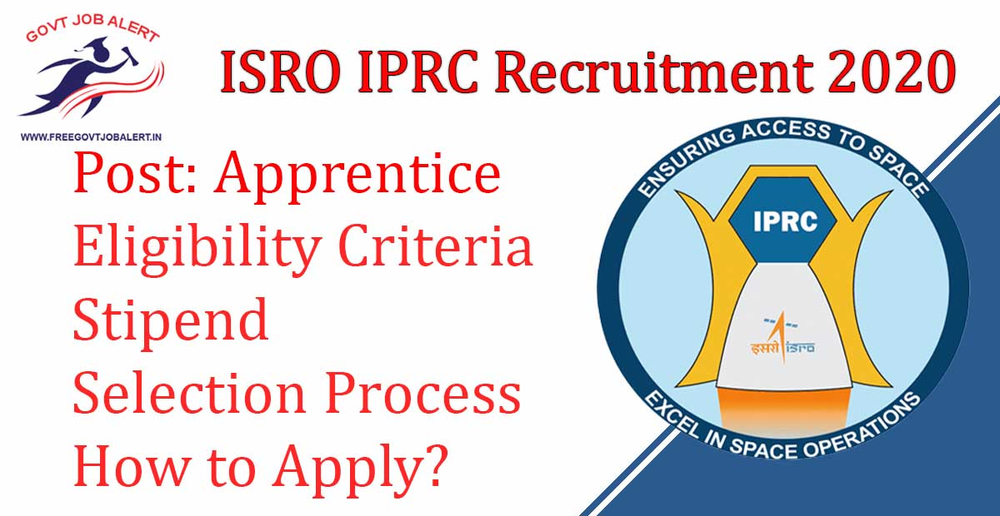
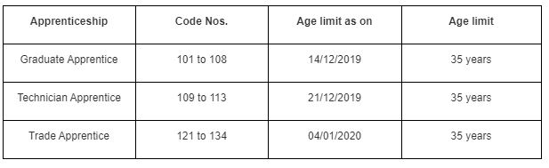

IPRC Mahendragiri recruitment 2019: ISRO Propulsion Complex (IPRC) located at Mahendragiri, Tirunelveli District, Tamil Nadu has is going to Fill up Apprentice Posts.IPRC is Invites Applications From Candidates for the engagement of Graduate / Technician / Trade Apprentices in various disciplines for Apprentice Posts. As Per ISRO IPRC Recruitment 2019 Notification A Total of 220 Vacancies are there. IPRC Mahendragiri Apprentice Vacancy Fill up through offline Mode only through Walk in Interview.

## **IPRC Mahendragiri Recruitment 2019**

<table style="border-collapse: collapse; width: 100%;"><tbody><tr><td style="width: 50%; background-color: #2a5a8e; text-align: center;" colspan="2"><h3><strong>ISRO IPRC Recruitment 2019</strong></h3></td></tr><tr><td style="width: 50%; text-align: center;">Job Recruitment Board</td><td style="width: 50%; text-align: center;">ISRO IPRC</td></tr><tr><td style="width: 50%; text-align: center;">Notification No.</td><td style="width: 50%; text-align: center;">IPRC/RMT/APP/2019/01</td></tr><tr><td style="width: 50%; text-align: center;">Post</td><td style="width: 50%; text-align: center;">Various Apprentice</td></tr><tr><td style="width: 50%; text-align: center;">Vacancies</td><td style="width: 50%; text-align: center;">220</td></tr><tr><td style="width: 50%; text-align: center;">Job Location</td><td style="width: 50%; text-align: center;">Mahendragiri, Tamil Nadu</td></tr><tr><td style="width: 50%; text-align: center;">Job Type</td><td style="width: 50%; text-align: center;">Apprentice Jobs</td></tr><tr><td style="width: 50%; text-align: center;">Application Mode</td><td style="width: 50%; text-align: center;">Offline/Interview</td></tr></tbody></table>

ISRO IPRC Recruitment 2019 Notification For Apprentice Post and Application Form With Interview Scheduled available on his official website. Those Candidates are Eligible to apply who Complete Engineering Degree. Maximum Age 35 Years For Every Applicant. Selected Candidates Placed at Mahendragiri, Tamil Nadu State. Interested & Eligible Candidates Can Attend Interview and get the jobs.

<table style="border-collapse: collapse; width: 98%; height: 107px;"><tbody><tr style="height: 28px;"><td style="width: 50%; background-color: #2a5a8e; text-align: center; height: 28px;" colspan="2"><h3><strong>ISRO IPRC Apprentice Interview Dates</strong></h3></td></tr><tr style="height: 20px;"><td style="width: 50%; text-align: center; height: 20px;">Graduate Apprentice Interview</td><td style="width: 50%; text-align: center; height: 20px;">14-12-2019 (09:00 AM to 01:30 PM)</td></tr><tr style="height: 34px;"><td style="width: 50%; text-align: center; height: 34px;">Technician Apprentice Interview</td><td style="width: 50%; text-align: center; height: 34px;">21-12-2019 (09:00 AM to 01:30 PM)</td></tr><tr style="height: 25px;"><td style="width: 50%; text-align: center; height: 25px;">Trade Apprentice Interview</td><td style="width: 50%; text-align: center; height: 25px;">04-01-2020 (09:00 AM to 01:30 PM)</td></tr></tbody></table>

ISRO Tirunelveli recruitment 2019 Details Like Education Qualification, Age Limit, Stipend, Selection Process, Mode of Application, how to apply, etc. - given below.

### **IPRC Apprentice Vacancy Details**

- A Total Of 220 Apprentice Vacancies.

### **IPRC Mahendragiri Recruitment Eligibility Criteria**

Age Limits

Education Qualification

<table style="border-collapse: collapse; width: 100%; height: 675px;"><tbody><tr style="height: 42px;"><td style="width: 13.9706%; height: 42px; text-align: center;"><strong>Code No.</strong></td><td style="width: 36.0294%; height: 42px; text-align: center;"><strong>Disciplines</strong></td><td style="width: 19.4853%; height: 42px; text-align: center;"><strong>No. of Training Positions</strong></td><td style="width: 30.5147%; height: 42px; text-align: center;"><strong>Essential Qualification</strong></td></tr><tr style="height: 20px;"><td style="width: 100%; background-color: #2a5a8e; height: 20px; text-align: center;" colspan="4"><strong>GRADUATE APPRENTICE</strong></td></tr><tr style="height: 65px;"><td style="width: 13.9706%; height: 19px; text-align: center;">101</td><td style="width: 36.0294%; height: 19px; text-align: center;">Mechanical Engineering</td><td style="width: 19.4853%; height: 19px; text-align: center;">10</td><td style="width: 30.5147%; height: 103px; text-align: center;" rowspan="7">First Class Engineering/Technology Degree in the respective disciplines</td></tr><tr style="height: 34px;"><td style="width: 13.9706%; height: 34px; text-align: center;">102</td><td style="width: 36.0294%; height: 34px; text-align: center;">Electrical &amp; Electronics Engineering</td><td style="width: 19.4853%; height: 34px; text-align: center;">05</td></tr><tr style="height: 34px;"><td style="width: 13.9706%; height: 10px; text-align: center;">103</td><td style="width: 36.0294%; height: 10px; text-align: center;">Electronics &amp;&nbsp; Communication&nbsp; Engineering</td><td style="width: 19.4853%; height: 10px; text-align: center;">10</td></tr><tr style="height: 34px;"><td style="width: 13.9706%; height: 10px; text-align: center;">104</td><td style="width: 36.0294%; height: 10px; text-align: center;">Instrumentation Engineering</td><td style="width: 19.4853%; height: 10px; text-align: center;">02</td></tr><tr style="height: 34px;"><td style="width: 13.9706%; height: 10px; text-align: center;">105</td><td style="width: 36.0294%; height: 10px; text-align: center;">Chemical Engineering</td><td style="width: 19.4853%; height: 10px; text-align: center;">02</td></tr><tr style="height: 34px;"><td style="width: 13.9706%; height: 10px; text-align: center;">106</td><td style="width: 36.0294%; height: 10px; text-align: center;">Computer Science Engineering</td><td style="width: 19.4853%; height: 10px; text-align: center;">05</td></tr><tr style="height: 34px;"><td style="width: 13.9706%; height: 10px; text-align: center;">107</td><td style="width: 36.0294%; height: 10px; text-align: center;">Civil Engineering</td><td style="width: 19.4853%; height: 10px; text-align: center;">04</td></tr><tr style="height: 85px;"><td style="width: 13.9706%; height: 85px; text-align: center;">108</td><td style="width: 36.0294%; height: 85px; text-align: center;">Library Science</td><td style="width: 19.4853%; height: 85px; text-align: center;">03</td><td style="width: 30.5147%; height: 85px; text-align: center;">Bachelor’s Degree (in Arts/Science/Commerce) + Degree in Library Science/ Library &amp; Information Science with First Class</td></tr><tr style="height: 20px;"><td style="width: 13.9706%; background-color: #2a5a8e; height: 20px; text-align: center;" colspan="4"><strong>TECHNICIAN APPRENTICE</strong></td></tr><tr style="height: 65px;"><td style="width: 13.9706%; height: 36px; text-align: center;">109</td><td style="width: 36.0294%; height: 36px; text-align: center;">Mechanical Engineering</td><td style="width: 19.4853%; height: 36px; text-align: center;">20</td><td style="width: 30.5147%; height: 114px; text-align: center;" rowspan="5">Diploma in Engineering/Technology in the respective disciplines with First Class</td></tr><tr style="height: 34px;"><td style="width: 13.9706%; height: 21px; text-align: center;">110</td><td style="width: 36.0294%; height: 21px; text-align: center;">Electrical &amp; Electronics&nbsp; Engineering</td><td style="width: 19.4853%; height: 21px; text-align: center;">10</td></tr><tr style="height: 34px;"><td style="width: 13.9706%; height: 16px; text-align: center;">111</td><td style="width: 36.0294%; height: 16px; text-align: center;">Electronics &amp; Communication Engineering</td><td style="width: 19.4853%; height: 16px; text-align: center;">15</td></tr><tr style="height: 55px;"><td style="width: 13.9706%; height: 29px; text-align: center;">112</td><td style="width: 36.0294%; height: 29px; text-align: center;">Chemical Engineering</td><td style="width: 19.4853%; height: 29px; text-align: center;">05</td></tr><tr style="height: 55px;"><td style="width: 13.9706%; height: 12px; text-align: center;">113</td><td style="width: 36.0294%; height: 12px; text-align: center;">Civil Engineering</td><td style="width: 19.4853%; height: 12px; text-align: center;">09</td></tr><tr style="height: 20px;"><td style="width: 13.9706%; background-color: #2a5a8e; height: 20px; text-align: center;" colspan="4"><strong>TRADE APPRENTICE</strong></td></tr><tr style="height: 34px;"><td style="width: 13.9706%; height: 10px; text-align: center;">121</td><td style="width: 36.0294%; height: 10px; text-align: center;">Fitter</td><td style="width: 19.4853%; height: 10px; text-align: center;">22</td><td style="width: 30.5147%; height: 271px; text-align: center;" rowspan="14">SSLC Pass

+

ITI&nbsp;&nbsp; in respective Trade&nbsp;&nbsp; from NCVT&nbsp;&nbsp;&nbsp;&nbsp; with NTC</td></tr><tr style="height: 34px;"><td style="width: 13.9706%; height: 10px; text-align: center;">122</td><td style="width: 36.0294%; height: 10px; text-align: center;">Welder</td><td style="width: 19.4853%; height: 10px; text-align: center;">10</td></tr><tr style="height: 34px;"><td style="width: 13.9706%; height: 10px; text-align: center;">123</td><td style="width: 36.0294%; height: 10px; text-align: center;">Electrician</td><td style="width: 19.4853%; height: 10px; text-align: center;">09</td></tr><tr style="height: 34px;"><td style="width: 13.9706%; height: 10px; text-align: center;">124</td><td style="width: 36.0294%; height: 10px; text-align: center;">Turner</td><td style="width: 19.4853%; height: 10px; text-align: center;">06</td></tr><tr style="height: 34px;"><td style="width: 13.9706%; height: 10px; text-align: center;">125</td><td style="width: 36.0294%; height: 10px; text-align: center;">Machinist</td><td style="width: 19.4853%; height: 10px; text-align: center;">02</td></tr><tr style="height: 34px;"><td style="width: 13.9706%; height: 10px; text-align: center;">126</td><td style="width: 36.0294%; height: 10px; text-align: center;">Draughtsman (Mechanic)</td><td style="width: 19.4853%; height: 10px; text-align: center;">02</td></tr><tr style="height: 34px;"><td style="width: 13.9706%; height: 10px; text-align: center;">127</td><td style="width: 36.0294%; height: 10px; text-align: center;">Draughtsman (Civil)</td><td style="width: 19.4853%; height: 10px; text-align: center;">04</td></tr><tr style="height: 65px;"><td style="width: 13.9706%; height: 21px; text-align: center;">128</td><td style="width: 36.0294%; height: 21px; text-align: center;">Electronic Mechanic

OR Mechanic (Radio and Television)</td><td style="width: 19.4853%; height: 21px; text-align: center;">05</td></tr><tr style="height: 34px;"><td style="width: 13.9706%; height: 10px; text-align: center;">129</td><td style="width: 36.0294%; height: 10px; text-align: center;">Instrument Mechanic</td><td style="width: 19.4853%; height: 10px; text-align: center;">04</td></tr><tr style="height: 34px;"><td style="width: 13.9706%; height: 10px; text-align: center;">130</td><td style="width: 36.0294%; height: 10px; text-align: center;">&nbsp;Ref. &amp; AC Mechanic</td><td style="width: 19.4853%; height: 10px; text-align: center;">04</td></tr><tr style="height: 34px;"><td style="width: 13.9706%; height: 10px; text-align: center;">131</td><td style="width: 36.0294%; height: 10px; text-align: center;">Mechanic Diesel</td><td style="width: 19.4853%; height: 10px; text-align: center;">04</td></tr><tr style="height: 34px;"><td style="width: 13.9706%; height: 10px; text-align: center;">132</td><td style="width: 36.0294%; height: 10px; text-align: center;">Carpenter</td><td style="width: 19.4853%; height: 10px; text-align: center;">02</td></tr><tr style="height: 34px;"><td style="width: 13.9706%; height: 18px; text-align: center;">133</td><td style="width: 36.0294%; height: 18px; text-align: center;">Instrument Mechanic (Chemical Plant)</td><td style="width: 19.4853%; height: 18px; text-align: center;">01</td></tr><tr style="height: 141px;"><td style="width: 13.9706%; height: 122px; text-align: center;">134</td><td style="width: 36.0294%; height: 122px; text-align: center;">Programming and System Administrative Assistant (PASAA) OR

Computer Operator and Programming Assistant (COPA)</td><td style="width: 19.4853%; height: 122px; text-align: center;">45</td></tr></tbody></table>

### **IPRC Mahendragiri Apprentice Salary/Pay Scale**

<table style="border-collapse: collapse; width: 68.0649%; height: 965px;"><tbody><tr style="height: 24px;"><td style="width: 74.4633px; text-align: center; height: 24px;"><strong>Code No.</strong></td><td style="width: 192.037px; text-align: center; height: 24px;"><strong>Disciplines</strong></td><td style="width: 103.857px; text-align: center; height: 24px;"><b>Stipend</b></td></tr><tr style="height: 24px;"><td style="width: 370.357px; background-color: #2a5a8e; text-align: center; height: 24px;" colspan="3"><strong>GRADUATE APPRENTICE</strong></td></tr><tr style="height: 10px;"><td style="width: 74.4633px; text-align: center; height: 10px;">101</td><td style="width: 192.037px; text-align: center; height: 10px;">Mechanical Engineering</td><td style="width: 103.857px; text-align: center; height: 203px;" rowspan="8">Rs. 9,000/-</td></tr><tr style="height: 24px;"><td style="width: 74.4633px; text-align: center; height: 24px;">102</td><td style="width: 192.037px; text-align: center; height: 24px;">Electrical &amp; Electronics Engineering</td></tr><tr style="height: 49px;"><td style="width: 74.4633px; text-align: center; height: 49px;">103</td><td style="width: 192.037px; text-align: center; height: 49px;">Electronics &amp;&nbsp; Communication&nbsp; Engineering</td></tr><tr style="height: 24px;"><td style="width: 74.4633px; text-align: center; height: 24px;">104</td><td style="width: 192.037px; text-align: center; height: 24px;">Instrumentation Engineering</td></tr><tr style="height: 24px;"><td style="width: 74.4633px; text-align: center; height: 24px;">105</td><td style="width: 192.037px; text-align: center; height: 24px;">Chemical Engineering</td></tr><tr style="height: 24px;"><td style="width: 74.4633px; text-align: center; height: 24px;">106</td><td style="width: 192.037px; text-align: center; height: 24px;">Computer Science Engineering</td></tr><tr style="height: 24px;"><td style="width: 74.4633px; text-align: center; height: 24px;">107</td><td style="width: 192.037px; text-align: center; height: 24px;">Civil Engineering</td></tr><tr style="height: 24px;"><td style="width: 74.4633px; text-align: center; height: 24px;">108</td><td style="width: 192.037px; text-align: center; height: 24px;">Library Science</td></tr><tr style="height: 24px;"><td style="width: 370.357px; background-color: #2a5a8e; text-align: center; height: 24px;" colspan="3"><strong>TECHNICIAN APPRENTICE</strong></td></tr><tr style="height: 10px;"><td style="width: 74.4633px; text-align: center; height: 10px;">109</td><td style="width: 192.037px; text-align: center; height: 10px;">Mechanical Engineering</td><td style="width: 103.857px; text-align: center; height: 181px;" rowspan="5">Rs. 8000/-</td></tr><tr style="height: 24px;"><td style="width: 74.4633px; text-align: center; height: 24px;">110</td><td style="width: 192.037px; text-align: center; height: 24px;">Electrical &amp; Electronics&nbsp; Engineering</td></tr><tr style="height: 49px;"><td style="width: 74.4633px; text-align: center; height: 49px;">111</td><td style="width: 192.037px; text-align: center; height: 49px;">Electronics &amp; Communication Engineering</td></tr><tr style="height: 49px;"><td style="width: 74.4633px; text-align: center; height: 49px;">112</td><td style="width: 192.037px; text-align: center; height: 49px;">Chemical Engineering</td></tr><tr style="height: 49px;"><td style="width: 74.4633px; text-align: center; height: 49px;">113</td><td style="width: 192.037px; text-align: center; height: 49px;">Civil Engineering</td></tr><tr style="height: 24px;"><td style="width: 370.357px; background-color: #2a5a8e; text-align: center; height: 24px;" colspan="3"><strong>TRADE APPRENTICE</strong></td></tr><tr style="height: 24px;"><td style="width: 74.4633px; text-align: center; height: 24px;">121</td><td style="width: 192.037px; text-align: center; height: 24px;">Fitter</td><td style="width: 103.857px; text-align: center; height: 24px;">Rs. 8050/-</td></tr><tr style="height: 24px;"><td style="width: 74.4633px; text-align: center; height: 24px;">122</td><td style="width: 192.037px; text-align: center; height: 24px;">Welder</td><td style="width: 103.857px; text-align: center; height: 24px;">Rs. 7700/-</td></tr><tr style="height: 24px;"><td style="width: 74.4633px; text-align: center; height: 24px;">123</td><td style="width: 192.037px; text-align: center; height: 24px;">Electrician</td><td style="width: 103.857px; text-align: center; height: 24px;">Rs. 8050/-</td></tr><tr style="height: 24px;"><td style="width: 74.4633px; text-align: center; height: 24px;">124</td><td style="width: 192.037px; text-align: center; height: 24px;">Turner</td><td style="width: 103.857px; text-align: center; height: 24px;">Rs. 8050/-</td></tr><tr style="height: 24px;"><td style="width: 74.4633px; text-align: center; height: 24px;">125</td><td style="width: 192.037px; text-align: center; height: 24px;">Machinist</td><td style="width: 103.857px; text-align: center; height: 24px;">Rs. 8050/-</td></tr><tr style="height: 24px;"><td style="width: 74.4633px; text-align: center; height: 24px;">126</td><td style="width: 192.037px; text-align: center; height: 24px;">Draughtsman (Mechanic)</td><td style="width: 103.857px; text-align: center; height: 24px;">Rs. 8050/-</td></tr><tr style="height: 24px;"><td style="width: 74.4633px; text-align: center; height: 24px;">127</td><td style="width: 192.037px; text-align: center; height: 24px;">Draughtsman (Civil)</td><td style="width: 103.857px; text-align: center; height: 24px;">Rs. 8050/-</td></tr><tr style="height: 73px;"><td style="width: 74.4633px; text-align: center; height: 73px;">128</td><td style="width: 192.037px; text-align: center; height: 73px;">Electronic Mechanic

OR Mechanic (Radio and Television)</td><td style="width: 103.857px; text-align: center; height: 73px;">Rs. 8050/-</td></tr><tr style="height: 24px;"><td style="width: 74.4633px; text-align: center; height: 24px;">129</td><td style="width: 192.037px; text-align: center; height: 24px;">Instrument Mechanic</td><td style="width: 103.857px; text-align: center; height: 24px;">Rs. 8050/-</td></tr><tr style="height: 24px;"><td style="width: 74.4633px; text-align: center; height: 24px;">130</td><td style="width: 192.037px; text-align: center; height: 24px;">&nbsp;Ref. &amp; AC Mechanic</td><td style="width: 103.857px; text-align: center; height: 24px;">Rs. 8050/-</td></tr><tr style="height: 24px;"><td style="width: 74.4633px; text-align: center; height: 24px;">131</td><td style="width: 192.037px; text-align: center; height: 24px;">Mechanic Diesel</td><td style="width: 103.857px; text-align: center; height: 24px;">Rs. 7700/-</td></tr><tr style="height: 24px;"><td style="width: 74.4633px; text-align: center; height: 24px;">132</td><td style="width: 192.037px; text-align: center; height: 24px;">Carpenter</td><td style="width: 103.857px; text-align: center; height: 24px;">Rs. 7700/-</td></tr><tr style="height: 24px;"><td style="width: 74.4633px; text-align: center; height: 24px;">133</td><td style="width: 192.037px; text-align: center; height: 24px;">Instrument Mechanic (Chemical Plant)</td><td style="width: 103.857px; text-align: center; height: 24px;">Rs. 8050/-</td></tr><tr style="height: 124px;"><td style="width: 74.4633px; text-align: center; height: 124px;">134</td><td style="width: 192.037px; text-align: center; height: 124px;">Programming and System Administrative Assistant (PASAA) OR

Computer Operator and Programming Assistant (COPA)</td><td style="width: 103.857px; text-align: center; height: 124px;">Rs. 7700/-</td></tr></tbody></table>

### **Selection Process For IPRC Mahendragiri Recruitment 2019**

- The selection for Apprenticeship Training will be done purely based on the **PERCENTAGE OF MARKS secured in the qualifying examination** as entered by the candidates in the Application FORM.

### **How to Apply For IPRC Mahendragiri Recruitment 2019**

- The applicants may visit the Careers page of the IPRC Website (**www.iprc.gov.in**) and download the Application Form.
- The applicants have to fill the Application Form neatly and correctly and attach self-attested copies of the certificates regarding Date of Birth, Qualification, Reservation (if any), Previous Experience, etc.
- The applicants have to bring the duly filled **Application Form** along with ORIGINALS and copies of the Certificates in-person to **ISRO Propulsion Complex (IPRC), Mahendragiri, Tirunelveli District, Tamil Nadu** on the stipulated date for submitting the application.
- The applicants have to carry a valid photo ID proof, viz. Aadhaar, Electoral ID, etc. for security reasons, without which they will not be allowed to enter the IPRC campus.
- Applications sent through Post / Courier or any other means will not be entertained.

### **IPRC Mahendragiri Recruitment Important Links**

- IPRC Apprentice Application Form 2019: [Download Here](https://www.iprc.gov.in/iprc/images/Apprentice/Apprentice_Application%20Form.pdf)
- IPRC Mahendragiri 220 Apprentice Notification 2019 PDF: [Click Here](https://www.iprc.gov.in/iprc/images/Apprentice/Apprentice_Advertisement.pdf)
- IPRC Official Website: [Click Here](https://www.iprc.gov.in/)

Candidates can visit https://www.iprc.gov.in to get more details about IPRC Apprentice 2020. To More Information About ISRO IPRC vacancies 2020, latest Updates, Admit Card, Result, Etc. It will be published on the official website. Also, visit Regularly our website [www.freegovtjobalert.in](https://freegovtjobalert.in "Free Govt Job Alert") for getting the Latest job Updates.
