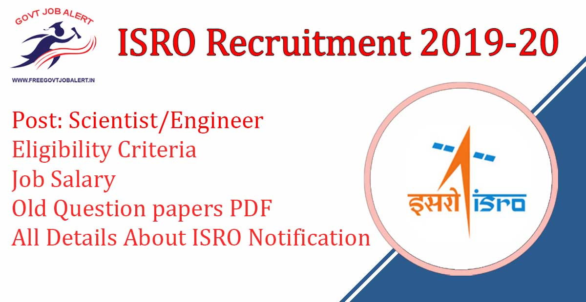

ISRO recruitment 2019: Indian Space Research Organization has Released Notification for the Recruitment of Scientist and Engineer 'SC' at constituent ISRO Centers (Group ‘A’ Gazetted posts) and in Autonomous Body (Group ‘A’ Non-Gazetted posts). Good Chance For Those Candidates Who want Make His Careers in ISRO And Want to Get ISRO Jobs they can Fillup ISRO Recruitment Online Form 2019 @ www.isro.gov.in recruitment 2019

## ISRO Recruitment 2019 For Scientist and Engineer Vacancy

<table style="border-collapse: collapse; width: 100%;"><tbody><tr><td style="width: 50%; background-color: #2a5a8e;" colspan="2"><h3 style="text-align: center;">ISRO Recruitment 2019</h3></td></tr><tr><td style="width: 50%; text-align: center;">Job Recruitment Board</td><td style="width: 50%; text-align: center;">Indian Space Research Organization(ISRO)</td></tr><tr><td style="width: 50%; text-align: center;">Advt No.&nbsp;</td><td style="width: 50%; text-align: center;">ISRO :ICRB:03:2019</td></tr><tr><td style="width: 50%; text-align: center;">Post</td><td style="width: 50%; text-align: center;">Scientist and Engineer</td></tr><tr><td style="width: 50%; text-align: center;">VAcancies</td><td style="width: 50%; text-align: center;">327 Posts</td></tr><tr><td style="width: 50%; text-align: center;">Job Location</td><td style="width: 50%; text-align: center;">Across India</td></tr><tr><td style="width: 50%; text-align: center;">Job Type</td><td style="width: 50%; text-align: center;">Central Govt Job</td></tr><tr><td style="width: 50%; text-align: center;">Application Mode</td><td style="width: 50%; text-align: center;">Online</td></tr></tbody></table>

ISRO Recruitment Notification 2019 has Publish on his official website. ISRO recruitment 2019 for engineers, Who have A B.E/ B.TECH Degree. As Per ISRO Recruitment 2019 Notification A Total of 327 Vacancies Are There. to know about ISRO Vacancy 2019 Details Like Education Qualification, Age Limits, Salary, Selection Process, How to Apply, Etc Given Below In this Page. Interested & Eligible Candidates Apply Online For ISRO Recruitment Before 4-11-2019.

<table style="border-collapse: collapse; width: 100%; height: 148px;"><tbody><tr style="height: 28px;"><td style="width: 50%; background-color: #2a5a8e; text-align: center; height: 28px;" colspan="2"><h3>Important Date</h3></td></tr><tr style="height: 24px;"><td style="width: 50%; text-align: center; height: 24px;">Starting Date for Submission of online application&nbsp;</td><td style="width: 50%; text-align: center; height: 24px;">15-10-2019</td></tr><tr style="height: 24px;"><td style="width: 50%; text-align: center; height: 24px;">Last Date for Submission of online application<strong></strong></td><td style="width: 50%; text-align: center; height: 24px;">04-11-2019</td></tr><tr style="height: 24px;"><td style="width: 50%; text-align: center; height: 24px;">Last Date For Fee Payment</td><td style="width: 50%; text-align: center; height: 24px;">06-11-2019</td></tr><tr style="height: 24px;"><td style="width: 50%; text-align: center; height: 24px;">Written Exam Date</td><td style="width: 50%; text-align: center; height: 24px;">12-01-2020</td></tr><tr style="height: 24px;"><td style="width: 50%; text-align: center; height: 24px;">Written Exam Admit Card</td><td style="width: 50%; text-align: center; height: 24px;">December 2019</td></tr></tbody></table>

### ISRO Vacancy 2019 Details

1. Scientist/Engineer - SC (Electronics): 131 Posts
2. Scientist/Engineer - SC (Mechanical): 135 Posts
3. Scientist/Engineer - SC (Computer Science): 58 Posts
4. Scientist/Engineer-SC (Electronics) - Autonomous Body: 03 Posts

### ISRO Recruitment Eligibility Criteria

Education Qualification & Age Limits

<table style="border-collapse: collapse; width: 100%;"><tbody><tr><td style="width: 39.0602%; text-align: center; background-color: #2a5a8e;"><strong>Posts</strong></td><td style="width: 27.6064%; text-align: center; background-color: #2a5a8e;"><strong>Education Qualification</strong></td><td style="width: 33.3333%; text-align: center; background-color: #2a5a8e;"><strong>Age Limits</strong></td></tr><tr><td style="width: 39.0602%; text-align: center;"><ul><li>Scientist/Engineer - SC (Electronics)</li><li>Scientist/Engineer - SC (Mechanical)</li><li>Scientist/Engineer - SC (Computer Science)</li><li>Scientist/Engineer-SC (Electronics) - Autonomous Body</li></ul></td><td style="width: 27.6064%; text-align: center;">BE/ B.Tech or equivalent in First Class with an aggregate minimum of 65% marks or CGPA 6.84/10</td><td style="width: 33.3333%; text-align: center;">Maximum 35 Years

Ex-Serviceman and Persons with Benchmark Disabilities (PWBD) are eligible for age relaxation as per Govt. of India orders.</td></tr></tbody></table>

### ISRO Job Salary/Pay Scale

- Selected candidates will be appointed as Scientist/Engineer ‘SC’ in Level 10 of Pay Matrix and will be paid minimum basic pay of ₹56,100/- p.m.
- In addition, Dearness Allowance \[DA\], House Rent Allowance \[HRA\] and Transport Allowance are payable as per extant rules on the subject. The employees will be governed by the New Pension Scheme.
- Further medical facilities for self and dependents, subsidized canteen, limited quarters facility (in lieu of HRA), Leave Travel Concession, Group Insurance, House Building Advance etc are admissible as per Central Government orders.

### ISRO Jobs Selection Process

1. Written Exam
2. Interview

- Candidates who meet the eligibility criteria will be shortlisted to appear in the Written Test, which is scheduled to be conducted on 12.01.2020 at twelve venues viz., Ahmedabad, Bengaluru, Bhopal, Chandigarh, Chennai, Guwahati, Hyderabad, Kolkata, Lucknow, Mumbai, New Delhi and Thiruvananthapuram.
- However, ICRB reserves its right to prescribe a higher cut-off on a need basis. ICRB also reserves its right to cancel any written test center and re-allot the candidates to any other test center. 
- Based on the performance in the Written Test, candidates will be short-listed for interview, the schedule and venue of which will be notified by e-mail.
- Written test is only a first-level screening and written test score will not be considered for the final selection process.
- Final selection will be based on the performance of the candidates in the Interview and those who secure minimum 60% marks in the interview will be eligible for consideration for empanelment, in the order of merit.

### ISRO Written Exam Admit Card

- The call letters for the written test to the short-listed candidates will be sent only by e-mail during the last week of December, 2019.

### ISRO Written Exam Pattern

- The written test paper consists of 80 objective type questions carrying equal marks.

### ISRO Exam Old Question Paper PDF

<table style="border-collapse: collapse; width: 90.2903%;"><tbody><tr><td style="width: 33.3333%; text-align: center; background-color: #2a5a8e;"><strong>Computer Science</strong></td><td style="width: 33.3333%; text-align: center; background-color: #2a5a8e;"><strong>Electronics</strong></td><td style="width: 23.5378%; text-align: center; background-color: #2a5a8e;"><strong>Mechanical</strong></td></tr><tr><td style="width: 33.3333%; text-align: center;"><ul><li style="text-align: left;"><a href="https://www.isro.gov.in/sites/default/files/cs-2015.pdf"><strong>CS-2015</strong></a></li><li style="text-align: left;"><a href="https://www.isro.gov.in/sites/default/files/cs-2016.pdf"><strong>CS-2016</strong></a></li><li style="text-align: left;"><a href="https://www.isro.gov.in/sites/default/files/cs-2017.pdf"><strong>CS-2017</strong></a></li><li style="text-align: left;"><a href="https://www.isro.gov.in/sites/default/files/cs-2017-ii.pdf"><strong>CS-2017-II</strong></a></li><li style="text-align: left;"><a href="https://www.isro.gov.in/sites/default/files/cs-2018.pdf"><strong>CS-2018</strong></a></li></ul></td><td style="width: 33.3333%; text-align: center;"><ul><li style="text-align: left;"><a href="https://www.isro.gov.in/sites/default/files/e-2015_1.pdf"><strong>EE-2015</strong></a></li><li style="text-align: left;"><a href="https://www.isro.gov.in/sites/default/files/e-2016.pdf"><strong>EE-2016</strong></a></li><li style="text-align: left;"><a href="https://www.isro.gov.in/sites/default/files/e-2017.pdf"><strong>EE-2017</strong></a></li><li style="text-align: left;"><a href="https://www.isro.gov.in/sites/default/files/e-2017-ii.pdf"><strong>EE-2017-II</strong></a></li><li style="text-align: left;"><a href="https://www.isro.gov.in/sites/default/files/e-2018.pdf"><strong>EE-2018</strong></a></li></ul></td><td style="width: 23.5378%; text-align: center;"><ul><li style="text-align: left;"><a href="https://www.isro.gov.in/sites/default/files/m-2015.pdf"><strong>ME-2015</strong></a></li><li style="text-align: left;"><a href="https://www.isro.gov.in/sites/default/files/m-2016.pdf"><strong>ME-2016</strong></a></li><li style="text-align: left;"><a href="https://www.isro.gov.in/sites/default/files/m-2017.pdf"><strong>ME-2017</strong></a></li><li style="text-align: left;"><a href="https://www.isro.gov.in/sites/default/files/m-2017-ii.pdf"><strong>ME-2017-II</strong></a></li><li style="text-align: left;"><a href="https://www.isro.gov.in/sites/default/files/m-2018.pdf"><strong>ME-2018</strong></a></li></ul></td></tr></tbody></table>

### Application Fee

- Rs. 100/- For All General Candidates 
- All Women/Scheduled Castes (SC)/ Scheduled Tribes (ST); Ex-serviceman \[EX\], Economically Weaker Sections (EWS) and Persons with Benchmark Disabilities (PWBD) candidates are exempted from payment of Application Fee.
- **Payment Mode**: Online or Offline
    - Online: Internet Banking/Debit Card 
    - Offline: Candidates should download, print and pay the application fee in cash at any SBI Branch within 3 days of generation of challan or last day stipulated for payment (06.11.2019).

### How to Apply For ISRO Jobs?

1. Candidates First Go to ISRO Official Website: https://www.isro.gov.in
2. Then Go Career Section 
3. Then Click On **Centralised Recruitment(ICRB), All Location**
4. Now Click on _Recruitment to the post of Scientist/Engineer 'SC' (Electronics, Mechanical and Computer Science)_
5. Now Click On, _Click Here to Apply\\_
6. Fill up Online ISRO Recruitment Application Form 2019
7. Upload Required Documents
8. Pay Application Fee(Online/Offline)
9. Submit Application
10. Download & save For Future Use.
11. Done

### ISRO Recruitment Important Links

- Direct Apply Onlne For ISRO Recruitment 2019: [Click Here](http://apps.isac.gov.in/CentralBE-2019/advt.jsp)
- ISRO Recruitment 2019 For Scientist and Engineer Vacancy Notification PDF: [Click Here](https://freegovtjobalert.in/wp-content/uploads/2019/10/ISRO-Recruitment-2019-For-Scientist-and-Engineer-Vacancy-Notification-PDF.pdf)
- ISRO Official Website: [Click Here](https://www.isro.gov.in/)
