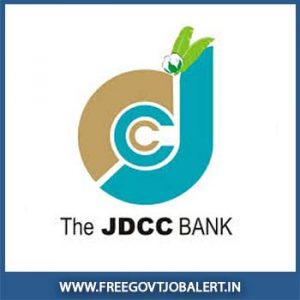

**JDCC bank Recruitment 2019**: Jalgaon District Central Co-operative Bank (JDCC Bank) has released Notification for Clark post vacancy (Support Staff Post). Interested And Eligible Candidates in **JDCC bank Clerk recruitment 2019** Those can apply online before Date 20-08-2019. All **JDCC Bank Vacancy Details** Mentioned in this page below. Interested candidates can read the notification carefully before apply online.

## JDCC Bank Clerk Post Vacancy Details

<table style="height: 475px; width: 84.9475%; border-collapse: collapse; border-style: double;"><tbody><tr style="height: 100px;"><td style="width: 100%; text-align: center; height: 10px;" colspan="2">Jalgaon District Central Co-operative Bank

JDCC bank Recruitment

Clerk Post 220 Vacancies</td></tr><tr style="height: 30px;"><td style="width: 100%; height: 30px; background-color: #2a5a8e; text-align: center;" colspan="2"><h3><strong>&nbsp;Important Dates</strong></h3></td></tr><tr style="height: 22px;"><td style="width: 50%; text-align: center; height: 22px;">Starting Date for Registration</td><td style="width: 50%; text-align: center; height: 22px;"><strong>01-08-2019</strong></td></tr><tr style="height: 22px;"><td style="width: 50%; text-align: center; height: 22px;">Last Date for Registration</td><td style="width: 50%; text-align: center; height: 22px;"><strong>20-08-2019</strong></td></tr><tr style="height: 30px;"><td style="width: 100%; height: 30px; background-color: #2a5a8e; text-align: center;" colspan="2"><h3><strong>&nbsp;Vacancy Details</strong></h3></td></tr><tr style="height: 22px;"><td style="width: 100%; text-align: center; height: 22px;" colspan="2">Post Name: Clerk (Support Staff)

Total Vacancy: 220</td></tr><tr style="height: 30px;"><td style="width: 100%; height: 30px; background-color: #2a5a8e; text-align: center;" colspan="2"><h3><strong>Eligibility Criteria&nbsp;</strong></h3></td></tr><tr style="height: 14px;"><td style="width: 50%; text-align: center; height: 14px;"><strong>Education Qualification</strong></td><td style="width: 50%; text-align: center; height: 14px;"><strong>Age Limits</strong></td></tr><tr style="height: 30px;"><td style="width: 50%; text-align: center; height: 30px;">Any Graduate From recognized university.passed with minimum 50% marks MSCIT/Government Approved Certificate in Computer Diploma.</td><td style="width: 50%; text-align: center; height: 30px;">Minimum 21 Years

Maximum 30 Years</td></tr><tr style="height: 30px;"><td style="width: 100%; height: 30px; background-color: #2a5a8e; text-align: center;" colspan="2"><h3><strong>Application Fee&nbsp;</strong></h3></td></tr><tr style="height: 30px;"><td style="text-align: center; height: 30px; width: 100%;" colspan="2"><ul><li style="text-align: left;">Application Fee:&nbsp;<strong>Rs. 1000/-</strong></li><li style="text-align: left;">Payment of Fee:<strong> Through Online</strong></li></ul></td></tr><tr style="height: 30px;"><td style="width: 100%; height: 30px; background-color: #2a5a8e; text-align: center;" colspan="2"><h3><strong>Selection Procedure</strong></h3></td></tr><tr style="height: 102px;"><td style="width: 100%; text-align: center; height: 102px;" colspan="2"><ul><li style="text-align: left;">The selection of the candidates shall be made on the basis of the Online Test/Examination.</li><li style="text-align: left;">Interview</li><li style="text-align: left;">Document verification</li></ul></td></tr><tr style="height: 30px;"><td style="width: 100%; height: 30px; background-color: #2a5a8e; text-align: center;" colspan="2"><h3><strong>Important Links&nbsp;</strong></h3></td></tr><tr style="height: 10px;"><td style="width: 50%; text-align: center; height: 10px;"><strong>Apply Online&nbsp;</strong></td><td style="width: 50%; text-align: center; height: 10px;"><strong><a style="color: #ff0000;" title="JDCC Bank" href="https://ibpsonline.ibps.in/jadccbljul19/basic_details.php" target="_blank" rel="noopener noreferrer">Registration</a>&nbsp;|&nbsp;<a style="color: #ff0000;" title="JDCC Bank" href="https://ibpsonline.ibps.in/jadccbljul19/" target="_blank" rel="noopener noreferrer">Login</a></strong></td></tr><tr style="height: 36px;"><td style="width: 50%; text-align: center; height: 23px;"><strong>Notification</strong></td><td style="width: 50%; text-align: center; height: 23px;"><a href="https://freegovtjobalert.in/wp-content/uploads/2019/08/JDCC-Bank-Clerk-Post-Vacancy-Notification.pdf" target="_blank" rel="noopener noreferrer"><strong>Click Here&nbsp;</strong></a></td></tr><tr style="height: 10px;"><td style="width: 50%; text-align: center; height: 10px;"><strong>&nbsp;Official Website</strong></td><td style="width: 50%; text-align: center; height: 10px;"><a style="color: #ff0000;" href="http://jdccbank.com/" target="_blank" rel="noopener noreferrer"><strong>Click Here</strong></a></td></tr></tbody></table>

### How To apply for JDCC bank Clerk Vacancy 2019

1. Candidates log on to [**https://ibpsonline.ibps.in/jadccbljul19/**](https://ibpsonline.ibps.in/jadccbljul19/)
2. Go to “**Registration**” & Register yourself.
3. Read the information carefully & Click on “**Apply Online**”.
4. Click on “**Click here for New Registration**”, (if you are a new user)
5. Complete the Registration & Click on “**Submit**”.
6. After Registration, Log in with Your Registered Number & Password.
7. Fill all the details in the application & upload Photo, Signature.
8. Done

**Other Bank Job Vacancy:**

- [Bank of Maharashtra – 46 Specialist Officers Vacancy 2019](https://freegovtjobalert.in/bank-of-maharashtra-specialist-officers-vacancy/)
- [IBPS Probationary Officer/ Management Trainee 4336 IBPS PO MT Vacancies](https://freegovtjobalert.in/ibps-crp-po-mt-ix-vacancies/)
