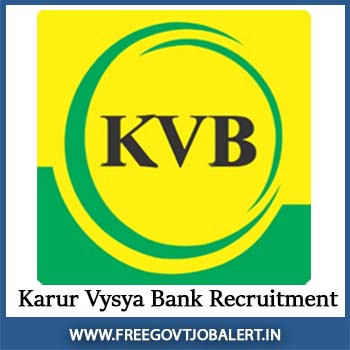

**Karur Vysya Bank Recruitment 2019**: Karur Vysya Bank (KVB Vacancy)has invited online applications for appointment of business Development Associate on Contract for CASA Sales in Karnataka. KVB Recruitment Notification 2019 published on www.kvb.co.in. Good chance for who looking for Bank jobs in Karnataka can apply online KVB Application Form 2019. candidates can apply KVB online form 2019 before the Last Date 23-10-2019. Karur Vysya Bank Recruitment 2019 vacancy is needed a minimum of 6 months experience in the sale of BFSI products and minimum age 21 Years. Karur Vysya Bank recruitment vacancy Details Like Educational Qualification, Salary/Pay Scale, Experience, Etc. Given in this page below...

\[caption id="attachment\_738" align="aligncenter" width="217"\] KVB Vacancy\[/caption\]

## KVB Recruitment Business Development Associate Vacancy Details

<table style="height: 654px; width: 84.9475%; border-collapse: collapse; border-style: double;"><tbody><tr style="height: 80px;"><td style="width: 100%; text-align: center; height: 50px;" colspan="2"><strong>Karur Vysya Bank Recruitment 2019</strong>

Business Development Associate Vacancy

KVB Vacancy (on contract)</td></tr><tr style="height: 30px;"><td style="width: 100%; height: 30px; background-color: #2a5a8e; text-align: center;" colspan="2"><h3><strong>&nbsp;Important Dates</strong></h3></td></tr><tr style="height: 22px;"><td style="width: 50%; text-align: center; height: 22px;">Starting Date for Submission of online application&nbsp;</td><td style="width: 50%; text-align: center; height: 22px;"><strong>23-07-2019</strong></td></tr><tr style="height: 22px;"><td style="width: 50%; text-align: center; height: 22px;">Last Date for Submission of online application&nbsp;</td><td style="width: 50%; text-align: center; height: 22px;"><strong>23-10-2019</strong></td></tr><tr style="height: 30px;"><td style="width: 100%; height: 30px; background-color: #2a5a8e; text-align: center;" colspan="2"><h3><strong>&nbsp;Vacancy Details</strong></h3></td></tr><tr style="height: 22px;"><td style="text-align: center; height: 22px; width: 50%;">Job Recruitment Board</td><td style="text-align: center; width: 50%;">Karur Vysya Bank</td></tr><tr><td style="text-align: center; width: 50%;">Post Name</td><td style="text-align: center; width: 50%;">Business Development Associate</td></tr><tr><td style="text-align: center; width: 50%;">Job Category</td><td style="text-align: center; width: 50%;"><a href="https://freegovtjobalert.in/bank-jobs-recruitment/" target="_blank" rel="noopener noreferrer">Bank Jobs</a></td></tr><tr><td style="text-align: center; width: 50%;">Job Location</td><td style="text-align: center; width: 50%;"><a href="https://freegovtjobalert.in/karnataka-govt-jobs/" target="_blank" rel="noopener noreferrer">Karnataka</a></td></tr><tr><td style="text-align: center; width: 50%;">Application Mode</td><td style="text-align: center; width: 50%;">Online</td></tr><tr style="height: 30px;"><td style="width: 100%; height: 30px; background-color: #2a5a8e; text-align: center;" colspan="2"><h3><strong>Eligibility Criteria&nbsp;</strong></h3></td></tr><tr style="height: 14px;"><td style="width: 50%; text-align: center; height: 14px;"><strong>Education Qualification</strong></td><td style="width: 50%; text-align: center; height: 14px;"><strong>Age Limits</strong></td></tr><tr style="height: 30px;"><td style="width: 50%; text-align: center; height: 30px;"><ul><li style="text-align: left;">Any candidate who has completed Under Graduate Degree (10+2+3 or 10+2+5 or 10+2+3+2 or 10+2+4) under regular course from a college affiliated to a recognized University with 50% of marks and above.</li><li style="text-align: left;">Candidates should be conversant in Local language where he is posted</li><li style="text-align: left;">Candidates should have working knowledge in English</li><li style="text-align: left;">Candidates with a minimum of 6 months experience in the sale of BFSI products is preferred</li></ul></td><td style="width: 50%; text-align: center; height: 30px;">Minimum 21 Years

Maximum 28 Years</td></tr><tr style="height: 30px;"><td style="width: 100%; height: 30px; background-color: #2a5a8e; text-align: center;" colspan="2"><h3><strong>Mode of Selection</strong></h3></td></tr><tr style="height: 30px;"><td style="text-align: center; height: 30px;" colspan="2"><ol><li style="text-align: left;">Screening of Candidates will be done by conducting a personal interview.</li><li style="text-align: left;">Candidates will be called for Personal Interview (Date of Interview and Venue will be informed by the Bank to the individual candidates through registered e-mail only).</li><li style="text-align: left;">&nbsp;Depending upon the number of vacancies, the Bank reserves the right to call for Personal Interview.</li><li style="text-align: left;">Selected candidates may be posted in the same city/area based on the vacancy position/requirement of candidates in the particular city/area.</li></ol></td></tr><tr><td style="background-color: #2a5a8e; text-align: center;" colspan="2"><h3><strong>KVB Vacancy Salary/EMOLUMENTS</strong></h3></td></tr><tr><td style="width: 100%; text-align: center;" colspan="2"><ul><li style="text-align: left;">The selected candidates will be appointed on contract basis for a period of three years and the salary would be on a consolidated basis of Rs.18000/- onwards. Also, eligible for performance-based incentive on monthly basis declared by the bank from time to time.</li><li style="text-align: left;">Depending upon the place of posting and experience, increase in quantum of consolidated pay may be considered.</li><li style="text-align: left;">Service Agreement:: The selected candidates will be required to execute Service Agreement (in Non-Judicial Stamp paper) upon joining the Bank undertaking to serve the Bank for a minimum period of 3 years.</li></ul></td></tr><tr style="height: 30px;"><td style="width: 100%; height: 30px; background-color: #2a5a8e; text-align: center;" colspan="2"><h3><strong>Important Links for KVB Vacancy</strong></h3></td></tr><tr style="height: 10px;"><td style="width: 50%; text-align: center; height: 10px;"><strong>Apply Online&nbsp;</strong></td><td style="width: 50%; text-align: center; height: 10px;"><strong><a style="color: #ff0000;" href="https://www.kvblimited.com/psp/kvbcg/EMPLOYEE/HRMS/c/HRS_HRAM.HRS_APP_SCHJOB.GBL?Page=HRS_APP_SCHJOB&amp;Action=U&amp;FOCUS=Applicant&amp;SiteId=1" target="_blank" rel="noopener noreferrer">Register</a> | <a style="color: #ff0000;" href="https://www.kvblimited.com/psp/kvbcg/EMPLOYEE/HRMS/c/HRS_HRAM.HRS_APP_SCHJOB.GBL?Page=HRS_APP_SCHJOB&amp;Action=U&amp;FOCUS=Applicant&amp;SiteId=1" target="_blank" rel="noopener noreferrer">Sign In</a></strong></td></tr><tr style="height: 36px;"><td style="width: 50%; text-align: center; height: 23px;"><strong>Notification</strong></td><td style="width: 50%; text-align: center; height: 23px;"><a style="color: #ff0000;" href="https://freegovtjobalert.in/wp-content/uploads/2019/08/KVB-Recruitment-Business-Development-Associate-Vacancy-Notification.pdf" target="_blank" rel="noopener noreferrer"><strong>Click Here</strong></a></td></tr><tr style="height: 10px;"><td style="width: 50%; text-align: center; height: 10px;"><strong>&nbsp;Official Website</strong></td><td style="width: 50%; text-align: center; height: 10px;"><a style="color: #ff0000;" href="https://www.kvb.co.in/" target="_blank" rel="noopener noreferrer"><strong>Click Here</strong></a></td></tr></tbody></table>

### How To Apply For KVB Vacancy Online Application Form 2019?

1. First Goto Here: [KVB Vacancy Recruitment](https://www.kvblimited.com/psp/kvbcg/EMPLOYEE/HRMS/c/HRS_HRAM.HRS_APP_SCHJOB.GBL?Page=HRS_APP_SCHJOB&Action=U&FOCUS=Applicant&SiteId=1)
2. find **Recruitment of Business Development Associate (on contract) for CASA Sales (Karnataka State)**
3. Click On Apply Online
4. Sign in With your Username & Password. (If You Don't Have ID Password Then click on new User and Register your self and get username)
5. Now apply for KVB Vacancy BDA Post.
6. Done
