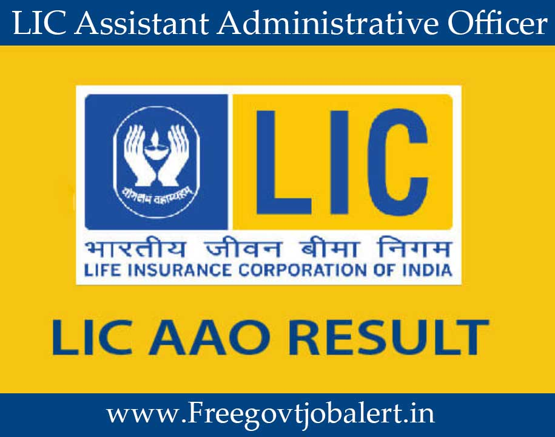

LIC AAO Interview Result 2019: Life Insurance Corporation had vacancy of the Assitant Administrative Officer. Interested and eligible candidates are applied for this post. The Application Mode or application process had online conducted. Application Submission Process had been from 02-03-2019 to 22-03-2019. Total 590 Vacancies for AAO Post.

## LIC AAO Interview Result 2019

<table style="border-collapse: collapse; width: 100%;"><tbody><tr><td style="width: 50%; text-align: center;">Job Recruitment Board</td><td style="width: 50%; text-align: center;">LIC Recruitment</td></tr><tr><td style="width: 50%; text-align: center;">Post</td><td style="width: 50%; text-align: center;">Assistant Administrative Officer</td></tr><tr><td style="width: 50%; text-align: center;">Vacancies</td><td style="width: 50%; text-align: center;">590</td></tr><tr><td style="width: 50%; text-align: center;">Preliminary Exam Date</td><td style="width: 50%; text-align: center;">4/5-5-2019</td></tr><tr><td style="width: 50%; text-align: center;">LIC AAO Preliminary Exam Result</td><td style="width: 50%; text-align: center;">4-6-2019</td></tr><tr><td style="width: 50%; text-align: center;">Main Exam Date</td><td style="width: 50%; text-align: center;">28-6-2019</td></tr><tr><td style="width: 50%; text-align: center;">Main Exam Result</td><td style="width: 50%; text-align: center;">29-7-2019</td></tr><tr><td style="width: 50%; text-align: center;">LIC AAO Interview</td><td style="width: 50%; text-align: center;">19-8-2019</td></tr><tr><td style="width: 50%; text-align: center;">LIC AAO Interview Result</td><td style="width: 50%; text-align: center;">Released</td></tr></tbody></table>

### LIC AAO Result 2019

- Marks obtained in the Main Examination only will be considered for shortlisting for interview and marks obtained in Main Examination + marks obtained in Interview will be considered for final merit listing of candidates.

### LIC AAO Medical Examination

- Shortlisted candidates in the final merit list will have to undergo Pre Recruitment Medical Examination and if found medically fit, will be offered an appointment.

### How to check LIC AAO Result

1. Candidates Goto Here: [LIC AAO Interview Result](https://www.licindia.in/Bottom-Links/careers)
2. Click On [Recruitment of Assistant Administrative Officer 2019](https://www.licindia.in/Bottom-Links/Careers/Recruitment-of-Assistant-Administrative-Officer-20)
3. Now You see result of shortlisted candidates
4. Click & Download PDF and Check Your Name/Roll Number
5. Done

### LIC AAO Final Result 2019 Links:

- [LIC AAO Final Result Generalist](https://www.licindia.in/Bottom-Links/Careers/AAO-GEN-PRT)
- [LIC AAO Final Result CA](https://www.licindia.in/Bottom-Links/Careers/AAO-CA-PRT)
- [LIC AAO Final Result IT](https://www.licindia.in/Bottom-Links/Careers/AAO-IT-PRT)
- [LIC AAO Final Result Rajbhasha](https://www.licindia.in/Bottom-Links/Careers/AAO-RJBA-PRT)
- [LIC AAO Final Result Actuarial](https://www.licindia.in/Bottom-Links/Careers/AAO-ACTL-PRT)
