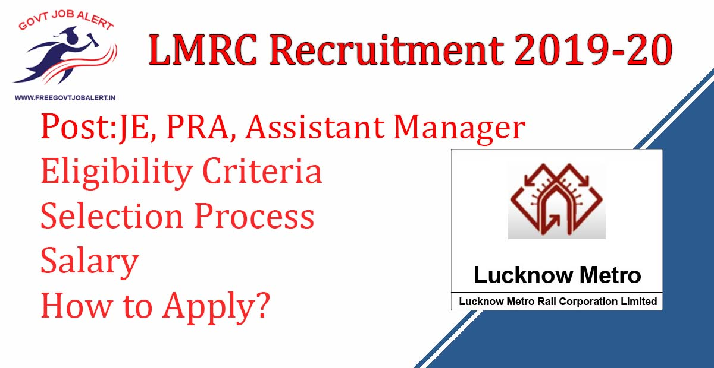
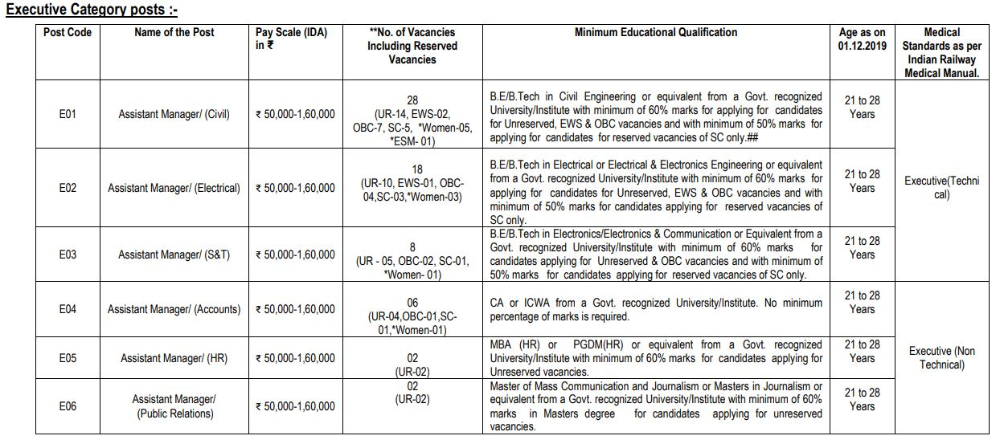
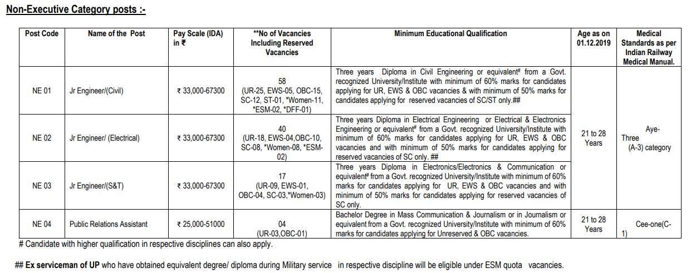

LMRC Recruitment 2019: Lucknow Metro Rail Corporation Ltd Has Released Notification for Recruitment of the post Assistant Manager, Jr Engineer, Public Relations Assistant. Online Applications are invited from young, dynamic and motivated candidates of Indian nationality for direct recruitment through online registration at www.lmrcl.com recruitment 2019. Lucknow metro job vacancy 2019 online Form Started on 22-11-2019.

## **LMRC Recruitment 2019-2020**

<table style="border-collapse: collapse; width: 100%;"><tbody><tr><td style="width: 50%; background-color: #2a5a8e; text-align: center;" colspan="2"><strong>LMRC Recruitment 2019</strong></td></tr><tr><td style="width: 50%; text-align: center;">Job Recruitment Board</td><td style="width: 50%; text-align: center;">Lucknow Metro Rail Corporation Ltd</td></tr><tr><td style="width: 50%; text-align: center;">Notification No.</td><td style="width: 50%; text-align: center;">LMRC/HR / Rectt/P/18/2019</td></tr><tr><td style="width: 50%; text-align: center;">Post</td><td style="width: 50%; text-align: center;">JE, PRA, Assistant Manager</td></tr><tr><td style="width: 50%; text-align: center;">Vacancies</td><td style="width: 50%; text-align: center;">183</td></tr><tr><td style="width: 50%; text-align: center;">Job Location</td><td style="width: 50%; text-align: center;">Lucknow/UP</td></tr><tr><td style="width: 50%; text-align: center;">Job Type</td><td style="width: 50%; text-align: center;">Railway Jobs</td></tr><tr><td style="width: 50%; text-align: center;">Application Mode</td><td style="width: 50%; text-align: center;">Online</td></tr></tbody></table>

LMRC recruitment 2019 notification has Published on his Official website on the date 20-11-2019. As Per Lucknow metro recruitment 2019, A total of 183 Vacancies are there. Applicants Should Have Age Between 21 to 28 Years. Candidates Must Have Completed B.E/ B.Tech/ CA/ MBA. Selected Candidates will be posted in Lucknow Metro Rail. Interested & Eligible Candidates can Apply for Lucknow metro job vacancy 2019.

<table style="border-collapse: collapse;"><tbody><tr><td style="width: 50%; background-color: #2a5a8e; text-align: center;" colspan="2"><h3><strong>LMRC Exam Important Dates</strong></h3></td></tr><tr><td style="width: 50%; text-align: center;">Notification Date</td><td style="width: 50%; text-align: center;">20-11-2019</td></tr><tr><td style="width: 50%; text-align: center;">Starting Date of Online Application</td><td style="width: 50%; text-align: center;">22-11-2019</td></tr><tr><td style="width: 50%; text-align: center;">Last Date of Online Application</td><td style="width: 50%; text-align: center;">23-12-2019</td></tr><tr><td style="width: 50%; text-align: center;">Fee Payment Between</td><td style="width: 50%; text-align: center;">22-11-2019 to 23-12-2019</td></tr><tr><td style="width: 50%; text-align: center;">Admit Card</td><td style="width: 50%; text-align: center;">03-01-2020</td></tr><tr><td style="width: 50%; text-align: center;">Written Exam</td><td style="width: 50%; text-align: center;">13-01-2020</td></tr></tbody></table>

Lucknow metro recruitment 2019 Details Like Education Qualification, Age Limits, Salary/Pay Scale, Selection Process, Application Fee, How to apply, etc. Given Below.

### **Lucknow Metro Job Vacancy 2019 Details**

- Assistant Manager: 64 Posts
- Jr Engineer: 115
- Public Relations Assistant: 04 Posts

### **LMRC Recruitment Selection Process**

i) For the post of Assistant Manager(Civil)(postcode-E01), Assistant Manager(Electrical)(postcode-E02), Assistant Manager(S&T)(postcode-E03), the selection methodology will comprise two-stage process –Written Test, followed by document verification & Medical examination in Executive(Technical) category.

ii) For the post of Assistant Manager/Accounts(postcode-E04), Assistant Manager/HR(postcode-E05), Assistant Manager(Public Relations)(postcode-E06), the selection methodology will comprise two-stage process –Written Test followed by Document verification & Medical examination in Executive(Non-Technical) category.

iii) For the post of Jr. Engineers, (postcodes NE01, NE02, NE03) the selection methodology will comprise a two-stage process – Written Test followed by Document verification & Medical examinations in Aye-Three (A-3) category.

iv) For the post of Public Relations Assistant, (post codes NE04 ) the selection methodology will comprise the two-stage process – Written Test followed by Document verification & Medical examination in Cee-One (C-1) category.

### **LMRC Vacancy Written Test**

Objective type Computer Based Test (CBT) for all the posts will be held on one or more days. The question paper will be bilingual i.e., in English and Hindi. It will consist of multiple-choice objective type questions to judge the knowledge of English language, General Awareness & Computer Applications, Logical Ability, Quantitative Aptitude and knowledge of the discipline.

- There will be a total of 140 questions for categories E-01 to E-06 & from NE-01 to NE-04.
- Each question carrying equal marks.
- There will be negative marking. For every wrong answer, 1/3 marks will be deducted.
- The Paper shall be of 2 hours duration.

### **LMRC Examination Centers**

Computer-based Test(CBT) will be held at Lucknow, Kanpur, Agra, Allahabad, Varanasi, Gorakhpur, Meerut, Jhansi, Bareilly, Gautam Buddha Nagar(Noida), Greater Noida, Ghaziabad, Aligarh, Moradabad, and Muzaffarnagar or any other city of U.P. (as per requirement).

### **Application Fee For LMRC Jobs 2019**

- UR & OBC candidates: Rs. 590/-
- SC/ST candidates: Rs. 236/-

Payment Mode: Online/Offline

- **On-Line Payment:** Application/ Processing Fee can be paid through ATM cum Debit Card of any bank/Credit Card of any bank/Net banking through any bank to make the online payment ONLY through State Bank of India (SBI ) Payment Gateway.
- **Off-Line Payment:** Download the preprinted Challan form for depositing application/processing fee through State Bank of India(SBI) Payment Gateway of the UPMRCL website (www.upmetrorail.com ) and make the cash payment in any State Bank of India (SBI) branches only during bank working hours.

### **How to Apply For LMRC Recruitment 2019-2020**

1. Candidates Go to LMRC Official Website: https://lmrcl.com
2. Find LMRC Recruitment 2019 in the Careers Section.
3. Click on Registration for New Candidates, if you are Registered the Login with your User Id and Date of Birth.
4. Fill up the Application Form.
5. upload Recruited Documents.
6. Pay Application Via Online or Offline.
7. Submit the Application Form.
8. Download and Save for Future Use.

### **Important Links For LMRC Recruitment 2019**

- LMRC Jobs Various Vacancy Online Form 2019: [Click Here](https://cdn.digialm.com//per/g01/pub/1139/ASM/WebPortal/1/index.html)
- Download LMRC Recruitment 2019 for 183 JE, PRA, Assistant Manager Vacancy Notification PDF: [Click Here](https://cdn.digialm.com//per/g01/pub/1139/ASM/WebPortal/1/PDF/UPMRCL_NOTIFICATION_2019.pdf)
- LMRC/UPMRCL Official Website: [Click Here](https://lmrcl.com/ "UP Metro Rail Corporation Limited")

Candidates can visit www.lmrcl.com to get more details about LMRC Recruitment 2019-20. To More Information About LMRC upcoming vacancy 2019-20, latest Updates, Admit Card, Syllabus, Result, Etc. It will be published on the official website. Also, visit Regularly our website [www.freegovtjobalert.in](https://freegovtjobalert.in "Free Govt Job Alert") for getting the Latest job Updates.
