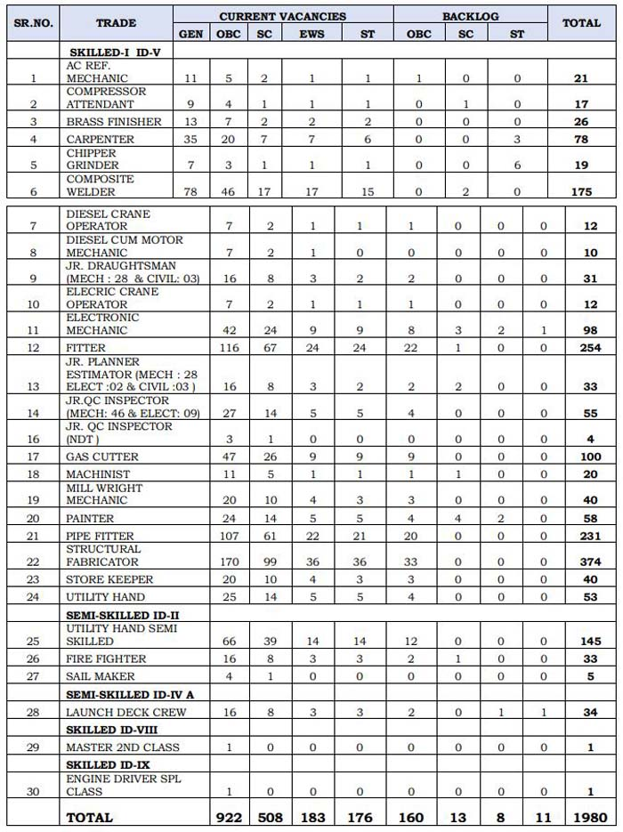

**Mazagon Dock Recruitment 2019**: Mazagon Dock Shipbuilders Limited (MDL) Has Published Notification of Various Post for Contract Basis. MDL Recruitment 2019 of Non-Executives On Fix Term Contract Basis For Maximum Period Two Years. good chance for 8th pass,10th pass 12th pass candidates can apply for this MDL Vacancy 2019. as per notification total 1980 vacancies in Mazagon Dock Shipbuilders Limited. Eligible & Interested Candidates can apply online MDL Official Website www.mazagondock.in. Candidates can fillup MDL Online Form 2019 Before Date 05-09-2019. Interested Candidates Read Mazagon Dock Recruitment official Notification 2019 Carefully Before Fillup MDL Application Form 2019. we mentioned all mazagon dock recruitment Details like Eligibility Criteria, Education Qualification, Experience, Age Limits, Salary, Selection Process, etc given in this Page Below...

## Mazagon Dock Recruitment For Various Post Vacancy Details

<table style="height: 5458px; width: 75.7166%; border-collapse: collapse; border-style: double;"><tbody><tr style="height: 80px;"><td style="width: 100%; text-align: center; height: 50px;" colspan="2"><strong>MAZAGON DOCK SHIPBUILDERS LIMITED</strong>

MDL Recruitment

1980 Vacancies</td></tr><tr style="height: 30px;"><td style="width: 100%; height: 30px; background-color: #2a5a8e; text-align: center;" colspan="2"><h3><strong>MDL Recruitment&nbsp;Important Dates</strong></h3></td></tr><tr style="height: 22px;"><td style="width: 50%; text-align: center; height: 22px;">Start Date of MDL Online Application</td><td style="width: 50%; text-align: center; height: 22px;"><strong>14-08-2019</strong></td></tr><tr style="height: 22px;"><td style="width: 50%; text-align: center; height: 22px;">Last Date of MDL Online Application</td><td style="width: 50%; text-align: center; height: 22px;"><strong>05-09-2019</strong></td></tr><tr style="height: 50px;"><td style="width: 50%; text-align: center; height: 50px;">Display of List of Eligible Candidates on MDL website</td><td style="width: 50%; text-align: center; height: 50px;"><strong>13-09-2019</strong></td></tr><tr style="height: 50px;"><td style="width: 50%; text-align: center; height: 50px;">Last Date for representation regarding ineligibility</td><td style="width: 50%; text-align: center; height: 50px;"><strong>18-09-2019</strong></td></tr><tr style="height: 50px;"><td style="width: 50%; text-align: center; height: 50px;">&nbsp;A date for the announcement of Online Examination (Tentative)</td><td style="width: 50%; text-align: center; height: 50px;"><strong>23-09-2019</strong></td></tr><tr style="height: 30px;"><td style="width: 100%; height: 30px; background-color: #2a5a8e; text-align: center;" colspan="2"><h3><strong>&nbsp;Vacancy Details</strong></h3></td></tr><tr style="height: 22px;"><td style="text-align: center; height: 22px; width: 50%;">Job Recruitment Board</td><td style="text-align: center; width: 50%; height: 22px;">Mazagon Dock Shipbuilders Limited</td></tr><tr style="height: 25px;"><td style="text-align: center; width: 50%; height: 25px;">Post Name</td><td style="text-align: center; width: 50%; height: 25px;">Various Posts</td></tr><tr style="height: 25px;"><td style="text-align: center; width: 50%; height: 25px;">No of Vacancies</td><td style="text-align: center; width: 50%; height: 25px;">1980 Posts</td></tr><tr style="height: 25px;"><td style="text-align: center; width: 50%; height: 25px;">Application Mode</td><td style="text-align: center; width: 50%; height: 25px;">Online</td></tr><tr style="height: 25px;"><td style="text-align: center; width: 50%; height: 25px;">Job Location</td><td style="text-align: center; width: 50%; height: 25px;">Mumbai</td></tr><tr style="height: 25px;"><td style="text-align: center; width: 50%; height: 25px;">Job Category</td><td style="text-align: center; width: 50%; height: 25px;">Maharashtra Contract Basis Jobs</td></tr><tr style="height: 25px;"><td style="width: 100%; background-color: #2a5a8e; text-align: center; height: 25px;" colspan="2"><strong>MDL Recruitment Category Wise Vacancy Details</strong></td></tr><tr style="height: 450px;"><td style="text-align: center; width: 100%; height: 407px;" colspan="2"></td></tr><tr style="height: 30px;"><td style="width: 100%; height: 30px; background-color: #2a5a8e; text-align: center;" colspan="2"><h3><strong>Eligibility Criteria&nbsp;</strong></h3></td></tr><tr style="height: 14px;"><td style="width: 50%; text-align: center; height: 14px;"><strong>Post Name</strong></td><td style="width: 50%; text-align: center; height: 14px;"><strong>Education Qualification &amp; Experience</strong></td></tr><tr style="height: 30px;"><td style="width: 50%; text-align: center; height: 30px;">AC. Ref. Mechanic</td><td style="width: 50%; height: 30px; text-align: left;"><ul><li>10th Pass</li><li>NAC Examination passed in the trade of “Refrigeration and Air Conditioning”.</li></ul></td></tr><tr style="height: 120px;"><td style="width: 50%; text-align: center; height: 120px;">Compressor Attendant</td><td style="width: 50%; text-align: left; height: 120px;"><ul><li>10th Pass</li><li>NAC examination in the trade of Millwright Mechanic/ Mechanic Machine Tool Maintenance.</li></ul></td></tr><tr style="height: 72px;"><td style="width: 50%; text-align: center; height: 72px;">Brass Finisher</td><td style="width: 50%; text-align: left; height: 72px;"><ul><li>NAC in the trade of Machinist without Shipbuilding experience.</li></ul></td></tr><tr style="height: 120px;"><td style="width: 50%; text-align: center; height: 120px;">Carpenter</td><td style="width: 50%; text-align: left; height: 120px;"><ul><li>8th Pass</li><li>National Apprenticeship Certificate Examination passed in the trade of “Carpenter”.</li></ul></td></tr><tr style="height: 142px;"><td style="width: 50%; text-align: center; height: 142px;">Chipper Grinder</td><td style="width: 50%; text-align: left; height: 142px;"><ul><li>10th Pass</li><li>NAC examination conducted by NCVT in the trade of Machinist / Machinist (Grinder) / Turner will be selected as “Trainee Chipper Grinder”.</li></ul></td></tr><tr style="height: 76px;"><td style="width: 50%; text-align: center; height: 76px;">Composite Welders</td><td style="width: 50%; text-align: left; height: 76px;"><ul><li>8th Pass</li><li>NAC Certificate</li></ul></td></tr><tr style="height: 120px;"><td style="width: 50%; text-align: center; height: 120px;">Diesel Crane Operator</td><td style="width: 50%; text-align: left; height: 120px;"><ul><li>10th Pass</li><li>NAC examination in the trade of Diesel Mechanic will be selected as “Trainee Diesel Crane Operator ”.</li></ul></td></tr><tr style="height: 98px;"><td style="width: 50%; text-align: center; height: 98px;">Diesel Cum Motor Mechanic</td><td style="width: 50%; text-align: left; height: 98px;"><ul><li>Passed SSC</li><li>NAC Examination passed in “Diesel Mechanic/Motor Vehicle Mechanic” trade</li></ul></td></tr><tr style="height: 164px;"><td style="width: 50%; text-align: center; height: 164px;">Jr. Draughtsman (Mechanical)</td><td style="width: 50%; text-align: left; height: 164px;"><ul><li>10th Pass</li><li>NAC Examination in the Trade of ‘Draughtsman’ in Mechanical Stream conducted by NCVT of the Directorate General of Employment &amp; Training, Ministry of Labour, Govt. of India</li></ul></td></tr><tr style="height: 164px;"><td style="width: 50%; text-align: center; height: 164px;">Jr. Draughtsman (Civil)</td><td style="width: 50%; text-align: left; height: 164px;"><ul><li>10th Pass</li><li>NAC Examination in the Trade of ‘Draughtsman’ in Civil Stream conducted by NCVT of the Directorate General of Employment &amp; Training, Ministry of Labour, Govt. of India.</li></ul></td></tr><tr style="height: 142px;"><td style="width: 50%; text-align: center; height: 142px;">Electric Crane Operator</td><td style="width: 50%; text-align: left; height: 142px;"><ul><li>10th Pass</li><li>NAC Examination passed in Electrician trade and having one-year experience in MDL/ Ship-building industry as Electric Crane Operator.</li></ul></td></tr><tr style="height: 98px;"><td style="width: 50%; text-align: center; height: 98px;">Electronic Mechanic</td><td style="width: 50%; text-align: left; height: 98px;"><ul><li>10th Pass</li><li>NAC Examination passed in the trade of “Electronic Mechanic”</li></ul></td></tr><tr style="height: 346px;"><td style="width: 50%; text-align: center; height: 346px;">Engine Driver Spl Class</td><td style="width: 50%; text-align: left; height: 346px;"><ul><li>Certificate of competency (1st Class) issued by Maharashtra Maritime Board/Mercantile Marine Dept. as per Indian Vessel Act. Knowledge of Swimming is compulsory.</li><li>Minimum 2 yrs experience as Engine Driver 1st Class.</li></ul>
OR

<ul><li>Ex-serviceman from Indian Navy of Engineering branch having 15 years of experience and holding IInd Class Engine Driver Qualified Certificate from MMB/MMD.</li></ul></td></tr><tr style="height: 50px;"><td style="width: 50%; text-align: center; height: 50px;">Fitter</td><td style="width: 50%; text-align: left; height: 50px;"><ul><li>10th Pass</li></ul></td></tr><tr style="height: 98px;"><td style="width: 50%; text-align: center; height: 98px;">Fire Fighter</td><td style="width: 50%; text-align: left; height: 98px;"><ul><li>10th Pass</li><li>Candidates must possess a valid Heavy Duty Vehicle Licence.</li></ul></td></tr><tr style="height: 102px;"><td style="width: 50%; text-align: center; height: 102px;">Jr.Planner Estimator (Mechanical)</td><td style="width: 50%; text-align: left; height: 102px;"><ul><li>10th Pass</li><li>12th Pass</li><li>full time three years Diploma.</li></ul></td></tr><tr style="height: 102px;"><td style="width: 50%; text-align: center; height: 102px;">Jr. Planner Estimator (Electrical/ Electronics)</td><td style="width: 50%; text-align: left; height: 102px;"><ul><li>10th Pass</li><li>12th Pass</li><li>full time three years Diploma.</li></ul></td></tr><tr style="height: 102px;"><td style="width: 50%; text-align: center; height: 102px;">Jr. Planner Estimator (Civil)</td><td style="width: 50%; text-align: left; height: 102px;"><ul><li>10th Pass</li><li>12th Pass</li><li>full time three years Diploma.</li></ul></td></tr><tr style="height: 208px;"><td style="width: 50%; text-align: center; height: 208px;">Jr. Q C Inspector (Mechanical)</td><td style="width: 50%; text-align: left; height: 208px;"><ul><li>10th Pass with full time three years Diploma in Mechanical ( Mechanical/Mechanical &amp; Industrial Engg./Mechanical &amp; Production Engg./Production Engg) OR</li><li>Marine Engineering in Examination conducted by Govt.of India recognized Technical Board.</li></ul></td></tr><tr style="height: 99px;"><td style="width: 50%; text-align: center; height: 99px;">Jr. QC Inspector (Elct./Elect.)</td><td style="width: 50%; text-align: left; height: 99px;">&nbsp;<ul><li>10th Pass</li><li>12th Pass</li><li>Full time three years’ Diploma in Electrical</li></ul></td></tr><tr style="height: 124px;"><td style="width: 50%; text-align: center; height: 124px;">Jr. QC Inspector (NDTMechanical)</td><td style="width: 50%; text-align: left; height: 124px;"><ul><li>10th Pass</li><li>12th Pass</li><li>full time three years Diploma in Mechanical Engineering.</li></ul></td></tr><tr style="height: 50px;"><td style="width: 50%; text-align: center; height: 50px;">Gas Cutter</td><td style="width: 50%; text-align: left; height: 50px;"><ul><li>10th Pass</li></ul></td></tr><tr style="height: 50px;"><td style="width: 50%; text-align: center; height: 50px;">Machinist</td><td style="width: 50%; text-align: left; height: 50px;"><ul><li>10th Pass</li></ul></td></tr><tr style="height: 230px;"><td style="width: 50%; text-align: center; height: 230px;">Master 2nd Class</td><td style="width: 50%; text-align: left; height: 230px;"><ul><li>Certificate of competency (2nd class Master) issued by the Maharashtra Maritime Board/Mercantile Marine Dept.</li><li>Minimum 3 yrs experience of operating Tugs from 226 to 565 BHP or Ex-serviceman from Indian navy with 15 years of experience and holding 2nd class Master qualified certificate from MMB/MMD.</li></ul></td></tr><tr style="height: 50px;"><td style="width: 50%; text-align: center; height: 50px;">Painter</td><td style="width: 50%; text-align: left; height: 50px;"><ul><li>8th Pass</li></ul></td></tr><tr style="height: 50px;"><td style="width: 50%; text-align: center; height: 50px;">Pipe Fitter</td><td style="width: 50%; text-align: left; height: 50px;"><ul><li>10th Pass</li></ul></td></tr><tr style="height: 212px;"><td style="width: 50%; text-align: center; height: 212px;">Laskar/Launch Deck Crew</td><td style="width: 50%; text-align: left; height: 212px;"><ul><li>10th Pass</li><li>DG shipping approved institutes will be considered. Knowledge of Swimming is Compulsory.</li><li>Non GP rating with 3-year experience as Crew on board Tug/Launch/Vessel of 226 BHP or above. Knowledge of Swimming is Compulsory.</li></ul></td></tr><tr style="height: 72px;"><td style="width: 50%; text-align: center; height: 72px;">Sail Maker</td><td style="width: 50%; text-align: left; height: 72px;"><ul><li>8th Pass std and the ITI in the trade of “Cutting &amp; Tailoring/Cutting &amp; Sewing”.</li></ul></td></tr><tr style="height: 50px;"><td style="width: 50%; text-align: center; height: 50px;">Structural Fabricator</td><td style="width: 50%; text-align: left; height: 50px;"><ul><li>10th Pass</li></ul></td></tr><tr style="height: 146px;"><td style="width: 50%; text-align: center; height: 146px;">Store Keeper</td><td style="width: 50%; text-align: left; height: 146px;"><ul><li>10th Pass</li><li>12th Pass</li><li>full time three years Engineering Diploma in Mechanical, Electrical, Electronics, Electronics.</li></ul></td></tr><tr style="height: 160px;"><td style="width: 50%; text-align: center; height: 160px;">Utility Hand(Skilled)</td><td style="width: 50%; text-align: left; height: 160px;"><ul><li>Candidates who have completed their NAC&nbsp;from the Trade “Fitter” or any other Trade and having one-year experience in Shipbuilding Industry as Utility Hand and experience in Gas /Welding Plant/Oxy Acetylene equipment, etc.</li></ul></td></tr><tr style="height: 186px;"><td style="width: 50%; text-align: center; height: 186px;">Utility Hand (SemiSkilled)</td><td style="width: 50%; text-align: left; height: 186px;"><ul><li>10th Pass</li><li>NAC in any trade and have worked in Shipbuilding industry as Utility Hand for a minimum period of one year may apply for the said post. However, the experience certificate should be certified by their Personnel Dept.</li></ul></td></tr><tr style="height: 50px;"><td style="width: 100%; text-align: center; height: 50px;" colspan="2"><strong>Period of Contract</strong>: The contract for all the above categories will be for the maximum period of two years.</td></tr><tr style="height: 30px;"><td style="width: 100%; background-color: #2a5a8e; text-align: center; height: 30px;" colspan="2"><h3><strong>MDL Recruitment posts Salary/Pay Scale</strong></h3></td></tr><tr style="height: 25px;"><td style="text-align: center; width: 50%; height: 25px;">Skilled Gr-I (IDA-IX)</td><td style="text-align: center; width: 50%; height: 25px;">Rs. 22000-Rs.83180</td></tr><tr style="height: 25px;"><td style="text-align: center; width: 50%; height: 25px;">Skilled Gr-I (IDA-VIII)</td><td style="text-align: center; width: 50%; height: 25px;">Rs. 21000-Rs.79380</td></tr><tr style="height: 25px;"><td style="text-align: center; width: 50%; height: 25px;">Skilled Gr-I (IDA-V)</td><td style="text-align: center; width: 50%; height: 25px;">Rs. 17000- Rs.64360</td></tr><tr style="height: 25px;"><td style="text-align: center; width: 50%; height: 25px;">Semi-Skilled Gr-I (IDA-IVA)</td><td style="text-align: center; width: 50%; height: 25px;">Rs. 16000-Rs.60520</td></tr><tr style="height: 25px;"><td style="text-align: center; width: 50%; height: 25px;">Semi-Skilled Gr-I (IDA-II)</td><td style="text-align: center; width: 50%; height: 25px;">Rs. 13200-Rs.49910</td></tr><tr style="height: 30px;"><td style="width: 100%; background-color: #2a5a8e; text-align: center; height: 30px;" colspan="2"><h3><strong>Age Limits &amp; Age Relaxation</strong></h3></td></tr><tr style="height: 189px;"><td style="text-align: center; width: 100%; height: 189px;" colspan="2"><ul><li style="text-align: left;">Minimum 18 Years</li><li style="text-align: left;">Maximum 35 Years</li></ul>
<strong>Age Relaxation:</strong>

<ul><li style="text-align: left;">OBC(NCL): 3 Years</li><li style="text-align: left;">SC/ST: 5 Years</li></ul></td></tr><tr style="height: 30px;"><td style="width: 100%; background-color: #2a5a8e; text-align: center; height: 30px;" colspan="2"><h3><strong>Selection Process</strong></h3></td></tr><tr style="height: 111px;"><td style="text-align: center; width: 100%; height: 111px;" colspan="2"><ol><li style="text-align: left;">Written Test: 30 %</li><li style="text-align: left;">Experience in Shipbuilding Industry: 20%</li><li style="text-align: left;">Trade Test: 50%</li></ol></td></tr><tr style="height: 30px;"><td style="width: 100%; height: 30px; background-color: #2a5a8e; text-align: center;" colspan="2"><h3><strong>Application Fee&nbsp;</strong></h3></td></tr><tr style="height: 30px;"><td style="width: 100%; text-align: center; height: 30px;" colspan="2"><ul><li style="text-align: left;">GEN/ OBC Candidates: <strong>Rs. 100/-</strong></li><li style="text-align: left;">SC/ ST/ PWD Candidates:<strong>&nbsp;Nil</strong></li></ul>
(The payment can be made using Debit Cards/Credit Cards/Net Banking/BHIM etc.)
</td></tr><tr style="height: 30px;"><td style="width: 100%; height: 30px; background-color: #2a5a8e; text-align: center;" colspan="2"><h3><strong>Important Links For MDL Recruitment</strong></h3></td></tr><tr style="height: 10px;"><td style="width: 50%; text-align: center; height: 10px;"><strong>Apply Online&nbsp;</strong></td><td style="width: 50%; text-align: center; height: 10px;"><strong><a title="Mazagon Dock Shipbuilders Ltd" href="https://mazagondock.in/MDLJobPortal/Registration.aspx" target="_blank" rel="noopener noreferrer">Registration</a>&nbsp;|&nbsp;<a title="Mazagon Dock Shipbuilders Ltd" href="https://mazagondock.in/MDLJobPortal/Login.aspx?msg=n" target="_blank" rel="noopener noreferrer">Login</a></strong></td></tr><tr style="height: 36px;"><td style="width: 50%; text-align: center; height: 23px;"><strong>Notification</strong></td><td style="width: 50%; text-align: center; height: 23px;"><a href="https://freegovtjobalert.in/wp-content/uploads/2019/08/Notification-Mazagon-Dock-Shipbuilders-Limited-Non-Executive-Posts-Advt-No.-90-2019.pdf" target="_blank" rel="noopener noreferrer"><strong>Click Here&nbsp;</strong></a></td></tr><tr style="height: 10px;"><td style="width: 50%; text-align: center; height: 10px;"><strong>&nbsp;Official Website</strong></td><td style="width: 50%; text-align: center; height: 10px;"><a href="https://mazagondock.in/" target="_blank" rel="noopener noreferrer"><strong>Click Here&nbsp;</strong></a></td></tr></tbody></table>

### How to Apply Mazagon Dock Recruitment Online Form 2019?

1. Log on to MDL website https://mazagondock.in
2. Go to Careers >> Online Recruitment >> Non-Executive
3. Click on Non- Executive Tab
4. Register by filling up relevant details & click on the “Submit” button.
5. Click on the validation link sent on email.
6. Login to MDL Online Portal with “Username” & “Password”
7. Select the job under Non-Executive Tab & view the “Eligibility Criteria”
8. While applying, a candidate should have the scanned copy of recent passport size color photograph, their signature & other relevant Certificates in JPEG format.
9. Read the instructions carefully and fill up all the details in the Online Application Form.
10. Candidates may enter ‘NA’ in the mandatory fields not applicable to them
11. Check the preview of the Application form and make corrections, if any. Any changes in the application form need to be edited before clicking on “Submit”.
12. Pay Application Fee.
13. Take a print of your MDL Recruitment application form with unique registration no. on or before the last date of application for future reference.
