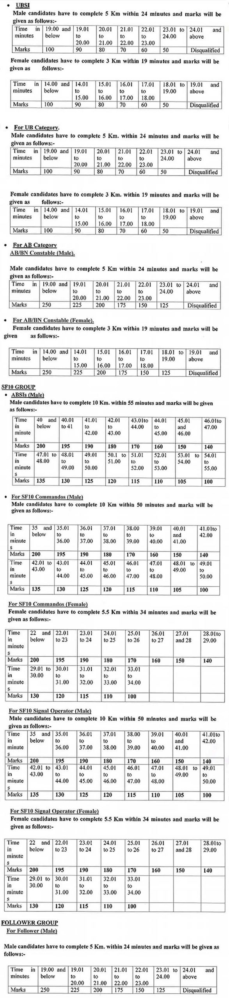

Meghalaya Police Eligibility Criteria 2019: MegPolice Recruitment Notification 2019 Publish on his Official website. As Per Meghalaya Police Recruitment 2019 Notification, A Total of 1015 Vacancies Are There. The Candidates Should Have 10th Pass, 12th Pass, Degree in Any Stream. Applicants Must Have Age Between 21 to 27 Years. Selected Candidates Will Be Posted in Meghalaya State. Good Chance For Those Meghalaya Candidates who Finding 10th Pass Jobs in Meghalaya. Interested & Eligible Candidates Can Apply Online For Meghalaya Police Vacancy 2019. Meghalaya Police SI, Constable Online Form 2019 Has Start on 12-11-2019.

## **Meghalaya Police Eligibility Criteria 2019**

Meghalaya police sf10 recruitment 2019 Details Like Education Qualification, Age limits, Salary/Pay Scale, Exam Pattern, How to apply Given [Here.](https://freegovtjobalert.in/meghalaya-police-recruitment/)

- Only Indian Citizens Domiciled in Meghalaya Are Eligible to Apply
- Candidates Should be Able to Speak Read And Write at least one of the Regional Languages of the State.

**Education Qualification**

<table style="border-collapse: collapse; width: 100%; height: 160px;"><tbody><tr style="height: 24px;"><td style="width: 54.3685%; text-align: center; background-color: #2a5a8e; height: 24px;"><strong>Post</strong></td><td style="width: 24.0822%; text-align: center; background-color: #2a5a8e; height: 24px;"><strong>Education Qualification</strong></td><td style="width: 21.5492%; text-align: center; background-color: #2a5a8e; height: 24px;"><strong>Age limits</strong></td></tr><tr style="height: 15px;"><td style="width: 54.3685%; text-align: center; height: 15px;">UB SI (Male &amp; Female)/SF10 ABSI (Male)</td><td style="width: 24.0822%; text-align: center; height: 15px;">Degree in any Stream</td><td style="width: 21.5492%; text-align: center; height: 15px;">21 to 27 Years</td></tr><tr style="height: 49px;"><td style="width: 54.3685%; text-align: center; height: 49px;">Unarmed Branch Constable/ Fireman/ Driver FM(Male)/ MPRO Operator &amp; Signal Operators (SF10)</td><td style="width: 24.0822%; text-align: center; height: 49px;">10+2 Passed</td><td style="width: 21.5492%; text-align: center; height: 49px;">18 to 21 Years</td></tr><tr style="height: 24px;"><td style="width: 54.3685%; text-align: center; height: 24px;">AB Constable/ Battalion Constable, Driver Constable(Male)</td><td style="width: 24.0822%; text-align: center; height: 24px;">9th Passed</td><td style="width: 21.5492%; text-align: center; height: 24px;">18 to 21 Years</td></tr><tr style="height: 24px;"><td style="width: 54.3685%; text-align: center; height: 24px;">Commandos/ Constable Operator (Male &amp; Female)</td><td style="width: 24.0822%; text-align: center; height: 24px;">10th Passed</td><td style="width: 21.5492%; text-align: center; height: 24px;">18 to 21 Years</td></tr><tr style="height: 24px;"><td style="width: 54.3685%; text-align: center; height: 24px;">Follower (Male) (AB/UB Group &amp; SF 10 Group)</td><td style="width: 24.0822%; text-align: center; height: 24px;">5th Passed</td><td style="width: 21.5492%; text-align: center; height: 24px;">18 to 27 Years</td></tr></tbody></table>

**Age Limits**

- Minimum 18 Years
- Maximum 27 Years
- SC/ST Candidates 5 Years of Relaxation

**Physical Standards**

**Hight:**

- Male:
    - General Candidates: 162 CM
    - SC/ST Candidates: 157 CM
- Female:
    - General Candidates: 157 CM
    - SC/ST Candidates: 152 CM

Note: There Shall be no Measurement of Weight and chest.

**Running/ Race**

AB/UB Group

- Male Candidates: 5KM Complete in 24 Minutes
- Female Candidates: 3KM Complete in 19 Minutes

SF10 Group

- Male Candidates: 10KM Complete in 55 Minutes
- Female Candidates: 5.5KM Complete in 34 Minutes

SF10 Commando/ Signal Operator 

- Male Candidates: 10KM Complete in 50 Minutes
- Female Candidates: 5.5KM Complete in 34 Minutes

Follower Group

- 5KM Race for Male Candidates Will Have to be completed within 24 Minutes

**Race Marking**

### **Meghalaya Police Recruitment 2019 Important Links** 

- Meghalaya SI, Constable AB/UB Police Online Form 2019: [Click Here](https://mpr2019.apply-gov.in/)
- Download Meghalaya SI, Constable AB/UB Police Recruitment 2019 Notification PDF: [Click Here](http://www.megpolice.gov.in/sites/default/files/advertisementmlpdt.12.11.2019.pdf)
- Meghalaya Police Official Website: [Click Here](http://www.megpolice.gov.in/)
