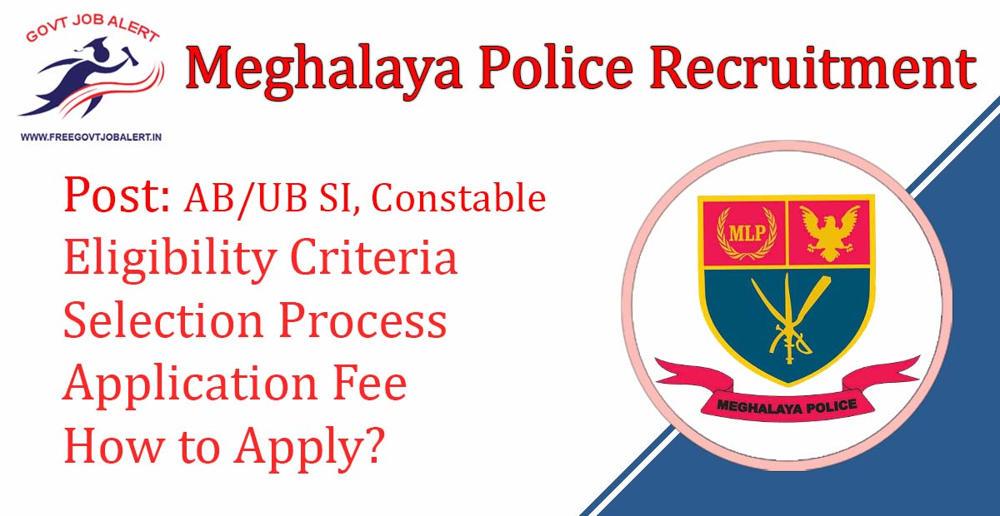
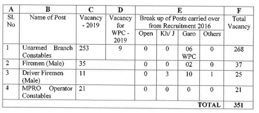
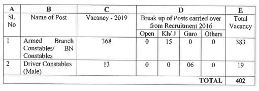
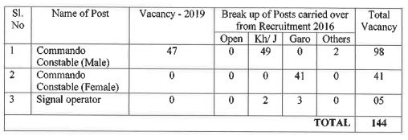
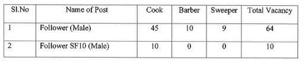
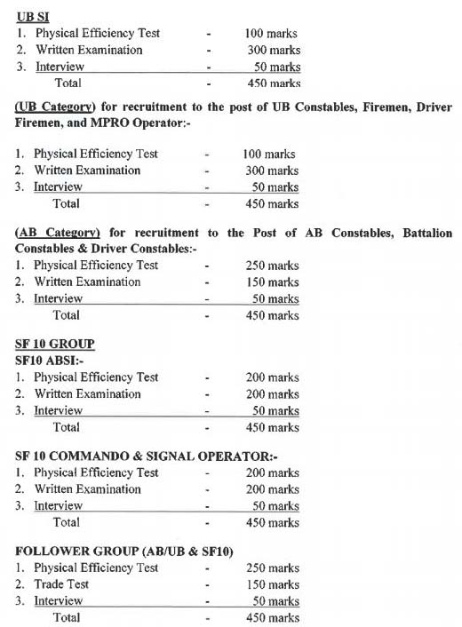

Meghalaya Police Recruitment 2019: Online Application Are Invited Through Meghalaya Police From Eligible Candidates Who Are Indian Citizens and Domicile in the state of Meghalaya to fill up SI, Constable & Other Vacancy in Meghalaya Police. As Per Meghalaya Police Recruitment 2019 Notification, A Total of 1015 Vacancies Are There. Meghalaya Police SI, Constable Online Form 2019 Has Start on 12-11-2019.

## **Meghalaya Police Recruitment 2019-20**

<table style="border-collapse: collapse; width: 100%;"><tbody><tr><td style="width: 50%; background-color: #2a5a8e; text-align: center;" colspan="2"><h3><strong>MegPolice Recruitment 2019</strong></h3></td></tr><tr><td style="width: 50%; text-align: center;">Job Recruitment Board</td><td style="width: 50%; text-align: center;">Meghalaya Police</td></tr><tr><td style="width: 50%; text-align: center;">Post</td><td style="width: 50%; text-align: center;">SI, Constable, Other</td></tr><tr><td style="width: 50%; text-align: center;">Vacancies</td><td style="width: 50%; text-align: center;">1015</td></tr><tr><td style="width: 50%; text-align: center;">Job Location</td><td style="width: 50%; text-align: center;">Across Meghalaya</td></tr><tr><td style="width: 50%; text-align: center;">Job Type</td><td style="width: 50%; text-align: center;">State jobs/Defence jobs</td></tr><tr><td style="width: 50%; text-align: center;">Application Mode</td><td style="width: 50%; text-align: center;">Online</td></tr></tbody></table>

MegPolice Recruitment Notification 2019 Publish on his Official website. The Candidates Should Have 10th Pass, 12th Pass, Degree in Any Stream. Applicants Must Have Age Between 21 to 27 Years. Selected Candidates Will Be Posted in Meghalaya State. Good Chance For Those Meghalaya Candidates who Finding 10th Pass Jobs in Meghalaya. Interested & Eligible Candidates Can Apply Online For Meghalaya Police Vacancy 2019.

<table style="border-collapse: collapse;"><tbody><tr><td style="width: 50%; background-color: #2a5a8e; text-align: center;" colspan="2"><h3><strong>Important Dates</strong></h3></td></tr><tr><td style="width: 50%; text-align: center;">Starting Date of Online Application</td><td style="width: 50%; text-align: center;">12-11-2019</td></tr><tr><td style="width: 50%; text-align: center;">Last Date of Online Application</td><td style="width: 50%; text-align: center;">14-12-2019</td></tr></tbody></table>

Meghalaya police sf10 recruitment 2019 Details Like Education Qualification, Age limits, Salary/Pay Scale, Physical Standards, Exam Pattern, How to apply Given Below.

### **Meghalaya Police Vacancy Details**

- UB Sub-Inspector: 41 Posts
- UB Category: 351 Posts

- AB Category: 402 Posts

- SF10 ABSI (Male): 03 Posts
- SF10 Commandos: 144 Posts

- Follower Group(AB&SF10): 74 Posts

### **Eligibility Criteria For Meghalaya Police Recruitment 2019**

Education Qualification

<table style="border-collapse: collapse; width: 100%; height: 160px;"><tbody><tr style="height: 24px;"><td style="width: 54.3685%; text-align: center; background-color: #2a5a8e; height: 24px;"><strong>Post</strong></td><td style="width: 24.0822%; text-align: center; background-color: #2a5a8e; height: 24px;"><strong>Education Qualification</strong></td><td style="width: 21.5492%; text-align: center; background-color: #2a5a8e; height: 24px;"><strong>Age limits</strong></td></tr><tr style="height: 15px;"><td style="width: 54.3685%; text-align: center; height: 15px;">UB SI (Male &amp; Female)/SF10 ABSI (Male)</td><td style="width: 24.0822%; text-align: center; height: 15px;">Degree in any Stream</td><td style="width: 21.5492%; text-align: center; height: 15px;">21 to 27 Years</td></tr><tr style="height: 49px;"><td style="width: 54.3685%; text-align: center; height: 49px;">Unarmed Branch Constable/ Fireman/ Driver FM(Male)/ MPRO Operator &amp; Signal Operators (SF10)</td><td style="width: 24.0822%; text-align: center; height: 49px;">10+2 Passed</td><td style="width: 21.5492%; text-align: center; height: 49px;">18 to 21 Years</td></tr><tr style="height: 24px;"><td style="width: 54.3685%; text-align: center; height: 24px;">AB Constable/ Battalion Constable, Driver Constable(Male)</td><td style="width: 24.0822%; text-align: center; height: 24px;">9th Passed</td><td style="width: 21.5492%; text-align: center; height: 24px;">18 to 21 Years</td></tr><tr style="height: 24px;"><td style="width: 54.3685%; text-align: center; height: 24px;">Commandos/ Constable Operator (Male &amp; Female)</td><td style="width: 24.0822%; text-align: center; height: 24px;">10th Passed</td><td style="width: 21.5492%; text-align: center; height: 24px;">18 to 21 Years</td></tr><tr style="height: 24px;"><td style="width: 54.3685%; text-align: center; height: 24px;">Follower (Male) (AB/UB Group &amp; SF 10 Group)</td><td style="width: 24.0822%; text-align: center; height: 24px;">5th Passed</td><td style="width: 21.5492%; text-align: center; height: 24px;">18 to 27 Years</td></tr></tbody></table>

Age Limits

- Minimum 18 Years
- Maximum 27 Years
- SC/ST Candidates 5 Years of Relaxation

Get Meghalaya Police Physical Standards Details: [Click Here](https://freegovtjobalert.in/meghalaya-police-eligibility-criteria/)

### **Salary/Pay Scale For Meghalaya Police Recruitment 2019**

- UB Sub-Inspector: Level-11 Rs. 37800/- - 86400/-
- UB Category: Level-4 Rs. 22200/- - 52400/-
- AB Category: Level-4 Rs. 22200/- - 52400/-
- SF10 ABSI (Male): Level-11 Rs. 37800/- - 86400/-
- SF10 Commandos: Level-4 Rs. 22200/- - 52400/-
- Follower Group(AB&SF10): Level-1 Rs. 17400/- - 41000/-

### **Meghalaya Police Recruitment 2019 Selection Process**

1. Physical Efficiency Test.
2. Written Exam.
3. Interview.

### **Exam Pattern For Meghalaya Police Recruitment 2019**

### **Meghalaya Police Written Exam Pattern & Syllabus**

UBSI Post:-

- General English: Precis Writing, Essay Writing, Drafting & English Grammar of 150 Marks to be Completed in 90 Minutes.
- Elementary Mathematics, Reasoning, and Basic Science of 50 Marks to be Completed in 30 Minutes.
- General knowledge of 100 Marks to be Completed in 60 Minutes.

UB Constable Post:-

- English Grammar & Usage 100 Marks.
- Arithmetic/ Elementary Science 100 Marks.
- General Knowledge 100 Marks.

AB Constable Posts:-

- English Grammar & Usage.
- Arithmetic/ Elementary Science.
- General Knowledge.
- This Paper Will be of Multiple Choice OMR Based Total 150 Marks.

SF10 ABSI Post:-

- General English: Precis Writing, Essay Writing, Drafting & English Grammar of 75 Marks to be Completed in 120 Minutes.
- Elementary Mathematics, Reasoning, and Basic Science of 50 Marks to be Completed in 60 Minutes.
- General knowledge of 75 Marks to be Completed in 75 Minutes.

SF10 Commando:-

- Elementary Knowledge of English, Basic Arithmetic, and Basic General Awareness (OMR Based) Total 200 Marks to be Completed in 60 Minutes.

### **Application Fee For Meghalaya Police Recruitment 2019**

- Application Fee: Rs. 50/-
- Payment Mode: EGRAS/ E- Challan Any Nationalized Bank.

### **How to Apply For Meghalaya Police Recruitment 2019**

1. Candidates Go to Meghalaya Police Official Website: http://www.megpolice.gov.in.
2. Find Meghalaya SI, Constable, AB/UB Police Recruitment 2019 Notification.
3. Click on Apply Online Button.
4. Fill up the Application Form.
5. Pay Application Fee.
6. Download Application For Future Use.
7. Done.

### **Important Documents For Meghalaya Police Recruitment 2019**

1. 4 Recent Passport Size Photos.
2. ST/SC Certificates of Meghalaya.
3. Age Certificates- HSLC/SSLC Certificates.
4. Education Qualification Certificates.
5. Additinationl Certificates.
6. No Objection Certificates for Government Employee.
7. Domicile Certificates For Open/General Category.
8. Photo Copies Of Certificates to Support claim of Bonus Marks Should Be Submitted at the PET.

### **Meghalaya Police Recruitment 2019 Important Links** 

- Meghalaya SI, Constable AB/UB Police Online Form 2019: [Click Here](https://mpr2019.apply-gov.in/)
- Download Meghalaya SI, Constable AB/UB Police Recruitment 2019 Notification PDF: [Click Here](http://www.megpolice.gov.in/sites/default/files/advertisementmlpdt.12.11.2019.pdf)
- Meghalaya Police Official Website: [Click Here](http://www.megpolice.gov.in/)

Candidates can visit www.megpolice.gov.in to get more details about Meghalaya Police Jobs 2019. Applicants can get all information Megpolice Jobs latest Updates, Admit Card, Result, Etc. It will be published on the official website. Also, visit Regularly our website [www.freegovtjobalert.in](https://freegovtjobalert.in) for getting the Latest job Updates.
