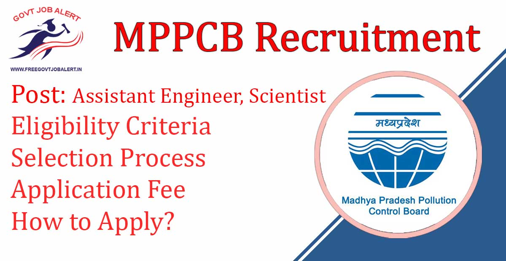

MPPCB Recruitment 2019: Madhya Pradesh Pollution Control Board Has Released Notification Regarding Assistant Engineer & Sincitist Post. The Board intends to recruit Assistant Engineer and invites Application From the Eligible Candidates who are Having Qualified GATE Scorecard with B.E/B.Tech. As Per MPPCB Recruitment 2019 Notification, A Total of 43 Vacancies Are There. MPPCB Assistant Engineer & Scientist Online Form 2019 has Last Date 30-11-2019.

## **MPPCB Recruitment 2019-20**

<table style="border-collapse: collapse; width: 100%;"><tbody><tr><td style="width: 50%; background-color: #2a5a8e; text-align: center;" colspan="2"><strong>MPPCB Recruitment 2019</strong></td></tr><tr><td style="width: 50%; text-align: center;">Job Recruitment Board</td><td style="width: 50%; text-align: center;">Madhya Pradesh Pollution Control Board</td></tr><tr><td style="width: 50%; text-align: center;">Notification No.</td><td style="width: 50%; text-align: center;">2753/2019/MPPCB</td></tr><tr><td style="width: 50%; text-align: center;">Post</td><td style="width: 50%; text-align: center;">Assistant Engineer &amp; Scientist</td></tr><tr><td style="width: 50%; text-align: center;">Vacancies</td><td style="width: 50%; text-align: center;">43</td></tr><tr><td style="width: 50%; text-align: center;">Job Location</td><td style="width: 50%; text-align: center;">Bhopal (MP)</td></tr><tr><td style="width: 50%; text-align: center;">Job Type</td><td style="width: 50%; text-align: center;">State Jobs</td></tr><tr><td style="width: 50%; text-align: center;">Application Mode</td><td style="width: 50%; text-align: center;">Online</td></tr></tbody></table>

MPPCB Recruitment Notification 2019 Publish on his Official website. The Candidates Should Have Completed Engineering/PG Degree. Applicants Must Have Age Between 21 to 25 Years. Selected Candidates Will Be Posted in Bhopal. Good Chance For Those Candidates who Finding Govt Jobs in Madhya Pradesh. Interested & Eligible Candidates Can Apply Online For MPPCB Vacancy 2019.

<table style="border-collapse: collapse;"><tbody><tr><td style="width: 50%; background-color: #2a5a8e; text-align: center;" colspan="2"><h3><strong>Important Dates</strong></h3></td></tr><tr><td style="width: 50%; text-align: center;">Starting Date of Online Application</td><td style="width: 50%; text-align: center;">Started</td></tr><tr><td style="width: 50%; text-align: center;">Last Date of Online Application</td><td style="width: 50%; text-align: center;">30-11-2019</td></tr></tbody></table>

MPPCB recruitment 2019 Details Like Education Qualification, Age limits, Salary/Pay Scale, Exam Pattern, How to apply Given Below.

### **MPPCB Vacancy 2019 Details**

- Assistant Engineer: 34 Posts

- Scientist: 09 Posts

### **MPPCB Recruitment 2019 Eligibility Criteria**

Education Qualification

Assistant Engineer:-

- Full Time B.E/ B.Tech. Environmental Engineering OR Civil/Chemical With Master Degree in Environmental From Recognized University.

Scientist:-

- Full-Time Zoology/ Botany/Chemistry/Environmental Science Post Graduation Degree From Recognized University.

Age Limits

- Minimum 21 Years
- Maximum:

### **Salary/Pay Scale For MPPCB Recruitment 2019**

- Rs. 56,100/-

### **MPPCB Recruitment Selection Process**

- Merit List

### **Application Fee For MPPCB Recruitment 2019**

- General Candidates: Rs. 1000/-
- SC/ST/PWD/OBC Candidates: Rs. 800/-
- Payment Mode: MP Online Kiosks

### **How to Apply For MPPCB Recruitment AE, Scientist**

1. Candidates Go to MP Online official Website:https://www.mponline.gov.in
2. Find MPPCB From the Application Section.
3. Click on Services.
4. Fill up the Application.
5. Upload Candidates Photo & Signature Images.
6. Click on Next.
7. Pay Application Fee.
8. Submit Application.
9. Download & Save For Future Use.
10. Done

### **Important Links For MPPCB Recruitment 2019**

- MPPCB Assistant Engineer & Scientist Online Form 2019: [Click Here](https://www.mponline.gov.in/Portal/Services/MPPCB/CB001/FRMApplication.aspx?NotificationId=Q0IwMDFG)
- Download MPPCB Assistant Engineer & Scientist Recruitment 2019 Notification PDF: [Click Here](http://www.mppcb.nic.in/proc/RECRUITMENT_FOR_POST_OF_ASSISTANT_ENGINEER_(ENVIRONMENT)&SCIENTIST.pdf)
- MPPCB Official Website: [Click Here](http://www.mppcb.mp.gov.in/)

Candidates can visit http://www.mppcb.nic.in to get more details about MPPCB Jobs 2019. Applicants can get all information MPPCB Vacancy 2019 latest Updates, Admit Card, Result, Etc. It will be published on the official website. Also, visit Regularly our website [www.freegovtjobalert.in](https://freegovtjobalert.in) for getting the Latest job Updates.
