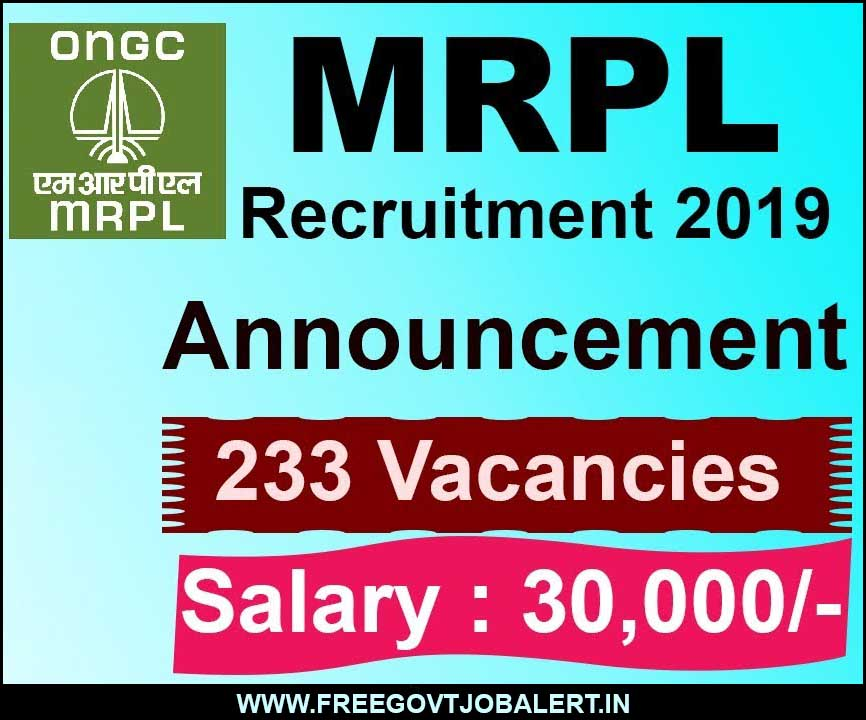
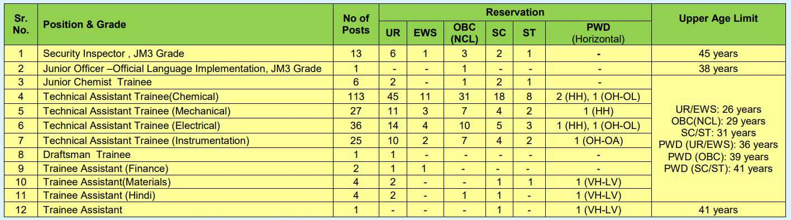

\[caption id="attachment\_1315" align="aligncenter" width="542"\] MRPL Recruitment 2019 apply for 233 Non-Management Cadre Vacancies\[/caption\]

MRPL Recruitment 2019: Mangalore Refinery and Petrochemicals Limited has Released Short Notice of recruitment for the various post. MRPL Invited application from eligible Indian candidates for various posts. This vacancy allocated for non-management cadre into Security Inspector, Junior Officer, Junior Chemist Trainee, Technical Assistant Trainee, Draftsman Trainee & Trainee Assistant posts. Good Chance for those candidates who are finding Central govt jobs in Karnataka State.

## MRPL Recruitment 2019 | Non-Management Cadre Vacancies

<table style="border-collapse: collapse; width: 100%;"><tbody><tr><td style="width: 50%; background-color: #2a5a8e; text-align: center;" colspan="2"><h3>MRPL Recruitment 2019</h3></td></tr><tr><td style="width: 50%; text-align: center;">Job Recruitment Board</td><td style="width: 50%; text-align: center;">Mangalore Refinery and Petrochemicals Limited</td></tr><tr><td style="width: 50%; text-align: center;">Advertisement No.</td><td style="width: 50%; text-align: center;">78/2019</td></tr><tr><td style="width: 50%; text-align: center;">Post&nbsp;</td><td style="width: 50%; text-align: center;">Various</td></tr><tr><td style="width: 50%; text-align: center;">Vacancies</td><td style="width: 50%; text-align: center;">233</td></tr><tr><td style="width: 50%; text-align: center;">Job Location&nbsp;</td><td style="width: 50%; text-align: center;">Karnataka</td></tr><tr><td style="width: 50%; text-align: center;">Job Type</td><td style="width: 50%; text-align: center;">Central Govt Jobs</td></tr><tr><td style="width: 50%; text-align: center;">Application Mode</td><td style="width: 50%; text-align: center;">Online</td></tr></tbody></table>

The Mangalore Refinery and Petrochemicals Limited has published recruitment notice on MRPL official website. as per the MRPL Recruitment Notification 2019, a total of 233 vacancies are there. To know About MRPL Mangalore recruitment 2019 Details like Education Qualification, age limits, Salary/Pay Scale, How to apply, etc Given below on this page. Interested & Eligible candidates can apply online Before 09-11-2019 at www.mrpl.co.in recruitment 2019

<table style="border-collapse: collapse; width: 100%;"><tbody><tr><td style="width: 50%; background-color: #2a5a8e; text-align: center;" colspan="2"><h3>Important Dates</h3></td></tr><tr><td style="width: 50%; text-align: center;">Starting Date for Submission of online application&nbsp;</td><td style="width: 50%; text-align: center;">11-10-2019</td></tr><tr><td style="width: 50%; text-align: center;">Last Date for Submission of online application</td><td style="width: 50%; text-align: center;">09-11-2019</td></tr></tbody></table>

### MRPL Vacancy Details

- Security Inspector, Grade-JM3: 13 Posts
- Junior Officer-official Language Implementation, Grade-JM3: 1 Post
- Junior Chemist Trainee: 6 Posts
- Technical Assistant Trainee(Chemical): 113 Posts
- Technical Assistant Trainee(Mechanical): 27 Posts
- Technical Assistant Trainee(Electrical): 36 Posts
- Technical Assistant Trainee(Instrumentation): 25 Posts
- Draftsman Trainee: 1 Post
- Trainee Assistant(Finance): 2 Posts
- Trainee Assistant(Materials): 4 Posts
- Trainee Assistant(Hindi): 4 Posts
- Trainee Assistant: 1 Post

Category Wise Vacancy Details

### Eligibility Criteria For MRPL Vacancy

Education Qualification 

<table style="border-collapse: collapse; width: 100%;"><tbody><tr><td style="width: 18.8566%; text-align: center; background-color: #2a5a8e;"><strong>Post Name</strong></td><td style="width: 81.1434%; text-align: center; background-color: #2a5a8e;"><strong>Education Qualification &amp; Experience&nbsp;</strong></td></tr><tr><td style="width: 18.8566%; text-align: center;">Security Inspector</td><td style="width: 81.1434%;"><ul><li>Graduate from recognized University with minimum 60 % marks in aggregate for UR/OBC (NCL)/EWS category and minimum 50% marks in aggregate for SC/ST category with proficiency of computers viz: MS Office: MS Word, PowerPoint &amp; Excel.</li><li>Minimum rank of Havildar in the Army or equivalent in Navy/Air Force with 15 years pensionable service with exemplary service record.</li></ul></td></tr><tr><td style="width: 18.8566%; text-align: center;">Junior Officer-Official Language Implementation</td><td style="width: 81.1434%;"><ul><li>Master’s degree in any subject with minimum 60 % marks.</li><li>The candidates should have a minimum eight years post qualification work experience of translation work from Hindi to English.</li></ul></td></tr><tr><td style="width: 18.8566%; text-align: center;">Junior Chemist Trainee</td><td style="width: 81.1434%;"><ul><li>Bachelor of Science (B.Sc.) in Chemistry with Chemistry/Analytical Chemistry/Industrial Chemistry/Polymer Chemistry/Applied Chemistry as principal subject with minimum 60% marks in aggregate for UR/OBC (NCL) category and minimum 50% marks in aggregate for SC/ST category.</li></ul></td></tr><tr><td style="width: 18.8566%; text-align: center;">Technical Assistant Trainee (Chemical)</td><td style="width: 81.1434%;"><ul><li>Diploma in Chemical Engineering or Technology/ Diploma in Petrochemical Engineering or Technology / Diploma in Polymer Engineering or Technology/ Diploma in Refinery Engineering or Technology with minimum 60% marks in aggregate for UR/OBC(NCL)/EWS category and minimum 50% marks in aggregate for SC/ST/PWD(HH)/PWD (OH-OL) category.</li></ul></td></tr><tr><td style="width: 18.8566%; text-align: center;">Technical Assistant Trainee (Mechanical)</td><td style="width: 81.1434%;"><ul><li>Diploma in Mechanical Engineering with minimum 60% marks in aggregate for UR/OBC (NCL)/EWS category and minimum 50% marks in aggregate for SC/ST/PWD(HH) category.</li></ul></td></tr><tr><td style="width: 18.8566%; text-align: center;">Technical Assistant Trainee (Electrical)</td><td style="width: 81.1434%;"><ul><li>Diploma in Electrical Engineering/ Electrical &amp; Electronics Engineering with minimum 60% marks in aggregate for UR/OBC (NCL)/EWS category and minimum 50% marks in aggregate for SC/ST/PWD-HH/PWD (OH-OL) category.</li></ul></td></tr><tr><td style="width: 18.8566%; text-align: center;">Technical Assistant Trainee (Instrumentation)</td><td style="width: 81.1434%;"><ul><li>Diploma in Electronics &amp; Instrumentation Engineering/ Instrument Technology/ Instrumentation &amp; Control Engineering/ Instrumentation &amp; Process Control/ Instrumentation Engineering/ Electronics &amp; Communication Engineering with minimum 60% marks in aggregate for UR/OBC (NCL)/EWS category and minimum 50% marks in aggregate for SC/ST/PWD (OH-OA) category</li></ul></td></tr><tr><td style="width: 18.8566%; text-align: center;">Draftsman Trainee</td><td style="width: 81.1434%;"><ul><li>Diploma in Mechanical Engineering with minimum 60% marks in aggregate and course completion certificate in AUTOCAD software.</li></ul></td></tr><tr><td style="width: 18.8566%; text-align: center;">Trainee Assistant (Finance)</td><td style="width: 81.1434%;"><ul><li>B.Com/ BBM graduates with a minimum 60% marks in aggregate.</li></ul></td></tr><tr><td style="width: 18.8566%; text-align: center;">Trainee Assistant (Materials)</td><td style="width: 81.1434%;"><ul><li>Bachelor Degree in Science/ Commerce/ Arts/BBM/ BBA/ BCA/ Diploma in any branch of Engineering with minimum 60% marks in aggregate for UR category and minimum 50% marks in aggregate for SC/ST/PWD-VH(LV) category. Knowledge of computers shall be considered as added advantage.</li></ul></td></tr><tr><td style="width: 18.8566%; text-align: center;">Trainee Assistant (Hindi)</td><td style="width: 81.1434%;"><ul><li>Graduate degree from recognized university with minimum 60% marks in aggregate for UR /OBC category and 50% marks in aggregate for SC/PWD VH(LV) with Hindi/English as a compulsory or elective /optional subject.</li></ul></td></tr><tr><td style="width: 18.8566%; text-align: center;">Trainee Assistant</td><td style="width: 81.1434%;"><ul><li>BA/BSc./B.Com/BBA/BBM/BCA degree with minimum 50% marks in aggregate.</li><li>Knowledge of computer is essential and shall be proficient in MS Office (MS Word, MS Excel &amp; MS PowerPoint). Candidates with Certificate in English Typewriting- Senior Grade shall be given preference.</li></ul></td></tr></tbody></table>

Age Limits

- Age Limits Mentioned in Category Wise Vacancy Details Image 

### MRPL Recruitment Selection Process

The selection process will consist of a Written Test followed by Skill Test (if required by MRPL), Physical Test (if required by MRPL) and Document Scrutiny. The candidates who are successful in the Written Test, Skill Test (if applicable) and Physical Test (if applicable) as per the criteria of MRPL will only be considered for Document Scrutiny. The Management reserves the right to add, modify or delete any test, as the case may be, to the selection process. The above tests are in addition to the mandatory pre-employment medical examination.

- Written Test

### MRPL Exam Syllabus & Exam Pattern

Written Test (Duration- 120 Minutes):

The Written Test will comprise of 120 Multiple Choice Questions, consisting of two sections;

(1) General Awareness of 40 marks (consisting of 40 objective questions) and

(2) Discipline/Subject of 80 marks (consisting of 80 objective questions) for a total of 120 minutes duration (Grand Total of 120 Marks).

- All questions carry 1 mark each. There will be no negative marking.
- The Question Papers for Written Test will be Bilingual i.e. in English & Hindi.
- The candidate has to choose his/her language for written test while applying.

The minimum percentage of marks required to qualify the written test shall be as under:

- Un-Reserved (UR)/ Economically Weaker Section (EWS) and OBC (Including Non-creamy layer) - 60%
- Scheduled Caste (SC)/ Scheduled Tribe(ST)/ Persons with Disability(PWD)- 50%

**MRPL Written Test Centre**

- The written test will be conducted at centres in Karnataka only.
- However, MRPL reserves the right to add any written test centre.
- No change in centre of examination will be allowed under any circumstances.
- MRPL reserves the right to cancel any Centre and ask the candidates of that Centre to appear from another Centre.
- MRPL also reserves the right to divert candidates of any Centre to some other Centre to take the examination.

### Salary/ Pay Scale for MRPL Jobs

<table style="border-collapse: collapse; width: 100%; height: 347px;"><tbody><tr style="height: 20px;"><td style="width: 50%; height: 20px; text-align: center; background-color: #2a5a8e;"><strong>Post</strong></td><td style="width: 50%; height: 20px; text-align: center; background-color: #2a5a8e;"><strong>Salary</strong></td></tr><tr style="height: 20px;"><td style="width: 50%; height: 20px; text-align: center;">Security Inspector, Grade-JM3</td><td style="width: 50%; height: 20px; text-align: center;">Rs. 13800/- to 38500/-</td></tr><tr style="height: 42px;"><td style="width: 50%; height: 42px; text-align: center;">Junior Officer-official Language Implementation, Grade-JM3</td><td style="width: 50%; height: 42px; text-align: center;">Rs. 13800/- to 38500/-</td></tr><tr style="height: 20px;"><td style="width: 50%; height: 20px; text-align: center;">Junior Chemist Trainee</td><td style="width: 50%; height: 265px; text-align: center;" rowspan="10">Rs. 30,000/- per month during the period of training&nbsp;</td></tr><tr style="height: 42px;"><td style="width: 50%; height: 42px; text-align: center;">Technical Assistant Trainee(Chemical)</td></tr><tr style="height: 42px;"><td style="width: 50%; height: 42px; text-align: center;">Technical Assistant Trainee(Mechanical)</td></tr><tr style="height: 42px;"><td style="width: 50%; height: 42px; text-align: center;">Technical Assistant Trainee(Electrical)</td></tr><tr style="height: 42px;"><td style="width: 50%; height: 19px; text-align: center;">Technical Assistant Trainee(Instrumentation)</td></tr><tr style="height: 20px;"><td style="width: 50%; height: 20px; text-align: center;">Draftsman Trainee</td></tr><tr style="height: 20px;"><td style="width: 50%; height: 20px; text-align: center;">Trainee Assistant(Finance)</td></tr><tr style="height: 20px;"><td style="width: 50%; height: 20px; text-align: center;">Trainee Assistant(Materials)</td></tr><tr style="height: 20px;"><td style="width: 50%; height: 20px; text-align: center;">Trainee Assistant(Hindi)</td></tr><tr style="height: 20px;"><td style="width: 50%; height: 20px; text-align: center;">Trainee Assistant</td></tr></tbody></table>

### MRPL Exam Application Fee

- General/OBC/EWS Candidates: Rs. 100/-
- SC/ST/PWD/Ex-Serviceman Candidates: Nil
- Fee Non-Refuntedal 
- Payment Mode: Online (Internet Banking, Debit/Credit Card, E-Challan Through SBI Bank)

### How to apply MRPL Recruitment Vacancy

1. Candidates first go to MRPL official website: [mrpl.co.in](https://mrpl.co.in/)
2. Then Goto Human Resource → Careers Section
3. Find and click on **Recruitment in Non-Management Cadre notified vide Advt. No. 78/2019**
4. Read Notification and click on apply
5. Fill up Application Form
6. Final Click on submit button
7. Download & Save Application For Future Use.
8. Done

### MRPL Recruitment 2019 Important Links

- MRPL Recruitment Non-Management Cadre Vacancies Online Form: [Click Here](https://www.eapplicationonline.com/MRPLAdvt782019/View/Index.aspx)
- MRPL Recruitment Non-Management Cadre Detailed Notification PDF: [Click Here](https://freegovtjobalert.in/wp-content/uploads/2019/10/Notification-MRPL-Jr-Officer-Chemist-Other-Posts.pdf)
- MRPL Recruitment Non-Management Cadre Notice: [Click Here](https://freegovtjobalert.in/wp-content/uploads/2019/10/MRPL-Recruitment-Non-Management-Cadre-notice.png)
- MRPL Official Website: [Click Here](https://mrpl.co.in/)
