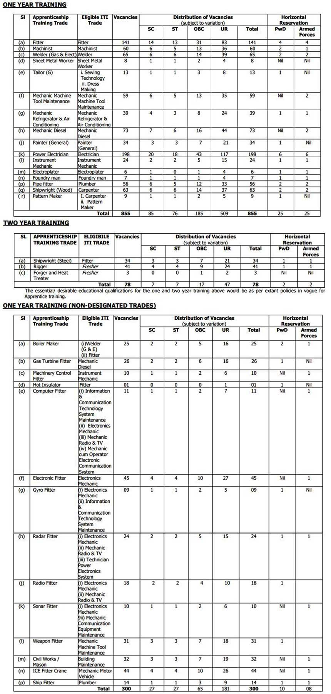

Naval Dockyard, Mumbai Apprentice invites online applications on www.bhartiseva.com from ITI qualified candidates (Male / Female) in various designated/ non-designated trades (except Rigger and Forger & Heat Treater ) for enrolment into Apprenticeship training. as per notification total 1233 vacancies on apprentice Training. ITI Completed Candidates Can fillup Apply Online Form. to know About Eligibility, Age limits, Minimum Physical Standards, Stipend, Etc. Given in this page below.

## Naval Dockyard Mumbai 1233 Apprentice Vacancies Details

<table style="height: 1052px; width: 84.9475%; border-collapse: collapse; border-style: double;"><tbody><tr style="height: 80px;"><td style="width: 100%; text-align: center; height: 50px;" colspan="2"><strong>Naval Dockyard, Mumbai</strong>

<strong>1233 Apprentice Vacancies&nbsp;2019</strong>

Designated/Non-designated</td></tr><tr style="height: 30px;"><td style="width: 100%; height: 30px; background-color: #2a5a8e; text-align: center;" colspan="2"><h3><strong>&nbsp;Important Dates</strong></h3></td></tr><tr style="height: 22px;"><td style="width: 50%; text-align: center; height: 22px;">Starting Date for Registration</td><td style="width: 50%; text-align: center; height: 22px;">02-09-2019</td></tr><tr style="height: 22px;"><td style="width: 50%; text-align: center; height: 22px;">Last Date for Registration</td><td style="width: 50%; text-align: center; height: 22px;">27-09-2019</td></tr><tr style="height: 30px;"><td style="width: 100%; height: 30px; background-color: #2a5a8e; text-align: center;" colspan="2"><h3><strong>&nbsp;Vacancy Details</strong></h3></td></tr><tr style="height: 22px;"><td style="text-align: center; height: 22px; width: 50%;">Job Recruitment Board</td><td style="text-align: center; width: 50%; height: 22px;">Naval Dockyard, Mumbai</td></tr><tr style="height: 25px;"><td style="text-align: center; width: 50%; height: 25px;">Post</td><td style="text-align: center; width: 50%; height: 25px;">Apprentice</td></tr><tr style="height: 25px;"><td style="text-align: center; width: 50%; height: 25px;">No of Vacancies</td><td style="text-align: center; width: 50%; height: 25px;">1233</td></tr><tr style="height: 25px;"><td style="text-align: center; width: 50%; height: 25px;">Job Location</td><td style="text-align: center; width: 50%; height: 25px;">Mumbai</td></tr><tr style="height: 25px;"><td style="text-align: center; width: 50%; height: 25px;">Application Mode</td><td style="text-align: center; width: 50%; height: 25px;">Online</td></tr><tr><td style="text-align: center; width: 100%;" colspan="2">

[caption id="attachment_1038" align="aligncenter" width="700"] Naval Dockyard Mumbai Apprentice[/caption]</td></tr><tr style="height: 30px;"><td style="width: 100%; height: 30px; background-color: #2a5a8e; text-align: center;" colspan="2"><h3><strong>Eligibility Criteria&nbsp;</strong></h3></td></tr><tr style="height: 14px;"><td style="text-align: center; height: 462px; width: 100%;" colspan="2">
<strong>Education Qualification:</strong>

<ul><li style="text-align: left;">Candidates Must Passed ITI With Relevant Trades.</li></ul>
<strong>Age Limits:</strong>

<ul><li style="text-align: left;">Born between 01 April 1999 to 31 Mar 2006.</li><li style="text-align: left;">(Upper age is relaxable by five years for SC/ST candidates and two years for wards of Defence employees or Naval civilians as per MoD letter FM/0442/NHQ/1278 D(N-II) dated 14 Nov 1996.)</li></ul>
<strong>Minimum Physical Standards:</strong>

<ul><li style="text-align: left;">Height 150 cm, Weight not less than 45 Kg, Chest expansion not less than 5 cm, Eye sight 6/6 to 6/9 (6/9 corrected with glasses), external &amp; internal organs to be normal.</li></ul>
<strong>Medical Examination:</strong>

<ul><li style="text-align: left;">Every candidate shall be medically examined and declared fit as per Rule 4 and Schedule II of Apprenticeship Rules, 1992 by the Employer, through a Govt Hospital before being engaged as an apprentice.</li></ul></td></tr><tr><td style="width: 100%; background-color: #2a5a8e; text-align: center;" colspan="2"><h3><strong>Payment of Stipend to Apprentices</strong></h3></td></tr><tr style="height: 124px;"><td style="text-align: center; width: 100%; height: 124px;" colspan="2">
<strong>During the first year of training</strong>: Seventy percentage of minimum wage of semi-skilled workers notified by the Maharashtra State

<strong>During the second year of training:</strong> Eighty percentage of minimum wage of semi-skilled workers notified by Maharashtra State.&nbsp;
</td></tr><tr style="height: 30px;"><td style="width: 100%; height: 30px; background-color: #2a5a8e; text-align: center;" colspan="2"><h3><strong>Application Fee&nbsp;</strong></h3></td></tr><tr style="height: 30px;"><td style="width: 100%; text-align: center; height: 30px;" colspan="2">None</td></tr><tr style="height: 30px;"><td style="width: 100%; height: 30px; background-color: #2a5a8e; text-align: center;" colspan="2"><h3><strong>Naval Dockyard Mumbai recruitment Important Links&nbsp;</strong></h3></td></tr><tr style="height: 10px;"><td style="width: 50%; text-align: center; height: 10px;"><strong>Apply Online&nbsp;</strong></td><td style="width: 50%; text-align: center; height: 10px;"><strong><a title="Naval Dockyard, Mumbai" href="https://register.bhartiseva.com/DTDAS19" target="_blank" rel="noopener noreferrer">Designated</a>&nbsp;|&nbsp;<a title="Naval Dockyard, Mumbai" href="https://register.bhartiseva.com/DASNDT19" target="_blank" rel="noopener noreferrer">Non-Designated</a></strong></td></tr><tr style="height: 36px;"><td style="width: 50%; text-align: center; height: 23px;"><strong>Notification</strong></td><td style="width: 50%; text-align: center; height: 23px;"><strong><a href="https://freegovtjobalert.in/wp-content/uploads/2019/09/Notification-Naval-Dockyard-Mumbai-Apprentice-Designated-Trades.pdf" target="_blank" rel="noopener noreferrer">Designated</a>&nbsp;|&nbsp;<a href="https://freegovtjobalert.in/wp-content/uploads/2019/09/Notification-Naval-Dockyard-Mumbai-Apprentice-Non-Designated-Trades.pdf" target="_blank" rel="noopener noreferrer">Non-Designated</a></strong></td></tr><tr style="height: 10px;"><td style="width: 50%; text-align: center; height: 10px;"><strong>&nbsp;Official Website</strong></td><td style="width: 50%; text-align: center; height: 10px;"><a href="http://www.bhartiseva.com/" target="_blank" rel="noopener noreferrer"><strong>Click Here</strong></a></td></tr></tbody></table>

### Naval Dockyard Examination Details:

**Scheme of Examination:**

- Candidates meeting the eligibility conditions as indicated by Eligible candidates would be called for written examination scheduled to be held at Mumbai on Dec 19.
- The written examination of 2 hrs duration would comprise of 100 Multiple Choice Questions on General Science, General Knowledge and Mathematics.

**Medium of Examination:**

- The question paper will be bilingual in both English & Hindi.

**Centre of Examination:**

- The Centre of examination will be Mumbai only. The exact date, time and venue of written examination would be intimated to candidates through online call-up letters on their registered email IDs only.
- Candidates are advised to check their email regularly.

**Shortlisting of Candidates for Written Examination:**

- Shortlisting of candidates for the written examination would be made trade wise as per extant policies, for the number of 1233 vacancies, and would be based with respect to valid online applications received as on the closing date of the advertisement. Shortlisted candidates would be called for Written Test to be held in Mumbai in Nov 2019

**Merit List / Selection Procedure:**

- Candidates placed in the preliminary Merit List on the basis of marks obtained in the written examination would be called for Interview / Skill Test in Jan 2020.
- The final merit list will be prepared by considering the consolidated marks of the written examination and Interview / Skill test as per Apprenticeship Trade (including reservations) with adequate candidates in the reserve list. In case of a tie, preference would be given to the candidate who has secured higher marks in ITI examination, followed by High School (Class 10) examination. Subsequently, candidates would be called for joining the apprenticeship training on the basis of merit standing (including medical fitness) as promulgated on website www.bhartiseva.com and through online communication on their registered email IDs. Candidates are advised to check their email regularly.

**Commencement of Training:** 

- April 2020.

**Travel / Expenses:**

- No travel expenses are admissible for candidates called for Written / Interview/ Skill Test.

**Boarding / Lodging:**

- Candidates called for Written / Interview / Skill Test are to arrange their own boarding and lodging. No accommodation will be provided to a candidate by the Naval Dockyard during the entire selection process.

### How to Fillup Naval Dockyard Mumbai Apprentice Online Form?

1. Candidates are required to log on to [www.bhartiseva.com](http://www.bhartiseva.com)
2. Goto **Apprenticeship Traning** Section.
3. You can see Designated/Non-designated Notification and Apply button.
4. Select and Click here to apply button.
5. Register your self
6. Fill up the Application Form.
7. Upload Candidate Images and Document image (SSC/Matriculation, Birth Certificate, Adhar card, ITI Marksheet)
8. Submit Application.
9. Done.

Naval Dockyard, Mumbai Apprentice  Naval Dockyard, Mumbai Apprentice Naval Dockyard, Mumbai Apprentice
