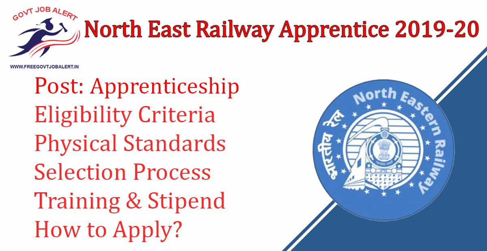
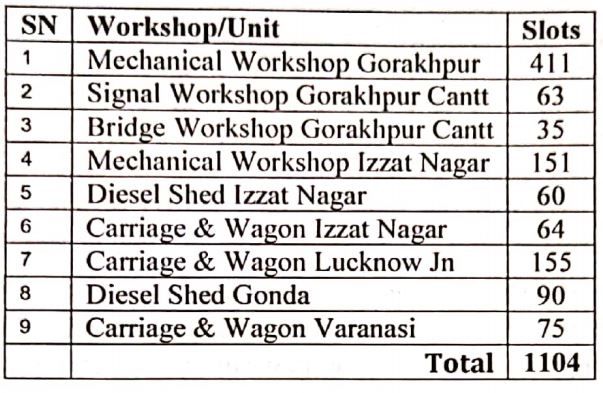
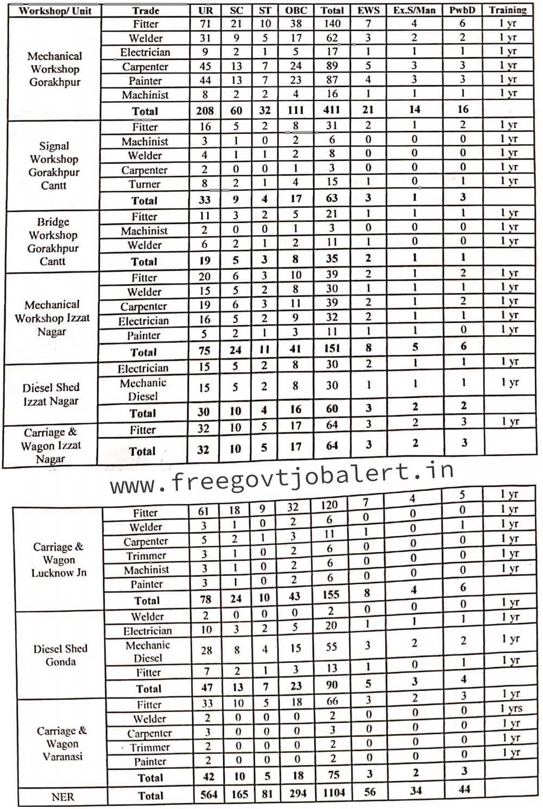

North East Railway Apprentice 2019: Rail Recruitment Cell, Gorakhpur/ North Eastern Railway has Released Advertisement For the Recruitment of act Apprentice Training. Online Application Through Railway Recruitment Cell, Gorakhpur is Invited from the Candidates fulfilling the prescribed conditions for undergoing Apprenticeship Training in North East Railway. RRC, North Eastern Railway Apprentice Online Form 2019 Has Start on 26-11-2019.

## **North East Railway Apprentice 2019**

<table style="border-collapse: collapse; width: 100%;"><tbody><tr><td style="width: 50%; background-color: #2a5a8e; text-align: center;" colspan="2"><strong>North East Railway Apprentice Recruitment 2019</strong></td></tr><tr><td style="width: 50%; text-align: center;">Job Recruitment Board</td><td style="width: 50%; text-align: center;">Rail Recruitment Cell, Gorakhpur</td></tr><tr><td style="width: 50%; text-align: center;">Notification No.</td><td style="width: 50%; text-align: center;">RRC, North East Railway Apprentice</td></tr><tr><td style="width: 50%; text-align: center;">Post</td><td style="width: 50%; text-align: center;">Apprentice</td></tr><tr><td style="width: 50%; text-align: center;">Vacancies</td><td style="width: 50%; text-align: center;">1104</td></tr><tr><td style="width: 50%; text-align: center;">Job Location</td><td style="width: 50%; text-align: center;">North East Railway</td></tr><tr><td style="width: 50%; text-align: center;">Job Type</td><td style="width: 50%; text-align: center;">Railway Jobs</td></tr><tr><td style="width: 50%; text-align: center;">Application Mode</td><td style="width: 50%; text-align: center;">Online</td></tr></tbody></table>

North Eastern Railway Recruitment 2019 Notification Published On his Official website. The Candidates Must Have 10th Pass and ITI Completed. Applicants Should Have Age Between 15 to 24 Years. Selected Candidates Will be Placed in North East Railway. Good Chance For those Candidates who Finding 10th Pass Jobs in Railway, they Can Apply Online at www.ner.indianrailways.gov.in Before 25-12-2019.

<table style="border-collapse: collapse;"><tbody><tr><td style="width: 50%; background-color: #2a5a8e; text-align: center;" colspan="2"><h3><strong>North East Railway Apprentice Important Dates</strong></h3></td></tr><tr><td style="width: 50%; text-align: center;">Starting Date of Online Application</td><td style="width: 50%; text-align: center;">26-11-2019</td></tr><tr><td style="width: 50%; text-align: center;">Last Date of Online Application</td><td style="width: 50%; text-align: center;">25-12-2019</td></tr></tbody></table>

North Eastern Railway Gorakhpur Vacancy Details Like Education Qualification, Age Limits, Physical Standard, Processing Fee, Selection Process, Training & Stipend, how to apply, etc. Given Below.

### **North Eastern Railway Gorakhpur Vacancy Details**

- Act Apprentice: 1104 Posts

North East Railway Apprentice 2019 | Category Wise 1104 North Eastern Railway Gorakhpur Vacancy Details

### **North East Railway Apprentice Recruitment 2019 Eligibility Criteria**

Education Qualification

- The Candidates Should Have Passed 10th With Minimum 50% Marks & ITI in Notified Trade on the Date of Issue of Notification. 

Age Limits

- Minimum: 15 Years
- Maximum:
    - General Candidates: 24 Years
    - OBC Candidates: 27 Years
    - SC/ST Candidates: 29 Years
    - Divyang Candidates: 34 Years

### **Physical Standard For North Eastern Railway Apprentice Recruitment**

- Selected Candidates Called For Document Verification Will Have to Submit Medical Certificate in Prescribed Format Issued by Authorized Medical Officer as Per Medical Certificate Proforma Enclosed Herewith. Eligibility of Divyang for Perticuler Trade Shall be Governed by Railway Board Guidelines. 

### **North Eastern Railway Apprentice Training & Stipend**

- Training Will be Arranged in Accordance with Standards and Syllabus Prescribed by the Central Apprenticeship Council.
- The Selected Candidates Will be Paid Stipend During Apprenticeship at the Prescribed Rates as Per Extant Instructions.

### **Selection Process For North Eastern Railway Apprentice**

- Selection Will Be Based on the Percentage of Marks Obtained in High School/10th Passed Exam.

### **North East Railway Apprentice Application Fee** 

- General Candidates: Rs. 100/-
- SC/ST/EWS/Divyang/Women: Exempted From Application Fee.
- Payment Mode: Online

### **How to Apply For North East Railway Apprentice 2019**

1. Candidates Go to NER Official Website:https://ner.indianrailways.gov.in
2. Then Find and Click on Act Apprentice 2019-20.
3. After then You can see Click Here Button Click on.
4. Fill up the Application Form.
5. Upload Candidates Image and Signature Image.
6. Submit the Application Form.
7. Pay Application Fee.
8. Than Last, Download & Save Application Form Fore Future Use.
9. Done.

### **Important Links For North East Railway Apprentice 2019**

- North East Railway Apprentice Recruitment 2019 Online Form: [Click Here](http://www.nergkp.org/apply_online_ner_act_apprentice_training_2019_1349.php?randID=1329949289)
- Download 1104 North East Railway Apprentice 2019 Notification PDF: [Click Here](http://www.ner.indianrailways.gov.in/uploads/files/1574677643274-aapp.pdf)
- North East Railway Official Website: [Click Here](https://ner.indianrailways.gov.in/)

Candidates can visit https://ner.indianrailways.gov.in to get more details about RRC, North Eastern Railway Apprentice Online Form 2019. To More Information About North Eastern Railway upcoming vacancy 2019-20, latest Updates, Admit Card, Syllabus, Result, Etc. It will be published on the official website. Also, visit Regularly our website [www.freegovtjobalert.in](https://freegovtjobalert.in "Free Govt job Alert") for getting the Latest job Updates.
