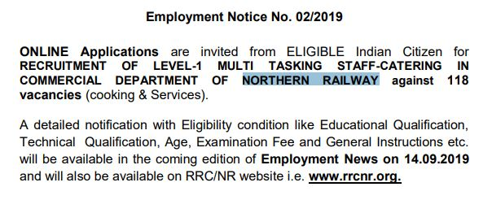

**Northern Railway Recruitment 2019**: Railway Recruitment Cell Released a Short Notice For Recruitment of Level-1 Multi Tasking Staff Catering In Commercial Department of North Railway Recruitment(Northern Railway Recruitment MTS). As Per Notice Total of 118 Vacancies in MTS. **Multi Tasking Staff for catering** (Cooking & Services). A Full Details Notification With Eligibility Condition, Education Qualification, Age Limits, Examination Fee, **RRC northern railway multi tasking staff online form 2019** And General Instructions will Be Avelebl in the Coming of **RRC Employment News** on 14-09-2019.

## RRC Northern Railway Recruitment MTS Vacancy Details

<table style="height: 449px; width: 84.9475%; border-collapse: collapse; border-style: double;"><tbody><tr style="height: 80px;"><td style="width: 100%; text-align: center; height: 50px;" colspan="2">Railway Recruitment Cell

Northern Railway Recruitment 2019

MTC 118 Vacancies</td></tr><tr style="height: 30px;"><td style="width: 100%; height: 30px; background-color: #2a5a8e; text-align: center;" colspan="2"><h3><strong>&nbsp;Important Dates For Northern Railway MTS Recruitment 2019</strong></h3></td></tr><tr style="height: 22px;"><td style="width: 50%; text-align: center; height: 22px;">Date of Full Details Notifications</td><td style="width: 50%; text-align: center; height: 22px;">14-09-2019</td></tr><tr style="height: 30px;"><td style="width: 100%; height: 30px; background-color: #2a5a8e; text-align: center;" colspan="2"><h3><strong>Northern railway vacancy 2019 Details</strong></h3></td></tr><tr style="height: 22px;"><td style="text-align: center; height: 22px; width: 50%;">Job Recruitment Board</td><td style="text-align: center; width: 50%; height: 22px;">RRC Northern Railway</td></tr><tr style="height: 22px;"><td style="text-align: center; width: 50%; height: 22px;">Post Name</td><td style="text-align: center; width: 50%; height: 22px;">Multi Tasking Staff</td></tr><tr style="height: 22px;"><td style="text-align: center; width: 50%; height: 22px;">No of Vacancies</td><td style="text-align: center; width: 50%; height: 22px;">118</td></tr><tr style="height: 22px;"><td style="text-align: center; width: 50%; height: 22px;">Job Category</td><td style="text-align: center; width: 50%; height: 22px;"><a href="https://freegovtjobalert.in/railway-recruitment/" target="_blank" rel="noopener noreferrer">Railway Jobs</a></td></tr><tr style="height: 22px;"><td style="text-align: center; width: 50%; height: 22px;">Application Mode</td><td style="text-align: center; width: 50%; height: 22px;">Online</td></tr><tr style="height: 30px;"><td style="width: 100%; height: 30px; background-color: #2a5a8e; text-align: center;" colspan="2"><h3><strong>Eligibility Criteria&nbsp;</strong></h3></td></tr><tr style="height: 14px;"><td style="width: 50%; text-align: center; height: 14px;"><strong>Education Qualification</strong></td><td style="width: 50%; text-align: center; height: 14px;"><strong>Age Limits</strong></td></tr><tr style="height: 30px;"><td style="width: 50%; text-align: center; height: 30px;">Available Soon</td><td style="width: 50%; text-align: center; height: 30px;">Available Soon</td></tr><tr style="height: 30px;"><td style="width: 100%; height: 30px; background-color: #2a5a8e; text-align: center;" colspan="2"><h3><strong>Application Fee&nbsp;</strong></h3></td></tr><tr style="height: 30px;"><td style="width: 100%; text-align: center; height: 30px;" colspan="2">Available Soon</td></tr><tr style="height: 30px;"><td style="width: 100%; height: 30px; background-color: #2a5a8e; text-align: center;" colspan="2"><h3><strong>Important Links&nbsp;</strong></h3></td></tr><tr style="height: 10px;"><td style="width: 50%; text-align: center; height: 10px;"><strong>Apply Online&nbsp;</strong></td><td style="width: 50%; text-align: center; height: 10px;">Available Soon</td></tr><tr style="height: 36px;"><td style="width: 50%; text-align: center; height: 23px;"><strong>Detailed Notification</strong></td><td style="width: 50%; text-align: center; height: 23px;"><strong>14-09-2019</strong></td></tr><tr><td style="width: 50%; text-align: center;"><strong>Short Notice</strong></td><td style="width: 50%; text-align: center;"><a href="https://freegovtjobalert.in/wp-content/uploads/2019/08/Notification-RRC-Northern-Railway-Multi-Tasking-Staff-Posts.pdf" target="_blank" rel="noopener noreferrer"><strong>Click Here</strong></a></td></tr><tr style="height: 10px;"><td style="width: 50%; text-align: center; height: 10px;"><strong>&nbsp;Official Website</strong></td><td style="width: 50%; text-align: center; height: 10px;"><a href="http://rrcnr.org/" target="_blank" rel="noopener noreferrer"><strong>Click Here</strong></a></td></tr></tbody></table>

> Full Details Notification Published on **14-09-2019**
