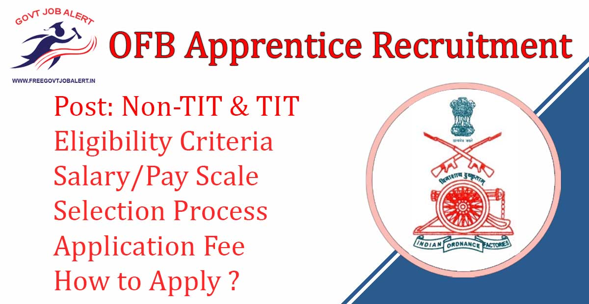

\[caption id="attachment\_1562" align="aligncenter" width="1200"\] OFB Apprentice Recruitment For Non-TIT & TIT\[/caption\]

**OFB Apprentice Recruitment 2020:** Ordnance Factory Board has Released Short Notification for the recruitment for the Apprentice of ITI & Non-TIT. Online applications from Indian citizens shall be invited for engagement of 56th batch (for Non-ITI & ITI Category) of Trade Apprentices in Ordnance & Ordnance Equipment Factories located in different states across India. As per OFB Recruitment Notification, a total of 4805 vacancies are there in which 1595 Non-TIT & 3210 TIT. OFB Trade Apprentice Online Form 2019 has been Starting in Last Week of December 2019 at ofb.gov.in recruitment 2019

## **OFB Apprentice Recruitment 2019-20**

<table style="border-collapse: collapse; width: 100%;"><tbody><tr><td style="width: 50%; background-color: #2a5a8e; text-align: center;" colspan="2"><strong>OFB Recruitment 2020</strong></td></tr><tr><td style="width: 50%; text-align: center;">Job Recruitment Board</td><td style="width: 50%; text-align: center;">Ordnance Factory Recruitment Centre (OFRC)</td></tr><tr><td style="width: 50%; text-align: center;">Notification No.</td><td style="width: 50%; text-align: center;">-</td></tr><tr><td style="width: 50%; text-align: center;">Post</td><td style="width: 50%; text-align: center;">Non-TIT &amp; TIT</td></tr><tr><td style="width: 50%; text-align: center;">Vacancies</td><td style="width: 50%; text-align: center;">4805</td></tr><tr><td style="width: 50%; text-align: center;">Job Location</td><td style="width: 50%; text-align: center;">Nagpur/Maharastra</td></tr><tr><td style="width: 50%; text-align: center;">Job Type</td><td style="width: 50%; text-align: center;">Maharastra State Jobs</td></tr><tr><td style="width: 50%; text-align: center;">Application Mode</td><td style="width: 50%; text-align: center;">Online</td></tr></tbody></table>

Ordnance factory recruitment 2019 free job alert Details Notification will be Published on his Official Website. The candidates must have 10th Pass With TIT. Applicants Should have Age Between 15 to 24 Years. Selected Candidates will be Placed in Maharashtra State. Good Chance For Those Candidates Who Finding 10th Pass Jobs in Maharastra. To Know About ordnance factory vacancy 2019 Details Like Eligibility Criteria, Age Limits, Salary, Selection Process, How to apply, etc. given below on this page.

<table style="border-collapse: collapse;"><tbody><tr><td style="width: 50%; background-color: #2a5a8e; text-align: center;" colspan="2"><h3><strong>Important Dates</strong></h3></td></tr><tr><td style="width: 50%; text-align: center;">Starting Date of Online Application</td><td style="width: 50%; text-align: center;">last week of December’ 2019</td></tr><tr><td style="width: 50%; text-align: center;">Last Date of Online Application</td><td style="width: 50%; text-align: center;">-</td></tr></tbody></table>

### **OFB Apprentice Recruitment Vacancy Details**

- Non-TIT Apprentice: 1595 Posts
- TIT Apprentice: 3210 Posts

### **Eligibility Criteria For OFB Apprentice Recruitment**

Education Qualification

- Non-TIT: 10th Pass with Minimum 50% Marks in aggregate and with 40% marks in Mathematics and Science
- TIT: Candidates should Be Passed relevant trade test from any institute recognized by NCVT or SCVT or any other authority specified through Gazette notification of Ministry of Skill Development and Entrepreneurship/Ministry of Labour and Employment with duration as per the Apprentice Act 1961 plus passed Madhyamik / Class X std or equivalent

Age Limits

- Between 15 to 24 years as on the last date of submission of Online Application. Relaxation in Upper age limit is admissible as per Govt Rules

### **OFB Apprentice** **Salary/Pay Scale**

- Check Official Notification For Salary/Pay Scale Details

### **OFB Apprentice Recruitment** **Selection Process** 

- Check Official Notification

### **OFB Apprentice Recruitment** **Application Fee**

- Check Official Notification

### **How to Apply For** **OFB Apprentice Recruitment** **2019**

1. Applicants Go to Apprinceship official website: https://apprenticeship.gov.in
2. Find and Click on Apprentice Registration.
3. Fill up Registration Details Like Personal Details, Contact, Qualification, Technical Qualification, Trade Preference
4. Upload Required Images.
5. Submit the Application Form
6. Preview and Download For Future Use.
7. Done

### **Important Links For** **OFB Apprentice Recruitment**

- OFB Trade Apprentice Online Form 2019: Click Here
- Download OFB Trade Apprentice Short Notice PDF 2019 [Click Here](https://ofb.gov.in/uploads/unit/0/TA%2056th%20Short%20Advt.pdf)
- Ordnance Factory Board Official Website: [Click Here](https://www.ofb.gov.in/)

Candidates can visit www.ofb.gov.in to get more details about Ordnance factory recruitment 2019-20. Full information will be updated in Some time. To More Information About Upcoming Vacancy in Ordnance Factory 2019-20, Admit Card, Syllabus, Result, Etc. It will be published on Official website. Also, visit Regularly our website [www.freegovtjobalert.in](https://freegovtjobalert.in) for getting the Latest job Updates.
