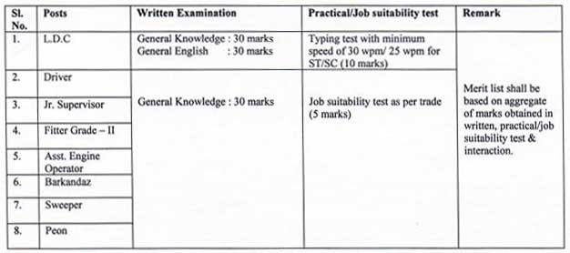

PHED Manipur Recruitment 2019: Public Health Engineering Department, Manipur has released the recruitment notification for the various posts. PHED Manipur Invited Application from the intending & Eligible candidates through sponsorship of concerned Employment Exchange for direct recruitment of 154 posts of group C & group D in this Department regularly. PHED Manipur Vacancy application form has stared on 07-10-2019 to 09-11-2019.

## PHED Manipur recruitment 2019 | 154 Various Vacancies

<table style="border-collapse: collapse; width: 100%; height: 108px;"><tbody><tr style="height: 28px;"><td style="width: 50%; height: 28px; background-color: #2a5a8e;" colspan="2"><h3 style="text-align: center;">PHED Manipur recruitment 2019</h3></td></tr><tr style="height: 16px;"><td style="width: 50%; height: 10px; text-align: center;">Job Recruitment Board</td><td style="width: 50%; height: 10px; text-align: center;">Public Health Engineering Department(PHED), Manipur</td></tr><tr style="height: 10px;"><td style="width: 50%; height: 10px; text-align: center;">Post</td><td style="width: 50%; height: 10px; text-align: center;">Various Posts</td></tr><tr style="height: 10px;"><td style="width: 50%; height: 10px; text-align: center;">Vacancies</td><td style="width: 50%; height: 10px; text-align: center;">154 Posts</td></tr><tr style="height: 34px;"><td style="width: 50%; height: 10px; text-align: center;">Job Location</td><td style="width: 50%; height: 10px; text-align: center;">Manipur</td></tr><tr style="height: 10px;"><td style="width: 50%; height: 10px; text-align: center;">Application Mode</td><td style="width: 50%; height: 10px; text-align: center;">Offline</td></tr></tbody></table>

The Public Health Engineering Department, Manipur has Published Notification and Application form on his official website. PHED has Announced Recruitment for the post of LDC, Driver, Jr Supervisor, Fitter Grade – II, Asst Engine Operator, Barkandaz, Sweeper, Peon. As Per PHED Recruitment Notification 2019 Total of 154 various vacancies are there. To know About PHED Vacancy 2019 Details like Education Qualification, age limits, Salary/Pay Scale, How to apply, etc Given below on this page. Interested & Eligible candidates can Fill up Application form Before 09-11-2019 at www.phedmanipur.gov.in recruitment 2019

<table style="border-collapse: collapse; width: 100%; height: 196px;"><tbody><tr style="height: 28px;"><td style="width: 50%; background-color: #2a5a8e; text-align: center; height: 28px;" colspan="2"><h3 style="text-align: center;">PHED Manipur Recruitment Important Date</h3></td></tr><tr style="height: 24px;"><td style="width: 50%; text-align: center; height: 24px;">Starting Date of Application Form</td><td style="width: 50%; text-align: center; height: 24px;">07-10-2019</td></tr><tr style="height: 24px;"><td style="width: 50%; text-align: center; height: 24px;">Last Date of Application Form</td><td style="width: 50%; text-align: center; height: 24px;">09-11-2019</td></tr><tr style="height: 24px;"><td style="width: 50%; text-align: center; height: 24px;">Date of Requisition Form Employment Exchange</td><td style="width: 50%; text-align: center; height: 24px;">07-10-2019</td></tr><tr style="height: 24px;"><td style="width: 50%; text-align: center; height: 24px;">Last Date of Requisition Form Employment Exchange</td><td style="width: 50%; text-align: center; height: 24px;">08-11-2019</td></tr><tr style="height: 24px;"><td style="width: 50%; text-align: center; height: 24px;">Date of Written Test</td><td style="width: 50%; text-align: center; height: 24px;">24-11-2019</td></tr><tr style="height: 24px;"><td style="width: 50%; text-align: center; height: 24px;">Computer Skill Test/Job Suitability Test</td><td style="width: 50%; text-align: center; height: 24px;">To be Notified Later</td></tr><tr style="height: 24px;"><td style="width: 50%; text-align: center; height: 24px;">Date of Interaction</td><td style="width: 50%; text-align: center; height: 24px;">To be Notified Later</td></tr></tbody></table>

### PHED Manipur Vacancy Details

- L.D.C (Group C): 42 Posts
- Driver (Group C): 15 Posts
- Jr. Supervisor (Group C): 30 Posts
- Fitter Grade-II (Group C): 3 Posts
- Assistant Engine Operator (Group D): 31 Posts
- Barkandaz (Group D): 5 Posts
- Sweeper (Group D): 13 Posts
- Peon (Group D): 15 Posts

### PHED Manipur Exam Eligibility Criteria

<table style="border-collapse: collapse; width: 100%; height: 170px;"><tbody><tr style="height: 20px;"><td style="width: 27.7166%; height: 20px; text-align: center; background-color: #2a5a8e;"><strong>Post Name</strong></td><td style="width: 41.483%; height: 20px; text-align: center; background-color: #2a5a8e;"><strong>Education</strong></td><td style="width: 30.8003%; height: 20px; text-align: center; background-color: #2a5a8e;"><strong>Age Limits</strong></td></tr><tr style="height: 12px;"><td style="width: 27.7166%; height: 10px; text-align: center;">L.D.C (Group C)</td><td style="width: 41.483%; height: 10px; text-align: center;">Graduate + Computer Knowledge</td><td style="width: 30.8003%; height: 10px; text-align: center;">Minimum 18 Years

Maximum 38 Years</td></tr><tr style="height: 20px;"><td style="width: 27.7166%; height: 20px; text-align: center;">Driver (Group C)</td><td style="width: 41.483%; height: 20px; text-align: center;">HSLC</td><td style="width: 30.8003%; height: 140px; text-align: center;" rowspan="7">Minimum 21 Years

Maximum 38 Years</td></tr><tr style="height: 20px;"><td style="width: 27.7166%; height: 20px; text-align: center;">Jr. Supervisor (Group C)</td><td style="width: 41.483%; height: 20px; text-align: center;">HSLC</td></tr><tr style="height: 20px;"><td style="width: 27.7166%; height: 20px; text-align: center;">Fitter Grade-II (Group C)</td><td style="width: 41.483%; height: 20px; text-align: center;">HSLC

Passed Concerned trade certificate course from ITI or Recognized Institute.</td></tr><tr style="height: 20px;"><td style="width: 27.7166%; height: 20px; text-align: center;">Assistant Engine Operator (Group D)</td><td style="width: 41.483%; height: 20px; text-align: center;">HSLC</td></tr><tr style="height: 20px;"><td style="width: 27.7166%; height: 20px; text-align: center;">Barkandaz (Group D)</td><td style="width: 41.483%; height: 20px; text-align: center;">HSLC</td></tr><tr style="height: 20px;"><td style="width: 27.7166%; height: 20px; text-align: center;">Sweeper (Group D)</td><td style="width: 41.483%; height: 20px; text-align: center;">HSLC</td></tr><tr style="height: 20px;"><td style="width: 27.7166%; height: 20px; text-align: center;">Peon (Group D)</td><td style="width: 41.483%; height: 20px; text-align: center;">HSLC</td></tr></tbody></table>

### PHED Manipur Jobs Salary/Pay Scale

- L.D.C (Group C): PB Rs. 5200 - 20200 + GP 1900
- Driver (Group C): PB Rs. 5200 - 20200 + GP 1900
- Jr. Supervisor (Group C): PB Rs. 5200 - 20200 + GP 1900
- Fitter Grade-II (Group C): PB Rs. 5200 - 20200 + GP 1900
- Assistant Engine Operator (Group D): PB Rs. 4440 - 7440 + GP 1650
- Barkandaz (Group D): PB Rs. 4440 - 7440 + GP 1300
- Sweeper (Group D): PB Rs. 4440 - 7440 + GP 1300
- Peon (Group D): PB Rs. 4440 - 7440 + GP 1300

### Application Fee For PHED Exam

- General/OBC Candidates: Rs. 500/-
- SC/ST Candidates: Rs. 400/-

### PHED Manipur Exam Selection Process

<table style="border-collapse: collapse; width: 100%;"><tbody><tr style="height: 20px;"><td style="width: 29.5888%; height: 20px; text-align: center; background-color: #2a5a8e;"><strong>Post Name</strong></td><td style="width: 64.7944%; text-align: center; background-color: #2a5a8e;" colspan="2"><strong>Scheme of Examination</strong></td></tr><tr style="height: 12px;"><td style="width: 29.5888%; height: 12px; text-align: center;">L.D.C (Group C)</td><td style="width: 31.4611%; text-align: center;">Written Test(60 Marks 1 Hours)

General English: 30 Marks

General Knowledge: 30 Marks</td><td style="width: 33.3333%; text-align: center;">Computer Skill Test(10 Marks in 30 Minutes)</td></tr><tr style="height: 20px;"><td style="width: 29.5888%; height: 20px; text-align: center;">Driver (Group C)</td><td style="width: 31.4611%; text-align: center;" rowspan="7">Written Test

General Knowledge 30 Marks in 30 Minutes</td><td style="width: 33.3333%; text-align: center;" rowspan="7">Job Suitability Practical Test: 5 Marks</td></tr><tr style="height: 20px;"><td style="width: 29.5888%; height: 20px; text-align: center;">Jr. Supervisor (Group C)</td></tr><tr style="height: 20px;"><td style="width: 29.5888%; height: 20px; text-align: center;">Fitter Grade-II (Group C)</td></tr><tr style="height: 20px;"><td style="width: 29.5888%; height: 20px; text-align: center;">Assistant Engine Operator (Group D)</td></tr><tr style="height: 20px;"><td style="width: 29.5888%; height: 20px; text-align: center;">Barkandaz (Group D)</td></tr><tr style="height: 20px;"><td style="width: 29.5888%; height: 20px; text-align: center;">Sweeper (Group D)</td></tr><tr style="height: 20px;"><td style="width: 29.5888%; height: 20px; text-align: center;">Peon (Group D)</td></tr><tr><td style="width: 94.3832%; text-align: center;" colspan="3">Interaction: 5 Marks ( for those Candidates who qualify written Examination)</td></tr></tbody></table>

### PHED Exam Pattern & Syllabus

### How to apply for PHED Recruitment Vacancy

1. Candidates First Goto PHED Manipur Web Portal: 
2. Find **Notification for the Recruitment of Group C & D Post in PHE Department** in WHATS NEW Section and Click on.
3. Download PHED Recruitment Notification and Form
4. Fill up Form and Submit
5. Attach Document Copies
6. Then Submit Application
7. Done

### Important Links For PHED Manipur Vacancy

- Notification for the Recruitment of Group C & D Post in PHE Department: [Click Here](https://freegovtjobalert.in/wp-content/uploads/2019/10/Notification-PHED-Manipur-LDC-Driver-Other-Posts.pdf)
- PHED Manipur Vacancy Application Form: [Click Here](https://freegovtjobalert.in/wp-content/uploads/2019/10/Notification-PHED-Manipur-LDC-Driver-Other-Posts.pdf)
- PHED Manipur Official Website: [Click Here](https://www.phedmanipur.gov.in/)
