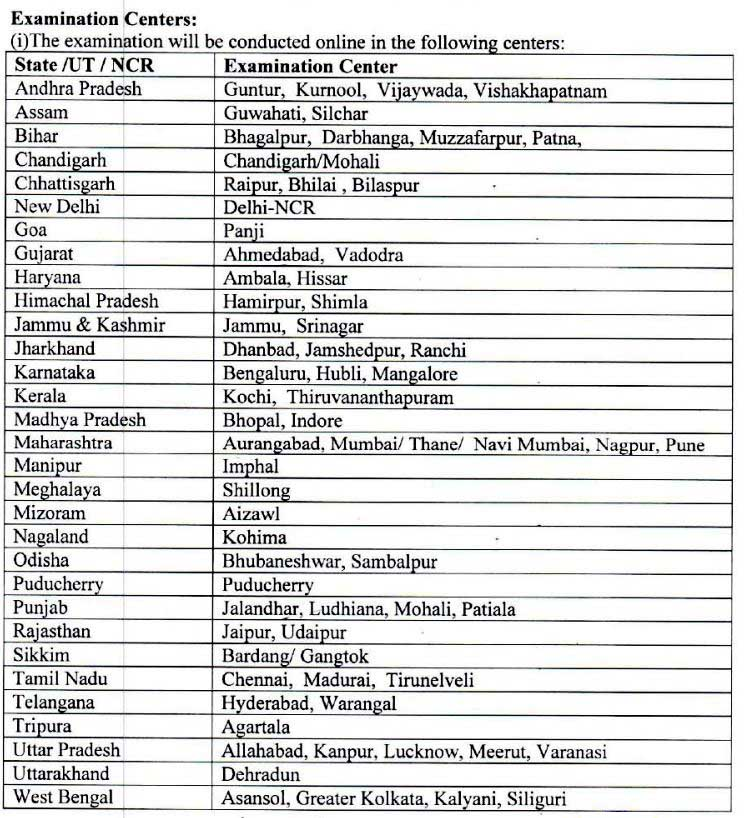

**Punjab and Sind bank recruitment 2019:** Punjab and Sind Bank has recruitment of special officer in JMGS I and MMGS II And Lateral, recruitment of company secretary, Rajbhasha Adhikari in SMGS IV and ASSistant General manager law in SMGS V.  **PSB Recruitment 2019 Notification** published on the official website with detailed information for above **PSB Bank Jobs**. As Per Punjab and Sind bank recruitment Notification 2019 **Total 168 Vacancies in PS Bank**. Good chance for those candidates who looking for bank jobs in Punjab for 12th pass. Punjab and Sind bank recruitment online form 2019 on 26-09-2019 to 10-10-2019. Interested and eligible candidates can apply online before last date has gone.

## Punjab and Sind bank recruitment 2019 | 168 Specialist Officer

Punjab And Sind Bank has invited online Application for the Recruitment on special officer. Interested candidates please First read Eligibility in this page below or PSD Advertisement Before apply online. Also know About Punjab And Sind Bank Vacancy Details Like Education Qualification, Age limits, Selection Process, Salary/Pay Scale, Application Fee, How to Apply, Etc. Mentioned in this page.

### **PSB Recruitment 2019 Details**

<table style="border-collapse: collapse; width: 100%;"><tbody><tr><td style="width: 50%; text-align: center;">Job Recruitment Board</td><td style="width: 50%; text-align: center;">Punjab And Sind Bank</td></tr><tr><td style="width: 50%; text-align: center;">Post</td><td style="width: 50%; text-align: center;">Various</td></tr><tr><td style="width: 50%; text-align: center;">Vacancies</td><td style="width: 50%; text-align: center;">168</td></tr><tr><td style="width: 50%; text-align: center;">Job Location</td><td style="width: 50%; text-align: center;">Anywhere In India</td></tr><tr><td style="width: 50%; text-align: center;">Job Type</td><td style="width: 50%; text-align: center;">Bank Jobs</td></tr><tr><td style="width: 50%; text-align: center;">Application Mode</td><td style="width: 50%; text-align: center;">Online</td></tr></tbody></table>

### **Punjab And Sind Bank Exam Dates**

<table style="border-collapse: collapse; width: 100%;"><tbody><tr><td style="width: 50%; text-align: center;">Starting Date of Online Application</td><td style="width: 50%; text-align: center;">26-09-2019</td></tr><tr><td style="width: 50%; text-align: center;">Last date of Online Application</td><td style="width: 50%; text-align: center;">10-10-2019</td></tr><tr><td style="width: 50%; text-align: center;">Last Date for receipt of hard copy of online application with enclosures(only for post-Serial No.1 to 3)</td><td style="width: 50%; text-align: center;">17-10-2019</td></tr></tbody></table>

### **Punjab and Sind bank vacancy Details**

### **Punjab And Sind Bank Recruitment Eligibility Criteria**

Punjab And Sind Bank has set Different minimum eligibility criteria For Every Post vacancy. PSB bank Job post wise Criteria is mention below.

#### **Age Limits**

- Minimum 20 Years
- Maximum 45 Years
- Mentioned All Post Wise Age Limits on Vacancy Details Images Above.

#### **Education Qualification & Experience**

<table style="border-collapse: collapse; width: 100%;"><tbody><tr><td style="width: 29.3685%; text-align: center; background-color: #2a5a8e;"><strong>Post Name</strong></td><td style="width: 35.536%; text-align: center; background-color: #2a5a8e;"><strong>Education</strong></td><td style="width: 35.0954%; text-align: center; background-color: #2a5a8e;"><strong>Experience</strong></td></tr><tr><td style="width: 29.3685%; text-align: center;">Assistant General Manager- Law</td><td style="width: 35.536%; text-align: center;">Degree in Law From Govt. Recognized University/Institute.</td><td style="width: 35.0954%; text-align: center;">10 Years Experience as a law officer in public sector Bank.

OR

12 Years Experience as Law Officer in the Legel Department of Scheduled Commercial Bank.</td></tr><tr><td style="width: 29.3685%; text-align: center;">Company&nbsp; Secretary In SMGS IV</td><td style="width: 35.536%; text-align: center;">Graduation From Govt. Recognized University/Institute.</td><td style="width: 35.0954%; text-align: center;">Minimum 8 Years Experience</td></tr><tr><td style="width: 29.3685%; text-align: center;">Rajbhasha Adhikari in SMGS - IV</td><td style="width: 35.536%; text-align: center;">Post Graduate Degree in Hindi with English as the degree level.</td><td style="width: 35.0954%; text-align: center;">Minimum 12 Year Experience in Relative Field at a Senior Position.</td></tr><tr><td style="width: 29.3685%; text-align: center;">Law Manager in MMGS II</td><td style="width: 35.536%; text-align: center;">Degree in Law From Govt. Recognized University/Institute.</td><td style="width: 35.0954%; text-align: center;">Minimum 4 Years Experience as Advocate.</td></tr><tr><td style="width: 29.3685%; text-align: center;">Fire Safty Officer in MMGS-II</td><td style="width: 35.536%; text-align: center;">B.E/B.Tech (Fire Engineering)</td><td style="width: 35.0954%; text-align: center;">Minimum 5 Years Experience in fire Safety</td></tr><tr><td style="width: 29.3685%; text-align: center;">Security officer in MMGS-II</td><td style="width: 35.536%; text-align: center;">Graduation From Govt. Recognized University/Institute.</td><td style="width: 35.0954%; text-align: center;">Minimum 5 Years Experience as Commissioned Officer in the Indian Army/Navy/Air Force.</td></tr><tr><td style="width: 29.3685%; text-align: center;">Agricultural Field Officer in JMGS-I</td><td style="width: 35.536%; text-align: center;">4 Years Degree in Agricultural</td><td style="width: 35.0954%; text-align: center;">Minimum 6 Month Experience of rural banking scheduled commercial bank.</td></tr><tr><td style="width: 29.3685%; text-align: center;">Chartered Accountants in JMGS-I</td><td style="width: 35.536%; text-align: center;">Qualified as chartered accountants</td><td style="width: 35.0954%; text-align: center;">-</td></tr><tr><td style="width: 29.3685%; text-align: center;">Software Developer/IT Programmer in JMGS-I</td><td style="width: 35.536%; text-align: center;">4 Years Engineering Technology Degree in Computer Science or Related.</td><td style="width: 35.0954%; text-align: center;">Minimum 1 Year Experience</td></tr><tr><td style="width: 29.3685%; text-align: center;">Rajbhasha Officer in JMGS-I</td><td style="width: 35.536%; text-align: center;">Post Graduate Degree in Hindi with English as the degree level.</td><td style="width: 35.0954%; text-align: center;">Minimum 1 Year Experience</td></tr><tr><td style="width: 29.3685%; text-align: center;">Technical Officer- Civil in JMGS-I</td><td style="width: 35.536%; text-align: center;">Degree in Civil Engineering with a minimum score of 60%</td><td style="width: 35.0954%; text-align: center;">-</td></tr><tr><td style="width: 29.3685%; text-align: center;">Technical Officer Electrical in JMGS-I</td><td style="width: 35.536%; text-align: center;">Degree in Electrical Engineering with minimum Score of 60%.</td><td style="width: 35.0954%; text-align: center;">-</td></tr></tbody></table>

### **PSB Bank Job Salary/ Pay Scale**

1. AGM-SMGS-V: Scale of pay is Rs. 59170 - 66070
2. Chief Manager-SMGS-IV: Scale of pay is Rs. 50030 - 59170
3. Manager-MMGS-II: Scale of pay is Rs. 31705 - 45950
4. Officer-JMGS-I: Scale of pay is Rs. 23700 - 42020

### **Probation Period**

- Posts at Serial No. 1 to 6: The Selected Candidates Shall be on Probation for a period of one year, which can be extended by a further period not exceeding one year, depending upon the performance of the candidate.
- Post at Serial No. 7 to 12: The Selected Candidates Shall be on Probation for a period of two years, which can be extended by a further period not exceeding one year, depending upon the performance of the candidate.

### **Punjab And Sind Bank Selection Process**

<table style="border-collapse: collapse; width: 95.5956%; height: 273px;"><tbody><tr style="height: 20px;"><td style="width: 50%; height: 20px; text-align: center; background-color: #2a5a8e;"><strong>Post Name</strong></td><td style="width: 45.5947%; height: 20px; text-align: center; background-color: #2a5a8e;"><strong>Selection Process</strong></td></tr><tr style="height: 20px;"><td style="width: 50%; height: 20px; text-align: center;">Assistant General Manager- Law</td><td style="width: 45.5947%; height: 60px; text-align: center;" rowspan="3"><ol><li>Short-listing</li><li>Personal Interview</li></ol></td></tr><tr style="height: 20px;"><td style="width: 50%; height: 20px; text-align: center;">Company&nbsp; Secretary In SMGS IV</td></tr><tr style="height: 20px;"><td style="width: 50%; height: 20px; text-align: center;">Rajbhasha Adhikari in SMGS - IV</td></tr><tr style="height: 20px;"><td style="width: 50%; height: 20px; text-align: center;">Law Manager in MMGS II</td><td style="width: 45.5947%; height: 193px; text-align: center;" rowspan="9"><ol><li>Online Examination</li><li>Personal Interview</li></ol></td></tr><tr style="height: 20px;"><td style="width: 50%; height: 20px; text-align: center;">Fire Safty Officer in MMGS-II</td></tr><tr style="height: 20px;"><td style="width: 50%; height: 20px; text-align: center;">Security officer in MMGS-II</td></tr><tr style="height: 20px;"><td style="width: 50%; height: 20px; text-align: center;">Agricultural Field Officer in JMGS-I</td></tr><tr style="height: 22px;"><td style="width: 50%; height: 22px; text-align: center;">Chartered Accountants in JMGS-I</td></tr><tr style="height: 42px;"><td style="width: 50%; height: 31px; text-align: center;">Software Developer/IT Programmer in JMGS-I</td></tr><tr style="height: 20px;"><td style="width: 50%; height: 20px; text-align: center;">Rajbhasha Officer in JMGS-I</td></tr><tr style="height: 20px;"><td style="width: 50%; height: 20px; text-align: center;">Technical Officer- Civil in JMGS-I</td></tr><tr style="height: 20px;"><td style="width: 50%; height: 20px; text-align: center;">Technical Officer Electrical in JMGS-I</td></tr></tbody></table>

### **Punjab and Sind Bank Examination Centers**

### **PSB Bank Exam Fee**

- General Candidates: Rs. 826/-   Including CGST & SGST
- SC/ST/PWD Candidates: Rs. 177/-  Including CGST & SGST
- Payment Mode: Online

### **How to apply for Punjab And Sind Bank Vacancy?**

Eligible Candidates have to apply online through the bank's Website only.

### **Punjab And Sind Bank Recruitment Important Links**

- Punjab And Sind Bank Application Online Form: [Registration](https://ibpsonline.ibps.in/pnbsndaug19/basic_details.php "Punjab & Sind Bank") | [Login](https://ibpsonline.ibps.in/pnbsndaug19/ "Punjab & Sind Bank")
- Punjab And Sind Bank Recruitment notification 2019 PDF: [Click Here](https://freegovtjobalert.in/wp-content/uploads/2019/09/Notification-Punjab-and-Sind-Bank-Specialist-Officer-Company-Secretary-Other-Posts.pdf)
- Punjab And Sind Bank Official Website (PSB): [Click Here](https://www.psbindia.com/)
