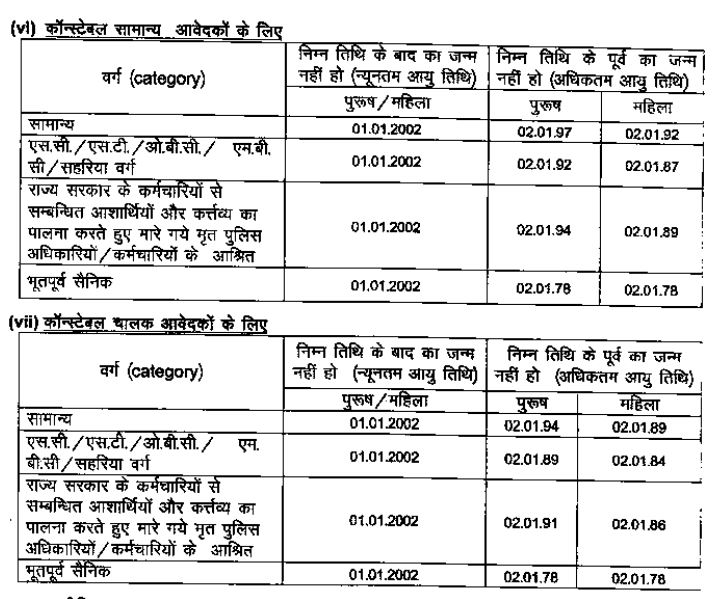
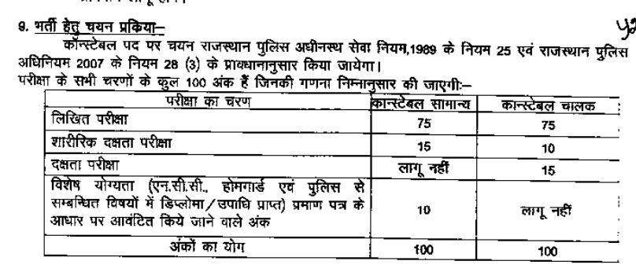
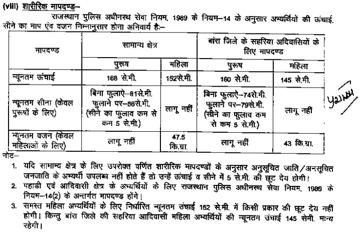
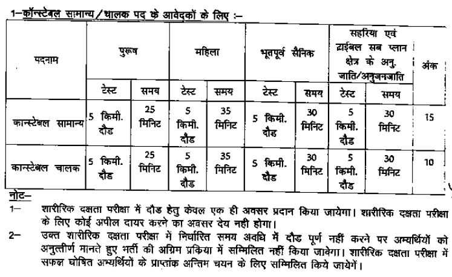

Rajasthan Police Constable Recruitment 2020: Rajasthan Police is going to fill up 5000 Constable Vacancy. Rajasthan Police has Released Notice for 5000 Constable Post. Raj Police 2019 Recruitment Details Like Education Qualification, Age Limits, Selection Process, Salary, Exam Pattern, Physical Efficiency Test, How to Apply, etc.- Given Below.

## **Rajasthan Police Constable Recruitment 2019**

<table style="border-collapse: collapse; width: 100%;"><tbody><tr><td style="width: 50%; background-color: #2a5a8e; text-align: center;" colspan="2"><strong>Rajasthan Police Recruitment 2019</strong></td></tr><tr><td style="width: 50%; text-align: center;">Job Recruitment Board</td><td style="width: 50%; text-align: center;">Rajasthan Police</td></tr><tr><td style="width: 50%; text-align: center;">Notification No.</td><td style="width: 50%; text-align: center;">-</td></tr><tr><td style="width: 50%; text-align: center;">Post</td><td style="width: 50%; text-align: center;">Various</td></tr><tr><td style="width: 50%; text-align: center;">Vacancies</td><td style="width: 50%; text-align: center;">5000</td></tr><tr><td style="width: 50%; text-align: center;">Job Location</td><td style="width: 50%; text-align: center;">Rajasthan State</td></tr><tr><td style="width: 50%; text-align: center;">Job Type</td><td style="width: 50%; text-align: center;">Defence Jobs/Police Jobs</td></tr><tr><td style="width: 50%; text-align: center;">Application Mode</td><td style="width: 50%; text-align: center;">Online</td></tr></tbody></table>

 

<table style="border-collapse: collapse;"><tbody><tr><td style="width: 50%; background-color: #2a5a8e; text-align: center;" colspan="2"><h3><strong>Important Dates</strong></h3></td></tr><tr><td style="width: 50%; text-align: center;">Starting Date of Online Application</td><td style="width: 50%; text-align: center;">23-12-2019</td></tr><tr><td style="width: 50%; text-align: center;">Last Date of Online Application</td><td style="width: 50%; text-align: center;">10-02-2020</td></tr></tbody></table>

 

### **Rajasthan Police Constable Vacancy Details**

- Rajasthan Police Constable Vacancy 2019-20: 5000 Posts

### **Eligibility Criteria For Rajasthan Police Constable Recruitment 2019**

Age Limits

Education Qualification

- Constable (General): Candidates should pass 10th Class
- Constable (RAC/ MBC): Candidates should pass 8th Class
- Constable Driver: Candidates should pass 10th Class from recognized board and posses and have valid Driving License (LMV/ HMV)

### **Rajasthan Police Constable Salary/Pay Scale**

- Fix For Two Years: Rs. 14,600/-

### **Selection Process For Rajasthan Police Constable Recruitment 2019**

### 

### **Rajasthan Police Constable Physical Standard**

### **Physical Efficiency Test For Rajasthan Police Constable Recruitment**

### **Application Fee For Rajasthan Police Constable Recruitment 2019**

- General Candidates of Rajasthan Domicile: Rs. 400/-
- SC/ ST Candidates of Rajasthan Domicile: Rs. 350/-
- General (Annual Income is less than 2.5 Lakh): Rs. 350/-
- Payment Mode: Online

### **How to Apply For Rajasthan Police Constable Recruitment 2020**

1. Candidates Register And Get SSO ID From Here: https://sso.rajasthan.gov.in
2. Then Fill up Raj Police Constable Online Form 2019.
3. Upload Recruited Images.
4. Pay Application Fee Via Online.
5. Submit the Application Form.
6. Download & Save For Future Use.
7. Done

### **Important Links For Rajasthan Police Constable Bharti 2019-20**

- Rajasthan Police Constable Online Form 2020: [Click Here](https://sso.rajasthan.gov.in/signin?ru=RECRUITMENT2)
- Download Rajasthan Police Constable 5000 Vacancy Notification PDF: [Click Here](https://freegovtjobalert.in/wp-content/uploads/2019/12/Short-Notice-Rajasthan-Police-Constable-Posts.pdf)
- Raj Police Official Website: [Click Here](https://www.police.rajasthan.gov.in/)

Candidates can visit https://www.police.rajasthan.gov.in to get more details about Rajasthan Police Constable 2019. To More Information About Rajasthan Police upcoming vacancy 2020, latest Updates, Admit Card, Syllabus, Result, Etc. It will be published on the official website. Also, visit Regularly our website [www.freegovtjobalert.in](https://freegovtjobalert.in) for getting the Latest job Updates.
