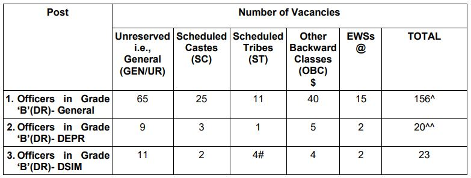
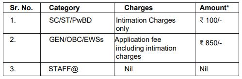

**RBI Recruitment Grade B 2019**: Reserve Bank of India has direct recruitment for post in combined Seniority Group (CSG) Streams. **RBI Recruitment 2019 Notification** has published for the Vacancy of Grade B officer Post. As Per RBI Recruitment Notification 2019, Total of 199 Vacancies. **RBI Grade B – GENERAL/DEPR/DSIM-2019** Examination Is Conducted by Reserve Bank of India. Eligible and Interested candidates can Fillup RBI recruitment 2019 apply online Form 2019 at **RBI Official Website** Before Date 11-10-2019. to know About RBI Vacancy Details Like Education Qualification, Age Limits, Salary/Pay Scale, Syllabus, Exam Pattern, RBI online Form 2019, Etc. Given In this Page Below.

## **RBI Recruitment 2019 | 199 RBI Grade B Officer Post Details**

### **RBI Recruitment 2019 Detail**

<table style="border-collapse: collapse; width: 100%;"><tbody><tr><td style="width: 39.1473%; text-align: center;">Job Recruitment Board</td><td style="width: 60.8527%; text-align: center;">Reserve Bank of India</td></tr><tr><td style="width: 39.1473%; text-align: center;">Post</td><td style="width: 60.8527%; text-align: center;">Officer Grade B - DR, DEPR and DSIM</td></tr><tr><td style="width: 39.1473%; text-align: center;">Total Vacancies</td><td style="width: 60.8527%; text-align: center;">199 Posts</td></tr><tr><td style="width: 39.1473%; text-align: center;">Job Location</td><td style="width: 60.8527%; text-align: center;">Anywhere In India</td></tr><tr><td style="width: 39.1473%; text-align: center;">Job Category</td><td style="width: 60.8527%; text-align: center;">Bank Jobs</td></tr><tr><td style="width: 39.1473%; text-align: center;">Application Mode</td><td style="width: 60.8527%; text-align: center;">Online</td></tr></tbody></table>

### **RBI Grade B Exam Important Dates**

- RBI Grade B Exam Dates is Given Below Table:

<table style="border-collapse: collapse; width: 100%; height: 189px;"><tbody><tr style="height: 20px;"><td style="width: 63.326%; height: 20px; text-align: center; background-color: #2a5a8e;"><strong>Events</strong></td><td style="width: 36.674%; height: 20px; text-align: center; background-color: #2a5a8e;"><strong>Dates</strong></td></tr><tr style="height: 25px;"><td style="width: 63.326%; height: 25px; text-align: center;">Starting Date of Online Application Form</td><td style="width: 36.674%; height: 25px; text-align: center;">21-09-2019</td></tr><tr style="height: 20px;"><td style="width: 63.326%; height: 20px; text-align: center;">Last Date of Online Application Form</td><td style="width: 36.674%; height: 20px; text-align: center;">11-10-2019</td></tr><tr style="height: 20px;"><td style="width: 63.326%; height: 20px; text-align: center;">Date of Fee Payment</td><td style="width: 36.674%; height: 20px; text-align: center;">21-09-2019 to 11-10-2019</td></tr><tr style="height: 42px;"><td style="width: 63.326%; height: 42px; text-align: center;">Officer Grade B General/DEPR/DSIM Phase-1 Online Exam Date</td><td style="width: 36.674%; height: 42px; text-align: center;">09-11-2019</td></tr><tr style="height: 20px;"><td style="width: 63.326%; height: 20px; text-align: center;">Officer Grade B General Phase-2 Paper I, II &amp; III Online Exam Date</td><td style="width: 36.674%; height: 20px; text-align: center;">01-12-2019</td></tr><tr style="height: 42px;"><td style="width: 63.326%; height: 42px; text-align: center;">Officer Grade B DEPR/DSIM Phase-2 Paper I, II &amp; III Online Exam Date</td><td style="width: 36.674%; height: 42px; text-align: center;">02-12-2019</td></tr></tbody></table>

### **RBI Grade B Vacancy Detail**

1. Officers in Grade ‘B’(DR)- General: 156 Vacancies
2. Officers in Grade ‘B’(DR)- DEPR: 20 Vacancies
3. Officers in Grade ‘B’(DR)- DSIM: 23 Vacancies

**RBI Grade B Category Wise Vacancy**

### **RBI Grade B Exam Eligibility**

Reserve Bank of India Is Conducted Grade B Exam and set Minimum Eligibility Like Education Qualification, Age Limits, Nationality, etc. For Above Posts. candidates must Pass All Eligible Critare for filling application form. Minimum Criteria is mentioned below:

**Nationality**

a candidate must be either:-

- (a) a citizen of India, or
- (b) a subject of Nepal, or
- (c) a subject of Bhutan, or
- (d) a Tibetan refugee who came over to India before 1st January, 1962 with the intention of permanently settling in India, or
- (e) a person of Indian origin who has migrated from Pakistan, Burma, Sri Lanka, East African countries of Kenya, Uganda, the United Republic of Tanzania, Zambia, Malawi, Zaire, Ethiopia and Vietnam with the intention of permanently settling in India.
- Provided that a candidate belonging to categories (b), (c), (d) and (e) shall be a person in whose favor a certificate of eligibility has been issued by the Government of India.

**Age Limits**

- A candidate must have Minimum 21 Years and Maximum 30 Years.
- For candidates possessing M.Phil. and Ph.D. qualification, upper age limit will be 32 and 34 years respectively.

The upper age-limit prescribed above will be relaxed:

- maximum of five years for candidates belonging to a Scheduled Caste or a Scheduled Tribe if the posts are reserved for them.
- maximum of three years in the case of candidates belonging to Other Backward Classes
- maximum of five years for ex-employees of banking institutions.
- More Detail About Age Relaxing Check Notification.

**Education Qualification**

The following minimum educational qualifications are prescribed for the posts:

<table style="border-collapse: collapse; width: 100%;"><tbody><tr><td style="width: 30.3965%; background-color: #2a5a8e; text-align: center;"><strong>Post Name</strong></td><td style="width: 69.6035%; background-color: #2a5a8e; text-align: center;"><strong>Education Qualification</strong></td></tr><tr><td style="width: 30.3965%;">Officers in Grade 'B' (DR) - (General)</td><td style="width: 69.6035%;"><ul><li>A minimum of 60% marks (50% in case of SC/ST/PwBD) or an equivalent grade in Bachelor's degree as well as in 12th (or Diploma or equivalent) and 10th Standard examinations.</li><li>The minimum qualifying percentage or an equivalent grade for the Bachelor’s degree will be in aggregate for all semesters/years.</li></ul></td></tr><tr><td style="width: 30.3965%;">Officers in Grade 'B' (DR) - DEPR</td><td style="width: 69.6035%;"><ul><li>A Master's Degree in Economics / Econometrics / Quantitative Economics / Mathematical Economics / Integrated Economics Course/ Finance, with a minimum of 55% marks or an equivalent grade in aggregate of all semesters /years from a recognized Indian or Foreign University /Institute; OR</li><li>PGDM/ MBA Finance with a minimum of 55% marks or an equivalent grade in aggregate of all semesters /years from a recognized Indian or Foreign University /Institute OR</li><li>Master’s Degree in Economics in any of the sub-categories of economics i.e. agricultural/ business/ developmental/ applied, etc., with a minimum of 55% marks or an equivalent grade in aggregate of all semesters /years from a recognized Indian or Foreign University /Institute.</li></ul></td></tr><tr><td style="width: 30.3965%;">Officers in Grade 'B' (DR) - DSIM</td><td style="width: 69.6035%;"><ul><li>A Master's Degree in Statistics/ Mathematical Statistics/ Mathematical Economics/ Econometrics/ Statistics &amp; Informatics from IIT-Kharagpur/ Applied Statistics &amp; Informatics from IIT-Bombay with a minimum of 55% marks or equivalent grade in aggregate of all semesters/years OR</li><li>Master's Degree in Mathematics with a minimum of 55% marks or an equivalent grade in aggregate of all semesters/years and one-year post-graduate diploma in Statistics or related subjects from an Institute of repute; OR</li><li>M. Stat. Degree of Indian Statistical Institute with a minimum of 55% marks in aggregate of all semesters/years; OR</li><li>Post Graduate Diploma in Business Analytics (PGDBA) jointly offered by ISI Kolkata, IIT Kharagpur and IIM Calcutta with a minimum of 55% marks or equivalent grade in aggregate of all semesters/years.</li></ul></td></tr></tbody></table>

### **RBI Grade B Application Fee/Exam Fee**

- Bank/Transaction charges are to be borne by the candidate.
- Payment Mode: Online
- The payment can be made by using Debit Cards (RuPay/Visa/MasterCard/Maestro), Credit Cards, Internet Banking, IMPS, Cash Cards/ Mobile Wallets.

### **How to Apply For RBI Grade B Officer Vacancy**

1. Candidates First Goto Here: [RBI Grade B Online Application](https://ibpsonline.ibps.in/rbigrbdsep19/)
2. To register application, choose the tab "Click here for New Registration" and enter Name, Contact details and Email-id. A Provisional Registration Number and Password will be generated by the system and displayed on the screen. Candidate should note down the Provisional Registration Number and Password. An Email & SMS indicating the Provisional Registration number and Password will also be sent.
3. Login With Your Registration Number & Password.
4. Fill up Application Details.
5. Then click on Save & Next Button.
6. upload Photo, Signature, left thumb impression and a hand-written declaration as per the specifications given in the Guidelines for Scanning and Upload of Documents.
7. Click on the Preview Tab to preview and verify the entire application form before FINAL SUBMIT.
8. Click on 'Payment' Tab and proceed for payment.
9. Then click on 'Submit' button.
10. Download & Save Application For Future Use.

### **RBI Grade B Exam Admit Card**

- Admit Card Is Receive those Candidates Who Properly Fill Up Application Form And Eligible For Grade B Exam criteria.
- Admit card Is Issue Two week Before Exam.
- Candidates are Download RBI Grade B Exam Admit Card From RBI Offical Website.
- candidates check admit card Details carefully and verify with Document.

> RBI Grade B Officer Admit Card (Released) For Phase I [Download Now](https://freegovtjobalert.in/rbi-grade-b-officer-admit-card/)

### **RBI Grade B Salary / Pay Scale**

- Selected Candidates will draw a starting basic pay of ₹ 35,150/- p.m. 
- the scale of Rs. 35150-1750 (9)-50900-EB-1750 (2)-54400-2000 (4)-62400 applicable to Officers in Grade B and they will also be eligible for Dearness Allowance, Local allowance, House Rent Allowance, Family allowance and Grade Allowance as per rules in force from time to time. At present, initial monthly Gross emoluments are approximately ₹ 77,208/-(approx.)

### **RBI Grade B Selection Process**

1. Phase-I online Examination (Objective Type)
2. Phase-II online Examination (Paper I, II & III)
3. Interview

### **RBI Grade B Exam Pattern**

**Phase-I online Examination (Objective Type)**

<table style="border-collapse: collapse; width: 100%;"><tbody><tr><td style="width: 45.155%; text-align: center; background-color: #2a5a8e;"><strong>Syllabus</strong></td><td style="width: 19.1861%; text-align: center; background-color: #2a5a8e;"><strong>Question</strong></td><td style="width: 17.4418%; text-align: center; background-color: #2a5a8e;"><strong>Marks</strong></td><td style="width: 18.2171%; text-align: center; background-color: #2a5a8e;"><strong>Time</strong></td></tr><tr><td style="width: 45.155%; text-align: center;"><ul><li style="text-align: left;">General Awareness</li><li style="text-align: left;">English Language</li><li style="text-align: left;">Quantitative Aptitude</li><li style="text-align: left;">Reasoning</li></ul></td><td style="width: 19.1861%; text-align: center;">200</td><td style="width: 17.4418%; text-align: center;">200</td><td style="width: 18.2171%; text-align: center;">120 Min. (2 Hours)</td></tr></tbody></table>

**Phase-II online Examination**

<table style="border-collapse: collapse; width: 100%;"><tbody><tr><td style="width: 25%; text-align: center; background-color: #2a5a8e;"><strong>Name of Paper</strong></td><td style="width: 41.2996%; text-align: center; background-color: #2a5a8e;"><strong>Type of Paper</strong></td><td style="width: 16.4097%; text-align: center; background-color: #2a5a8e;"><strong>Time</strong></td><td style="width: 17.2907%; text-align: center; background-color: #2a5a8e;"><strong>Marks</strong></td></tr><tr><td style="width: 25%; text-align: center;">Paper-I: Economic and Social Issues</td><td style="width: 41.2996%; text-align: center;">Objective Type</td><td style="width: 16.4097%; text-align: center;">90 Min.</td><td style="width: 17.2907%; text-align: center;">100</td></tr><tr><td style="width: 25%; text-align: center;">Paper-II: English (Writing Skills)</td><td style="width: 41.2996%; text-align: center;">Descriptive, to be typed with the help of the keyboard</td><td style="width: 16.4097%; text-align: center;">90 Min.</td><td style="width: 17.2907%; text-align: center;">100</td></tr><tr><td style="width: 25%; text-align: center;">Paper-III: Finance and Management</td><td style="width: 41.2996%; text-align: center;">Objective type</td><td style="width: 16.4097%; text-align: center;">90 Min.</td><td style="width: 17.2907%; text-align: center;">100</td></tr></tbody></table>

### **RBI Grade B Important Links**

- RBI Grade B Online Registration: [Click Here](https://ibpsonline.ibps.in/rbigrbdsep19/basic_details.php)
- RBI Grade B Apply Online Form 2019: [Click Here](https://ibpsonline.ibps.in/rbigrbdsep19/)
- RBI Recruitment Grade B Notification PDF: [Click Here](https://freegovtjobalert.in/wp-content/uploads/2019/09/Notification-RBI-Officer-Posts.pdf)
- RBI Official Website: [Click Here](https://www.rbi.org.in/)
