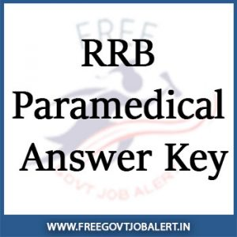

RRB Paramedical Answer Key 2019: Railway Recruitment Board (RRB) published a notification on date 4/3/2019 for recruitment Of various post vacancies For Paramedical staff, qualified candidates applied for this post and give an exam and now RRB has released notice for the paramedical answer key.

<table style="border-collapse: collapse; width: 80.4907%; height: 451px;"><tbody><tr style="height: 33px;"><td style="width: 100%; background-color: #2a5a8e; text-align: center; height: 33px;" colspan="2"><h2>RRB Paramedical Vacancy Details</h2></td></tr><tr style="height: 22px;"><td style="width: 53.0338%; text-align: center; height: 22px;"><strong>Starting Date for Online Registration</strong></td><td style="width: 46.9662%; text-align: center; height: 22px;"><strong>04-03-2019</strong></td></tr><tr style="height: 22px;"><td style="width: 53.0338%; text-align: center; height: 22px;"><strong>Last Date for Online Registration</strong></td><td style="width: 46.9662%; text-align: center; height: 22px;"><strong>02-04-2019</strong></td></tr><tr style="height: 44px;"><td style="width: 53.0338%; text-align: center; height: 44px;"><strong>Closing Date &amp; Time for Payment of Application Fee through Online</strong></td><td style="width: 46.9662%; text-align: center; height: 44px;"><strong>05-04-2019</strong></td></tr><tr style="height: 44px;"><td style="width: 53.0338%; text-align: center; height: 44px;"><strong>Closing Date &amp; Time for Payment of Application Fee through Offline</strong></td><td style="width: 46.9662%; text-align: center; height: 44px;"><strong>&nbsp;04-04-2019</strong></td></tr><tr style="height: 22px;"><td style="width: 53.0338%; text-align: center; height: 22px;"><strong>CBT Exam Date</strong></td><td style="width: 46.9662%; text-align: center; height: 22px;"><strong>19 to 21-07-2019</strong></td></tr><tr style="height: 44px;"><td style="width: 53.0338%; text-align: center; height: 44px;"><strong>Viewing of the Question Paper, Responses and Answer Keys and raising of Objections</strong></td><td style="width: 46.9662%; text-align: center; height: 44px;"><strong>05-08-2019 at 10.00 am onwards</strong></td></tr><tr style="height: 22px;"><td style="width: 53.0338%; text-align: center; height: 22px;"><strong>Closing of the Objection raising and payment window</strong></td><td style="width: 46.9662%; text-align: center; height: 22px;"><strong>08-08-2019, at 23.59 hrs</strong></td></tr><tr style="height: 22px;"><td style="width: 53.0338%; text-align: center; height: 22px;"><strong>Total Vacancy</strong></td><td style="width: 46.9662%; text-align: center; height: 22px;"><strong>1923</strong></td></tr><tr style="height: 22px;"><td style="width: 53.0338%; text-align: center; height: 22px;"><strong>Download Answer Key</strong></td><td style="width: 46.9662%; text-align: center; height: 22px;"><a style="color: #ff0000;" href="https://rrbot.onlineregistrationform.org/ObjectionTrackerPortalWeb/loginPage.jsp" target="_blank" rel="noopener noreferrer"><strong>Click Here</strong></a></td></tr><tr style="height: 22px;"><td style="width: 53.0338%; text-align: center; height: 22px;"><strong>Answer Key Notice</strong></td><td style="width: 46.9662%; text-align: center; height: 22px;"><strong><a style="color: #ff0000;" href="https://freegovtjobalert.in/wp-content/uploads/2019/08/RRB-Paramedical-Staff-Answer-Key-Notice.pdf" target="_blank" rel="noopener noreferrer">Click Here</a></strong></td></tr><tr style="height: 22px;"><td style="width: 53.0338%; text-align: center; height: 22px;"><strong>Notice for Candidates Who Opted for Multiple Posts</strong></td><td style="width: 46.9662%; text-align: center; height: 22px;"><strong><a style="color: #ff0000;" href="https://freegovtjobalert.in/wp-content/uploads/2019/08/Notice-RRB-Paramedical-Staff.pdf" target="_blank" rel="noopener noreferrer">Click Here</a></strong></td></tr><tr style="height: 22px;"><td style="width: 53.0338%; text-align: center; height: 22px;"><strong>Download CBT Admit Card</strong></td><td style="width: 46.9662%; text-align: center; height: 22px;"><strong><a style="color: #ff0000;" href="https://rrbpmcallletter.onlineregistrationform.org/RRBAdmitCard/" target="_blank" rel="noopener noreferrer">Click Here</a></strong></td></tr><tr style="height: 22px;"><td style="width: 53.0338%; text-align: center; height: 22px;"><strong>Exam Date Notification</strong></td><td style="width: 46.9662%; text-align: center; height: 22px;"><strong><a style="color: #ff0000;" href="https://freegovtjobalert.in/wp-content/uploads/2019/08/CBT-Exam-Date-RRB-Paramedical-Staff-Posts.pdf" target="_blank" rel="noopener noreferrer">Click Here</a></strong></td></tr><tr style="height: 22px;"><td style="width: 53.0338%; text-align: center; height: 22px;"><strong>RRB Paramedical Important Dates &amp; Times</strong></td><td style="width: 46.9662%; text-align: center; height: 22px;"><strong><a style="color: #ff0000;" href="https://secunderabad.rrbregonline.org" target="_blank" rel="noopener noreferrer">Click Here</a></strong></td></tr><tr style="height: 22px;"><td style="width: 53.0338%; text-align: center; height: 22px;"><strong>Notification</strong></td><td style="width: 46.9662%; text-align: center; height: 22px;"><strong><a style="color: #ff0000;" href="https://freegovtjobalert.in/wp-content/uploads/2019/08/RRB-Paramaedical-Staff-Notification.pdf" target="_blank" rel="noopener noreferrer">English</a> | <a style="color: #ff0000;" href="https://freegovtjobalert.in/wp-content/uploads/2019/08/RRB-Paramedical-Notification-In-Hindi.pdf" target="_blank" rel="noopener noreferrer">Hindi</a></strong></td></tr><tr style="height: 22px;"><td style="width: 53.0338%; text-align: center; height: 22px;"><strong>Official Website</strong></td><td style="width: 46.9662%; text-align: center; height: 22px;"><strong><a href="http://www.rrcb.gov.in/rrbs.html" target="_blank" rel="noopener noreferrer">http://www.rrcb.gov.in/rrbs.html</a></strong></td></tr></tbody></table>

## RRB Paramedical Answer Key 2019

The Computer Based Test (CBT) for Paramedical posts against CEN 02/2019 was conducted from 19.7.2019 to 21.07.2019. In order to enable the candidates who appeared in this CBT to view their question papers, responses and answer keys, a LINK will be provided on all the official websites of RRBs and the LINK will be active from 10.00 hrs. on 05.08.2019 to 23.59 hrs. of 08.08.2019.

<table style="border-collapse: collapse; width: 78.3878%; height: 404px;"><tbody><tr><td style="width: 50%; background-color: #2a5a8e; text-align: center;" colspan="2"><strong>RRB Paramedical Answer Key Time Schedule</strong></td></tr><tr><td style="width: 50%;">Viewing of the Question Paper, Responses and Answer Keys and raising of Objections</td><td style="width: 50%;"><strong>05-08-2019 at 10.00 am onwards</strong></td></tr><tr><td style="width: 50%;">Closing of the Objection raising and payment window</td><td style="width: 50%;"><strong>08-08-2019, at 23.59 hrs</strong></td></tr><tr><td style="width: 50%; text-align: center;" colspan="2"><strong>Fee Details</strong></td></tr><tr><td style="width: 50%;" colspan="2"><ul><li>The prescribed fee for raising an objection is `.50/- + applicable Bank service Charges per each objection.</li><li>In case the objection raised is found to be correct, the Fee paid against such valid objection will be refunded to the candidate.</li><li>The refund will be made to the bank account number from which the candidate has made the online payment.</li></ul></td></tr></tbody></table>

> ## RRB Paramedical Answer Key 2019 [Download Now](https://rrbot.onlineregistrationform.org/ObjectionTrackerPortalWeb/loginPage.jsp)

## RRB Paramedical Answer Key Procedure for raising objections

1. In Question Paper view, you will be viewing your question paper, your chosen option and the correct answer (key) for the question.
2. The correct answer (key) for each question is highlighted in Green.
3. Your Chosen Option is highlighted in Blue and 'Chosen option' is mentioned against it.
4. You have to enter your question number against which objection has to be raised in the 'Question No.' field.
5. You have to select relevant Category of Objection from the drop-down box.
6. Your Objections must be registered in English only.
7. Objections can be raised only against questions and their alternatives.
8. Once Objections submitted cannot be edited later.
9. You have to enter an objection against a question in the 'Objection' field.
10. Click on the 'Add Objection' button to raise additional objections.
11. Once all objections are entered, you will select 'Save & Proceed to Payment'.
12. For each objection raised and submitted candidate needs to pay \`.50/- + bank charges.
13. If your objection is found to be correct, then the amount paid will be refunded to the account from which payment made after deducting the bank charges.
14. Once objections are entered and payment is made, no new objections can be added further

> More Govt Jobs: [www.freegovtjobalert.in](http://www.freegovtjobalert.in)
