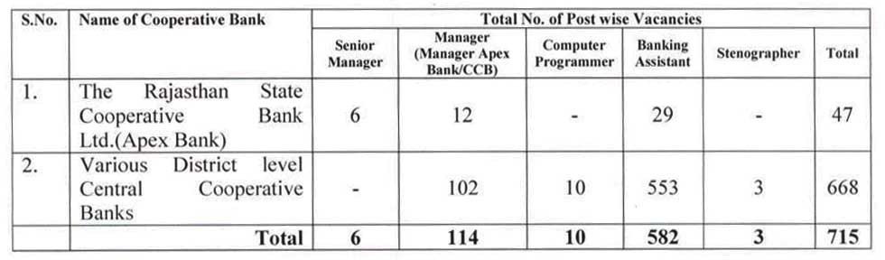

**RSCB recruitment 2019**: The Rajasthan State Co-operative Bank Limited has published notification for **RSCB Various Posts** **vacancies**. The Rajasthan State Co-operative Bank Ltd. (Apex Bank), Jaipur and Various District Level Central Cooperative Banks Of the State are invited online Application For Recruitment to the Various Posts. As Per **RSCB Recruitment 2019 Notification** total of 715 Vacancies in Various District Level Central Cooperative Banks of the State. Rajasthan cooperative bank recruitment 2019 of the Senior Manager, Computer Programmer, Banking Assistant, Steno. To know About RSCB bank recruitment 2019 Details Like Education Qualification, Age Limits, **Rajasthan state cooperative bank recruitment syllabus**, Salary/Pay Scale, How to apply, Etc. Given in this page below.

## RSCB recruitment 2019 | 715 Various Posts @rscb.org.in

<table style="height: 2213px; width: 68.1798%; border-collapse: collapse; border-style: double;"><tbody><tr style="height: 80px;"><td style="width: 100%; text-align: center; height: 50px;" colspan="2"><strong>The Rajasthan State Co-operative Bank Limited</strong>

RSCB recruitment 2019

715 Various Posts</td></tr><tr style="height: 30px;"><td style="width: 100%; height: 30px; background-color: #2a5a8e; text-align: center;" colspan="2"><h3><strong>&nbsp;Important Dates</strong></h3></td></tr><tr style="height: 22px;"><td style="width: 50.1295%; text-align: center; height: 22px;">Starting Date for Registration</td><td style="width: 49.8705%; text-align: center; height: 22px;">12-09-2019 change to 18-09-2019</td></tr><tr style="height: 22px;"><td style="width: 50.1295%; text-align: center; height: 22px;">Last Date for Registration</td><td style="width: 49.8705%; text-align: center; height: 22px;">06-10-2019 Change to 10-10-2019</td></tr><tr><td style="width: 50.1295%; text-align: center;">Online Exam Date</td><td style="width: 49.8705%; text-align: center;">November 2019(Tentative)</td></tr><tr style="height: 30px;"><td style="width: 100%; height: 30px; background-color: #2a5a8e; text-align: center;" colspan="2"><h3><strong>RSCB Various Posts Vacancies Details</strong></h3></td></tr><tr style="height: 22px;"><td style="text-align: center; height: 22px; width: 50.1295%;">Job Recruitment Board</td><td style="text-align: center; width: 49.8705%;">RSCB recruitment</td></tr><tr><td style="text-align: center; width: 50.1295%;">Post</td><td style="text-align: center; width: 49.8705%;">Various Posts</td></tr><tr><td style="text-align: center; width: 50.1295%;">No of Vacancies</td><td style="text-align: center; width: 49.8705%;">715</td></tr><tr><td style="text-align: center; width: 50.1295%;">Job Location</td><td style="text-align: center; width: 49.8705%;">Rajasthan State</td></tr><tr><td style="text-align: center; width: 50.1295%;">Job Category</td><td style="text-align: center; width: 49.8705%;"><a href="https://freegovtjobalert.in/bank-jobs-recruitment/" target="_blank" rel="noopener noreferrer">Bank Jobs</a></td></tr><tr><td style="text-align: center; width: 50.1295%;">Application Mode</td><td style="text-align: center; width: 49.8705%;">Online</td></tr><tr><td style="text-align: center; width: 100%;" colspan="2">

[caption id="attachment_1011" align="aligncenter" width="706"] <strong>RSCB Recruitment Various Posts Details</strong>[/caption]</td></tr><tr style="height: 30px;"><td style="width: 100%; height: 30px; background-color: #2a5a8e; text-align: center;" colspan="2"><h3><strong>Eligibility Criteria&nbsp;</strong></h3></td></tr><tr style="height: 14px;"><td style="width: 100%; height: 14px; text-align: left;" colspan="2"><strong>Education Qualification:</strong><ul><li><strong>Senior Manager:</strong> An MBA Degree, Two Year Post Graduate Diploma In Business Management with Graduation. Knowledge of Computer is Compulsory.</li><li><strong>Manager:</strong> Graduate in Any Subject</li><li><strong>Computer Programmer</strong>: B.Tech/BE, M.Sc, Graduation, MCA/M.Sc/M.sc IT. with One Year Experience.</li><li><strong>Banking Assistan</strong>t: Graduation</li><li><strong>Steno</strong>: Graduation and Typing Speed: 100 Word Per Minute English, 80 Word in Hindi</li></ul></td></tr><tr style="height: 30px;"><td style="height: 30px; text-align: left; width: 100%;" colspan="2"><strong>Age Limits:</strong><ul><li>Minimum: 18 Years</li><li>Maximum: 40 Years</li></ul></td></tr><tr><td style="text-align: left; width: 100%;" colspan="2"><strong>Selection Process:</strong>

Selections to Each Category of the posts will be made on the basis of online Examinations For The Respective Category of the post.

<strong>Place of Examination:&nbsp;</strong>

Online Examination Will be Conducted by Institute of Banking Personnel Selection Tentatively During the Month of November at Various Examination Center.</td></tr><tr><td style="background-color: #2a5a8e; text-align: left; width: 100%;" colspan="2"><h3 style="text-align: center;"><strong>RSCB Salary/Pay Scale</strong></h3></td></tr><tr><td style="width: 100%; text-align: left;" colspan="2"><ul><li>Senior Manager: Rs. 22870-49520</li><li>Manager: Rs. 17790-45590</li><li>Computer Programmer: Rs. 17790-45590</li><li>Banking Assistant: Rs. 8910-41870</li></ul></td></tr><tr style="height: 30px;"><td style="width: 100%; height: 30px; background-color: #2a5a8e; text-align: center;" colspan="2"><h3><strong>Application Fee&nbsp;</strong></h3></td></tr><tr style="height: 30px;"><td style="width: 100%; text-align: center; height: 30px;" colspan="2"><ul><li style="text-align: left;">General/Creamy layer of BC/MBC Candidates: <strong>Rs. 1000/-</strong></li><li style="text-align: left;">Sahriya/SC/ST/Non-Creamy layer BC/EWS and MBC/TSP Area/Disabled Candidates of Rajasthan: <strong>Rs. 500/-</strong></li><li style="text-align: left;">Payment Mode: <strong>Online</strong> (The payment can be made by using Debit Cards (RuPay/Visa/MasterCard/Maestro), Credit Cards, Internet Banking, IMPS, Cash Cards/ Mobile Wallets)</li></ul></td></tr><tr style="height: 30px;"><td style="width: 100%; height: 30px; background-color: #2a5a8e; text-align: center;" colspan="2"><h3><strong>Important Links&nbsp;</strong></h3></td></tr><tr style="height: 10px;"><td style="width: 50.1295%; text-align: center; height: 10px;"><strong>Apply Online&nbsp;</strong></td><td style="width: 49.8705%; text-align: center; height: 10px;"><strong><a title="RSCB" href="https://ibpsonline.ibps.in/rcrbjul19/basic_details.php" target="_blank" rel="noopener noreferrer">Registration</a>&nbsp;|&nbsp;<a title="RSCB" href="https://ibpsonline.ibps.in/rcrbjul19/" target="_blank" rel="noopener noreferrer">Login</a></strong></td></tr><tr><td style="width: 50.1295%; text-align: center;"><strong>Date Change Notice</strong></td><td style="width: 49.8705%; text-align: center;"><a href="https://freegovtjobalert.in/wp-content/uploads/2019/09/Last-Date-Extended-RSCB-Sr-Manager-Manager-Other-Posts.pdf" target="_blank" rel="noopener noreferrer"><strong>Click Here</strong></a></td></tr><tr><td style="width: 50.1295%; text-align: center;"><strong>RSCB Exam Syllabus</strong></td><td style="width: 49.8705%; text-align: center;"><a href="http://rajcrb.rajasthan.gov.in/Syllabus" target="_blank" rel="noopener noreferrer"><strong>Click Here</strong></a></td></tr><tr><td style="width: 50.1295%; text-align: center;"><strong>Short Notification</strong></td><td style="width: 49.8705%; text-align: center;"><a href="https://freegovtjobalert.in/wp-content/uploads/2019/09/Notification-Rajasthan-State-Co-operative-Bank-Banking-Asst-Manager-Other-Posts.pdf" target="_blank" rel="noopener noreferrer"><strong>Click Here</strong></a></td></tr><tr style="height: 36px;"><td style="width: 50.1295%; text-align: center; height: 23px;"><strong>Full Detail Notification</strong></td><td style="width: 49.8705%; text-align: center; height: 23px;"><a href="https://freegovtjobalert.in/wp-content/uploads/2019/09/RSCB-recruitment-Detail-Notification.pdf" target="_blank" rel="noopener noreferrer"><strong>Click Here</strong></a></td></tr><tr style="height: 10px;"><td style="width: 50.1295%; text-align: center; height: 10px;"><strong>&nbsp;Official Website</strong></td><td style="width: 49.8705%; text-align: center; height: 10px;"><a href="http://www.rscb.org.in" target="_blank" rel="noopener noreferrer"><strong>Click Here</strong></a></td></tr></tbody></table>

### RSCB Recruitment Exam Call Letters:

The eligible candidate should download his/her call letter from the link provided on the authorized Board website www.rajcrb.rajasthan.gov.in by entering his/ her details i.e. Registration Number and Password/Date of Birth. Candidate should note that hard copy of the call letter/ Information Handout etc. will NOT be sent by post/courier. The Centre, venue address, date and time for examination shall be intimated in the respective Call Letter which is to be downloaded as above.

### How to Apply For RSCB Recruitment 2019 For Various Posts?

1. Candidates First Goto Here: [www.rajcrb.rajasthan.gov.in](http://www.rajcrb.rajasthan.gov.in) 
2. Click On **Apply Online**
3. Then First Registration Your Self, If You Have Already Registered the login With Your Registration Number & Password.
4. Fillup Your Personal Details, Education Details, Etc.
5. then Verify and Click on Next Button.
6. Pay Exam Application Fee via Online.
7. Then Upload Candidates Image and Signature Image.
8. Submit Application.
9. Download & Save Your Application For Future Use.
10. Done
