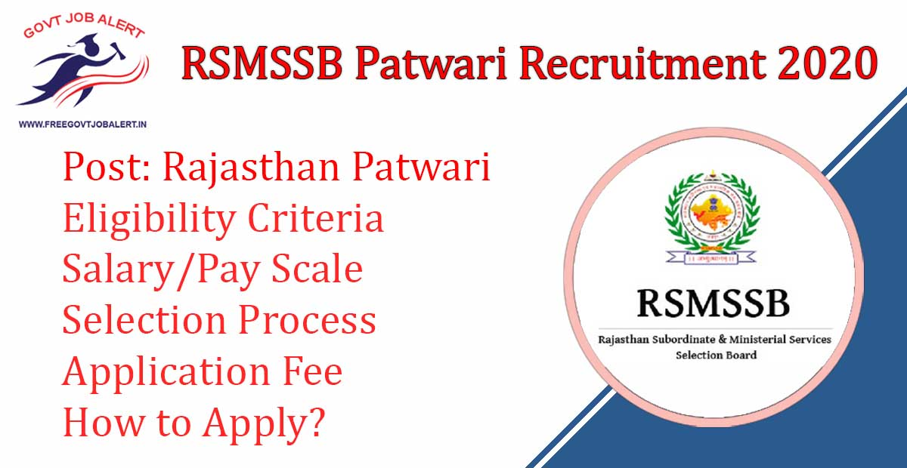

RSMSSB Patwari Recruitment 2019: Rajasthan Subordinate and Ministerial Service Selection Board has released the notification Regarding Patwari Post. RSMSSB Has online invites Application From Eligible Candidates For Patwar in Rajasthan Subordinate and Ministerial Service Selection Board. As Per RSMSSB Patwari Recruitment Total Of 4207 Vacancy Are There. RSMSSB Patwari Online Form 2019 has been Starting on 20-01-2020 At https://rsmssb.rajasthan.gov.in

## **RSMSSB Patwari Recruitment 2019**

<table style="border-collapse: collapse; width: 100%;"><tbody><tr><td style="width: 50%; background-color: #2a5a8e; text-align: center;" colspan="2"><strong>RSMSSB Recruitment 2019</strong></td></tr><tr><td style="width: 50%; text-align: center;">Job Recruitment Board</td><td style="width: 50%; text-align: center;">Rajasthan Subordinate and Ministerial Service Selection Board</td></tr><tr><td style="width: 50%; text-align: center;">Notification No.</td><td style="width: 50%; text-align: center;">-</td></tr><tr><td style="width: 50%; text-align: center;">Post</td><td style="width: 50%; text-align: center;">Patwari</td></tr><tr><td style="width: 50%; text-align: center;">Vacancies</td><td style="width: 50%; text-align: center;">4207</td></tr><tr><td style="width: 50%; text-align: center;">Job Location</td><td style="width: 50%; text-align: center;">Rajasthan State</td></tr><tr><td style="width: 50%; text-align: center;">Job Type</td><td style="width: 50%; text-align: center;">State Govt Jobs</td></tr><tr><td style="width: 50%; text-align: center;">Application Mode</td><td style="width: 50%; text-align: center;">Online</td></tr></tbody></table>

Rajasthan Patwari Bharti 2019 Notification And Apply Online Link Available on his Official Website. Those Candidates have Eligible to apply who have Bachelor's Degree (Any Stream)/ Diploma/ Degree. Applicants must Age Between 18 to 40 Years. Selected Candidates Will Be Placed in Rajasthan State. Good Chance For Those Candidates who are Finding Govt Jobs In Rajasthan they can Fill up RSMSSB Patwari Online Application Form 2019 Before the Last Date.

<table style="border-collapse: collapse;"><tbody><tr><td style="width: 50%; background-color: #2a5a8e; text-align: center;" colspan="2"><h3><strong>RSMSSB Patwari Exam Dates</strong></h3></td></tr><tr><td style="width: 50%; text-align: center;">Starting Date of Online Application</td><td style="width: 50%; text-align: center;">20-01-2020</td></tr><tr><td style="width: 50%; text-align: center;">Last Date of Online Application</td><td style="width: 50%; text-align: center;">19-02-2020</td></tr></tbody></table>

RSMSSB Patwari Recruitment 2019 Notification Details Like Education Qualification, Age Limits, Selection Process, Salary, Exam Pattern, How to Apply, etc.- Given Below.

### **Rajasthan Patwari Vacancy 2019 Details**

- Rajasthan Patwari Vacancy 2019: 4207 Posts

### **RSMSSB Patwari Recruitment 2019 Eligibility Criteria**

Age Limits

- Minimum 18 Years
- Maximum 40 Years

Education Qualification

- Candidates Should Have a Bachelor's Degree (Any Stream)/ Diploma/ Degree (Computer Science/ Equivalent) From Recognized University.
- Working Knowledge of Hindi Written in Devnagari Script and Knowledge of Rajasthani Culture.

### **Rajasthan Patwari Salary/Pay Scale**

- Pay Metrix Level-5 Rs. 20,800/-

### **Selection Process For RSMSSB Patwari Jobs**

- Written Exam/Interview

### **RSMSSB Patwari Recruitment 2020 Application Fee** 

 

- General/OBC Creamy Layer: Rs. 450/-
- BC/OBC Non-Creamy Layer: Rs. 350/-
- SC/ST Candidates: Rs. 250/-
- Payment Mode: Online

 

### **How to Apply For Rajasthan Patwari Bharti 2020**

1. Candidates Go to Rajasthan Staff Selection Board Official Website: https://rsmssb.rajasthan.gov.in
2. Find RSMSSB Patwari Notification 2019
3. Click on Apply Now Button 
4. Fill up Application Form
5. Pay Application Fee
6. Submit the Application Form
7. Download & Save Application Form For Future Use.
8. Done

### **Important Links For RSMSSB Patwari Recruitment 2019**

- RSMSSB Patwari Online Form 2019: Click Here
- Download Rajasthan 4207 Patwari Vacancy Notification 2019 PDF: [Click Here](https://rsmssb.rajasthan.gov.in/link_to_external_file/Patwari_Advertisement.pdf)
- RSMSSB Official Website: [Click Here](https://rsmssb.rajasthan.gov.in/)

Candidates can visit https://rsmssb.rajasthan.gov.in to get more details about RSMSSB Patwari Recruitment 2019. To More Information About upcoming vacancies in Rajasthan 2020, latest Updates, Admit Card, Syllabus, Result, Etc. It will be published on the official website. Also, visit Regularly our website [www.freegovtjobalert.in](https://freegovtjobalert.in "Free Govt Job ALert") for getting the Latest job Updates.
