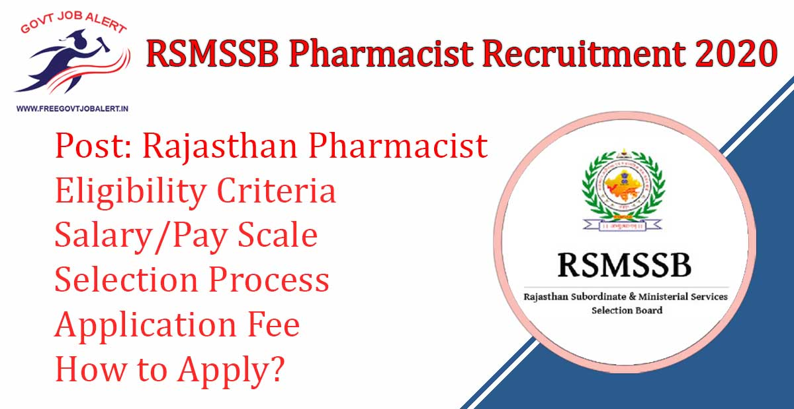
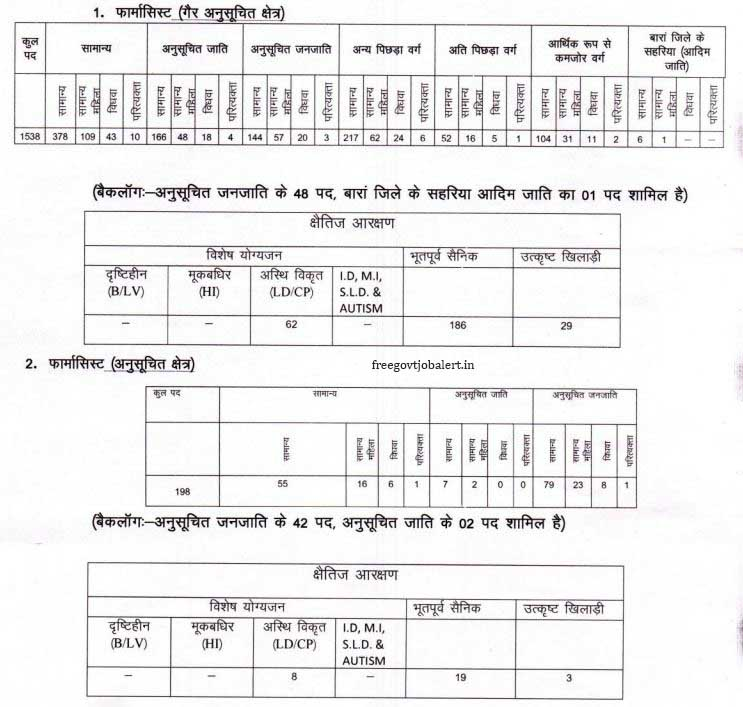

RSMSSB Pharmacist Recruitment 2019: Rajasthan Subordinate and Ministerial Service Selection Board has released the notification Regarding the Pharmacist Post. RSMSSB Has online invites Application From Eligible Candidates For Patwar in Rajasthan Subordinate and Ministerial Service Selection Board. As Per RSMSSB Pharmacist Recruitment Total of 1736 Vacancy Are There. RSMSSB Pharmacist Online Form 2019 has been Starting on 11-12-2019 At https://rsmssb.rajasthan.gov.in

## **RSMSSB Pharmacist Recruitment 2019**

<table style="border-collapse: collapse; width: 100%;"><tbody><tr><td style="width: 50%; background-color: #2a5a8e; text-align: center;" colspan="2"><strong>RSMSSB Recruitment 2019</strong></td></tr><tr><td style="width: 50%; text-align: center;">Job Recruitment Board</td><td style="width: 50%; text-align: center;">Rajasthan Subordinate and Ministerial Service Selection Board</td></tr><tr><td style="width: 50%; text-align: center;">Notification No.</td><td style="width: 50%; text-align: center;">-</td></tr><tr><td style="width: 50%; text-align: center;">Post</td><td style="width: 50%; text-align: center;">Pharmacist</td></tr><tr><td style="width: 50%; text-align: center;">Vacancies</td><td style="width: 50%; text-align: center;">1736</td></tr><tr><td style="width: 50%; text-align: center;">Job Location</td><td style="width: 50%; text-align: center;">Rajasthan</td></tr><tr><td style="width: 50%; text-align: center;">Job Type</td><td style="width: 50%; text-align: center;">State Govt Jobs</td></tr><tr><td style="width: 50%; text-align: center;">Application Mode</td><td style="width: 50%; text-align: center;">Online</td></tr></tbody></table>

Rajasthan Pharmacist Bharti 2019 Notification And Apply Online Link Available on his Official Website. Those Candidates have Eligible to apply who have passed Diploma in Pharmacy and Registered in Rajasthan Pharmacy Council. Applicants must Age Between 18 to 40 Years. Selected Candidates Will Be Placed in Rajasthan State. Good Chance For Those Candidates who are Finding Govt Jobs In Rajasthan they can Fill up RSMSSB Pharmacist Online Application Form 2019 Before the Last Date.

<table style="border-collapse: collapse;"><tbody><tr><td style="width: 50%; background-color: #2a5a8e; text-align: center;" colspan="2"><h3><strong>Important Dates</strong></h3></td></tr><tr><td style="width: 50%; text-align: center;">Starting Date of Online Application</td><td style="width: 50%; text-align: center;">11-12-2019</td></tr><tr><td style="width: 50%; text-align: center;">Last Date of Online Application</td><td style="width: 50%; text-align: center;">10-01-2020</td></tr></tbody></table>

RSMSSB Pharmacist Recruitment 2019 Notification Details Like Education Qualification, Age Limits, Selection Process, Salary, Exam Pattern, How to Apply, etc.- Given Below.

### **RSMSSB Pharmacist Vacancy 2020 Details**

- RSMSSB Pharmacist Vacancy 2019-20: 1736 Posts

### **Rajasthan Pharmacist Recruitment 2020-Eligibility Criteria**

Age Limits

- Minimum 18 Years
- Maximum 40 Years

Education Qualification

- Candidate Must Have Passed Diploma in Pharmacy and Registered in Rajasthan Pharmacy Council.

### **Selection Process For Rajasthan Pharmacist Recruitment 2020**

- Written Exam/ Interview

### **Rajasthan Pharmacist Recruitment 2020 - Application Fee**

- General/OBC Creamy Layer: Rs. 450/-
- BC/OBC Non-Creamy Layer: Rs. 350/-
- SC/ST Candidates: Rs. 250/-
- Payment Mode: Online

### **How to Apply For Rajasthan Pharmacist Recruitment 2020**

1. Candidates Go to Rajasthan Staff Selection Board Official Website: https://rsmssb.rajasthan.gov.in
2. Find RSMSSB Pharmacist Notification 2019
3. Click on Apply Now Button.
4. Fill up the Application Form.
5. Pay Application Fee.
6. Submit the Application Form.
7. Download & Save Application Form For Future Use.
8. Done

### **Rajasthan Pharmacist Recruitment 2020- Important Links**

- RSMSSB Patwari Online Form 2019: Click Here
- Download Rajasthan 1736 Pharmacist Vacancy Notification 2019 PDF: [Click Here](https://rsmssb.rajasthan.gov.in/link_to_external_file/Pharmacist_Ammendment.pdf)
- RSMSSB Official Website: [Click Here](https://rsmssb.rajasthan.gov.in/)

Candidates can visit https://rsmssb.rajasthan.gov.in to get more details about RSMSSB Pharmacist Recruitment 2019. To More Information About upcoming vacancies in Rajasthan 2020, latest Updates, Admit Card, Syllabus, Result, Etc. It will be published on the official website. Also, visit Regularly our website [www.freegovtjobalert.in](https://freegovtjobalert.in) for getting the Latest job Updates.
