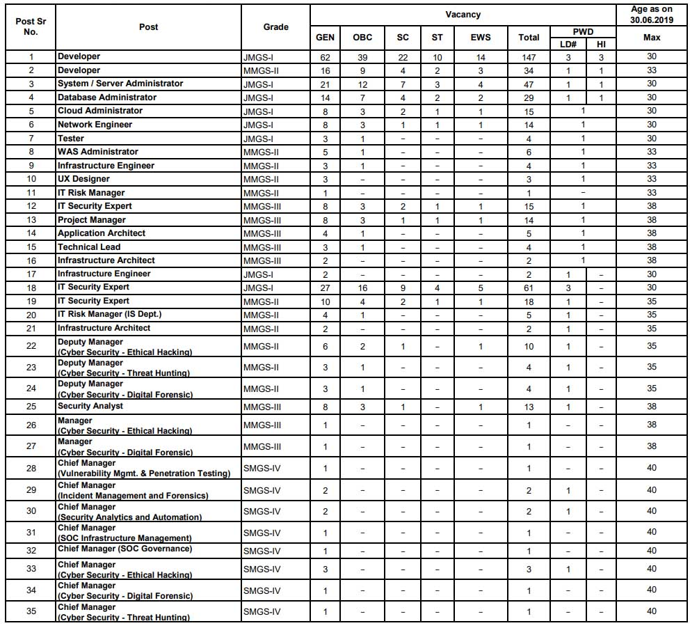

**SBI Recruitment 2019**: State Bank of India has published a notification for **SBI Specialist Cadre Officer** in State Bank of India on a Regular Basis. As Per **SBI recruitment 2019 notification** total of **447 Various Vacancies in SBI**. State Bank of India invites On-line application from Indian citizens for appointment in the following Specialist Cadre Officer posts on a regular basis. Candidates are requested to apply Online through the link is given in Bank's website https://bank.sbi/careers or https://www.sbi.co.in/careers. Interested and Eligible candidates can **SBI recruitment 2019 apply online**. to know SBI Bank Jobs All Details Mentioned in This Page Below.

## SBI Special Cadre Officer Vacancy @sbi.co.in

<table style="height: 2127px; width: 84.9475%; border-collapse: collapse; border-style: double;"><tbody><tr style="height: 80px;"><td style="width: 100%; text-align: center; height: 50px;" colspan="2"><strong>State Bank of India</strong>

SBI Recruitment 2019

Special Cadre Officer</td></tr><tr style="height: 30px;"><td style="width: 100%; height: 30px; background-color: #2a5a8e; text-align: center;" colspan="2"><h3><strong>SBI SCO Recruitment 2019 Important Dates</strong></h3></td></tr><tr style="height: 22px;"><td style="width: 50%; text-align: center; height: 22px;">Starting Date for Apply Online</td><td style="width: 50%; text-align: center; height: 22px;">06-09-2019</td></tr><tr style="height: 22px;"><td style="width: 50%; text-align: center; height: 22px;">Last Date for Apply Online</td><td style="width: 50%; text-align: center; height: 22px;">25-09-2019 extended up to 30-09-2019</td></tr><tr style="height: 22px;"><td style="width: 50%; text-align: center; height: 22px;">Fee Payment Date</td><td style="width: 50%; text-align: center; height: 22px;">06-09-2019 to 25-09-2019</td></tr><tr style="height: 44px;"><td style="width: 50%; text-align: center; height: 10px;">Tentative Date For Online Test SI No. 1 to 24</td><td style="width: 50%; text-align: center; height: 10px;">24-10-2019</td></tr><tr style="height: 44px;"><td style="width: 50%; text-align: center; height: 23px;">Tentative Date for Downloading Call Letter for Online Test</td><td style="width: 50%; text-align: center; height: 23px;">10-10-2019</td></tr><tr style="height: 30px;"><td style="width: 100%; height: 30px; background-color: #2a5a8e; text-align: center;" colspan="2"><h3><strong>&nbsp;Vacancy Details</strong></h3></td></tr><tr style="height: 22px;"><td style="text-align: center; height: 22px; width: 50%;">Job Recruitment Board</td><td style="text-align: center; width: 50%; height: 22px;">SBI Recruitment</td></tr><tr style="height: 22px;"><td style="text-align: center; width: 50%; height: 22px;">Post Name</td><td style="text-align: center; width: 50%; height: 22px;">Various Posts</td></tr><tr style="height: 22px;"><td style="text-align: center; width: 50%; height: 22px;">No of Vacancies</td><td style="text-align: center; width: 50%; height: 22px;">477</td></tr><tr style="height: 22px;"><td style="text-align: center; width: 50%; height: 22px;">Job Category</td><td style="text-align: center; width: 50%; height: 22px;">Bank Jobs</td></tr><tr style="height: 22px;"><td style="text-align: center; width: 50%; height: 22px;">Job Location</td><td style="text-align: center; width: 50%; height: 22px;">Anywhere in India</td></tr><tr style="height: 22px;"><td style="text-align: center; width: 50%; height: 22px;">Application Mode</td><td style="text-align: center; width: 50%; height: 22px;">Online</td></tr><tr style="height: 22px;"><td style="width: 100%; height: 22px; background-color: #2a5a8e; text-align: center;" colspan="2"><strong>Category Wise Vacancy Details</strong></td></tr><tr style="height: 687px;"><td style="text-align: center; width: 100%; height: 687px;" colspan="2"></td></tr><tr style="height: 30px;"><td style="width: 100%; height: 30px; background-color: #2a5a8e; text-align: center;" colspan="2"><h3><strong>Eligibility Criteria&nbsp;</strong></h3></td></tr><tr style="height: 22px;"><td style="text-align: center; height: 19px; width: 50%;"><strong>Post Name</strong></td><td style="text-align: center; width: 50%; height: 19px;"><strong>Qualification &amp; Experience</strong></td></tr><tr style="height: 22px;"><td style="text-align: center; width: 50%; height: 22px;">Developer (JMGS-I)</td><td style="text-align: center; width: 50%; height: 432px;" rowspan="21"><ul><li style="text-align: left;">Engineering Graduate in Computer Science/IT/ECE or MCA/ M.Sc.(IT) / M.Sc. (Computer Science) from recognized University/ Institute.</li><li style="text-align: left;">Relevant Work Experience</li></ul></td></tr><tr style="height: 22px;"><td style="text-align: center; height: 19px; width: 50%;">Developer (MMGS-II)</td></tr><tr style="height: 22px;"><td style="text-align: center; width: 50%; height: 22px;">System/Server Administrator (JMGS-I)</td></tr><tr style="height: 22px;"><td style="text-align: center; height: 19px; width: 50%;">Database Administrator (JMGS-I)</td></tr><tr style="height: 22px;"><td style="text-align: center; width: 50%; height: 22px;">Cloud Administrator (JMGS-I)</td></tr><tr style="height: 22px;"><td style="text-align: center; height: 19px; width: 50%;">Network Engineer (JMGS-I)</td></tr><tr style="height: 22px;"><td style="text-align: center; width: 50%; height: 22px;">Tester (JMGS-I)</td></tr><tr style="height: 22px;"><td style="text-align: center; height: 19px; width: 50%;">WAS Administrator (MMGS-II)</td></tr><tr style="height: 22px;"><td style="text-align: center; width: 50%; height: 22px;">Infrastructure Engineer (MMGS-II)</td></tr><tr style="height: 22px;"><td style="text-align: center; height: 19px; width: 50%;">UX Designer (MMGS-II)</td></tr><tr style="height: 22px;"><td style="text-align: center; width: 50%; height: 22px;">IT Risk Manager (MMGS-II)</td></tr><tr style="height: 22px;"><td style="text-align: center; height: 19px; width: 50%;">IT Security Expert (MMGS-III)</td></tr><tr style="height: 22px;"><td style="text-align: center; width: 50%; height: 22px;">Project Manager (MMGS-III)</td></tr><tr style="height: 22px;"><td style="text-align: center; height: 19px; width: 50%;">Application Architect (MMGS-III)</td></tr><tr style="height: 22px;"><td style="text-align: center; width: 50%; height: 22px;">Technical Lead (MMGS-III)</td></tr><tr style="height: 22px;"><td style="text-align: center; height: 19px; width: 50%;">Infrastructure Architect (MMGS-III)</td></tr><tr style="height: 22px;"><td style="text-align: center; width: 50%; height: 22px;">Infrastructure Engineer (JMGS-I)</td></tr><tr style="height: 22px;"><td style="text-align: center; height: 19px; width: 50%;">IT Security Expert (JMGS-I)</td></tr><tr style="height: 22px;"><td style="text-align: center; width: 50%; height: 22px;">IT Security Expert (MMGS-II)</td></tr><tr style="height: 22px;"><td style="text-align: center; height: 19px; width: 50%;">IT Risk Manager (IS Dept.) (MMGS-II)</td></tr><tr style="height: 22px;"><td style="text-align: center; width: 50%; height: 22px;">Infrastructure Architect (MMGS-II)</td></tr><tr style="height: 22px;"><td style="text-align: center; height: 19px; width: 50%;">Deputy Manager (Cyber Security - Ethical Hacking) (MMGS-II)</td><td style="text-align: center; width: 50%; height: 287px;" rowspan="14">B.E. / B. Tech. in Computer Science /Computer Applications / Information Technology / Electronics / Electronics &amp; Telecommunications / Electronics &amp; Communications / Electronics &amp; Instrumentations OR M.Sc. (Computer Science) / M.Sc. (IT) / MCA from Government recognized University or institution</td></tr><tr style="height: 22px;"><td style="text-align: center; width: 50%; height: 22px;">Deputy Manager (Cyber Security - Threat Hunting) (MMGS-II)</td></tr><tr style="height: 22px;"><td style="text-align: center; height: 19px; width: 50%;">Deputy Manager (Cyber Security - Digital Forensic) (MMGS-II)</td></tr><tr style="height: 22px;"><td style="text-align: center; width: 50%; height: 22px;">Security Analyst (MMGS-III)</td></tr><tr style="height: 22px;"><td style="text-align: center; height: 19px; width: 50%;">Manager (Cyber Security - Ethical Hacking) (MMGS-III)</td></tr><tr style="height: 22px;"><td style="text-align: center; width: 50%; height: 22px;">Manager (Cyber Security - Digital Forensic) (MMGS-III)</td></tr><tr style="height: 22px;"><td style="text-align: center; height: 19px; width: 50%;">Chief Manager (Vulnerability Mgmt. &amp; Penetration Testing) (SMGS-IV)</td></tr><tr style="height: 22px;"><td style="text-align: center; width: 50%; height: 22px;">Chief Manager (Incident Management and Forensics) (SMGS IV)</td></tr><tr style="height: 22px;"><td style="text-align: center; height: 19px; width: 50%;">Chief Manager (Security Analytics and Automation) (SMGS-IV)</td></tr><tr style="height: 22px;"><td style="text-align: center; width: 50%; height: 22px;">Chief Manager (SOC Infrastructure Management) (SMGS-IV)</td></tr><tr style="height: 22px;"><td style="text-align: center; height: 19px; width: 50%;">Chief Manager (SOC Governance) (SMGS-IV)</td></tr><tr style="height: 22px;"><td style="text-align: center; width: 50%; height: 22px;">Chief Manager (Cyber Security - Ethical Hacking) (SMGS-IV)</td></tr><tr style="height: 22px;"><td style="text-align: center; height: 19px; width: 50%;">Chief Manager (Cyber Security - Digital Forensic) (SMGS-IV)</td></tr><tr style="height: 22px;"><td style="text-align: center; width: 50%; height: 22px;">Chief Manager (Cyber Security - Threat Hunting) (SMGS-IV)</td></tr><tr style="height: 22px;"><td style="width: 100%; height: 22px; background-color: #2a5a8e; text-align: center;" colspan="2"><h3><strong>Specialist Cadre Officer SBI Salary/Pay Scale</strong></h3></td></tr><tr style="height: 154px;"><td style="text-align: center; width: 100%; height: 154px;" colspan="2"><ul><li style="text-align: left;">Junior Management Grade Scale I (JMGS I) - Rs.23700-Rs.42020</li><li style="text-align: left;">Middle Management Grade Scale-II (MMGS II) - Rs.31705-Rs.45950</li><li style="text-align: left;">Middle Management Grade Scale III (MMGS III) - Rs.31705-Rs.51490</li><li style="text-align: left;">Senior Management Grade Scale IV (SMGS-IV) - Rs.50030-Rs.59170</li></ul></td></tr><tr style="height: 22px;"><td style="width: 100%; height: 30px; background-color: #2a5a8e; text-align: center;" colspan="2"><h3><strong>SBI Specialist Cadre Officer Application Fee&nbsp;</strong></h3></td></tr><tr style="height: 30px;"><td style="width: 100%; text-align: center; height: 30px;" colspan="2"><ul><li style="text-align: left;">General/ EWC/ OBC Candidates :<strong>&nbsp;Rs.750/-</strong></li><li style="text-align: left;">SC/ST/PwD Candidates: <strong>Rs. 125/-</strong></li><li style="text-align: left;">Payment Mode:<strong> Online</strong></li></ul></td></tr><tr style="height: 30px;"><td style="width: 100%; height: 30px; background-color: #2a5a8e; text-align: center;" colspan="2"><h3><strong>SBI Specialist Cadre Officer Important Links&nbsp;</strong></h3></td></tr><tr style="height: 10px;"><td style="width: 50%; text-align: center; height: 10px;"><strong>Apply Online&nbsp;</strong></td><td style="width: 50%; text-align: center; height: 10px;"><strong><a style="color: #ff0000;" title="SBI" href="https://ibpsonline.ibps.in/sbiscosaug19/basic_details.php" target="_blank" rel="noopener noreferrer">Registration</a>&nbsp;|&nbsp;<a style="color: #ff0000;" title="SBI" href="https://ibpsonline.ibps.in/sbiscosaug19/" target="_blank" rel="noopener noreferrer">Login</a></strong></td></tr><tr><td style="width: 50%; text-align: center;"><strong>Last Date extended</strong></td><td style="width: 50%; text-align: center;"><a href="https://freegovtjobalert.in/wp-content/uploads/2019/09/Last-Date-Extended-SBI-Specialist-Cadre-Officer-Posts.pdf" target="_blank" rel="noopener noreferrer"><strong>Click Here</strong></a></td></tr><tr style="height: 36px;"><td style="width: 50%; text-align: center; height: 23px;"><strong>Notification</strong></td><td style="width: 50%; text-align: center; height: 23px;"><a href="https://freegovtjobalert.in/wp-content/uploads/2019/09/Notification-SBI-Specialist-Cadre-Officer-Posts.pdf" target="_blank" rel="noopener noreferrer"><strong>Click Here</strong></a></td></tr><tr style="height: 10px;"><td style="width: 50%; text-align: center; height: 10px;"><strong>&nbsp;Official Website</strong></td><td style="width: 50%; text-align: center; height: 10px;"><a href="https://www.sbi.co.in/" target="_blank" rel="noopener noreferrer"><strong>Click Here</strong></a></td></tr></tbody></table>

### How to Apply For SBI Specialist Cadre Officer?

1. Candidates will be required to register themselves online through the link available on SBI website https://bank.sbi/careers OR https://www.sbi.co.in/careers
2. Candidates should fill the application carefully. Once application is filled-in completely, a candidate should submit the same. In the event of candidate not being able to fill the application in one go, he can save the information already entered. When the information/ application is saved, a provisional registration number and password is generated by the system and displayed on the screen. Candidate should note down the registration number and password. They can re-open the saved application using registration number and password and edit the particulars if needed. This facility of editing the saved information will be available for three times only. Once the application is filled completely, a candidate should submit the same and proceed for online payment of the fee.
3. pay the application fee using Internet Banking/ Debit Card/ Credit Card etc.
4. Candidates should first scan their latest photograph and signature.
5. The online application will not be registered unless the candidate uploads his/her photo and signature as specified on the online registration page (under ‘How to Apply”).
6. After registering online, the candidates are advised to take a printout of the system generated online application forms.
7. Done

> ### SBI specialist officer online form 2019 **[Registration](https://ibpsonline.ibps.in/sbiscosaug19/basic_details.php "SBI") | [Login](https://ibpsonline.ibps.in/sbiscosaug19/ "SBI")**
