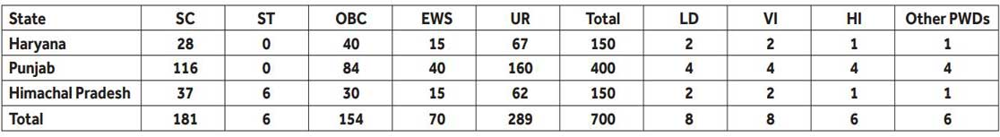
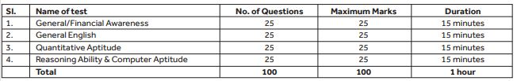

SBI recruitment Apprentice 2019: State Bank of India invites for apprentice in the state of Punjab, Haryana, Himachal Pradesh. Candidates can apply online Via official websites. As per SBI Recruitment Notification 2019 total of 700 vacancies in SBI Apprentice Vacancy. Good Chance For Graduate Candidates of Haryana, Panjab, Himachal Pradesh. to know About SBI Recruitment Apprentice Details Like Education Qualification, Age Limits, Stipend, How to apply, Etc. Given in this page Below.

## SBI recruitment 2019 | 700 Apprentice Online Form 2019

<table style="height: 2209px; width: 76.2755%; border-collapse: collapse; border-style: double;"><tbody><tr style="height: 80px;"><td style="width: 100%; text-align: center; height: 50px;" colspan="2">State Bank of India

SBI recruitment Apprentice 2019

700 Apprentice Vacancies</td></tr><tr style="height: 30px;"><td style="width: 100%; height: 30px; background-color: #2a5a8e; text-align: center;" colspan="2"><h3><strong>&nbsp;Important Dates</strong></h3></td></tr><tr style="height: 22px;"><td style="width: 50%; text-align: center; height: 22px;">Starting Date for Application</td><td style="width: 50%; text-align: center; height: 22px;">17-09-2019</td></tr><tr style="height: 22px;"><td style="width: 50%; text-align: center; height: 22px;">Last Date for Application</td><td style="width: 50%; text-align: center; height: 22px;">16-10-2019</td></tr><tr style="height: 25px;"><td style="width: 50%; text-align: center; height: 25px;">SBI Admit Card</td><td style="width: 50%; text-align: center; height: 25px;">15-10-2019</td></tr><tr style="height: 25px;"><td style="width: 50%; text-align: center; height: 25px;">Online Exam Date</td><td style="width: 50%; text-align: center; height: 25px;">23-10-2019</td></tr><tr style="height: 30px;"><td style="width: 100%; height: 30px; background-color: #2a5a8e; text-align: center;" colspan="2"><h3><strong>&nbsp;Vacancy Details</strong></h3></td></tr><tr style="height: 22px;"><td style="text-align: center; height: 22px; width: 50%;">Job Recruitment Board</td><td style="text-align: center; width: 50%; height: 22px;">SBI Recruitment 2019</td></tr><tr style="height: 25px;"><td style="text-align: center; width: 50%; height: 25px;">Post</td><td style="text-align: center; width: 50%; height: 25px;">Apprentice</td></tr><tr style="height: 25px;"><td style="text-align: center; width: 50%; height: 25px;">No of Vacancies</td><td style="text-align: center; width: 50%; height: 25px;">700</td></tr><tr style="height: 25px;"><td style="text-align: center; width: 50%; height: 25px;">Job Location</td><td style="text-align: center; width: 50%; height: 25px;">Haryana, Panjab, Himachal Pradesh</td></tr><tr style="height: 25px;"><td style="text-align: center; width: 50%; height: 25px;">Job Category</td><td style="text-align: center; width: 50%; height: 25px;">Bank Jobs</td></tr><tr style="height: 25px;"><td style="text-align: center; width: 50%; height: 25px;">Application Mode</td><td style="text-align: center; width: 50%; height: 25px;">Online</td></tr><tr style="height: 133px;"><td style="text-align: center; width: 100%; height: 133px;" colspan="2">

[caption id="attachment_1041" align="aligncenter" width="409"] SBI recruitment 700 Apprentice Vacancies[/caption]</td></tr><tr style="height: 30px;"><td style="width: 100%; height: 30px; background-color: #2a5a8e; text-align: center;" colspan="2"><h3><strong>Eligibility Criteria&nbsp;</strong></h3></td></tr><tr style="height: 14px;"><td style="width: 50%; text-align: center; height: 14px;"><strong>Education Qualification</strong></td><td style="width: 50%; text-align: center; height: 14px;"><strong>Age Limits</strong></td></tr><tr style="height: 30px;"><td style="width: 50%; text-align: center; height: 30px;">Graduation from a recognized University/ Institute</td><td style="width: 50%; text-align: center; height: 30px;">Minimum: 20 years

Maximum: 28 years</td></tr><tr style="height: 30px;"><td style="width: 100%; background-color: #2a5a8e; text-align: center; height: 30px;" colspan="2"><h3><strong>Apprentice Stipend &amp; Training</strong></h3></td></tr><tr style="height: 112px;"><td style="text-align: center; width: 100%; height: 112px;" colspan="2"><ul><li style="text-align: left;">The apprentices are eligible for stipend of 70% of semi-skilled labor wages as applicable in the respective states as per the Apprentices Act or Rs.8000 per month whichever is higher.</li><li style="text-align: left;">The trainee is not eligible for any other allowances/benefits.</li><li style="text-align: left;">Training: One year only.</li></ul></td></tr><tr style="height: 36px;"><td style="width: 100%; height: 36px; background-color: #2a5a8e; text-align: center;" colspan="2"><h3><strong>Selection Process &amp; ExamPattern</strong></h3></td></tr><tr style="height: 570px;"><td style="width: 100%; text-align: center; height: 570px;" colspan="2">
<strong>Selection Process:</strong>

The selection for engagement of apprentices would be based on the basis of online written test and tests of the local language.

<strong>1.Online Written Test:</strong>

[caption id="attachment_1042" align="aligncenter" width="373"] SBI recruitment Apprentice Online Test[/caption]<ul><li style="text-align: left;">The questions will be bilingual, i.e., English &amp; Hindi, except for the test of General English. There will be negative marks for wrong answers in the Objective tests.</li><li style="text-align: left;">1/4th of the mark assigned for question will be deducted for each wrong answer.</li><li style="text-align: left;">Candidates are required to score a minimum percentage marks on aggregate (For SC/ST/OBC/PWD candidates, 5% relaxation available thereon).</li><li style="text-align: left;">Minimum qualifying marks in aggregate will be as decided by the Bank.</li><li style="text-align: left;">There are no minimum qualifying marks for individual subjects.</li><li style="text-align: left;">Merit list will be drawn Statewise and category wise.</li><li style="text-align: left;">Candidates qualified in the test will be placed according to their aggregate marks in descending order in respective States and Categories.</li></ul>
<strong>2.Test of local language:</strong>

<ul><li style="text-align: left;">Haryana: Hindi/Punjabi</li><li style="text-align: left;">Panjab: Hindi/Panjabi</li><li style="text-align: left;">Himachal Pradesh: Hindi</li></ul></td></tr><tr style="height: 30px;"><td style="width: 100%; height: 30px; background-color: #2a5a8e; text-align: center;" colspan="2"><h3><strong>Application Fee&nbsp;</strong></h3></td></tr><tr style="height: 30px;"><td style="width: 100%; text-align: center; height: 30px;" colspan="2">There is no application fee.</td></tr><tr style="height: 30px;"><td style="width: 100%; height: 30px; background-color: #2a5a8e; text-align: center;" colspan="2"><h3><strong>SBI Recruitment Important Links&nbsp;</strong></h3></td></tr><tr style="height: 10px;"><td style="width: 50%; text-align: center; height: 10px;"><strong>Apply Online&nbsp;</strong></td><td style="width: 50%; text-align: center; height: 10px;"><strong><a title="SBI" href="https://ibpsonline.ibps.in/sbiappesep19/basic_details.php" target="_blank" rel="noopener noreferrer">Registration</a>&nbsp;|&nbsp;<a title="SBI" href="https://ibpsonline.ibps.in/sbiappesep19/" target="_blank" rel="noopener noreferrer">login</a></strong></td></tr><tr style="height: 36px;"><td style="width: 50%; text-align: center; height: 23px;"><strong>Notification</strong></td><td style="width: 50%; text-align: center; height: 23px;"><a href="https://freegovtjobalert.in/wp-content/uploads/2019/09/Notification-SBI-Apprentice-Posts.pdf" target="_blank" rel="noopener noreferrer"><strong>Click Here</strong></a></td></tr><tr style="height: 10px;"><td style="width: 50%; text-align: center; height: 10px;"><strong>&nbsp;Official Website</strong></td><td style="width: 50%; text-align: center; height: 10px;"><a href="https://www.sbi.co.in/" target="_blank" rel="noopener noreferrer"><strong>Click Here</strong></a></td></tr></tbody></table>

### How to Apply For SBI Apprentice Post?

1. Candidates First Goto Here: [http://bfsissc.com/sbi.html](http://bfsissc.com/sbi.html)
2. Click On Apply Online.
3. Login With Your IBPS Registration Number & Password (If You Don't Have Then First Register Your Self on IBPS Site and Get Registration Number)
4. Fill the Application Form and Check Again.
5. Upload Photographs.
6. Submit Application.
7. Download & save Application For Future Use.
8. Done
