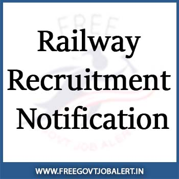

SBI Recruitment 2020: State Bank of India has published a notification for SBI Specialist Cadre Officer in State Bank of India on a Regular Basis. As Per SBI recruitment 2021 notification total of 452 Various Vacancies in SBI. State Bank of India invites an On-line Application from Indian citizens for appointment in the following Specialist Cadre Officer Posts on a Regular Basis. Candidates Are Requested to Apply Online Through the link is given on Bank's website. Interested and Eligible candidates Can Fill up SBI Specialist Cadre Officer Online Form Before the Last Date.

## **SBI Recruitment 2020 - 452 SBI Specialist Cadre Officer Vacancy**

SBI Specialist Cadre Officer Recruitment Notification 2020 Has Published on His Official Website. SBI Recruitment of Manager, Deputy Manager, Assistant Manager, IT Security Expert, Project Manager, Application Architect, Technical Lead Posts. Candidates Should Have Minimum MBA/PGDBM/ CA/ MCA/ M.Sc / B.E/ B.tech/ Master Degree. The age of the applicant should be between 23 to 55 years. Good Opportunity for Those Candidates Who Finding Bank Jobs, Can Apply Online SBI SCO Recruitment 2020. Selected Candidates Will Be Posted Across India.

<table style="border-collapse: collapse; width: 100%; height: 205px;"><tbody><tr style="height: 30px;"><td style="width: 100%; background-color: #2a5a8e; text-align: center; height: 30px;" colspan="2"><h3><strong>SBI SCO Recruitment 2020</strong></h3></td></tr><tr style="height: 25px;"><td style="width: 50%; text-align: center; height: 25px;">Job Recruitment Board</td><td style="width: 50%; text-align: center; height: 25px;">State Bank of India (SBI)</td></tr><tr style="height: 25px;"><td style="width: 50%; text-align: center; height: 25px;">Notification No.</td><td style="width: 50%; text-align: center; height: 25px;">CRPD/SCO/2020-21/14</td></tr><tr style="height: 25px;"><td style="width: 50%; text-align: center; height: 25px;">Post</td><td style="width: 50%; text-align: center; height: 25px;">Manager &amp; Deputy Manager (Marketing)</td></tr><tr style="height: 25px;"><td style="width: 50%; text-align: center; height: 25px;">Vacancies</td><td style="width: 50%; text-align: center; height: 25px;">38</td></tr><tr><td style="width: 50%; text-align: center;">Education Qualification</td><td style="width: 50%; text-align: center;">MBA/ PGDBM</td></tr><tr style="height: 25px;"><td style="width: 50%; text-align: center; height: 25px;">Job Location</td><td style="width: 50%; text-align: center; height: 25px;">Across India</td></tr><tr style="height: 25px;"><td style="width: 50%; text-align: center; height: 25px;">Job Type</td><td style="width: 50%; text-align: center; height: 25px;"><a href="https://freegovtjobalert.in/bank-jobs-recruitment/" target="_blank" rel="noopener noreferrer">Bank Jobs</a></td></tr><tr style="height: 25px;"><td style="width: 50%; text-align: center; height: 25px;">Application Mode</td><td style="width: 50%; text-align: center; height: 25px;">Online</td></tr><tr><td style="width: 50%; text-align: center;">Selection Procedure</td><td style="width: 50%; text-align: center;">Online Exam &amp; Interview</td></tr><tr><td style="width: 50%; text-align: center;">Online Application Date</td><td style="width: 50%; text-align: center;">22-12-2020 to 11-01-2021</td></tr><tr><td style="width: 50%; text-align: center;">Salary</td><td style="width: 50%; text-align: center;">Rs. 31705/- to 51490/-</td></tr><tr><td style="width: 50%; text-align: center;">More Details</td><td style="width: 50%; text-align: center;"><a href="https://freegovtjobalert.in/sbi-bank-manager-recruitment/" target="_blank" rel="noopener">Check Here</a></td></tr></tbody></table>

<table style="border-collapse: collapse;"><tbody><tr style="height: 30px;"><td style="width: 100%; background-color: #2a5a8e; text-align: center; height: 30px;" colspan="2"><h3><strong>SBI SCO Recruitment 2020</strong></h3></td></tr><tr style="height: 25px;"><td style="width: 50%; text-align: center; height: 25px;">Job Recruitment Board</td><td style="width: 50%; text-align: center; height: 25px;">State Bank of India (SBI)</td></tr><tr style="height: 25px;"><td style="width: 50%; text-align: center; height: 25px;">Notification No.</td><td style="width: 50%; text-align: center; height: 25px;">CRPD/SCO/2020-21/27</td></tr><tr style="height: 25px;"><td style="width: 50%; text-align: center; height: 25px;">Post</td><td style="width: 50%; text-align: center; height: 25px;">Manager (Credit Procedures)</td></tr><tr style="height: 25px;"><td style="width: 50%; text-align: center; height: 25px;">Vacancies</td><td style="width: 50%; text-align: center; height: 25px;">02</td></tr><tr><td style="width: 50%; text-align: center;">Education Qualification</td><td style="width: 50%; text-align: center;">MBA/PGDM/ PGDBA/CA/CFA/FRM</td></tr><tr style="height: 25px;"><td style="width: 50%; text-align: center; height: 25px;">Job Location</td><td style="width: 50%; text-align: center; height: 25px;">Mumbai</td></tr><tr style="height: 25px;"><td style="width: 50%; text-align: center; height: 25px;">Job Type</td><td style="width: 50%; text-align: center; height: 25px;">Bank Jobs</td></tr><tr style="height: 25px;"><td style="width: 50%; text-align: center; height: 25px;">Application Mode</td><td style="width: 50%; text-align: center; height: 25px;">Online</td></tr><tr><td style="width: 50%; text-align: center;">Selection Procedure</td><td style="width: 50%; text-align: center;">Shortlisting &amp; Interview</td></tr><tr><td style="width: 50%; text-align: center;">Online Application Date</td><td style="width: 50%; text-align: center;">22-12-2020 to 11-01-2021</td></tr><tr><td style="width: 50%; text-align: center;">Salary</td><td style="width: 50%; text-align: center;">Rs. 42,020/- to 51,490/-</td></tr><tr><td style="width: 50%; text-align: center;">More Details</td><td style="width: 50%; text-align: center;"><a href="https://freegovtjobalert.in/sbi-manager-vacancy/" target="_blank" rel="noopener">Check Here</a></td></tr></tbody></table>

<table style="border-collapse: collapse;"><tbody><tr style="height: 30px;"><td style="width: 100%; background-color: #2a5a8e; text-align: center; height: 30px;" colspan="2"><h3><strong>SBI SCO Recruitment 2020</strong></h3></td></tr><tr style="height: 25px;"><td style="width: 50%; text-align: center; height: 25px;">Job Recruitment Board</td><td style="width: 50%; text-align: center; height: 25px;">State Bank of India (SBI)</td></tr><tr style="height: 25px;"><td style="width: 50%; text-align: center; height: 25px;">Notification No.</td><td style="width: 50%; text-align: center; height: 25px;">CRPD/SCO/2020-21/28</td></tr><tr style="height: 25px;"><td style="width: 50%; text-align: center; height: 25px;">Post</td><td style="width: 50%; text-align: center; height: 25px;">Project Manager, IT Security Expert &amp; Other Posts</td></tr><tr style="height: 25px;"><td style="width: 50%; text-align: center; height: 25px;">Vacancies</td><td style="width: 50%; text-align: center; height: 25px;">240</td></tr><tr><td style="width: 50%; text-align: center;">Education Qualification</td><td style="width: 50%; text-align: center;">IT/ECE or MCA / M.Sc. (IT) / M.Sc. (Computer Science)</td></tr><tr style="height: 25px;"><td style="width: 50%; text-align: center; height: 25px;">Job Location</td><td style="width: 50%; text-align: center; height: 25px;">Navi Mumbai</td></tr><tr style="height: 25px;"><td style="width: 50%; text-align: center; height: 25px;">Job Type</td><td style="width: 50%; text-align: center; height: 25px;">Bank Jobs</td></tr><tr style="height: 25px;"><td style="width: 50%; text-align: center; height: 25px;">Application Mode</td><td style="width: 50%; text-align: center; height: 25px;">Online</td></tr><tr><td style="width: 50%; text-align: center;">Selection Procedure</td><td style="width: 50%; text-align: center;">Online Exam &amp; Interview</td></tr><tr><td style="width: 50%; text-align: center;">Online Application Date</td><td style="width: 50%; text-align: center;">22-12-2020 to 11-01-2021</td></tr><tr><td style="width: 50%; text-align: center;">More Details</td><td style="width: 50%; text-align: center;"><a href="https://freegovtjobalert.in/sbi-vacancy/" target="_blank" rel="noopener">Check Here</a></td></tr></tbody></table>

<table style="border-collapse: collapse;"><tbody><tr style="height: 30px;"><td style="width: 100%; background-color: #2a5a8e; text-align: center; height: 30px;" colspan="2"><h3><strong>SBI Specialist Cadre Officer Recruitment 2020</strong></h3></td></tr><tr style="height: 25px;"><td style="width: 50%; text-align: center; height: 25px;">Job Recruitment Board</td><td style="width: 50%; text-align: center; height: 25px;">State Bank of India (SBI)</td></tr><tr style="height: 25px;"><td style="width: 50%; text-align: center; height: 25px;">Notification No.</td><td style="width: 50%; text-align: center; height: 25px;">CRPD/SCO/2020-21/29</td></tr><tr style="height: 25px;"><td style="width: 50%; text-align: center; height: 25px;">Post</td><td style="width: 50%; text-align: center; height: 25px;">Assistant &amp; Deputy Manager</td></tr><tr style="height: 25px;"><td style="width: 50%; text-align: center; height: 25px;">Vacancies</td><td style="width: 50%; text-align: center; height: 25px;">100</td></tr><tr><td style="width: 50%; text-align: center;">Education Qualification</td><td style="width: 50%; text-align: center;">BE / BTech/ MCA/ M.Sc it</td></tr><tr style="height: 25px;"><td style="width: 50%; text-align: center; height: 25px;">Job Location</td><td style="width: 50%; text-align: center; height: 25px;">Mumbai or Navi Mumbai</td></tr><tr style="height: 25px;"><td style="width: 50%; text-align: center; height: 25px;">Job Type</td><td style="width: 50%; text-align: center; height: 25px;">Bank Jobs</td></tr><tr style="height: 25px;"><td style="width: 50%; text-align: center; height: 25px;">Application Mode</td><td style="width: 50%; text-align: center; height: 25px;">Online</td></tr><tr><td style="width: 50%; text-align: center;">Selection Procedure</td><td style="width: 50%; text-align: center;">Online Exam &amp; Interview</td></tr><tr><td style="width: 50%; text-align: center;">Online Application Date</td><td style="width: 50%; text-align: center;">22-12-2020 to 11-01-2021</td></tr><tr><td style="width: 50%; text-align: center;">More Details</td><td style="width: 50%; text-align: center;"><a href="https://freegovtjobalert.in/sbi-manager-jobs/" target="_blank" rel="noopener">Check Here</a></td></tr></tbody></table>

<table style="border-collapse: collapse;"><tbody><tr style="height: 30px;"><td style="width: 100%; background-color: #2a5a8e; text-align: center; height: 30px;" colspan="2"><h3><strong>SBI Recruitment 2020</strong></h3></td></tr><tr style="height: 25px;"><td style="width: 50%; text-align: center; height: 25px;">Job Recruitment Board</td><td style="width: 50%; text-align: center; height: 25px;">State Bank of India (SBI)</td></tr><tr style="height: 25px;"><td style="width: 50%; text-align: center; height: 25px;">Notification No.</td><td style="width: 50%; text-align: center; height: 25px;">CRPD/SCO/2020-21/31</td></tr><tr style="height: 25px;"><td style="width: 50%; text-align: center; height: 25px;">Post</td><td style="width: 50%; text-align: center; height: 25px;">Deputy Manager (Internal Audit)</td></tr><tr style="height: 25px;"><td style="width: 50%; text-align: center; height: 25px;">Vacancies</td><td style="width: 50%; text-align: center; height: 25px;">28</td></tr><tr><td style="width: 50%; text-align: center;">Education Qualification</td><td style="width: 50%; text-align: center;"><strong>Chartered Accountancy (CA)</strong></td></tr><tr style="height: 25px;"><td style="width: 50%; text-align: center; height: 25px;">Job Location</td><td style="width: 50%; text-align: center; height: 25px;">Hyderabad</td></tr><tr style="height: 25px;"><td style="width: 50%; text-align: center; height: 25px;">Job Type</td><td style="width: 50%; text-align: center; height: 25px;">Bank Jobs</td></tr><tr style="height: 25px;"><td style="width: 50%; text-align: center; height: 25px;">Application Mode</td><td style="width: 50%; text-align: center; height: 25px;">Online</td></tr><tr><td style="width: 50%; text-align: center;">Selection Procedure</td><td style="width: 50%; text-align: center;">Online Exam &amp; Interview</td></tr><tr><td style="width: 50%; text-align: center;">Online Application Date</td><td style="width: 50%; text-align: center;">22-12-2020 to 11-01-2021</td></tr><tr><td style="width: 50%; text-align: center;">More Details</td><td style="width: 50%; text-align: center;"><a href="https://freegovtjobalert.in/sbi-deputy-manager-recruitment/" target="_blank" rel="noopener">Check Here</a></td></tr></tbody></table>

<table style="border-collapse: collapse;"><tbody><tr style="height: 30px;"><td style="width: 100%; background-color: #2a5a8e; text-align: center; height: 30px;" colspan="2"><h3><strong>SBI Specialist Cadre Officer Recruitment 2020</strong></h3></td></tr><tr style="height: 25px;"><td style="width: 50%; text-align: center; height: 25px;">Job Recruitment Board</td><td style="width: 50%; text-align: center; height: 25px;">State Bank of India (SBI)</td></tr><tr style="height: 25px;"><td style="width: 50%; text-align: center; height: 25px;">Notification No.</td><td style="width: 50%; text-align: center; height: 25px;">CRPD/SCO-FIRE/2020-21/32</td></tr><tr style="height: 25px;"><td style="width: 50%; text-align: center; height: 25px;">Post</td><td style="width: 50%; text-align: center; height: 25px;">Engineer (Fire)</td></tr><tr style="height: 25px;"><td style="width: 50%; text-align: center; height: 25px;">Vacancies</td><td style="width: 50%; text-align: center; height: 25px;">16</td></tr><tr><td style="width: 50%; text-align: center;">Education Qualification</td><td style="width: 50%; text-align: center;">BE/ B.Tech/B.Sc. (Fire)</td></tr><tr style="height: 25px;"><td style="width: 50%; text-align: center; height: 25px;">Job Location</td><td style="width: 50%; text-align: center; height: 25px;">Across India</td></tr><tr style="height: 25px;"><td style="width: 50%; text-align: center; height: 25px;">Job Type</td><td style="width: 50%; text-align: center; height: 25px;">Bank Jobs</td></tr><tr style="height: 25px;"><td style="width: 50%; text-align: center; height: 25px;">Application Mode</td><td style="width: 50%; text-align: center; height: 25px;">Online</td></tr><tr><td style="width: 50%; text-align: center;">Selection Procedure</td><td style="width: 50%; text-align: center;">Shortlist &amp; Interview</td></tr><tr><td style="width: 50%; text-align: center;">Online Application Date</td><td style="width: 50%; text-align: center;">22-12-2020 to 11-01-2021</td></tr><tr><td style="width: 50%; text-align: center;">More Details</td><td style="width: 50%; text-align: center;"><a href="https://freegovtjobalert.in/sbi-engineer-recruitment/" target="_blank" rel="noopener">Check Here</a></td></tr></tbody></table>

<table style="border-collapse: collapse; width: 98%; height: 315px;"><tbody><tr style="height: 30px;"><td style="width: 100%; background-color: #2a5a8e; text-align: center; height: 30px;" colspan="2"><h3><strong>SBI Recruitment 2020</strong></h3></td></tr><tr style="height: 25px;"><td style="width: 50%; text-align: center; height: 25px;">Job Recruitment Board</td><td style="width: 50%; text-align: center; height: 25px;">State Bank of India (SBI)</td></tr><tr style="height: 25px;"><td style="width: 50%; text-align: center; height: 25px;">Notification No.</td><td style="width: 50%; text-align: center; height: 25px;">CRPD/SCO/2020-21/30</td></tr><tr style="height: 25px;"><td style="width: 50%; text-align: center; height: 25px;">Post</td><td style="width: 50%; text-align: center; height: 25px;">Manager</td></tr><tr style="height: 25px;"><td style="width: 50%; text-align: center; height: 25px;">Vacancies</td><td style="width: 50%; text-align: center; height: 25px;">32</td></tr><tr style="height: 25px;"><td style="width: 50%; text-align: center; height: 25px;">Education Qualification</td><td style="width: 50%; text-align: center; height: 25px;">Master Degree</td></tr><tr style="height: 25px;"><td style="width: 50%; text-align: center; height: 25px;">Job Location</td><td style="width: 50%; text-align: center; height: 25px;">Mumbai/ Bengaluru</td></tr><tr style="height: 25px;"><td style="width: 50%; text-align: center; height: 25px;">Job Type</td><td style="width: 50%; text-align: center; height: 25px;">Bank Jobs</td></tr><tr style="height: 25px;"><td style="width: 50%; text-align: center; height: 25px;">Application Mode</td><td style="width: 50%; text-align: center; height: 25px;">Online</td></tr><tr style="height: 25px;"><td style="width: 50%; text-align: center; height: 25px;">Selection Procedure</td><td style="width: 50%; text-align: center; height: 25px;">Online Exam &amp; Interview</td></tr><tr style="height: 25px;"><td style="width: 50%; text-align: center; height: 25px;">Online Application Date</td><td style="width: 50%; text-align: center; height: 25px;">22-12-2020 to 11-01-2021</td></tr><tr style="height: 10px;"><td style="width: 50%; text-align: center; height: 10px;">Salary</td><td style="width: 50%; text-align: center; height: 10px;">Rs. 42020/- to 51490/-</td></tr><tr style="height: 25px;"><td style="width: 50%; text-align: center; height: 25px;">More Details</td><td style="width: 50%; text-align: center; height: 25px;"><a href="https://freegovtjobalert.in/sbi-manager-recruitment/" target="_blank" rel="noopener">Check Here</a></td></tr></tbody></table>

Note: The Applicants Are Requested to Read the Official Notification Carefully Before Apply.

<table style="border-collapse: collapse; width: 100%;"><tbody><tr><td style="width: 100%; background-color: #2a5a8e; text-align: center;" colspan="2"><h3>Important Links</h3></td></tr><tr style="height: 25px;"><td style="width: 50%; text-align: center; height: 25px;">Official Website</td><td style="width: 50%; text-align: center; height: 25px;"><a href="https://www.sbi.co.in/" target="_blank" rel="noopener">Check Here</a></td></tr><tr style="height: 25px;"><td style="width: 50%; text-align: center; height: 25px;">Get Free Govt Job Alert On Mobile&nbsp;</td><td style="width: 50%; text-align: center; height: 25px;"><a href="https://t.me/free_govtjobalert" target="_blank" rel="noopener noreferrer">Telegram</a> | <a href="https://www.facebook.com/Free-Govt-Job-Alert-1091006524429779/" target="_blank" rel="noopener noreferrer">Facebook</a> | <a href="https://feedburner.google.com/fb/a/mailverify?uri=Freegovtjobalertin&amp;loc=en_US" target="_blank" rel="noopener noreferrer">Email</a></td></tr></tbody></table>

**Latest Jobs:**

\[catlist name="job-notification" numberposts=20 orderby=modified date\]

<table style="border-collapse: collapse;"><tbody><tr><td style="width: 33.3333%; background-color: #2a5a8e; text-align: center;" colspan="3"><strong>Jobs by Qualification</strong></td></tr><tr><td style="width: 33.3333%; text-align: center;"><a href="https://freegovtjobalert.in/10th-pass-job/" target="_blank" rel="noopener noreferrer">10th Pass</a></td><td style="width: 33.3333%; text-align: center;"><a href="https://freegovtjobalert.in/12th-pass-job/" target="_blank" rel="noopener noreferrer">12th Pass</a></td><td style="width: 33.3333%; text-align: center;"><a href="https://freegovtjobalert.in/qualification/bcom/" target="_blank" rel="noopener noreferrer">B.Com</a></td></tr><tr><td style="width: 33.3333%; text-align: center;"><a href="https://freegovtjobalert.in/qualification/be/" target="_blank" rel="noopener noreferrer">B.E</a></td><td style="width: 33.3333%; text-align: center;"><a href="https://freegovtjobalert.in/qualification/b-sc/" target="_blank" rel="noopener noreferrer">B.Sc</a></td><td style="width: 33.3333%; text-align: center;"><a href="https://freegovtjobalert.in/qualification/btech/" target="_blank" rel="noopener noreferrer">B.Tech</a></td></tr><tr><td style="width: 33.3333%; text-align: center;"><a href="https://freegovtjobalert.in/qualification/ba/" target="_blank" rel="noopener noreferrer">B.A</a></td><td style="width: 33.3333%; text-align: center;"><a href="https://freegovtjobalert.in/qualification/bba/" target="_blank" rel="noopener noreferrer">BBA</a></td><td style="width: 33.3333%; text-align: center;"><a href="https://freegovtjobalert.in/qualification/bca/" target="_blank" rel="noopener noreferrer">BCA</a></td></tr><tr><td style="width: 33.3333%; text-align: center;"><a href="https://freegovtjobalert.in/qualification/b-ed/" target="_blank" rel="noopener noreferrer">B.Ed</a></td><td style="width: 33.3333%; text-align: center;"><a href="https://freegovtjobalert.in/qualification/b-pharma/" target="_blank" rel="noopener noreferrer">B.Pharma</a></td><td style="width: 33.3333%; text-align: center;"><a href="https://freegovtjobalert.in/qualification/charted-accountant/" target="_blank" rel="noopener noreferrer">C.A/ ICWA</a></td></tr><tr><td style="width: 33.3333%; text-align: center;"><a href="https://freegovtjobalert.in/qualification/iti/" target="_blank" rel="noopener noreferrer">I.T.I</a></td><td style="width: 33.3333%; text-align: center;"><a href="https://freegovtjobalert.in/qualification/llb/" target="_blank" rel="noopener noreferrer">LLB</a></td><td style="width: 33.3333%; text-align: center;"><a href="https://freegovtjobalert.in/qualification/ma/" target="_blank" rel="noopener noreferrer">M.A</a></td></tr><tr><td style="width: 33.3333%; text-align: center;"><a href="https://freegovtjobalert.in/qualification/mba-jobs/" target="_blank" rel="noopener noreferrer">M.B.A</a></td><td style="width: 33.3333%; text-align: center;"><a href="https://freegovtjobalert.in/qualification/mca/" target="_blank" rel="noopener noreferrer">M.C.A</a></td><td style="width: 33.3333%; text-align: center;"><a href="https://freegovtjobalert.in/qualification/m-com/" target="_blank" rel="noopener noreferrer">M.Com</a></td></tr><tr><td style="width: 33.3333%; text-align: center;"><a href="https://freegovtjobalert.in/qualification/md/" target="_blank" rel="noopener noreferrer">M.D</a></td><td style="width: 33.3333%; text-align: center;"><a href="https://freegovtjobalert.in/qualification/me/" target="_blank" rel="noopener noreferrer">M.E</a></td><td style="width: 33.3333%; text-align: center;"><a href="https://freegovtjobalert.in/qualification/m-sc/" target="_blank" rel="noopener noreferrer">M.Sc</a></td></tr><tr><td style="width: 33.3333%; text-align: center;"><a href="https://freegovtjobalert.in/qualification/m-tech/" target="_blank" rel="noopener noreferrer">M.Tech</a></td><td style="width: 33.3333%; text-align: center;"><a href="https://freegovtjobalert.in/qualification/m-ed/" target="_blank" rel="noopener noreferrer">M.Ed</a></td><td style="width: 33.3333%; text-align: center;"><a href="https://freegovtjobalert.in/qualification/msw/" target="_blank" rel="noopener noreferrer">MSW</a></td></tr><tr><td style="width: 33.3333%; text-align: center;"><a href="https://freegovtjobalert.in/qualification/m-phil/" target="_blank" rel="noopener noreferrer">M.Phil</a></td><td style="width: 33.3333%; text-align: center;"><a href="https://freegovtjobalert.in/qualification/mbbs/" target="_blank" rel="noopener noreferrer">MBBS</a></td><td style="width: 33.3333%; text-align: center;"><a href="https://freegovtjobalert.in/qualification/ph-d/" target="_blank" rel="noopener noreferrer">Ph.D</a></td></tr><tr><td style="width: 33.3333%; text-align: center;"><a href="https://freegovtjobalert.in/qualification/pgdca/" target="_blank" rel="noopener noreferrer">PGDCA</a></td><td style="width: 33.3333%; text-align: center;"><a href="https://freegovtjobalert.in/qualification/diploma/" target="_blank" rel="noopener noreferrer">Diploma</a></td><td style="width: 33.3333%; text-align: center;"><a href="https://freegovtjobalert.in/qualification/graduate/" target="_blank" rel="noopener noreferrer">Graduate</a></td></tr><tr><td style="width: 33.3333%; text-align: center;"><a href="https://freegovtjobalert.in/engineering-jobs/" target="_blank" rel="noopener noreferrer">Engineering Jobs</a></td><td style="width: 33.3333%; text-align: center;"><a href="https://freegovtjobalert.in/qualification/pg-diploma/" target="_blank" rel="noopener noreferrer">PG Diploma</a></td><td style="width: 33.3333%; text-align: center;"><a href="https://freegovtjobalert.in/qualification/post-graduation/" target="_blank" rel="noopener noreferrer">Post Graduation</a></td></tr></tbody></table>

**Quick Links:**

<table style="border-collapse: collapse; width: 100%;"><tbody><tr><td style="width: 33.3333%; border-style: hidden;"></td><td style="width: 33.3333%; border-style: hidden;"></td><td style="width: 33.3333%; border-style: hidden;"></td></tr><tr><td style="width: 33.3333%; border-style: hidden;"></td><td style="width: 33.3333%; border-style: hidden;"></td><td style="width: 33.3333%; border-style: hidden;"></td></tr></tbody></table>
