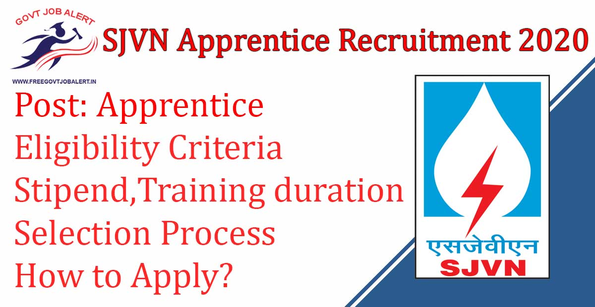
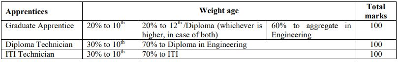

SJVN Apprentice Recruitment 2020: Satluj Jal Vidyut Nigam Limited has Issued a Notification Regarding fill up Apprentice Vacancy in SJVN Ltd. Shimla. SJVN Limited Invites Online Application from eligible candidates who are domicile of Himachal Pradesh for undergoing one-year apprenticeship training. As Per SJVN Recruitment 2019 Notification A Total of 230 Vacancies are there. SJVN recruitment 2019 apply online Form Start on 10th December 2019 at www.sjvn.nic.in recruitment 2019.

## **SJVN Apprentice Recruitment 2019**

<table style="border-collapse: collapse; width: 100%;"><tbody><tr><td style="width: 50%; background-color: #2a5a8e; text-align: center;" colspan="2"><h3><strong>SJVN Recruitment 2019</strong></h3></td></tr><tr><td style="width: 50%; text-align: center;">Job Recruitment Board</td><td style="width: 50%; text-align: center;">Satluj Jal Vidyut Nigam Limited</td></tr><tr><td style="width: 50%; text-align: center;">Notification No.</td><td style="width: 50%; text-align: center;">Advt. No. 90/2019</td></tr><tr><td style="width: 50%; text-align: center;">Post</td><td style="width: 50%; text-align: center;">Various Apprentice</td></tr><tr><td style="width: 50%; text-align: center;">Vacancies</td><td style="width: 50%; text-align: center;">230</td></tr><tr><td style="width: 50%; text-align: center;">Job Location</td><td style="width: 50%; text-align: center;">Shimla, Himachal Pradesh</td></tr><tr><td style="width: 50%; text-align: center;">Job Type</td><td style="width: 50%; text-align: center;">Apprentice Jobs</td></tr><tr><td style="width: 50%; text-align: center;">Application Mode</td><td style="width: 50%; text-align: center;">Online</td></tr></tbody></table>

SJVN Shimla recruitment 2019 Notification and Apply online Link Available on his Official Website. Those Candidates Eligible to apply who have Completed Engineering Degree, and Only Candidates who are domicile of Himachal Pradesh. Applicants Must Age Between 18 to 30 Years. Selected Candidates Will Be Placed in Shimla, Himachal Pradesh. Good Chance for those candidates who are finding Jobs In Shimla, they can fill up SJVN Apprentice Online Form 2020 Before The Last Date.

<table style="border-collapse: collapse;"><tbody><tr><td style="width: 50%; background-color: #2a5a8e; text-align: center;" colspan="2"><h3><strong>Important Dates</strong></h3></td></tr><tr><td style="width: 50%; text-align: center;">Starting Date of Online Application</td><td style="width: 50%; text-align: center;">10-12-2019</td></tr><tr><td style="width: 50%; text-align: center;">Last Date of Online Application</td><td style="width: 50%; text-align: center;">31-12-2019</td></tr></tbody></table>

SJVN Limited recruitment 2019 Notification Details Like Education Qualification, Age Limits, Stipend, Training duration, Selection Criteria, How to apply, etc. - Given below.

### **SJVN Vacancy Details**

- SJVN Apprentice Vacancy: 230 Posts

### **SJVN Shimla Apprentice Recruitment Eligibility Criteria**

- Only Candidates who are domicile of Himachal Pradesh are eligible to apply.
- Candidates should be eligible with respect to age criteria and educational qualification as on the closing date of advertisement. Result awaited candidates need not apply. Candidates who have undergone apprentice training in SJVN need not apply.
- Employment in SJVN: No extension of training and employment will be given after the completion of one-year training by SJVN

Age Limits

- The minimum age limit is 18 years, and the maximum will be 30 Years as on closing date (Relaxable by 05 years for SC/ST; 03 years for OBC(Non-Creamy Layer) & 10 years for PWDs)

Education Qualification

**Graduate Apprentices:**

- Full-time degree in Engineering/ Technology in relevant branch, from Institute/ University, recognized by AICTE

**Technician (Diploma) Apprentices:**

- Full-time Diploma in Engineering/Technology in relevant branch, from Institute/ University, recognized by AICTE/ Board of Technical Education of State.

**Technician (ITI) Apprentices:**

- ITI passed from any recognized University/ Institute

### **SJVN Apprentice Jobs Stipend**

- Graduate Apprentices: Rs 10,000/- Per Month
- Diploma Holders: Rs 8,000/- Per Month
- ITI Apprentices: Rs 7,000/- Per Month.

### **Selection Process For SJVN Apprentice Vacancy**

There will be no interviews. The eligible candidates will be shortlisted on the basis of merit list formed on the basis of marks secured in Matriculation examination (10th) and ITI Course/ Diploma and Bachelor of Engineering/Technology as per the following details:

### **Training duration**

- One Year

### **How to Apply For SJVN Apprentice Recruitment 2020**

- Eligible and interested candidates would be required to apply online through the Career section on SJVN’s website: www.sjvn.nic.in.
- No other means/ mode of application shall be accepted.

### **SJVN Apprentice Recruitment 2020 Important Links**

- SJVN Apprentice Recruitment Online Form 2020: [Click Here](http://www.sjvn.nic.in/careerdetail.htm?52/jobdetail)
- Download SJVN 230 Apprentice Vacancy Notification 2019 PDF: [Click Here](http://www.sjvn.nic.in/writereaddata/Portal/Job/52_1/1_English_Ad_Apprentice_HP.pdf)
- SJVN Official website: [Click Here](http://www.sjvn.nic.in/)

Applicants can visit http://www.sjvn.nic.in to get more details about SJVN Ltd Apprentice 2020. To More Information About SJVN vacancies 2020, latest Updates, Admit Card, Result, Etc. It will be published on the official website. Also, visit Regularly our website [www.freegovtjobalert.in](https://freegovtjobalert.in "Free Job Alert") for getting the Latest job Updates.
