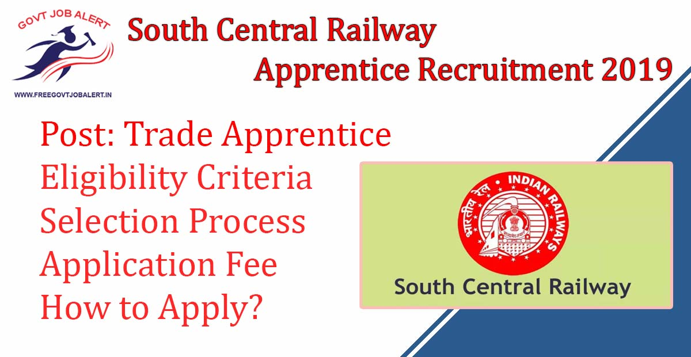
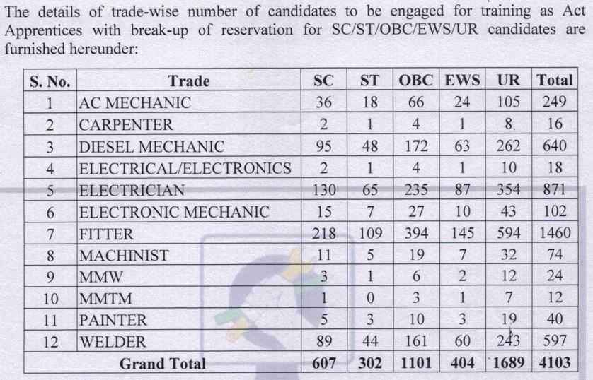
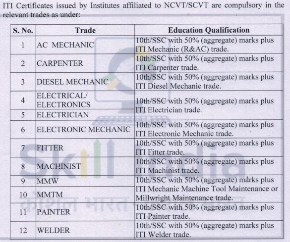
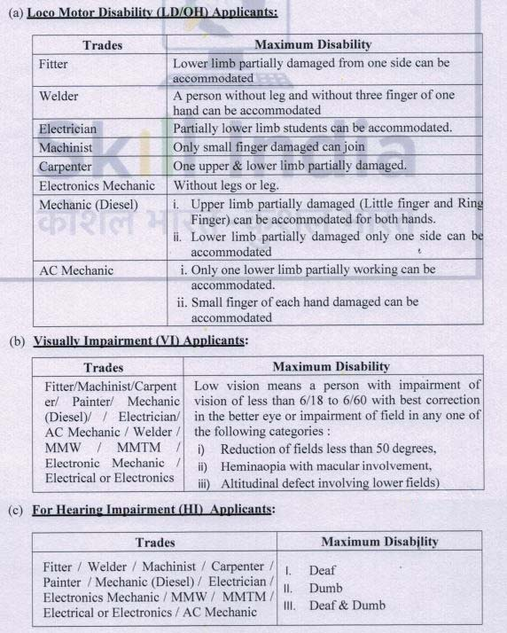

\[caption id="attachment\_1687" align="alignnone" width="1200"\] South Central Railway Apprentice Recruitment 2019 - 4103 RRC SCR Jobs\[/caption\]

South Central Railway Apprentice Recruitment 2019: South Central Railway has Released Notification Regarding Apprentice Vacancy. SCR invites Application From Eligible candidates for Apprentice Post at South Central Railway. As per South Central Railway Recruitment Notification 2019, A Total 4103 Vacancies in Different Trade Are There. South Central Railway Apprentice Online Form 2019 has Started on 9th November 2019.

## **South Central Railway Apprentice Recruitment 2019**

<table style="border-collapse: collapse; width: 100%;"><tbody><tr><td style="width: 50%; background-color: #2a5a8e; text-align: center;" colspan="2"><h3><strong>South Central Railway </strong><strong>Recruitment 2019</strong></h3></td></tr><tr><td style="width: 50%; text-align: center;">Job Recruitment Board</td><td style="width: 50%; text-align: center;">South Central Railway</td></tr><tr><td style="width: 50%; text-align: center;">Notification No.</td><td style="width: 50%; text-align: center;">SCR/P-HQ/111/Act.App/2019</td></tr><tr><td style="width: 50%; text-align: center;">Post</td><td style="width: 50%; text-align: center;">Apprentice</td></tr><tr><td style="width: 50%; text-align: center;">Vacancies</td><td style="width: 50%; text-align: center;">4103</td></tr><tr><td style="width: 50%; text-align: center;">Job Location</td><td style="width: 50%; text-align: center;">Across South Central Railway</td></tr><tr><td style="width: 50%; text-align: center;">Job Type</td><td style="width: 50%; text-align: center;">Railway Jobs</td></tr><tr><td style="width: 50%; text-align: center;">Application Mode</td><td style="width: 50%; text-align: center;">Online</td></tr></tbody></table>

RRC SCR Recruitment Notification 2019 Published on his Official website with Apply online Link. The Candidates Must Have Passed 10th Class. Applicants Should Have Age Between 15 to 24 Years. Good Chance for those Candidates Who Finding 10th Pass Jobs in Railway. The Selected Candidates Will be posted in South Central Railway. Interested Eligible Candidates Can Fill up South Central Railway Apprentice Online Form 2019 Before the Last date.

<table style="border-collapse: collapse;"><tbody><tr><td style="width: 50%; background-color: #2a5a8e; text-align: center;" colspan="2"><h3><strong>SCR Apprentice Important Dates</strong></h3></td></tr><tr><td style="width: 50%; text-align: center;">Starting Date of Online Application</td><td style="width: 50%; text-align: center;">09-11-2019</td></tr><tr><td style="width: 50%; text-align: center;">Last Date of Online Application</td><td style="width: 50%; text-align: center;">08-12-2019</td></tr></tbody></table>

South Central Railway Apprentice Recruitment Details Like Education Qualification, Age Limits, Application Fee, Selection Process, How to apply, etc. are given below.

### **South Central Railway Jobs Details**

- Trade Apprentice: 4103 Posts

\[caption id="attachment\_1683" align="aligncenter" width="838"\] South Central Railway Apprentice Recruitment 2019 - 4103 RRC SCR Jobs\[/caption\]

### **Eligibility Criteria For** **South Central Railway Apprentice Recruitment 2019**

Education Qualification

The Candidates Must Have Passed 10th Class Examination or its Equivalent With minimum 50% Marks in Aggregate From Recognized Board and also Possess ITI Certification in the Trade Notified From the Institute Recognized by NCVT/SCVT.

Age Limits

- Minimum: 15 Years
- Maximum:
    - General: 24 Years
    - OBC: 27 Years
    - SC/ST: 29 Years
    - PWBD: 34 Years

### **South Central Railway Jobs Salary/Pay Scale**

- The Selected Candidates Will be Paid Stipend During Apprenticeship at The Prescribed Rates as per Extant Instructions.

### **Selection Process For** **South Central Railway Apprentice**

- Merit List

### **Physical Standards & Medical Fitness For South Central Railway Apprentice**

\[caption id="attachment\_1686" align="aligncenter" width="572"\] South Central Railway Apprentice Physical Standards & Medical Fitness\[/caption\]

### **South Central Railway Apprentice Recruitment** **Application Fee**

- General Candidates: Rs. 100/-
- SC/ST/PWBD/Women Candidates: Nil
- Payment Mode: Online Via Credit/Debit Card, Net Banking, UPI

### **How to Apply** **South Central Railway Apprentice Recruitment 2019**

1. Candidates Go To RRC SCR Website: https://scr.indianrailways.gov.in
2. Find ACT APPRENTICE - 2019 Online Application Registration Link in Click on. 
3. After Click on Proceed Filling Application Form
4. Fill up Application Form
5. Upload Required Documents
6. Pay Application Fee
7. Submit South Central Railway Apprentice Application
8. Download & Save For Future Use
9. Done

### **South Central Railway Apprentice Recruitment** **Important Links**

- South Central Railway Apprentice Online Form 2019: [Click Here](http://104.211.221.149/instructions.php)
- Download South Central Railway Apprentice Recruitment 2019 PDF: [Click Here](http://104.211.221.149/Act_App_Notification09112019.pdf)
- RRC South Central Railway Official Website: [Click Here](https://scr.indianrailways.gov.in/)

Candidates can visit https://scr.indianrailways.gov.in to get more details about South Central Railway Jobs 2019. Applicants can get all information SCR Railway Jobs latest Updates, Admit Card, Result, Etc. It will be published on the official website. Also, visit Regularly our website [www.freegovtjobalert.in](https://freegovtjobalert.in) for getting the Latest job Updates.
