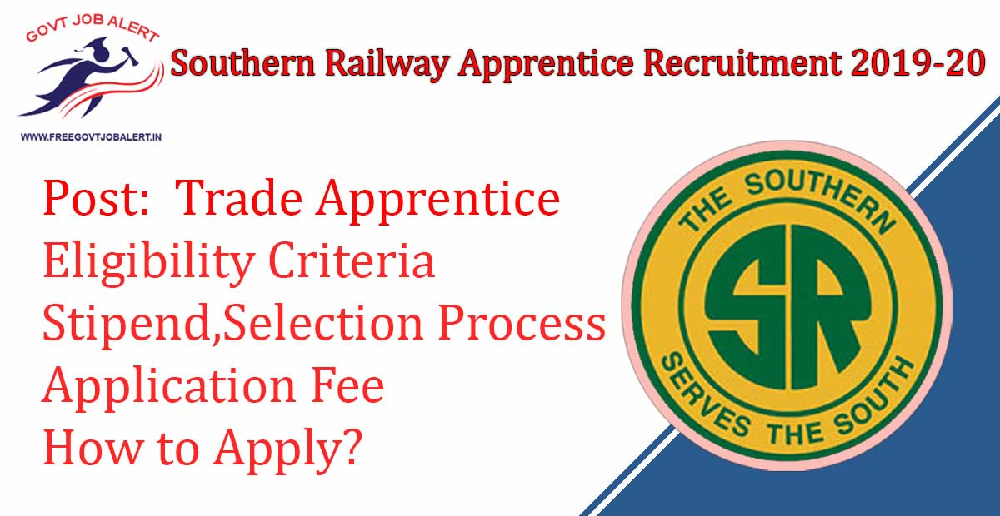

\[caption id="attachment\_1859" align="aligncenter" width="1200"\] Southern Railway Apprentice Recruitment 2019-2020\[/caption\]

Southern Railway Recruitment 2020: Railway Recruitment Cell, Southern Railway Has Released Notification Regarding Act Apprentice Vacancy in Different Workshop And Different Posts. Southern Railway is an online Application are Invited From Eligible Candidates For Engagement as Act Apprentices for Imparting Training under the Apprentice Act 1961 in the designated trades at various Divisions/Workshops/Units in the jurisdiction of Southern Railway. As Per Southern Railway Apprentice Recruitment 2020 Notification A total of 3585 Trade Apprentice's Vacancies in Southern Railway. The Last Date for Fill up Southern Railway Apprentice Online Form 2019 is 31-12-2019.

## **Southern Railway Apprentice Recruitment 2019-20**

<table style="border-collapse: collapse; width: 100%;"><tbody><tr><td style="width: 50%; background-color: #2a5a8e; text-align: center;" colspan="2"><strong>Southern Railway Recruitment 2019</strong></td></tr><tr><td style="width: 50%; text-align: center;">Job Recruitment Board</td><td style="width: 50%; text-align: center;">Southern Railway</td></tr><tr><td style="width: 50%; text-align: center;">Notification No.</td><td style="width: 50%; text-align: center;">CPB/P1/98/Act/TP/Vol.XXI, GPB(A)-128/Act-Engg-29, SGW IP.98/Vo1.XXI/ Act Apprentices</td></tr><tr><td style="width: 50%; text-align: center;">Post</td><td style="width: 50%; text-align: center;">Trade Apprentice</td></tr><tr><td style="width: 50%; text-align: center;">Vacancies</td><td style="width: 50%; text-align: center;">3585</td></tr><tr><td style="width: 50%; text-align: center;">Job Location</td><td style="width: 50%; text-align: center;">Southern Railway Zone</td></tr><tr><td style="width: 50%; text-align: center;">Job Type</td><td style="width: 50%; text-align: center;">Railway Jobs</td></tr><tr><td style="width: 50%; text-align: center;">Application Mode</td><td style="width: 50%; text-align: center;">Online</td></tr></tbody></table>

RRC, Southern Railway Recruitment Notification 2020 Has Published on his Official Website. The Candidates Should Have 10th Pass/ 12th Pass/ ITI Passed. Applicants Must Have Age Between 15 to 24 Years. Selected Candidates Will Be Placed in Southern Railway Zone. Good Chance For Those Candidates Who Finding 10th Pass Jobs In Railway They can Apply Online Before the Last Date.

<table style="border-collapse: collapse;"><tbody><tr><td style="width: 50%; background-color: #2a5a8e; text-align: center;" colspan="2"><h3><strong>Important Dates</strong></h3></td></tr><tr><td style="width: 50%; text-align: center;">Starting Date of Online Application</td><td style="width: 50%; text-align: center;">01-12-2019</td></tr><tr><td style="width: 50%; text-align: center;">Last Date of Online Application</td><td style="width: 50%; text-align: center;">31-12-2019</td></tr></tbody></table>

Southern Railway Apprentice Jobs 2020 Details Like Education Qualification, Age Limits, Selection Process, Application Fee, Stipend, How to Apply, etc. - Given Below.

### **Southern Railway Vacancy 2019 Details**

- Southern Railway Apprentice Vacancy 2019-20: 3585 Posts
- Full Details Plese Check Notification

### **Southern Railway Apprentice Recruitment Eligibility Criteria**

Education Qualification

- Must have passed 10th class examination under 10, +2 system or its equivalent with minimum 50% marks in aggregate.
- Must have passed ITI Course in relevant trades from a recognized institution.
- Must have passed +2 with Physics, Chemistry & Biology (For MLT Only).

Age Limits

- The candidates should have completed 15 years of age and should NOT have completed 22/24 years for Freshers/Ex-ITI, MLT Respectively.
- The Upper age is relaxed able by 3 years for OBC, 5 years for SC/ST candidates and 10 Years for Person with Disability (PwD).

### **Stipend For Southern Railway Apprentice Recruitment 2019**

- Selected Candidates will be paid Stipend During the training as prescribed in the apprentice Act 1961 and Rules Amended From time to time.

### **Southern Railway Apprentice Selection Process**

- Southern Railway apprentice selection will be based on the merit list.

### **Application Fee For Southern Railway Apprentice Jobs**

- General Candidates: Rs. 100/-
- SC/ST/PWD/Women Candidates: No Fee
- Payment Mode: Online

### **How to Apply Southern Railway Apprentice Recruitment 2019-20**

1. Candidates Go TO Southern Railway Official Website: https://sr.indianrailways.gov.in
2. Click on News & Updates and Select Careers.
3. Find and Click on Combined Notification for the Engagement of Act Apprentices in Southern Railway.
4. Then Fill UP Application Form, After Register.
5. Upload Recruited Documents, Images.
6. Pay Application Fee.
7. Submit Application.
8. Download & Save For Future Use.

### **Southern Railway Apprentice Recruitment 2019 Important Links** 

- Southern Railway Apprentice Online Form 2019-20: [Click Here](https://iroams.com/Apprentice/recruitmentIndex)
- Download Southern Railway Apprentice Recruitment Notification PDF: [Click Here](https://iroams.com/Apprentice/recruitmentIndex)
- Southern Railway Official Website: [Click Here](https://sr.indianrailways.gov.in/)

Candidates can visit https://sr.indianrailways.gov.in to get more details about Southern Railway Apprentice Recruitment 2019-2020. To More Information About Southern Railway upcoming vacancy 2019-20, latest Updates, Admit Card, Syllabus, Result, Etc. It will be published on the official website. Also, visit Regularly our website [www.freegovtjobalert.in](https://freegovtjobalert.in) for getting the Latest job Updates.
