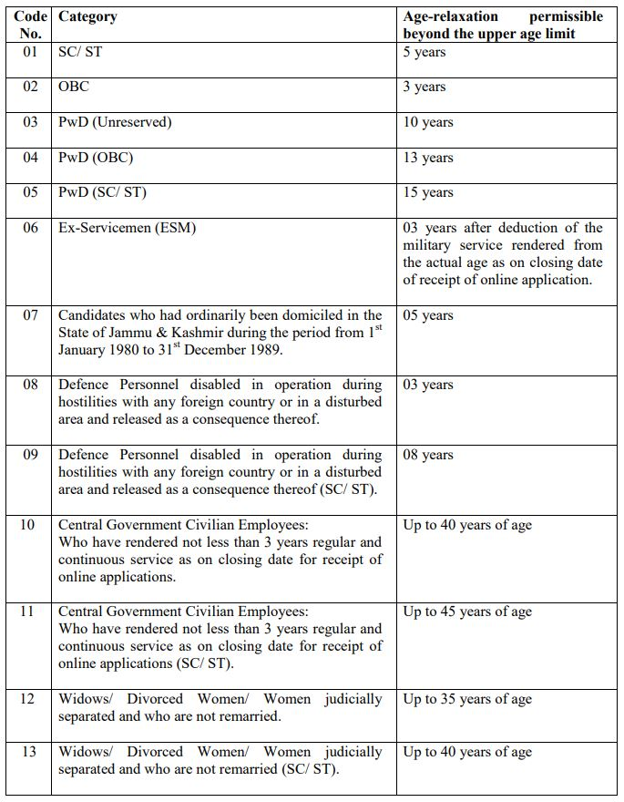
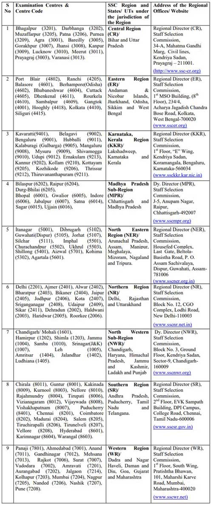

**SSC CHSL 2023**: The Staff Selection Commission has Released a Notification Regarding the Combined Higher Secondary (10+2) Level Examination, 2023. The Staff Selection Commission will hold a competitive examination for recruitment to the posts of Lower Divisional Clerk/ Junior Secretariat Assistant, Postal Assistant/ Sorting Assistant and Data Entry Operators for various Ministries/ Departments/ Offices of the Government of India. SSC CHSL 10+2 Level Exam Online Form 2023 Start on 6-12-2022 at https://ssc.nic.in.

## **SSC CHSL 2023 Notification Details**

<table style="border-collapse: collapse; width: 100%;"><tbody><tr><td style="width: 50%; background-color: #2a5a8e; text-align: center;" colspan="2"><strong>SSC CHSL Recruitment 2023</strong></td></tr><tr><td style="width: 50%; text-align: center;">Job Recruitment Board</td><td style="width: 50%; text-align: center;">Staff Selection Commission</td></tr><tr><td style="width: 50%; text-align: center;">Notification No.</td><td style="width: 50%; text-align: center;">Combined Higher Secondary (10+2) Level Examination, 2022</td></tr><tr><td style="width: 50%; text-align: center;">Post</td><td style="width: 50%; text-align: center;">Various Posts</td></tr><tr><td style="width: 50%; text-align: center;">Vacancies</td><td style="width: 50%; text-align: center;">4500</td></tr><tr><td style="width: 50%; text-align: center;">Job Location</td><td style="width: 50%; text-align: center;">Across India</td></tr><tr><td style="width: 50%; text-align: center;">Job Type</td><td style="width: 50%; text-align: center;">Central Govt Jobs</td></tr><tr><td style="width: 50%; text-align: center;">Application Mode</td><td style="width: 50%; text-align: center;">Online</td></tr></tbody></table>

SSC CHSL 2023 Notification And Apply Online Link Available on his Official Website. The Candidates Must Have 12th Passed. Applicants Should have Age Between 18 to 27 years. Selected Candidates Will be Placed Across India. Good Chance for those Candidates who are finding 12th-pass jobs in India. SSC CHSL Recruitment 2023 Detailed Notification PDF is Here

<table style="border-collapse: collapse; width: 98%;"><tbody><tr><td style="width: 100%; background-color: #2a5a8e; text-align: center;" colspan="2"><h3><strong>SSC CHSL 2023 Exam Dates</strong></h3></td></tr><tr><td style="width: 52.9141%; text-align: center;">Starting Date of Online Application</td><td style="width: 47.0859%; text-align: center;">06-12-2022</td></tr><tr><td style="width: 52.9141%; text-align: center;">Last Date of Online Application</td><td style="width: 47.0859%; text-align: center;">05-01-2023 (23:00)</td></tr><tr><td style="width: 52.9141%; text-align: center;">Last date for receipt of application</td><td style="width: 47.0859%; text-align: center;">04-01-2023 (23:00)</td></tr><tr><td style="width: 52.9141%; text-align: center;">Last date for making online fee payment</td><td style="width: 47.0859%; text-align: center;">04-01-2023 (23:00)</td></tr><tr><td style="width: 52.9141%; text-align: center;">Last date for generation of offline Challan</td><td style="width: 47.0859%; text-align: center;">04-01-2023 (23:00)</td></tr><tr><td style="width: 52.9141%; text-align: center;">Last date for payment through Challan (during working hours of Bank)</td><td style="width: 47.0859%; text-align: center;">06-01-2023</td></tr><tr><td style="width: 52.9141%; text-align: center;">Dates of ‘Window for Application Form Correction’ and online payment of Correction Charges.</td><td style="width: 47.0859%; text-align: center;">09-01-2023 to 10-01-2023 (23:00)</td></tr><tr><td style="width: 52.9141%; text-align: center;">Schedule of Tier-I (Computer-Based Examination)</td><td style="width: 47.0859%; text-align: center;">Feb-Mar, 2023</td></tr><tr><td style="width: 52.9141%; text-align: center;">Schedule of Tier-II (Computer Based Examination)</td><td style="width: 47.0859%; text-align: center;">To be notified later</td></tr></tbody></table>

SSC CHSL 2023 Details like Education Qualification, Age Limits, Pay Scale, Selection Process, Exam Pattern, How to apply, etc. - Are given Below.

### **SSC CHSL 2023 Vacancy Details**

- Lower Division Clerk (LDC)
- Junior Secretariat Assistant (JSA)
- Data Entry Operator (DEO)
- Data Entry Operator, Grade „A‟

### **SSC CHSL 2023 Eligibility Criteria**

A candidate must be either:

- a citizen of India, or
- a subject of Nepal, or
- a subject of Bhutan, or
- a Tibetan refugee who came over to India, before the 1st January 1962, with the intention of permanently settling in India, or
- a person of Indian origin who has migrated from Pakistan, Burma, Sri Lanka, East African countries of Kenya, Uganda, the United Republic of Tanzania(Formerly Tanganyika and Zanzibar), Zambia, Malawi, Zaire, Ethiopia and Vietnam with the intention of permanently settling in India.

Education Qualification

- LDC/ JSA, DEO (except DEOs in C&AG): The candidates must have passed 12th Standard or equivalent examination from a recognized Board or University.
- Data Entry Operator (DEO Grade ‘A’) in the Office of Comptroller and Auditor General of India (C&AG): 12th Standard pass in Science stream with Mathematics as a subject from a recognized Board or equivalent.

Age Limits

- Minimum 18 Years
- Maximum 27 Years

### **SSC CHSL 2023 Salary/Pay Scale**

- Lower Division Clerk (LDC)/ Junior Secretariat Assistant (JSA): Pay Level-2 (Rs.19,900-63,200).
- Data Entry Operator (DEO): Pay Level-4 (Rs. 25,500-81,100) and
- Data Entry Operator, Grade „A‟: Pay Level-4 (Rs. 25,500-81,100).

### **SSC CHSL 2023 Selection Process**

1. Tier-I (Computer-Based Examination)
2. Tier-II (Computer-Based Examination)

### **SSC CHSL 2023 Exam Pattern**

Tier-I (Computer Based Examination)

- The Tier-I Examination will consist of Objective Type, Multiple choice questions only. The questions will be set both in English & Hindi for Part-II, III & IV.

Tier-II (Computer Based Examination)

- Tier-II Paper will be a descriptive Paper of 100 Marks in „Pen and Paper‟ Mode. The duration of the Descriptive Paper will be for one hour. The Paper would comprise writing of an Essay of 200-250 words and a Letter/ Application of approximately 150-200 words.

> Full Details of SSC CHSL Exam Pattern 2023 For Tier – I, II & III: [Click Here](https://freegovtjobalert.in/ssc-chsl-exam-pattern/)

### **SSC CHSL 2023 Application Fee**

- General Candidates: Rs. 100/-
- SC/ST/Women/PwD/ESM Candidates: No Fee
- Payment Mode: Online/Offline (Fee can be paid online through BHIM UPI, Net Banking, by using Visa, Mastercard, Maestro, RuPay Credit or Debit cards or in cash at SBI Branches by generating SBI Challan.)

### **SSC CHSL 2023 Exam Centers**

\[caption id="attachment\_1869" align="aligncenter" width="496"\] SSC CHSL 2023 Exam Centers\[/caption\]

### **How to Apply For SSC CHSL 2023 Exam**

- Applications must be submitted in online mode only at the official website of SSC Headquarters i.e. https://ssc.nic.in.
- The last date for the submission of online applications is 10-01-2023.

### **Important Links For SSC CHSL 2023** 

- SSC CHSL 2023 (10+2) Exam Online Application Form: [Click Here](https://ssc.nic.in/Portal/Apply)
- SSC CHSL Syllabus 2023: [Click Here](https://freegovtjobalert.in/ssc-chsl-syllabus/)
- Download SSC CHSL 2023 Combined Higher Secondary (10+2) Level Examination, 2019 Notification PDF: [Click Here](https://ssc.nic.in/SSCFileServer/PortalManagement/UploadedFiles/Notice_chsl_06122022.pdf)
- The Staff Selection Commission Official Website: [Click Here](https://ssc.nic.in/ "SSC")

Candidates can visit https://ssc.nic.in to get more details about SSC CHSL 2023. To More Information About SSC upcoming vacancy 2023, latest Updates, Admit Card, Syllabus, Result, Etc. It will be published on the official website. Also, visit Regularly our website [www.freegovtjobalert.in](https://freegovtjobalert.in "Free Govt Job Alert") for getting the Latest job Updates.

**Latest Jobs:**

\[catlist name="job-notification" numberposts=20 orderby=modified date\]

<table style="border-collapse: collapse;"><tbody><tr><td style="width: 33.3333%; background-color: #2a5a8e; text-align: center;" colspan="3"><strong>Jobs by Qualification</strong></td></tr><tr><td style="width: 33.3333%; text-align: center;"><a href="https://freegovtjobalert.in/10th-pass-job/" target="_blank" rel="noopener noreferrer">10th Pass</a></td><td style="width: 33.3333%; text-align: center;"><a href="https://freegovtjobalert.in/12th-pass-job/" target="_blank" rel="noopener noreferrer">12th Pass</a></td><td style="width: 33.3333%; text-align: center;"><a href="https://freegovtjobalert.in/qualification/bcom/" target="_blank" rel="noopener noreferrer">B.Com</a></td></tr><tr><td style="width: 33.3333%; text-align: center;"><a href="https://freegovtjobalert.in/qualification/be/" target="_blank" rel="noopener noreferrer">B.E</a></td><td style="width: 33.3333%; text-align: center;"><a href="https://freegovtjobalert.in/qualification/b-sc/" target="_blank" rel="noopener noreferrer">B.Sc</a></td><td style="width: 33.3333%; text-align: center;"><a href="https://freegovtjobalert.in/qualification/btech/" target="_blank" rel="noopener noreferrer">B.Tech</a></td></tr><tr><td style="width: 33.3333%; text-align: center;"><a href="https://freegovtjobalert.in/qualification/ba/" target="_blank" rel="noopener noreferrer">B.A</a></td><td style="width: 33.3333%; text-align: center;"><a href="https://freegovtjobalert.in/qualification/bba/" target="_blank" rel="noopener noreferrer">BBA</a></td><td style="width: 33.3333%; text-align: center;"><a href="https://freegovtjobalert.in/qualification/bca/" target="_blank" rel="noopener noreferrer">BCA</a></td></tr><tr><td style="width: 33.3333%; text-align: center;"><a href="https://freegovtjobalert.in/qualification/b-ed/" target="_blank" rel="noopener noreferrer">B.Ed</a></td><td style="width: 33.3333%; text-align: center;"><a href="https://freegovtjobalert.in/qualification/b-pharma/" target="_blank" rel="noopener noreferrer">B.Pharma</a></td><td style="width: 33.3333%; text-align: center;"><a href="https://freegovtjobalert.in/qualification/charted-accountant/" target="_blank" rel="noopener noreferrer">C.A/ ICWA</a></td></tr><tr><td style="width: 33.3333%; text-align: center;"><a href="https://freegovtjobalert.in/qualification/iti/" target="_blank" rel="noopener noreferrer">I.T.I</a></td><td style="width: 33.3333%; text-align: center;"><a href="https://freegovtjobalert.in/qualification/llb/" target="_blank" rel="noopener noreferrer">LLB</a></td><td style="width: 33.3333%; text-align: center;"><a href="https://freegovtjobalert.in/qualification/ma/" target="_blank" rel="noopener noreferrer">M.A</a></td></tr><tr><td style="width: 33.3333%; text-align: center;"><a href="https://freegovtjobalert.in/qualification/mba-jobs/" target="_blank" rel="noopener noreferrer">M.B.A</a></td><td style="width: 33.3333%; text-align: center;"><a href="https://freegovtjobalert.in/qualification/mca/" target="_blank" rel="noopener noreferrer">M.C.A</a></td><td style="width: 33.3333%; text-align: center;"><a href="https://freegovtjobalert.in/qualification/m-com/" target="_blank" rel="noopener noreferrer">M.Com</a></td></tr><tr><td style="width: 33.3333%; text-align: center;"><a href="https://freegovtjobalert.in/qualification/md/" target="_blank" rel="noopener noreferrer">M.D</a></td><td style="width: 33.3333%; text-align: center;"><a href="https://freegovtjobalert.in/qualification/me/" target="_blank" rel="noopener noreferrer">M.E</a></td><td style="width: 33.3333%; text-align: center;"><a href="https://freegovtjobalert.in/qualification/m-sc/" target="_blank" rel="noopener noreferrer">M.Sc</a></td></tr><tr><td style="width: 33.3333%; text-align: center;"><a href="https://freegovtjobalert.in/qualification/m-tech/" target="_blank" rel="noopener noreferrer">M.Tech</a></td><td style="width: 33.3333%; text-align: center;"><a href="https://freegovtjobalert.in/qualification/m-ed/" target="_blank" rel="noopener noreferrer">M.Ed</a></td><td style="width: 33.3333%; text-align: center;"><a href="https://freegovtjobalert.in/qualification/msw/" target="_blank" rel="noopener noreferrer">MSW</a></td></tr><tr><td style="width: 33.3333%; text-align: center;"><a href="https://freegovtjobalert.in/qualification/m-phil/" target="_blank" rel="noopener noreferrer">M.Phil</a></td><td style="width: 33.3333%; text-align: center;"><a href="https://freegovtjobalert.in/qualification/mbbs/" target="_blank" rel="noopener noreferrer">MBBS</a></td><td style="width: 33.3333%; text-align: center;"><a href="https://freegovtjobalert.in/qualification/ph-d/" target="_blank" rel="noopener noreferrer">Ph.D</a></td></tr><tr><td style="width: 33.3333%; text-align: center;"><a href="https://freegovtjobalert.in/qualification/pgdca/" target="_blank" rel="noopener noreferrer">PGDCA</a></td><td style="width: 33.3333%; text-align: center;"><a href="https://freegovtjobalert.in/qualification/diploma/" target="_blank" rel="noopener noreferrer">Diploma</a></td><td style="width: 33.3333%; text-align: center;"><a href="https://freegovtjobalert.in/qualification/graduate/" target="_blank" rel="noopener noreferrer">Graduate</a></td></tr><tr><td style="width: 33.3333%; text-align: center;"><a href="https://freegovtjobalert.in/engineering-jobs/" target="_blank" rel="noopener noreferrer">Engineering Jobs</a></td><td style="width: 33.3333%; text-align: center;"><a href="https://freegovtjobalert.in/qualification/pg-diploma/" target="_blank" rel="noopener noreferrer">PG Diploma</a></td><td style="width: 33.3333%; text-align: center;"><a href="https://freegovtjobalert.in/qualification/post-graduation/" target="_blank" rel="noopener noreferrer">Post Graduation</a></td></tr></tbody></table>

**Quick Links:**

<table style="width: 100%; border-collapse: collapse;" border="2"><tbody><tr><td style="width: 33.3333%;"></td><td style="width: 33.3333%;"></td><td style="width: 33.3333%;"></td></tr><tr><td style="width: 33.3333%;"></td><td style="width: 33.3333%;"></td><td style="width: 33.3333%;"></td></tr></tbody></table>
